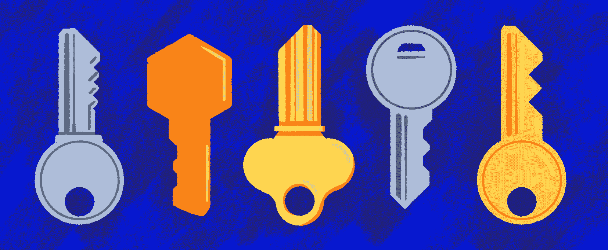

# 如何审计和保护 AWS 帐户|云专家

> 原文：<https://acloudguru.com/blog/engineering/how-to-audit-and-secure-an-aws-account>

据 Statista 称，数据泄露和暴露的凭据:这只是让网络安全专家夜不能寐的几个云安全问题。确实很可怕。这就是为什么对于任何重视自身持续存在的组织来说，投入时间对云环境进行适当的审计和保护仍然是重中之重。在本帖中，我们将讨论如何审计和保护 AWS 帐户

但是，当涉及到保护您的 AWS 帐户时，您应该从哪里开始呢？

我们可以从几个基本问题开始，我们将在这篇博文中回答这些问题:

*   我们如何审计 AWS 账户？

*   我们如何保护 AWS 帐户的安全？

*   我们的工具箱里有哪些 AWS 原生工具？

以下提示和见解由杰出的安全工程师唐·麦咭提供。唐是一位爱猫人士，是一位拥有 20 多年 IT 经验的资深[云架构师](https://acloudguru.com/blog/engineering/what-is-a-cloud-architect-and-how-do-you-become-one)，也是 [Stedi](https://www.stedi.com/) 的云安全主管，Stedi 是一家 100%远程、完全无服务器的 B2B SaaS 提供商。

*本内容基于我们的* [*保护您的 AWS 环境*](https://get.acloudguru.com/securing-aws-environment-webinar?&ajs_aid=8b2cc73f-c0e0-442b-ba6d-0eb362250ebb) *ACG 网络研讨会。任何错误都是编辑的责任。*

保护 AWS 帐户的大部分工作都可以通过 AWS 原生工具来完成。

以下并不是一个完整的列表，但是这些是 Don 在 Stedi 的工作中发现的最有影响力的 AWS 原生工具。我们将在下面详细讨论其中的一些工具。

*   **账户和组织** —这提供了最强的[爆炸半径](https://acloudguru.com/blog/engineering/ransomware-and-aws-6-ways-to-reduce-your-blast-radius)来限制安全事件的影响。

*   **访问和身份管理(IAM)——**通过角色、策略和用户管理对服务和资源的访问

*   **日志记录—** Cloudtrail、S3 访问日志、流量日志、CloudWatch 日志

*   **基础设施和数据保护—** VPC、神盾局、WAF、网络防火墙、马西、KMS、证书管理器、机密管理器

*   **安全评估、事件响应、数据保护和威胁检测—** 警卫、检查员、Confi、侦探、工件、安全中心

* * *

[**12 AWS 配置规则每个账户都应该有**](https://acloudguru.com/blog/engineering/12-aws-config-rules-that-every-account-should-have)
在[这篇博文](https://acloudguru.com/blog/engineering/12-aws-config-rules-that-every-account-should-have)中，看到了 AWS 配置规则，应该被认为是任何账户的最低要求。

* * *

## **如何审计 AWS 账户**

当我们深入探讨如何审计和保护 AWS 帐户时，让我们从审计开始。通过审计 AWS 帐户，您可以查看 IAM 用户、角色、组和策略，并查看是否有任何用户或工具拥有过多的权限。

审计是至关重要的，因为你不能保护你没有跟踪的东西。审计是确保 AWS 帐户安全的最基本的工具之一，但是大部分安全工作都是做基本的事情。(但是，当然，基础的东西可能很难。)

在您的环境中，从第一天开始，以下内容都是可以访问的。

### **1。生成并维护一份完整的资产清单**

什么是资产？在 AWS 领域，资产是任何有标识符的东西。这可能是策略、角色和服务器。我们需要这些东西的清单。一旦我们有了一个列表，那么我们就可以开始弄清楚这些东西是做什么的，我们如何保护这些资源，以及它们是否有任何配置错误。

#### 如何创建资产库存

建立资产清单有不同的方法。您可以使用第三方工具或 CLI 脚本，但是有一种快速简单的方法:AWS Config。AWS Config 允许您记录和评估 AWS 资源的配置。

查看[这篇文章](https://acloudguru.com/blog/engineering/12-aws-config-rules-that-every-account-should-have)了解更多关于使用 AWS 配置创建资产清单的详细信息，以及 [12 个 AWS 配置规则，每个帐户都应该有](https://acloudguru.com/blog/engineering/12-aws-config-rules-that-every-account-should-have)。

### **2。安全 IAM**

作为审计的一部分，请看一下 IAM。IAM 经常被赋予过多的特权，所以我们希望确保我们有一个坚实的战略来解决这个问题。

#### 身份和访问管理(IAM)基础知识

与资源类似，用户和角色经常被授予过度特权。以下是你应该考虑的一些基本事项，作为最低限度的要求:

*   确保您配置了密码要求。
*   对所有用户实施 MFA 尤其是根帐户！
*   停止说话…停止使用根帐户。除了设置计费计划和更改自己的地址之外，它没有任何实际 IAM 用户或角色无法完成的有用功能。
*   使用访问分析器查找意外访问。您可能会看到有能力由外部实体承担的角色，这可能是您不希望看到的…尤其是如果是您不认识的客户。
*   尽可能限制 IAM 用户的使用。它们带来了额外的风险。
*   使用 AWS SSO 进行人工访问。并为人类建立特定的工作角色。它让开发者的生活变得更加容易。
*   根据工作角色而非人员授予用户访问权限。
*   禁用任何 90 天或更长时间未使用的角色。如果另一个 90 没人投诉，就删了。
*   利用开源/第三方工具进行 IAM 分析。

* * *



[**了解如何修复 5 个常见的 AWS IAM 错误**](https://acloudguru.com/blog/engineering/fixing-5-common-aws-iam-errors)
AWS IAM 错误很常见。别担心！在[这篇博文](https://acloudguru.com/blog/engineering/fixing-5-common-aws-iam-errors)中，我们深入探讨了 5 种常见 AWS IAM 错误的原因和解决方法。

* * *

### **3。寻找公共资源**

一旦你有了资产清单，并在 IAM 上浏览了一遍，你就需要开始处理公共资源。

这些都是我们已经确定为公开的，因此是风险点。这些可以包括 S3、EBS 快照、SNS、数据库等等。

我们看到像 S3 错误配置这样的事情，但还有其他可能是公开的危险但被忽视的事情。例如，有时人们拍摄服务器的快照，并意外地将它们配置为公共的。我们需要检查这些东西！

公开可用的资源可能会导致数据泄露、数据丢失以及对帐户和服务的意外访问。(那些不好。)这就是为什么我们需要确定公开可用的资源。

非故意公开的常见资源包括:

*   S3 桶或物体
*   快照
*   社交网络话题
*   数据库
*   EC2 实例

“我要做一个非常不受欢迎的声明:没有任何好的理由，S3 水桶应该是公开的，”唐说。“从来没有人给过我一个好的理由。”

要查找公共资源，可以使用开源工具，第三方工具，或者 [AWS Config](https://acloudguru.com/blog/engineering/12-aws-config-rules-that-every-account-should-have) 。但是*你*必须去补救它们。

这里有一些你可以立即完成的快速简单的胜利。这些是唐最起码的要求:

*   在帐户级别启用 S3 公共访问阻止
*   打开警戒
*   使用 AWS 防火墙管理器将通用 IP 安全规则应用于所有 VPC
*   利用托管配置规则，但不要害怕编写自己的规则！

### **4。使用 AWS 组织**

#### 推荐的 AWS 组织结构

AWS 组织是一个最被低估的安全领域。这是您的安全工具箱中最强大的工具之一。

账户就是边界。你必须允许东西进出账户。你不能用 AWS 中的其他任何东西来说。即使有了 VPCs，您也必须采取额外的步骤来使它比开箱即用更加安全。默认情况下，除非您允许，否则没有任何东西可以进出帐户。

我们将这些用作我们技术体系中特定部分的服务帐户。每个团队或服务都有一个帐户。

*   **Root /管理帐户—托管组织**
    *   生产 OU、生产前 OU、构建 OU、开发 OU
        *   每个人对每项服务都有一个帐户
    *   运营 OU
        *   公司系统账户(账单、内部 IT 等。)
        *   DNS 帐户—将子域委派给其他帐户
    *   安全 OU
        *   安全帐户—所有安全工具(警卫、SIEM、配置等)的所有者。)
        *   日志记录帐户—安全部门使用的所有日志的真实来源
    *   暂停 OU
        *   这是我们保存关闭或未使用账户的地方
        *   有 SCP 来阻止采取任何行动

* * *

**[保护您的 AWS 环境](https://get.acloudguru.com/securing-aws-environment-webinar)** 在[这个免费的点播式网络研讨会](https://get.acloudguru.com/securing-aws-environment-webinar)中，您将了解如何从零开始保护复杂的 AWS 环境，并了解如何审计和保护 AWS 帐户。

* * *

### **5。确保审计日志已启用**

接下来，我们必须有审计日志。审核日志对于检测值得注意的事件至关重要，有助于您了解事件发生后的情况。

CloudTrail 基本上是 AWS 中大多数情况下发生的每个动作的自动日志。但是，根据您的工作负载，您也可以考虑其他服务，包括 VPC 流日志(如果您使用服务器)或 S3 访问日志(如果您公开使用存储桶)。

#### AWS 审计日志记录基础

*   确保启用了 CloudTrail 并在 S3 中存储日志。
    *   S3 存储桶应该具有高度受限的访问权限
    *   最佳做法是将所有日志存储在专用帐户中
    *   如果使用 AWS 组织，请打开全局 CloudTrail
*   其他值得注意的日志有 S3 访问日志、CloudWatch 日志、WAF 日志和 VPC 流日志
*   没有 SIEM 工具，日志几乎毫无用处。
*   只要有用，就只储存多头。

CloudTrail 很快就会变得昂贵，尤其是如果你在 S3 存储的话。你只需要保留你需要的东西。但是你需要它。如果您没有打开 CloudTrail，您就无法检测事件。

#### 如何通过 CLI 打开全局 CloudTrail

创建一个 S3 存储桶来存储日志，并确保该存储桶尽可能被锁定。然后，通过 CLI 启用全局 CloudTrail:

*   `aws organizations enable-all-features`
*   `aws organizations enable-aws-service-access --service-principal [cloudtrail.amazonaws.com](http://cloudtrail.amazonaws.com)`
*   `aws cloudtrail create-trail --name my-trail --s3-bucket-name my-bucket --is-organization-trail —is-multi-region-trail`

如果使用 SIEM，请配置 S3 存储桶和 SIEM 以使用日志。

* * *

## 锁定您的云安全技能

学得更快。动作快点。[从 ACG 开始](https://acloudguru.com/pricing)通过 AWS、Microsoft Azure、Google Cloud 等领域的课程和实际动手实验室改变你的职业生涯。

* * *

### **6。打开安全控制**

打开那些对齐的原生工具，如果适用的话，比如守卫职责和督察。

保持警惕总是好的，但是如果您正在运行 EC2 实例，并且您没有强大的漏洞管理程序，您可能希望打开 Inspector 来查找缺失的补丁和类似的东西。

### **7。如果没有数据流图和网络图，则构建它们**

我们想要所有东西的数据流图。如果你不知道一个开发者是如何使用系统的，你就不知道你能做什么。这可以帮助做出决定，如阻止 S3 公共访问。

### **8。挑一个标准**

安全不应该是你一路走来编造出来的。你不应该进入一个问题，只是决定实施一个规则。作为审核和保护您的 AWS 帐户的工作的一部分，您需要路标。这就是标准的作用。

唐推荐 NIST CSF/800-53、CIS 或 CCM。但是请记住:这些不应该是规则。你应该利用它们来为你的决策提供信息。

### **9。建立风险登记簿以跟踪调查结果**

风险本身必须被跟踪，就像资产一样。我们不想玩打地鼠。建立风险登记册可以确保我们不是在救火，而是在防火。

风险登记簿可以像电子表格一样简单，至少应跟踪以下内容:

| 身份证明 | 调查结果的专用标识符 |
| 优先 | 临界指示器 |
| 描述 | 风险有多大？ |
| 可能性 | 这种情况发生概率 |
| 影响 | 事件的后果 |
| 响应类型 | 接受、转移、减轻、避免 |
| 响应描述 | 可以做些什么来解决或减轻风险？ |
| 物主 | 谁负责？ |
| 状态 | 此风险的当前状态 |

风险登记册应该推动补救问题和故事。

## **如何保护 AWS 账户的安全**

接下来，让我们以类似于 Don 在 Stedi 的方法来应用这些概念。

*   将基础架构用作所有部署的代码
*   打开默认 EBS 加密
*   在帐户级别启用 S3 公共访问阻止
*   EC2 实例需要 IMDSv2
*   使用 AWS 组织
*   利用服务控制策略
    *   执行“禁止”和“禁止”的规定
    *   保护关键资产
    *   保持光线
*   对 IAM 用户使用 AWS SSO
*   使用基于工作的角色
*   关键帐户访问警报

这是上面提到的一些事情以及如何在 CloudFormation 中实现它们的一个例子:

```
S3AccountPublicAccessBlock:
    Type: "Community::S3::PublicAccessBlock"
       Properties:
      BlockPublicAcls: true
      BlockPublicPolicy: true
      IgnorePublicAcls: true
      RestrictPublicBuckets: true
  EbsEncryptionDefaults:
    Type: "Community::Organizations::EbsEncryptionDefaults"
    Properties:
      EnableEbsEncryptionByDefault: true
IMDSv2LaunchTemplate:
    Type: AWS::EC2::LaunchTemplate
      Properties:
      LaunchTemplateName: IMDSV2
      LaunchTemplateData:
        MetadataOptions:
          HttpEndpoint: enabled
          HttpPutResponseHopLimit: 1
          HttpTokens: required
```

### 服务控制策略(SCP)

服务控制策略(SCP)允许您对帐户应用限制性策略。这些可以在根级别或 OU 级别应用。根帐户不受 scp 的影响

#### 推荐的最低 scp:

*   拒绝根用户访问
*   要求使用 IMDSv2
*   拒绝创建 IAM 访问密钥的能力
*   拒绝离开组织的能力
*   拒绝扰乱守卫职责或阻止守卫职责失效能力
*   拒绝禁用 S3 公共访问阻止的能力
*   拒绝禁用 EBS 默认加密的能力
*   拒绝禁用 AWS 配置的能力

#### Optional SCPs:

*   禁用未使用的区域
*   需要资源上的标签
*   防止删除数据库、S3 存储桶或生产中的其他敏感项目

### 服务控制策略示例

下面的 SCP 示例阻止 root 帐户执行几乎所有操作。Don 建议将此应用于所有孩子帐户，并创建一个移除时触发的警报。

```
DenyRootUserSCP:
    Type: OC::ORG::ServiceControlPolicy
    Properties:
      PolicyName: DenyRootUser
      Description: Deny using the root account
      PolicyDocument:
        Version: "2012-10-17"
        Statement:
          - Sid: DenyRootUser
            Effect: Deny
            Action: "*"
            Resource: "*"
            Condition:
              StringLike:
                "aws:PrincipalArn": "arn:aws:iam::*:root"
```

在 https://asecure.cloud/p/scp_package/可以找到一个很棒的 scp 列表

## 提高 AWS 环境的安全性

除了以上关于如何审计和保护 AWS 账户的步骤之外，一个组织可以做的最大的事情之一就是[通过授权给开发人员](https://acloudguru.com/blog/business/how-to-shift-aws-security-left-10-ways-to-empower-your-developers)来转移安全性。你可以在这里阅读更多关于 T2 的信息。

想了解有关保护您的云环境的更多信息吗？

ACG 为您提供了保护 [AWS](https://acloudguru.com/blog/engineering/what-is-amazon-web-services-aws) 、 [Azure](https://acloudguru.com/blog/engineering/what-is-microsoft-azure) 和 [GCP](https://acloudguru.com/blog/engineering/what-is-google-cloud-platform-gcp) 环境所需的基本要素。查看我们的[掌握 AWS 良好架构的框架](https://acloudguru.com/course/mastering-the-aws-well-architected-framework)课程。

或者，在八月份，查看以下免费课程，这些课程都是 [ACG 免费课程](https://acloudguru.com/blog/news/whats-free-at-acg)的一部分:

寻找更深入的安全培训？查看 ACG 的 [AWS 安全学习路径](https://acloudguru.com/learning-paths/aws-security')并提升你的技能，无论你是完全的新手还是安全专家。

* * *


**[看点:领导需要了解哪些关于云安全的知识](https://go.acloudguru.com/Leaders-Cloud-Security-Webinar?ajs_aid=8b2cc73f-c0e0-442b-ba6d-0eb362250ebb)**
你的业务在云端安全吗？答案很大程度上取决于你。观看 Mark Nunnikhoven 的[免费点播网络研讨会](https://go.acloudguru.com/Leaders-Cloud-Security-Webinar)，他将解决云安全的关键问题。