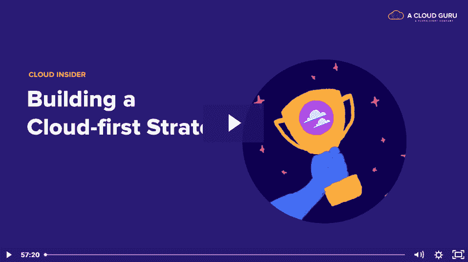
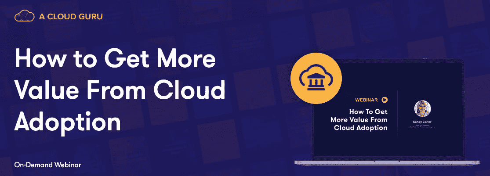

# 观察:如何构建云优先战略|云专家

> 原文：<https://acloudguru.com/blog/business/how-to-build-a-cloud-first-strategy>

预计到 2023 年，云支出将达到近 6000 亿美元。没什么好隐瞒的了。在这一点上，云领导人要么被淋湿，要么学会在雨中跳舞。

在本次网络研讨会中，云专家 Drew Firment 和德勤首席云战略官 David Linthicum 讨论了云领导者在制定云战略时犯的五个最大错误以及他们应该做些什么。

## 云第一领导者的定义是什么？

“云优先”领导者将云视为一项业务投资、创新催化剂和推动更大业务成果的方式。他们直接驶向风暴，而不是等待风暴来找他们。他们会活着讲述他们的故事。

在未来 10 年，我们将看到许多公司离开，因为他们的领导者从战术上看待云——一次采取一项行动，而没有考虑更大的图景——而不是从战略上规划如何利用云技术来实现业务成果。从战术角度考虑的领导者比从战略角度考虑云的领导者花费相同或更多的成本:

*   他们没有做太多的计划
*   他们犯了更多的错误
*   他们没有向利益相关者解释云技术的真正价值

现在，他们中的许多人感到失望，因为他们的云战略并没有实现他们所期望的投资回报。云可能是神秘的，但它不是奇迹。

云优先领导者将云技术作为真正的创新力量倍增器，推动其业务向前发展。然后，他们弄清楚它如何融入文化、运营模式和技能组合分析，从而成为他们组织中的转型支柱。

* * *

### 如何建立云第一团队

“云优先”领导者不仅仅是定义云战略。他们塑造了推动业务成果的文化和团队。。。或者不是。在这篇博文中了解更多关于[建立变革文化的信息。](https://acloudguru.com/blog/business/cloud-transformation-faqs-culture-teams-and-cloud-fluency-at-scale)

* * *

## 有意将多云添加到您的云优先战略中

领导者犯的最大错误之一是试图在短时间内做太多事情。我们已经到了这样一个阶段，领导者正在默认实施多云，而不是有意设计多云策略。为什么？最常见的原因是他们害怕供应商锁定。但这导致了企业没有准备好处理的复杂性问题。

要想在多云中取得成功，您必须有目的地将云提供商的优势与业务意图结合起来，同时注意管理成本和安全性增加的复杂性所需的抽象。如果您没有战略性地处理这个问题，或者不小心陷入其中，您将无法从您的多云环境中获得最大的好处。它甚至可能会让你付出代价。

在你直接跳入深水区之前，确保你知道如何游泳。从一片云开始，并精于此道。了解它的工作原理以及如何利用云原生特性。一旦您和您的团队对一家云提供商感到满意，那么就开始寻找其他同类最佳的解决方案来添加到您的云战略中。

* * *

### 你的多云云系统安全吗？

一旦你的多云系统就位，确保用这 4 个最佳实践来[保护它。](https://acloudguru.com/blog/engineering/4-key-steps-to-an-effective-multicloud-security-solution)

* * *

## 原生安全性是云优先战略的基础

几年来，安全一直是领导人关心的问题。现在，随着云使用的持续增长，情况变得更糟，而且还没有最低限度的可行标准。许多领导者希望其他组织帮助他们了解如何保护他们的云环境。他们会读到一篇关于任何其他企业如何创建了一个伟大的云安全系统的文章，复制它，并想知道为什么他们在第二周被攻破。

企业现在真正需要的是经济高效、可靠的全包式安全解决方案，他们可以依赖并默认使用。不过，唯一的办法是让开发人员能够将安全性直接构建到他们的应用程序中。这需要我们的思维发生转变，从在系统和数据周围筑起高墙，转变为从内部加强它们。谢天谢地，随着从 DevOps 到 DevSecOps 的转变，这已经开始了。

## 云优先战略针对投资回报进行了优化

在过去，我们给予开发者全权来构建云系统。我们告诉他们工作软件是目标，他们做到了。一些公司交付的解决方案每月运行成本高达 500 万美元。其他人提供了解决相同问题的解决方案，但运行成本仅为 50 万美元。它们产生相同的结果，但对业务的影响却截然不同。

“云优先”的领导者和开发人员会考虑他们解决方案的经济性。他们意识到他们现在构建的东西将在未来 15 到 20 年内使用，因此他们正在相应地优化他们的架构。这可能看起来像架构开发期间的战略监督，着眼于解决方案随时间推移的运营经济可行性。

FinOps 是实践中的另一个例子——工程、财务、技术和业务团队合作，以获得对其云系统的更多财务控制和可预测性。无论如何实现，这种云战略的目标是更接近百万分之一的 100%优化的配置。

* * *

**利用数据支持的洞察来指导您的云战略，并在快速变化的云世界中保持领先。[在这个点播网络研讨会中了解如何操作。](https://go.acloudguru.com/how-to-get-more-value-from-cloud-adoption-webinar)**

* * *

## 为您的云优先战略培养合适的云人才

“云优先”的领导者应该雇佣持续学习者。拥有名牌大学的工程学位或持有五项认证已经不够了。领导者无法通过雇佣来摆脱云技能缺口。相反，他们必须培养实施云战略的人才。做到这一点的唯一方法是雇佣有创造力、有学习和创新欲望的开发人员。

一旦人员到位，创建学习和发展计划就很容易了。借助[按需和自动学习系统](https://acloudguru.com/)，领导者可以为他们的开发人员构建学习路径，并为完成任务创造激励或期望。甚至还有实验室和沙盒的实践机会，帮助入门级工程师获得构建云基础架构的实际经验，对您的业务几乎没有风险。这是一个双赢的局面。您可以缩小业务中的云技能差距，您的团队可以扩展他们的技能，他们的新知识可以让您的云系统更加高效和有效。

在 YouTube 上订阅一位云专家的每周云新闻。或者在[脸书](https://www.facebook.com/acloudguru)上关注我们，在 [Twitter](https://twitter.com/acloudguru) 上关注我们，并在 [Discord](http://discord.gg/acloudguru) 上加入对话，了解云的最新动态！