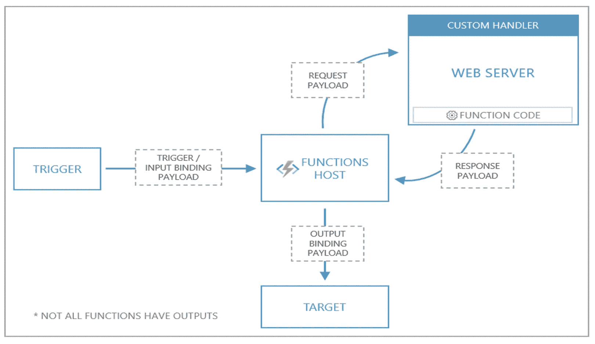

# 如何使用 Go 和 Azure 功能构建无服务器应用程序

> 原文：<https://acloudguru.com/blog/engineering/how-to-build-a-serverless-app-using-go-and-azure-functions>

随着 [Azure Functions 自定义处理程序](https://docs.microsoft.com/azure/azure-functions/functions-custom-handlers?WT.mc_id=data-10498-alvidela)的到来，现在没有什么可以阻止你在 Azure 上使用 Go 来实现无服务器功能了！下面是一个有趣的方法来尝试自定义处理程序。

Webhook 后端是 FaaS(功能即服务)平台的一个流行用例。它们可以用于许多用例，比如发送客户通知或用有趣的 gif 回复！使用无服务器函数，封装 webhook 功能并以 HTTP 端点的形式公开它是非常方便的。

在本教程中，你将学习如何使用 [Azure 函数](https://docs.microsoft.com/azure/azure-functions/functions-custom-handlers?WT.mc_id=data-9656-abhishgu)和 [Go](https://golang.org/) 实现一个 [Slack 应用](https://api.slack.com/start/overview#apps)作为无服务器后端。您可以扩展 Slack 平台，并通过实现自定义应用或工作流来集成服务，这些应用或工作流可以访问平台的所有范围，从而让您在 Slack 中构建强大的体验。

这是松弛时间的[图形的一个简单版本。最初的 Giphy Slack 应用程序通过响应多个 gif 来响应搜索请求。为了简单起见，本文中演示的函数应用程序只使用](https://get.slack.help/hc/en-us/articles/204714258-Giphy-for-Slack) [Giphy 随机 API](https://developers.giphy.com/docs/#operation--gifs-random-get) 返回一个搜索关键字对应的单个(随机)图像。这篇文章提供了一步一步的指导，让应用程序部署到 [Azure Functions](https://azure.microsoft.com/en-in/services/functions/?WT.mc_id=data-9656-abhishgu) ，并将其与您的 Slack workspace 集成。

在这篇文章中，你将:

*   获得 Azure 函数中自定义处理程序的概述
*   通过简短的代码演练了解幕后发生的事情
*   了解如何使用配置 Azure 功能和 Slack 设置解决方案
*   当然，在工作区运行你的 Slack 应用程序！

后端功能逻辑用 Go 编写(代码是 GitHub 上可用的[)。那些使用过 Azure 函数的人可能还记得，Go 是默认支持的语言处理程序中的*而不是*。这就是](https://github.com/abhirockzz/serverless-go-slack-app/)[海关处理员](https://docs.microsoft.com/azure/azure-functions/functions-custom-handlers?WT.mc_id=data-9656-abhishgu)来帮忙的地方！

简而言之，[自定义处理程序](https://docs.microsoft.com/azure/azure-functions/functions-custom-handlers)是一个轻量级 web 服务器，它从函数主机接收事件。在您最喜欢的运行时/语言中，您唯一需要实现的定制处理程序就是 HTTP 支持！这并不意味着定制处理程序仅限于 [HTTP 触发器](https://docs.microsoft.com/azure/azure-functions/functions-bindings-http-webhook-trigger?tabs=csharp&WT.mc_id=data-9656-abhishgu)。你可以通过扩展包自由使用[其他触发器以及输入和输出绑定](https://docs.microsoft.com/azure/azure-functions/functions-triggers-bindings?tabs=csharp&WT.mc_id=data-9656-abhishgu)。

以下是自定义处理程序工作原理的概要:



[https://docs.microsoft.com/en-us/azure/azure-functions/media/functions-custom-handlers/azure-functions-custom-handlers-overview.png](https://docs.microsoft.com/en-us/azure/azure-functions/media/functions-custom-handlers/azure-functions-custom-handlers-overview.png)

事件触发器(通过 HTTP、存储、事件中心等。)调用函数主机。定制处理程序与传统函数的不同之处在于，函数主机充当中间人:它向定制处理程序(函数)的 web 服务器发出请求有效负载，以及包含触发器、输入绑定数据和函数的其他元数据的*有效负载*。函数将响应返回给函数宿主，宿主将响应中的数据传递给函数的输出绑定进行处理。

在我们深入其他领域之前，通过探索代码来理解本质可能会有所帮助，顺便说一下，代码相对简单。

让我们看看应用程序是如何设置的。

```

├── cmd
│   └── main.go
├── funcy
│   └── function.json
├── go.mod
├── host.json
└── pkg
    └── function
        ├── function.go
        ├── giphy.go
        └── slack.go
```

`function.json`文件位于一个以函数名命名的文件夹中。([这是惯例](https://docs.microsoft.com/azure/azure-functions/functions-custom-handlers?WT.mc_id=data-9656-abhishgu#application-structure)。)

```
{
    "bindings": [
        {
            "type": "httpTrigger",
            "direction": "in",
            "name": "req",
            "methods": [
                "get",
                "post"
            ]
        },
        {
            "type": "http",
            "direction": "out",
            "name": "res"
        }
    ]
}
```

`host.json`通过指向能够处理 HTTP 事件的 web 服务器，告知函数主机向何处发送请求。注意`customHandler.description.defaultExecutablePath`，它定义了`go_funcy`是用于运行 web 服务器的可执行文件的名称。"`enableForwardingHttpRequest` ": true 确保原始 HTTP 数据不加任何修改地发送到自定义处理程序。

```
{
    "version": "2.0",
    "extensionBundle": {
        "id": "Microsoft.Azure.Functions.ExtensionBundle",
        "version": "[1.*, 2.0.0)"
    },
    "customHandler": {
        "description": {
            "defaultExecutablePath": "go_funcy"
        },
        "enableForwardingHttpRequest": true
    },
    "logging": {
        "logLevel": {
            "default": "Trace"
        }
    }
}
```

`cmd`和`pkg`目录包含 Go 源代码。让我们在下一小节中探讨这个问题。

`cmd/main.go`设置并启动 HTTP 服务器。注意，`/api/funcy` 端点是函数主机向定制处理程序 HTTP 服务器发送请求的端点。

```
func main() {
    port, exists := os.LookupEnv("FUNCTIONS_CUSTOMHANDLER_PORT")
    if !exists {
        port = "8080"
    }
    http.HandleFunc("/api/funcy", function.Funcy)
    log.Fatal(http.ListenAndServe(":"+port, nil))
}
```

所有的重活都在`function/function.go`完成。

第一部分是读取请求体(从 Slack 中)并通过基于 Slack 定义的[这个配方的签名验证过程来确保其完整性。](https://api.slack.com/docs/verifying-requests-from-slack#a_recipe_for_security)

```
    signingSecret := os.Getenv("SLACK_SIGNING_SECRET")
    apiKey := os.Getenv("GIPHY_API_KEY")

    if signingSecret == "" || apiKey == "" {
        http.Error(w, "Failed to process request. Please contact the admin", http.StatusUnauthorized)
        return
    }

    slackTimestamp := r.Header.Get("X-Slack-Request-Timestamp")

    b, err := ioutil.ReadAll(r.Body)
    if err != nil {
        http.Error(w, "Failed to process request", http.StatusBadRequest)
        return
    }
    slackSigningBaseString := "v0:" + slackTimestamp + ":" + string(b)
    slackSignature := r.Header.Get("X-Slack-Signature")

    if !matchSignature(slackSignature, signingSecret, slackSigningBaseString) {
        http.Error(w, "Function was not invoked by Slack", http.StatusForbidden)
        return
    }
```

一旦我们确认该函数确实通过 Slack 被调用，下一步就是提取(Slack)用户输入的搜索词。

```
    vals, err := parse(b)
    if err != nil {
        http.Error(w, "Failed to process request", http.StatusBadRequest)
        return
    }
    giphyTag := vals.Get("text")
```

通过调用 GIPHY REST API，使用搜索词查找 gif。

```
    giphyResp, err := http.Get("http://api.giphy.com/v1/gifs/random?tag=" + giphyTag + "&api_key=" + apiKey)
    if err != nil {
        http.Error(w, "Failed to process request", http.StatusFailedDependency)
        return
    }

    resp, err := ioutil.ReadAll(giphyResp.Body)
    if err != nil {
        http.Error(w, "Failed to process request", http.StatusInternalServerError)
        return
    }
```

解编由 GIPHY API 发回的响应，将其转换成 Slack 可以理解的形式，并返回它。就是这样！

```
    var gr GiphyResponse
    json.Unmarshal(resp, &gr)
    title := gr.Data.Title
    url := gr.Data.Images.Downsized.URL

    slackResponse := SlackResponse{Text: slackResponseStaticText, Attachments: []Attachment{{Text: title, ImageURL: url}}}

    w.Header().Set("Content-Type", "application/json")
    json.NewEncoder(w).Encode(slackResponse)
    fmt.Println("Sent response to Slack")
```

如果您对检查签名验证过程感兴趣，请检查`matchSignature`函数，并查看 slack.go、giphy.go(在`function`目录中),以了解所使用的 go 结构表示各个组件之间交换的信息(JSON)。为了保持这篇文章的简洁，这里没有包括这些内容。

好吧！到目前为止，我们已经介绍了很多理论和背景信息。是时候把事情做好了！在继续之前，请确保满足以下先决条件。

请记下您的 GIPHY API 密钥，因为您稍后会用到它

接下来的章节将引导你完成部署 Azure 功能和配置 Slash 命令的 Slack 的过程。

首先创建一个[资源组](https://docs.microsoft.com/azure/azure-resource-manager/management/manage-resource-groups-portal?WT.mc_id=data-9656-abhishgu)来托管解决方案的所有组件。

首先在 Azure 门户搜索**功能 App** ，点击**添加**。

输入所需的详细信息:您应该选择**自定义处理程序**作为**运行时堆栈**。

在**托管**部分，分别为**操作系统**和**计划类型**选择 **Linux** 和**消费(无服务器)**。

启用应用洞察(如果需要)。

查看最终设置并点击**创建**继续。

该过程完成后，还将创建以下资源和功能应用程序:

克隆 GitHub repo 并构建函数。

```
git clone https://github.com/abhirockzz/serverless-go-slack-app
cd e-go-slack-app

GOOS=linux go build -o go_funcy cmd/main.go
```

`GOOS=linux`用于构建一个`Linux`可执行文件，因为我们为我们的函数应用程序选择了一个`Linux O` S。

要进行部署，请使用 Azure Functions 核心工具 CLI。

```
func azure functionapp publish <enter name of the function app>
```

部署完成后，复制该命令返回的函数 URL 您将在后续步骤中使用它。

本节将介绍在工作区中设置 Slack 应用程序(Slash 命令)所需执行的步骤:

*   创建一个 Slack 应用程序
*   创建斜线命令
*   将应用程序安装到您的工作区

登录到你的 [Slack 工作空间](https://slack.com/signin)，并通过[创建一个新的 Slack 应用](https://api.slack.com/apps/new)开始。

点击*创建新命令*，用所需信息定义新的*斜线命令*。请注意，**请求 URL** 字段是您将输入函数的 HTTP 端点的字段，它只是您在上一节中部署函数后获得的 URL。完成后，点击**保存**完成。

创建完 Slash 命令后，转到应用程序的设置页面，在导航菜单中单击*基本信息*功能，选择*将应用程序安装到工作区*，然后单击*将应用程序安装到工作区*——这将把应用程序安装到 Slack 工作区，以测试应用程序并生成与 Slack API 交互所需的令牌。一旦你完成应用程序的安装，*应用程序凭证*就会出现在同一页面上。

记下您的应用程序**的签名密码**，因为您稍后会用到它。

…确保更新函数应用配置，以添加松弛签名密钥(`SLACK_SIGNING_SECRET`)和 Giphy API 密钥(`GIPHY_API_KEY` ) —它们将作为函数中的环境变量。

从您的松弛工作区，调用命令`/funcy <search term>`。(比如试试`/funcy dog`。)你应该拿回一个随机的 GIF 作为回报！

简单回顾一下正在发生的事情:当您在 Slack 中调用`/funcy` 命令时，它会调用该函数，然后该函数与 Giphy API 进行交互，最后将 GIF 返回给用户——假设一切顺利！

第一次调用后，您可能会从 Slack 中看到`timeout error`。这很可能是由于第一次调用`cold start`时，该函数需要几秒钟来引导。再加上 [Slack 期望在 3 秒内得到响应](https://api.slack.com/slash-commands#responding_basic_receipt)——因此出现了错误消息。

没什么好担心的。你需要做的就是再次尝试，一切都会好的！

清理:一旦完成，别忘了[删除资源组](https://docs.microsoft.com/azure/azure-resource-manager/management/delete-resource-group?tabs=azure-powershell&WT.mc_id=data-9656-abhishgu#delete-resource-group)，这又会删除之前创建的所有资源(功能 app，App 服务计划等。)

现在，没有什么可以阻止你在 Azure 上使用 Go 实现无服务器功能！我希望这将是一种尝试定制处理程序的有趣方式。让我们知道你的想法。

#### 关于作者

Abhishek Gupta 是微软的高级开发人员。你可以在 [Twitter](https://twitter.com/abhi_tweeter?opt_id=oeu1596472260634r0.19676524222612213) 上关注他，在 [LinkedIn](https://in.linkedin.com/in/abhirockzz?opt_id=oeu1596472260634r0.19676524222612213) 上联系他，或者关注他的[博客](https://medium.com/@abhishek1987?opt_id=oeu1596472260634r0.19676524222612213)。