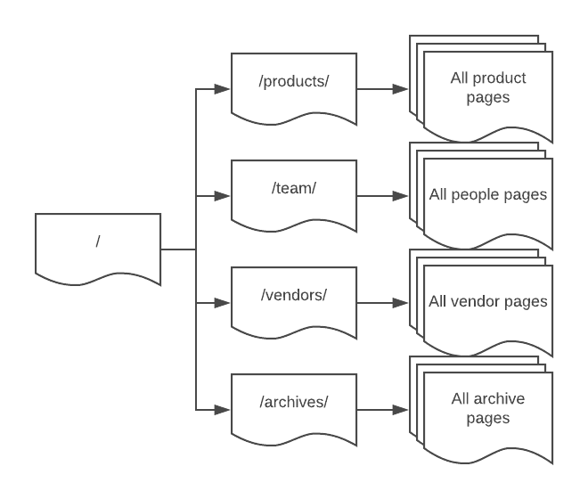
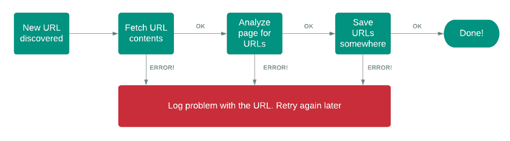

# 如何建立一个无服务器的网络爬虫

> 原文：<https://acloudguru.com/blog/engineering/how-to-build-a-serverless-web-crawler>

## 使用无服务器扩展现代的旧概念

最近，一个客户项目需要抓取一个大型媒体网站，以生成 URL 和网站资产的列表。鉴于网站的规模很大，使用传统的爬行方法会使 Lambda 函数超时——所以我们考虑将方法改为无服务器模型。

以下是我在这个项目中学到的关于设计无服务器功能的知识。

### 我们跑之前先爬吧

抓取一个网站有很多原因——抓取不同于抓取。在爬行一个站点时，我们登陆一个网页，通常是主页，搜索网页上的 URL，然后递归地浏览这些 URL。

抓取可能是爬行的原因——特别是如果您想要存储这些页面内容的副本，或者您可能只是出于索引页面的一些次要原因。



Traversing the tree of a typical website

爬行是有趣的部分，因为您可以快速生成大量的 URL 列表，或者通过实施一些规则来控制您收集的内容。例如，您可能只浏览具有相同域名的 URL，并删除查询参数以减少重复。

然后你必须考虑抓取的速度——你是一次处理一个 URL 还是同时浏览多个？如果你在 html 中发现混合用法，你如何看待 http 和 https？

对于 Node 用户来说，有一个优雅地称为[网站抓取器](https://www.npmjs.com/package/website-scraper)的包，它有大量的配置选项来处理这些问题，还有许多其他功能。

运行这个工具非常简单——你可以访问 [my github repo](https://github.com/jbesw/askJames-serverlessCrawler/blob/master/example.js) 获取完整的例子，但是这里有一些重要的部分:

```
const options = {
  urls: myTargetSite,
  directory: '/temp/',
  prettifyUrls: true,
  recursive: true,
  filenameGenerator: 'bySiteStructure',
  urlFilter: (url) => url.startsWith(myTargetSite),
  onResourceSaved: (resource) => URLs.push(resource.url),
  onResourceError: (resource, err) => console.error(`${resource}: ${err}`),
  requestConcurrency: 10
}
const result = await crawl(options)
console.log('# of URLs:', URLs.length)
```

这个包主要是配置驱动的。我们指定一个目标网站，让它递归地搜索与 *urlFilter 匹配的 URL。*在本例中，过滤器被设置为包括同一域中的任何 URL，同时请求多达 10 个 URL。

当保存一个资源时，我们将 URL 推送到一个数组上，然后记录任何错误。在过程结束时，所有发现的资源都存储在数组*URL*中。完整的脚本中有更多的代码，但这些是最基本的。

这一切都很棒——但是当抓取一个超过 10，000 个 URL 的网站时，我们遇到了一些主要问题。它有效地作为一个原子作业运行，获取 URL，节省资源，并管理要浏览的 URL 的内部列表:

*   它可以运行几个小时，如果它失败了，没有办法从它停止的地方恢复。所有的状态都是内部管理的，如果出现问题就会丢失。
*   随着内部映射的增长，消耗的内存可能会很大，因此您必须确保所使用的实例分配有足够的 RAM。
*   对于大型站点，使用的临时磁盘空间可能高达数百 GB，因此您需要确保有足够的本地可用空间。

所有这些都不是 webscraper 包的错——纯粹是因为*一切都在大规模变化*。这个项目对于互联网上 99%的网站来说都是完美的，但是对于抓取纽约时报或者维基百科来说就不是了。

鉴于客户网站的规模，我们需要重新考虑这种方法，同时利用无服务器的优势。

### 无服务器 Crawler —版本 1.0

第一步是简单地将 webrawler 代码打包成一个 Lambda 函数，放在一个基本的“提升移位”中。这一尝试按预期运行——当站点探测不能及时完成时，在 15 分钟时超时。

在 15 分钟结束时，除了你可以从我们的日志文件的灰烬中收集到的信息之外，我们对进度没有什么概念。为了确保它的工作，我们必须确保网站的大小与功能运行的时间长短没有根本的关系。

在新版本中，该函数检索页面，找到与我们的过滤器匹配的 URL，将它们存储在某个地方，然后终止。当新的 URL 被存储时，这将启动相同的函数，并且该过程重新开始。



简而言之，我们将从代码中提取递归，并用我们的无服务器玩具盒复制它。如果我们将 URL 存储在 DynamoDB 中，我们可以在每次将 URL 写入数据库时使用流来触发爬虫:

我们构建了这个，所以整个过程是通过将主页 URL 作为记录写入 DynamoDB 来触发的。事情是这样的:

1.  将“https://mytestsite.com”写入 DynamoDB。
2.  该流导致 Lambda 以传入事件“https://mytestsite.com”开始。
3.  它获取页面，找到 20 个 URL 并在 DynamoDB 中保存为 20 条记录。
4.  20 个新记录的流导致多个 Lambdas 开始。每个加载一个页面，找到另外 20 个 URL 并将它们写入数据库。
5.  400 个新记录的流导致多个 lambda 启动，使我们正在爬行的网站崩溃，并且所有未完成的 lambda 都抛出错误。

好吧，那是哪里出了问题？

人们很容易忘记*Lambda 如何高效地为您扩展—* ，这可能会导致无意和自我诱导的拒绝服务(DOS)。

无论网站有多大，总有一个并发水平会使网络服务器不堪重负。我们需要对这种工作方式进行调整，以防止 Lambdas 尽职尽责地完成工作。我们需要使网络爬虫，嗯…爬行得更快。

### 无服务器网络爬虫 2.0-现在更慢！

我们之前的问题是由 Lambda 完成其工作引起的。如果许多记录同时写入 DynamoDB，这将激发更多的并发 Lambdas 来完成工作。

有时候你不想要这种行为——这就是其中之一。那么如何才能让它慢下来呢？一般来说，有几个策略可以帮助刹车:

*   在 Lambda 函数写入 DynamoDB 之间引入一个 [SQS 延迟队列](https://docs.aws.amazon.com/AWSSimpleQueueService/latest/SQSDeveloperGuide/sqs-delay-queues.html)——这增加了长达 15 分钟的可配置延迟。
*   将 Lambda 函数的并发设置从未保留的默认值(1000)更改为一个更小的值。将该值设置为 1 将阻止所有并发，并有效地导致串行接收。在我们的例子中，我们发现 10 是足够的。
*   更改批处理大小，这会影响每次调用从流中发送的记录数量。这里较低的数字会导致更多的并发调用，而如果同时添加许多记录，较大的数字会导致单个 Lambda 处理来自流的更多项。

在这三个层次之间，如果 DynamoDB 流中出现大量事件，我们现在有了合理的控制量来平滑处理速度。

### 给我看看代码！

首先，在你运行任何东西之前，确保你有一个自己拥有的或者有权限抓取的小网站——最好是一个有少量页面的开发网站。在没有明确许可的情况下抓取第三方网站通常会违反使用条款，你也不想违反 AWS 的可接受使用政策。

好了，我们来看看包里的[文件:](https://github.com/jbesw/askJames-serverlessCrawler)

*   **handler . js**:Lambda 的默认入口点，它将并发执行所有传入的事件——如果批处理大小是 5 个 URL，它将同时获取所有这些。这里的*等待承诺。all* 机制处理实现这一点的复杂性。
*   **processURL.js** :这将获取页面和发现的 URL，并将它们以 25 个项目为一组分批放入 DynamoDB。
*   **crawl.js** :实际的爬行工作在这里进行——它获取页面，然后使用 Cheerio 包发现 html 中的 URL。有一些逻辑来验证 URL 并消除重复。
*   **dynamodb.js** :它使用 batchWriteItem 一次上传 25 个项目到 dynamodb 表。
*   **test.js** :模拟 testEvent.json 中新项目事件的最小测试工具，如果运行 node test.js，它将启动 testEvent 中 URL 的整个过程:

要使用这段代码，您需要创建一个名为`**crawler**`的 DynamoDB 表。此时，当代码运行时，它将只对单个 URL 有效。

要使它在新的 URL 添加到 DynamoDB 时触发，您必须激活表上的流——转到“概述”选项卡，启用流并将流 ARN 复制到`**serverless.yaml**`文件中。

是的，这些都可以在回购中自动完成。由于 Lambda 和表格交互的递归性质，我不希望任何人下载代码，对 Amazon.com 运行它，并想知道为什么他们的 AWS 账单是天价。一旦你将 DynamoDB 流连接到 Lambda 函数，你将有一个递归的无服务器循环*，所以要非常小心*。

有一个有趣的地方不是很明显，但是有助于爬行过程。在我们的 DynamoDB 表中，URL 是主分区键，因此它必须是惟一的。当 batchWriteItem 试图将重复值写入表中时，由于重复项无法更新项，因此不会写入重复项，因此不会触发流事件。这很关键，因为在每次迭代中发现的许多 URL 已经出现在表中。

最终的整体流程如下所示:

### 无服务器网络爬虫 3.0

提供的代码只是外壳。对于我们客户的项目，我们还实现了更多的 webscraper 逻辑，每次调用 Lambda 时都为 S3 节省资源。我们还向 DynamoDB 表添加了其他属性，包括状态(例如“新”、“处理中”、“错误”)、时间戳以及使用 cron 作业跟踪失败页面的能力。

在无服务器环境中工作有许多有益的副作用:

*   在 S3 上存储对象，与在 EC2 实例上存储文件相比，没有大小限制。它适用于任何规模的网站。
*   每次调用所需的 RAM 数量不受爬网总大小的影响。每个 Lambda 函数只关心下载单个页面。
*   如果目标站点变得不可用，或者整个过程由于某种原因而暂停，您会知道爬行的状态，因为它存储在 DynamoDB 表中。我们从流程中提取递归状态，并将其放入数据库。
*   扩展功能是微不足道的。例如，将图像与 HTML 或 CSS 文件区别对待不会影响原始功能。

对我来说，这个项目最有趣的一点是意识到有多少不适合无服务器的长寿命流程可以利用相同的模式。

例如，有可能在这些应用程序中识别出一些迭代元素，这些元素可以被分解，这样就可以在 DynamoDB 中维护状态。无服务器的并发能力可以大大提高这些任务的性能，而潜在的成本要低得多。