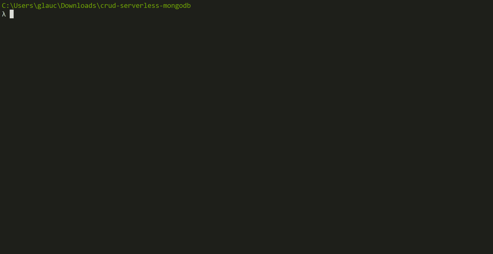

# 如何用 Azure 函数和 MongoDB 创建 CRUD 应用程序

> 原文：<https://acloudguru.com/blog/engineering/how-to-create-crud-applications-with-azure-functions-and-mongodb>

在本文中，我们将学习如何使用 Azure 函数创建一个与 MongoDB 和 Node.js 集成的 CRUD 应用程序

你可以在一堆编程语言中用 Azure 函数开发无服务器应用:[**【c#】**](https://docs.microsoft.com/azure/azure-functions/functions-reference-csharp?WT.mc_id=javascript-12357-gllemos)[**JavaScript**](https://docs.microsoft.com/azure/azure-functions/functions-reference-node?WT.mc_id=javascript-12357-gllemos)[**F #**](https://docs.microsoft.com/azure/azure-functions/functions-reference-fsharp?WT.mc_id=javascript-12357-gllemos)[**Java**](https://docs.microsoft.com/azure/azure-functions/functions-reference-fsharp?WT.mc_id=javascript-12357-gllemos)[**PowerShell**](https://docs.microsoft.com/azure/azure-functions/functions-reference-powershell?WT.mc_id=javascript-12357-gllemos)[**Python**](https://docs.microsoft.com/azure/azure-functions/functions-reference-python?WT.mc_id=javascript-12357-gllemos)[**TypeScript**](https://docs.microsoft.com/azure/azure-functions/functions-reference-node?WT.mc_id=javascript-12357-gllemos)然而，在这篇文章中，我们将关注 JavaScript。我们开始吧！

Azure Functions 核心工具 将允许我们从终端或命令提示符在我们的机器上本地开发和测试功能。以下是我用来解决这一挑战的程序和软件包的链接:

下面假设机器上安装了 Node.js 的 X 版本。

```
npm install -g azure-functions-core-tools
```

```
brew tap azure/functions
brew install azure-functions-core-tools 
```

*   **带 APT 的 Linux(Ubuntu/Debian)**

```
curl https://packages.microsoft.com/keys/microsoft.asc | gpg --dearmor > microsoft.gpg
sudo mv microsoft.gpg /etc/apt/trusted.gpg.d/microsoft.gpg 
```

有关如何正确安装 Azure Functions 核心工具的更多信息，请访问此处的链接。

要验证 Azure Functions Core Tools 是否已正确安装在您的计算机上，请在终端上检查 func 命令:

```
> func
```

如果按照下面的 [GIF](https://gifyu.com/image/hYvM) 发生，那是因为软件包安装成功了！


太好了。现在我们可以创建自己的函数了。为此，在您的机器上创建一个本地文件夹—让我们开始吧！

## 2.开始创建您的新应用程序

现在我们已经安装了这个包，让我们创建一个新的应用程序。为此，只需按照下面的 [GIF](https://gifyu.com/image/hYqP) 步骤即可。



注意，当我们打开 Visual Studio 代码时，需要点击出现在右下角的`**YES**`按钮来启用项目中的一些重要文件。

## 3.创建 MongoDB 连接

现在让我们对新创建的项目进行一些必要的更改。这样，我们将在我们的项目中本地安装 MongoDB。输入命令:

```
npm install mongodb
```

当我们在项目中安装 MongoDB 时，注意到在`**package.json**`文件中有变化。该文件将如下所示:

```
{
  "name": "crud-serverless-mongodb",
  "version": "1.0.0",
  "description": "Challenge-4 25 days of serverless",
  "scripts": {
    "test": "echo \"No tests yet...\""
  },
  "author": "",
  "dependencies": {
    "mongodb": "^3.3.2"
  }
} 
```

现在让我们创建一个名为`**shared**`的文件夹，并在其中创建一个文件:`**mongo.js**`。现在，项目结构如下图所示:

```
/**
 * Arquivo: mongo.js
 * Data: 01/25/2021
 * Descrição: file responsible for handling the database connection locally
 * Author: Glaucia Lemos – (Twitter: @glaucia_lemos86)
 */

const { MongoClient } = require("mongodb");

const config = {
  url: "mongodb://localhost:27017/crud-serverless-mongodb",
  dbName: "crud-serverless-mongodb"
};

async function createConnection() {
  const connection = await MongoClient.connect(config.url, {
    useNewUrlParser: true
  });
  const db = connection.db(config.dbName);
  return {
    connection,
    db
  };
}

module.exports = createConnection; 
```

在这里，我们正在创建到 MongoDB 的本地连接！

让我们也改变一下`**local.settings.json**`文件。这个文件负责“存储”所有我们不希望在提交到 GitHub 时暴露的密钥。注意这个文件在`**.gitignore**` **的文件列表中。**

打开`**local.settings.json**`文件并进行一些更改:

*   **文件:local.settings.json**

```
{
  "IsEncrypted": false,
  "Values": {
    "FUNCTIONS_WORKER_RUNTIME": "node",
    "AzureWebJobsStorage": "{AzureWebJobsStorage}"
  },
  "Host": {
    "LocalHttpPort": 7071,
    "CORS": "*"
  }
} 
```

在上面的代码中可以看到，我们已经启用了`CORS`。因为没有它，我们无法执行 CRUD 操作！如果你想对 CORS 有更多的了解，我推荐你阅读[这里的](https://developer.mozilla.org/en-US/docs/Web/HTTP/CORS)。

太好了！第一步已经完成了。现在让我们在 Azure 函数中创建我们的 CRUD！

* * *

[**成年人的 NoSQL:dynamo db 单表建模 w/里克·霍利汉**](https://get.acloudguru.com/nosql-for-grownups-dynamodb-webinar) DynamoDB 可以作为传统关系数据库的可伸缩、经济高效的替代品。。。如果正确使用的话！在[这个免费的点播网络研讨会](https://get.acloudguru.com/nosql-for-grownups-dynamodb-webinar)中，AWS 的高级实践经理、单表 DynamoDB 设计的发明者里克·霍利汉展示了他在 DynamoDB 中建模复杂数据访问模式的技巧。

* * *

## 4.功能-“创建菜肴”

要创建新函数，只需键入以下命令:

```
func new
```

当你输入这个命令时，它会给你几个 Azure Functions 提供给我们的模板选项。让我们选择 **HttpTrigger** 模板。

请注意，创建了一个 **CreateDish** 文件夹和两个文件:

*   **function.json** :这里我们将定义路由和端点方法。
*   **index.json** :这里我们将开发端点逻辑。

让我们开始改变这些文件。从 function.json 开始

*   **文件:CreateDish/function.json**

```
{
  "bindings": [
    {
      "authLevel": "anonymous",
      "type": "httpTrigger",
      "direction": "in",
      "name": "req",
      "methods": ["post"],
      "route": "dishes"
    },
    {
      "type": "http",
      "direction": "out",
      "name": "res"
    }
  ]
} 
```

现在让我们更改 index.js 文件:

*   **文件:CreateDish/index.js**

```
/**
 * File: CreateDish/index.js
 * Description: file responsible for creating a new 'Dish'
 * Date: 01/25/2021
 * Author: Glaucia Lemos (Twitter: @glaucia_lemos86)
 */

const createMongoClient = require('../shared/mongo');

module.exports = async function (context, req) {
  const dish= req.body || {}

  if (dish) {
    context.res = {
      status: 400,
      body: 'Dish data is required! '
    }
  }

  const { db, connection } = await createMongoClient()

  const Dishes = db.collection('dishes')

  try {
    const dishes = await Dishes.insert(dish)
    connection.close()

    context.res = {
      status: 201,
      body: dishes.ops[0]
    }
  } catch (error) {
    context.res = {
      status: 500,
      body: 'Error creating a new Dish'
    }
  }
} 
```

这里我们定义了`Post`路线，并为:`**Create a New Dish**`开发了逻辑。

让我们运行这个端点！要运行，只需键入命令:

```
func host start
```

它将列出我们创建的端点！看下面的 [GIF](https://gifyu.com/image/hYI5) 。


它为我们列出了以下端点:`**[POST]**` [**http://localhost:7071/API/disks**](http://localhost:7071/api/dishes)

## 5.功能-“获取所有菜肴”

这和我们上面做的是一样的。让我们用命令创建一个新函数: **func new** ，包含函数名为**getall disks**并更改文件: **function.json** 和 **index.js**

*   **getall disks/function . JSON**

```
{
  "bindings": [
    {
      "authLevel": "anonymous",
      "type": "httpTrigger",
      "direction": "in",
      "name": "req",
      "methods": ["get"],
      "route": "dishes"
    },
    {
      "type": "http",
      "direction": "out",
      "name": "res"
    }
  ]
} 
```

```
/**
 * File: GetAllDishes/index.js
 * Description: file responsible for list all 'Dishes'
 * Data: 01/25/2021
 * Author: Glaucia Lemos (Twitter: @glaucia_lemos86)
 */

const createMongoClient = require('../shared/mongo')

module.exports = async context => {
  const { db, connection } = await createMongoClient()

  const Dishes = db.collection('dishes')
  const res = await Dishes.find({})
  const body = await res.toArray()

  connection.close()

  context.res = {
    status: 200,
    body
  }
} 
```

## 6.函数-“GetDishById”

现在已经很清楚用 Azure 函数创建 CRUD 有多简单了，我将开始加速创建过程，并告诉您`**function.json**`和`**index.js**`文件中发生了什么变化:

*   **GetDishById/function . JSON**

```
 {
  "bindings": [
    {
      "authLevel": "anonymous",
      "type": "httpTrigger",
      "direction": "in",
      "name": "req",
      "methods": ["get"],
      "route": "dishes/{id}"
    },
    {
      "type": "http",
      "direction": "out",
      "name": "res"
    }
  ]
} 
```

```
// @ts-nocheck
/**
 * File: GetDishById/index.js
 * Description: file responsible for get a 'Dish' by Id
 * Data: 01/25/2021
 * Author: Glaucia Lemos (@glaucia_lemos86)
 */

const { ObjectID } = require('mongodb')
const createMongoClient = require('../shared/mongo')

module.exports = async function (context, req) {
  const { id } = req.params

  if (!id) {
    context.res = {
      status: 400,
      body: 'Please enter the correct Dish Id number!'
    }

    return
  }

  const { db, connection } = await createMongoClient()

  const Dishes = db.collection('dishes')

  try {
    const body = await Dishes.findOne({ _id: ObjectID(id) })

    connection.close()
    context.res = {
      status: 200,
      body
    }
  } catch (error) {
    context.res = {
      status: 500,
      body: 'Error listing Dish by Id.'
    }
  }
} 
```

## 7.函数-“UpdateDishById”

*   **UpdateDishById/function . JSON**

```
{
  "bindings": [{
          "authLevel": "anonymous",
          "type": "httpTrigger",
          "direction": "in",
          "name": "req",
          "methods": ["put"],
          "route": "dishes/{id}"
      },
      {
          "type": "http",
          "direction": "out",
          "name": "res"
      }
  ]
} 
```

```
// @ts-nocheck
/**
 * File: UpdateDishById/index.js
 * Description: file responsible for update a 'Dish' by Id
 * Data: 01/25/2021
 * Author: Glaucia Lemos (@glaucia_lemos86)
 */

const { ObjectID } = require('mongodb')
const createMongoClient = require('../shared/mongo')

module.exports = async function (context, req) {
  const { id } = req.params
  const dish = req.body || {}

  if (!id || !dish) {
    context.res = {
      status: 400,
      body: 'Fields are required'
    }

    return
  }

  const { db, connection } = await createMongoClient()
  const Dishes = db.collection('dishes')

  try {
    const dishes = await Dishes.findOneAndUpdate(
      { _id: ObjectID(id) },
      { $set: dish }
    )

    connection.close()

    context.res = {
      status: 200,
      body: dishes
    }
  } catch (error) {
    context.res = {
      status: 500,
      body: 'Error updating a Dish'
    }
  }
} 
```

## 8.函数-'DeleteDishById '

在' DeleteBishById 代码上方:

*   **DeleteDishById/function . JSON**

```
{
  "bindings": [
    {
      "authLevel": "anonymous",
      "type": "httpTrigger",
      "direction": "in",
      "name": "req",
      "methods": ["delete"],
      "route": "dishes/{id}"
    },
    {
      "type": "http",
      "direction": "out",
      "name": "res"
    }
  ]
} 
```

```
// @ts-nocheck
/**
 * File: DeleteDishById/index.js
 * Description: file responsible for delete a 'Dish' by Id
 * Data: 01/25/2021
 * Author: Glaucia Lemos (Twitter: @glaucia_lemos86)
 */

const { ObjectID } = require('mongodb')
const createMongoClient = require('../shared/mongo')

module.exports = async function (context, req) {
  const { id } = req.params

  if (!id) {
    context.res = {
      status: 400,
      body: 'The fields are required!'
    }

    return
  }

  const { db, connection } = await createMongoClient()

  const Dishes = db.collection('dishes')

  try {
    await Dishes.findOneAndDelete({ _id: ObjectID(id) })
    connection.close()
    context.res = {
      status: 204,
      body: 'Dish deleted successfully!'
    }
  } catch (error) {
    context.res = {
      status: 500,
      body: 'Error Deleting Dish' + id
    }
  }
} 
```

我们的食物准备好了！让我们测试所有端点！要测试，打开 Postman，可以下载[**Postman——这里**](https://www.getpostman.com/) 并包含 json 请求。请参见下面的示例:

```
{
  "name": "Amanda",
  "dish": "garlicky green beans",
  "vegetarian": true,
  "vegan": false,
  "allergens": "nuts (almonds)"
} 
```

*   新建一道菜:**【POST】http://localhost:7071/API/disks/**
*   列出所有菜品:**【GET】http://localhost:7071/API/disks/**
*   按 Id 列出菜品:**【GET】http://localhost:7071/API/disks/{ Id }**
*   按 Id 更新菜:**【PUT】http://localhost:7071/API/disks/{ Id }**
*   按 Id 删除菜:**【删除】http://localhost:7071/API/disks/{ Id }**

## 了解有关 Azure 基础知识的更多信息

如果你想了解更多关于 Azure 函数的知识，微软提供免费课程和电子书来帮助你了解更多关于无服务器和 Azure 函数的知识:

而如果你想了解更多其他科技新闻，Azure 和 JavaScript / Node。Js，一定要在 Twitter 上关注我！