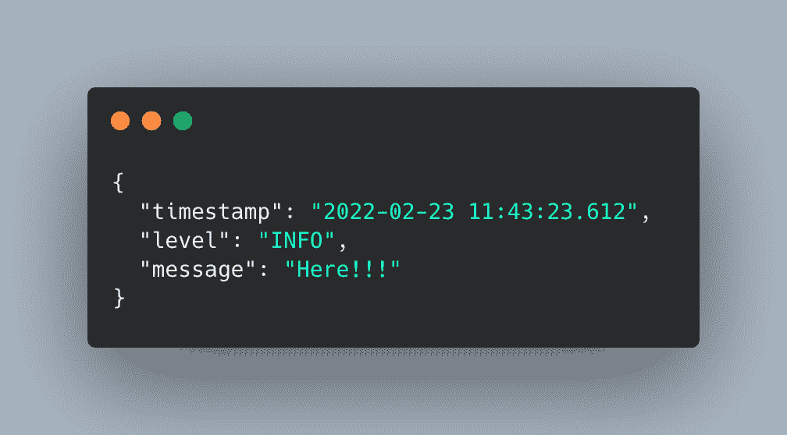
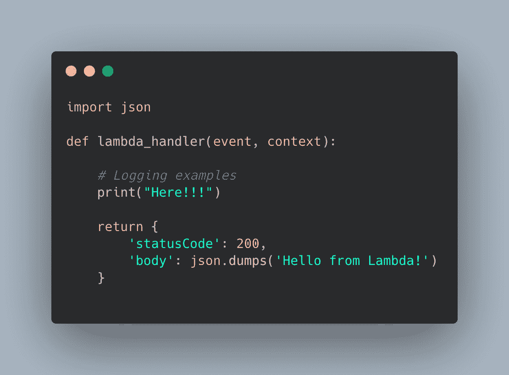
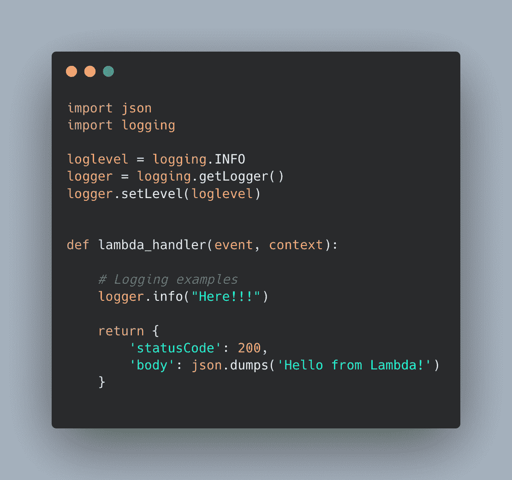
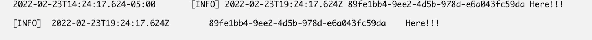
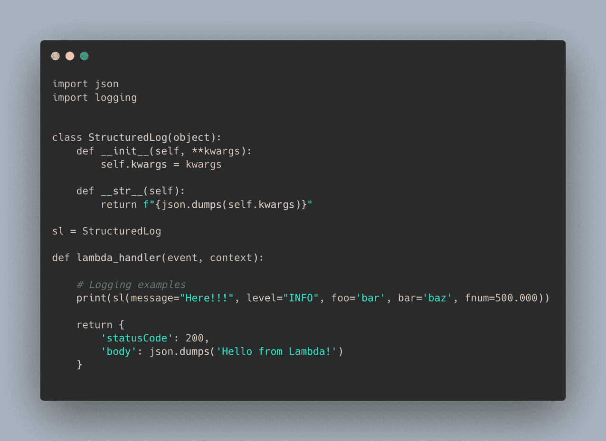
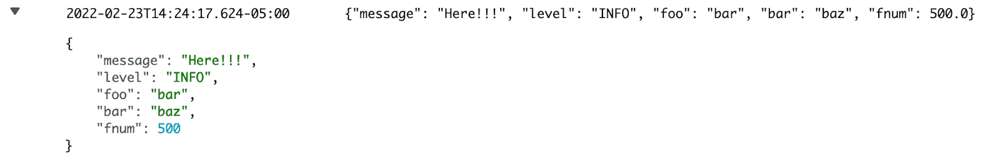
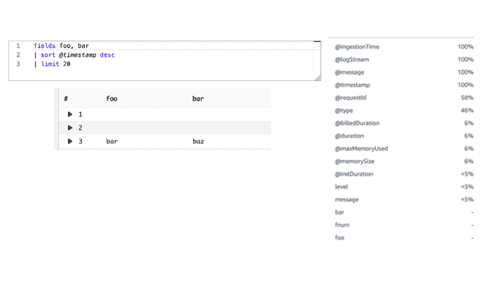
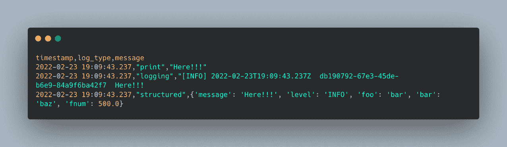

# 如何使用结构化日志更快地调试|云专家

> 原文：<https://acloudguru.com/blog/engineering/how-to-debug-faster-with-structured-logging>

日志一直是开发人员调试应用程序的工具，从简单的“print("Here ")”`到使用更正式的库，如 log4j 和日志模块。虽然这种“非结构化日志记录”对于单独的开发人员阅读日志来查明问题是有效的，但在执行更深入的分析或构建关于应用程序使用情况的报告时，这种类型的“非结构化日志记录”无法扩展。

* * *

**加速您的云计算职业生涯**

云专家让你轻松(也很棒)提升你的云事业——即使你对技术完全陌生。查看 [ACG 目前的免费课程](https://acloudguru.com/blog/news/whats-free-at-acg)或[立即开始](https://acloudguru.com/pricing)免费试用。

* * *

在最近关于构建无服务器应用程序的 Twitter 空间中，讨论了结构化日志的概念，作为一种扩展日志工作的方式，并提供了一种一致的方式来使用日志。

## **什么是结构化日志**？

结构化日志记录是一种以一致的格式记录信息的方法，允许将日志视为数据而非文本。结构化日志通常用 JSON 表示，这使得开发人员能够高效地存储、检索和分析日志。

支持更快调试的一些主要优势包括…

*   **更好的搜索—**通过利用 JSON 格式，我们可以在字段上创建查询，而不必依赖原始文本的脆弱正则表达式模式
*   **更好的集成**–通过使用一致的 JSON 格式，应用程序可以轻松地为仪表板或分析等下游任务获取数据。
*   **更好的可读性—**通过利用一致的格式，日志的使用者(如系统管理员)可以比阅读原始文本文件更有效地解析数据。

在这篇文章中，我将通过一个简单的 [AWS Lambda](https://aws.amazon.com/lambda/) 函数演示 Python 中的一个例子，强调非结构化和结构化日志记录之间的区别。

## **非结构化日志示例**

在本例中，我们将只使用默认的 print 语句。简单地说“这里”可以让我们知道代码在函数中的什么地方被执行。

虽然简单，但在查看日志事件时，它允许快速的人类可读调试过程。在 AWS Lambda 的上下文中，我们可以使用 [AWS CloudWatch](https://aws.amazon.com/cloudwatch/) 日志组来轻松验证我们的代码运行。

虽然对于简单用例的单独调试来说很棒，但是简单地打印文本并不能传达更深入的分析或有效的搜索方式所需的上下文。例如，可以从某个地区的客户那里查找日志，或者在特定页面上执行某个操作。必须进行文本匹配或正则表达式来查找日志中的数据，这对于细致入微的搜索来说并不理想。

日志模块也遇到了与标准打印语句相同的问题。

数据仍然是文本格式，即使它提供了日志级别等附加信息，日志消息仍然被视为文本而不是数据。

## **结构化测井示例**

为了将日志视为数据，我们必须创建一个能够将日志表示为数据的结构。有一些包，如 [Python JSON Logger](https://github.com/madzak/python-json-logger) 提供了将日志转换成 JSON 的机制，但是您也可以创建一个类来封装您的数据。

现在，当我们在 Cloudwatch 中查看数据时，我们会得到一个漂亮的 JSON，其中包含我们想要的任何字段。

由于数据是 JSON 格式，允许我们使用 Cloudwatch Log Insights 使用自定义字段对数据进行查询，因此我们决定不进行任何额外的配置。

更多利用 Cloudwatch 日志的例子，请查看 [AWS 计算博客](https://aws.amazon.com/blogs/compute/tag/cloudwatch-logs/)。

当我们移植日志时，我们还获得了一种易于使用的 JSON 格式，可以在其他应用程序中使用。

与其他日志示例中的原始文本相比，在结构化示例中，日志消息现在可以作为 JSON 对象使用。

如您所见，结构化日志记录并不是必须以某种方式实现的“硬性要求”。它只是一个框架，使您能够将日志视为数据，从而为您、您的团队和组织提供更健壮的调试方法。

*在 Twitter 上关注 Banjo，点击* [*，@banjtheman*](https://twitter.com/banjtheman) *和* [*，@AWSDevelopers*](https://twitter.com/awsdevelopers) *了解更多关于云计算和 AWS 的有用提示和技巧。*

#### **关于作者**

Banjo 是 AWS 的一名高级开发人员，他在那里帮助开发人员对使用 AWS 感到兴奋。Banjo 热衷于将数据操作化，并围绕利用数据启动了一个播客、一个 meetup 和开源项目。当没有建造下一个大东西时，Banjo 喜欢通过玩视频游戏特别是 JRPGs 和探索他周围发生的事件来放松。