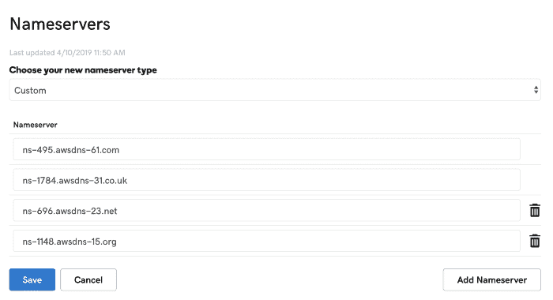
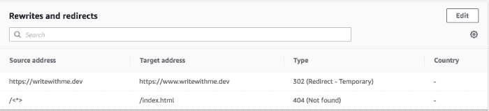

# 如何使用 Amplify 控制台|云专家部署自定义域

> 原文：<https://acloudguru.com/blog/engineering/how-to-deploy-a-custom-domain-with-the-amplify-console>

### 什么是 Amplify 控制台？

Amplify 控制台通过持续的基于 Git 的部署为[全栈无服务器 web 应用](https://acloudguru.com/course/building-a-full-stack-serverless-application-on-aws)提供托管。连接 Github repo，单击 deploy，应用程序就部署到一个活动的 URL 上了。

内置的原子部署通过确保 web 应用仅在整个部署完成时更新，消除了维护窗口。

如果您正在启动一个带有 Amplify 后端的项目，控制台还会为您提供部署和维护 Amplify 项目的选项。

### 添加自定义域

部署应用程序后，下一步是将应用程序部署到通过 GoDaddy 或 Google Domains 等域名注册商购买的自定义域名。

当您最初使用 Amplify 控制台部署 web 应用程序时，它托管在如下位置:

```
https://branch-name.d1m7bkiki6tdw1.amplifyapp.com
```

当您使用自定义域时，用户将能够轻松访问您的应用程序，该应用程序由一个虚拟 URL 托管，如下所示:

```
https://www.myawesomedomain.com
```

让我们来学习如何做到这一点！

### **在 Amplify 控制台中启动应用程序**

如果您已经在 Amplify 控制台中启动了一个应用程序，您可以跳过这一步，直接进入下一步—添加自定域。

还有现成的盖茨比博客可以快速上手。只需点击[这里](https://console.aws.amazon.com/amplify/home#/deploy?repo=https://github.com/gatsbyjs/gatsby-starter-blog)，然后跳到下一步添加自定义域。

要部署 GitHub 帐户中已有的应用程序，让我们在 Amplify 控制台中启动一个新的应用程序。第一步是将您的浏览器指向`[https://console.aws.amazon.com/amplify](https://console.aws.amazon.com/amplify)`并点击**部署**部分下的**开始**。

接下来，连接您想要启动的 Git 存储库并选择分支，然后点击 **Next** 。接受默认的构建设置，然后点击**保存并部署**。

现在您的应用程序已经启动，我们可以继续在自定义域中设置它了。

### 添加自定义域

在 AWS 仪表板中，转到 53 号公路并点击**托管区域**。选择**创建托管区域**。从那里，输入你的域名&点击**创建**。

**ProTip** :一定要按原样输入你的域名，不带 www。例如`myawesomedomain.com`

现在，在 Route53 dashboard 中，您应该有 4 个域名服务器。

在你的托管账户(GoDaddy，谷歌域名等..)，在您正在使用的域的 DNS 设置中设定这些自定名称服务器。



> *这些域名服务器应该看起来像 ns-1355.awsdns-41.org、ns-1625.awsdns-11.co.uk 等……*

接下来，在 Amplify 控制台中，点击左侧菜单中的**域管理**。接下来，点击**添加域名**按钮。

在这里，下拉菜单应该显示您在 [AWS Route 53](https://acloudguru.com/hands-on-labs/managing-dns-records-with-aws-route-53) 中的域名。选择本域&点击**配置域**。

这应该会将应用程序部署到您的域中(这将需要 5-20 分钟)。最后一件事是设置重定向。点击**重写&重定向**。

确保域的重定向如下所示(即，将 https://websitename 重定向到 https://www.websitename):



就是这样！一旦 DNS 开始传播，您应该会看到您的域名位于您在上述步骤中设置的 URL 上。

* * *

## 获得更好职业所需的技能。

掌握现代技术技能，获得认证，提升您的职业生涯。无论您是新手还是经验丰富的专业人士，您都可以通过实践来学习，并在 ACG 的帮助下推进您的云计算职业生涯。

* * *

*我的名字是* [*纳德达比特*](https://twitter.com/dabit3) *。我是亚马逊网络服务的一名开发人员，负责类似于*[*AWS app sync*](https://aws.amazon.com/appsync/)*和*[*AWS Amplify*](https://aws-amplify.github.io/)*的项目。我专门从事跨平台&云应用开发。*