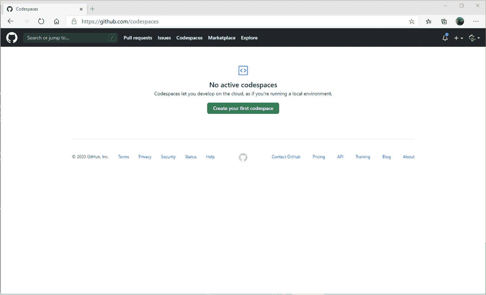
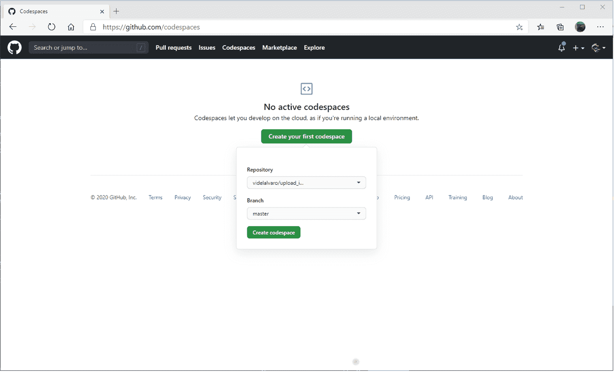
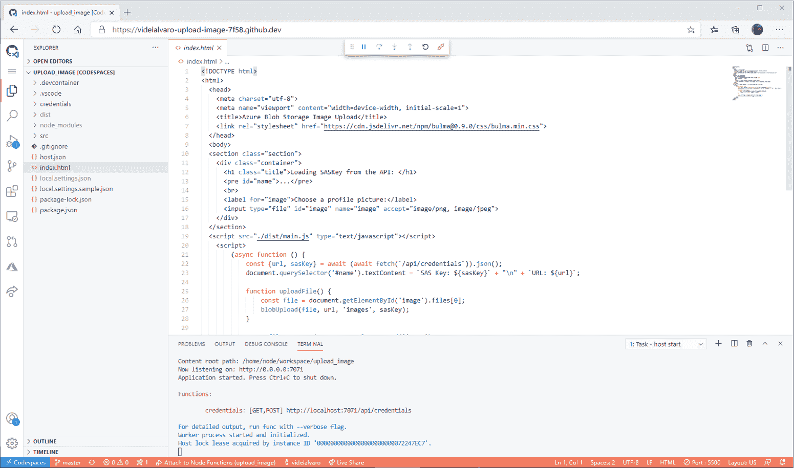
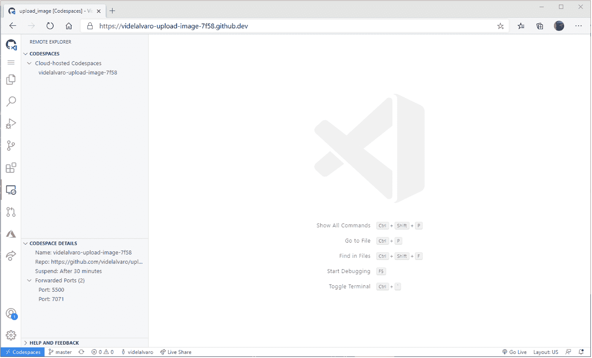
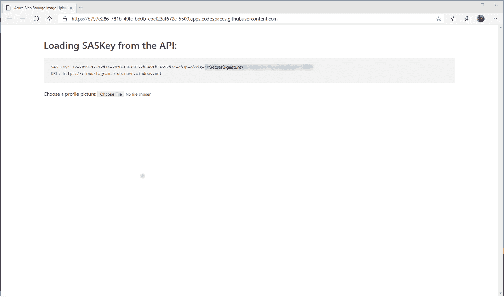

# 如何用 GitHub Codespaces 开发无服务器应用

> 原文：<https://acloudguru.com/blog/engineering/how-to-develop-serverless-apps-with-github-codespaces>

[GitHub Codespaces](https://github.com/features/codespaces) 是一个在线开发环境，运行在 [GitHub](https://github.com/) 上，使用 Visual Studio 代码。我们可以用它 100%在云端开发。所以我想看看它能否运行一个混合了 [Azure 功能](https://docs.microsoft.com/azure/azure-functions/?WT.mc_id=acg-blog-alvidela)和 [Azure 静态 Web 应用](https://docs.microsoft.com/azure/static-web-apps/?WT.mc_id=acg-blog-alvidela) [的项目。](https://docs.microsoft.com/azure/static-web-apps/?WT.mc_id=acg-blog-alvidela)

本项目教程将向您展示如何为 GitHub 代码空间准备好 Azure Functions & Static Web App 项目。您将了解如何自定义 Visual Studio 代码启动目标以自动测试您的应用程序，以及如何配置您的项目，以便在您在云端开发时自动安装 Visual Studio 代码扩展。

该项目由一个静态 Web 应用程序和一个图像上传表单组成。图像被直接上传到 [Azure Blob 存储器](https://docs.microsoft.com/azure/storage/blobs/storage-blobs-introduction?WT.mc_id=acg-blog-alvidela)，但是为了工作，它需要接收一个 [SAS 密钥](https://docs.microsoft.com/azure/storage/common/storage-sas-overview?WT.mc_id=acg-blog-alvidela)来对 Blob 容器执行匿名认证。这意味着我们有一个无服务器的后端生成 SAS 密钥，我们的前端可以通过 API 调用检索这些密钥。

你可以在 GitHub 上访问这个项目的代码[。](https://github.com/videlalvaro/upload_image)

要完成本教程，您需要一个 Azure 帐户。可以[免费报名](https://azure.microsoft.com/free/?WT.mc_id=acg-blog-alvidela)。注册后，您需要创建一个 [Azure 存储帐户](https://docs.microsoft.com/azure/storage/common/storage-account-create?tabs=azure-portal&WT.mc_id=acg-blog-alvidela)

我们希望有一个可以在代码空间中运行的开发环境，并且能够支持所有开箱即用的服务，所以让我们列出我们需要的东西:

1.  我们的项目运行在 nodejs 上，所以我们需要安装这个依赖项。
2.  对于 Azure Functions，我们需要安装 Azure Functions 核心工具，并在本地测试它们。
3.  对于“@azure/storage-blob”依赖，我们需要一个运行的“webpack ”,每当我们做一些更改时，它会自动重建我们项目的 JavaScript。
4.  对于静态 Web 应用程序，我们希望 Visual Studio 代码的 [Live Server](https://marketplace.visualstudio.com/items?itemName=ritwickdey.LiveServer&WT.mc_id=acg-blog-alvidela) 扩展可以让我们在本地预览我们的网站。
5.  设置项目所需的环境变量。

让我们看看如何解决这些问题。

## 为代码空间准备项目

在幕后，Codespaces 运行 docker 容器，我们的依赖项将安装在那里。幸运的是，Codespaces 有一整套现成的容器，我们可以开箱即用。去克隆 GitHub 上的[/Microsoft/vs code-dev-containers](https://github.com/microsoft/vscode-dev-containers)repo。在“containers”文件夹中，我们有“azure-functions-node ”,它已经包含了 nodejs 依赖项和 Azure Functions 核心工具依赖项。因此，第 1 点和第 2 点将被覆盖。

要为我们的项目启用该容器，我们需要将“. devcontainer”文件夹从“azure-functions-node”文件夹复制到我们项目的根文件夹中。在该目录中有“Dockerfile”和“devcontainer.json”文件，用于配置我们的代码空间。一旦它被添加，提交给 git 并推送到 GitHub。

要设置“webpack ”,我们将把这些行添加到“package.json”文件中，以确保依赖项安装在代码空间容器中:

```
json
"devDependencies": {
  "webpack": "^4.44.1",
  "webpack-cli": "^3.3.12"
}
```

然后在“脚本”下，我们将添加一个自定义脚本来执行名为“构建”的“webpack ”:

```
json
"scripts": {
    "start": "func start",
    "test": "echo \"No tests yet...\"",
    "build": "webpack --mode=development"
  },
```

然后我们需要告诉 VSCode 如何开始我们的项目。通常，当我们点击“F5”时，VSCode 会启动 Azure Functions 核心工具，但在这种情况下，我们也需要它来运行 webpack 构建。让我们编辑`. vscode/tasks.json `文件，在其中添加几个任务。

```
json
{
  "type": "shell",
  "label": "npm run webpack",
  "command": "npm run build",
  "dependsOn": "npm install"
},
```

此任务将运行我们的 webpack build 命令，同时依赖于“npm install ”,因此我们确保也运行一个。然后，我们需要编辑“主机启动”任务，这将启动“Azure 功能核心工具”。让我们让它依赖于我们的 webpack 任务:

```
json
{
  "type": "func",
  "command": "host start",
  "problemMatcher": "$func-watch",
  "isBackground": true,
  "dependsOn": "npm run webpack"
},
```

注意，任务相关性是使用任务“标签”作为标识符来指定的。

我们赢了五分之三。现在是时候解决服务器直播的问题了。默认情况下，我们需要安装 Live Server 扩展。为此，让我们打开`. devcontainer/devcontainer.json `配置文件，并编辑` extensions '条目，以包含 Live Server 扩展的 id，(既然我们在这里，让我们添加静态 Web Apps 扩展):

```
json
"extensions": [
	"ms-azuretools.vscode-azurefunctions",
"ms-azuretools.vscode-azurestaticwebapps",
	"dbaeumer.vscode-eslint",
	"ritwickdey.liveserver"
],
```

Live Server 会让我们在 http://localhost:5500 下预览或者静态的 Web App。在代码空间中，任何指向本地主机的 URL 都将被端口转发并重定向到重写的 URL。为了与 Live Server 一起工作，我们需要告诉 Codespaces 转发“5500”端口。在“. devcontainer/devcontainer.json”文件中，我们需要修改“forwardPorts”条目以包含该端口:

```
json
"forwardPorts": [ 7071, 5500 ],
```

一旦我们进入代码空间，我们将处理第 5 步。

## 创建您的第一个代码空间

我们在前面的步骤中做了所有的更改，现在是时候将您的项目推送到 GitHub 了。一旦完成，进入 [GitHub 代码空间](https://github.com/codespaces)并点击“创建你的第一个代码空间”。



然后选择代码空间的项目，以及 git 分支，并单击 create codespace:



一旦代码空间启动并运行，我们就可以进行最后的第五步，即告诉 Azure Functions Core Tools 如何连接到我们的存储帐户。为此，在项目的根目录下创建一个名为“local.settings.json”的文件。为此，您可以重命名 repo 已提供的“local.settings.sample.json”文件，并将其命名为“local.settings.json”。在这里，我们可以编辑“AzureWebJobsStorage”密钥，以包含从 Azure Portal 获得的存储帐户的连接字符串。您可以从运行在代码空间上的 Visual Studio 代码内部完成所有这些工作！这有多酷多 meta？！

它看起来应该是这样的，但是带有您的实际连接字符串:

```
json
{
    "IsEncrypted": false,
    "Values": {
      "AzureWebJobsStorage": "DefaultEndpointsProtocol=https;AccountName=youraccountname;AccountKey=<SecretAccountKey>;EndpointSuffix=core.windows.net",
      "FUNCTIONS_WORKER_RUNTIME": "node"
    }
  }
```

一旦完成，就该运行项目了。按“F1 ”,然后键入“用 Live Server 打开”以启动 Live Server 实例，这将让我们预览项目的静态 Web 应用程序端。完成后，按“F5”启动我们项目的 Azure 功能部分:



在 Azure Functions 启动我们的后端之后，我们可以继续在浏览器中查看它。在 Visual Studio 代码侧面板中选择“代码空间”选项卡，以访问转发端口及其各自的 URL:



点击“转发端口”下的“端口:5500”。如果一切顺利，您应该会看到类似这样的内容:



静态 Web 应用程序运行在我们的代码空间上，由 Live Server 提供服务，它联系了我们的无服务器应用程序，该应用程序为它提供了 SAS 密钥，允许我们将文件上传到 Azure Web Storage。

## 结论

通过这 5 个步骤，我们可以拥有一个使用 Azure 静态 Web 应用程序和 Azure 函数的项目，准备好使用 GitHub Codespaces 开箱即用。

GitHub Codespaces 是一个很棒的工具，它让我们在云中拥有一个工作开发环境，而不需要安装任何东西。这将有助于我们简化开发，并在开发过程中与其他开发人员共享我们的应用，使协作变得更加容易。可能性是无限的。就我而言，我对所有在线编程教育感到兴奋，这将由 Codespaces 实现。

## 后续步骤

##### 关于作者

阿尔瓦罗·维德拉是微软的一名开发者拥护者，他组织了 DuraznoConf。他是 RabbitMQ in Action 的合著者，并为计算机器协会撰写文章。你可以在推特上找到他的名字是 [@old_sound](https://twitter.com/old_sound) 。