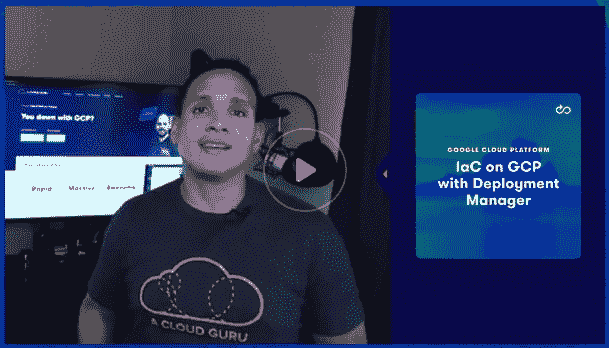

# 如何在云专家 GCP 上开始使用基础设施即代码(IaC)

> 原文：<https://acloudguru.com/blog/engineering/how-to-get-started-with-infrastructure-as-code-iac-on-gcp>

想知道如何在谷歌云平台(GCP)上开始使用基础设施即代码(IaC)吗？好吧，如果你对 GCP 有所了解，但对 IaC 了解不多，那么我有一个故事给你！聚集起来，大师们，来听一个关于 IaC、GCP、一个叫做[谷歌部署管理器](https://acloudguru.com/hands-on-labs/deploying-resources-with-google-cloud-deployment-manager)的工具和一个叫罗伊的人的故事。

#### 从前…

从前，有一个叫罗伊·g·比夫的人。他是 Virtucon 公司的新实习生。他的第一个任务是熟悉 Google Cloud Deployment Manager。他在办公桌前坐下来，在那里他找到了下面的架构图。

“嗯，”罗伊想。尽管罗伊熟悉谷歌云平台的基础知识，但他之前从未使用过部署管理器。

他决定做一些严肃的研究(也就是快速的谷歌搜索)来挖掘一些关于谷歌云部署管理器的信息。Roy 了解到，Deployment Manager 是一个 GCP 工具，用于将基础架构定义为可重用模板的代码。

Roy 对图表有了更多的了解，他决定应该使用[云外壳](https://acloudguru.com/blog/engineering/one-shell-to-rule-them-all-5-reasons-to-use-powershell-for-cloud-management)向部署管理器 API 提交一个配置文件。然后，部署管理器将使用计算引擎 API 来请求所需的资源，即使用默认 VPC 网络的 VM 实例。

罗伊匆匆写了一份清单，以确保他把所有的事情都安排妥当。

* * *

*设置多台服务器？我们都知道在几台服务器上连续运行命令是乏味且容易出错的。查看我们的动手实验室，学习使用[引导脚本](https://acloudguru.com/hands-on-labs/using-bootstrap-scripts-in-google-compute-engine)在谷歌计算引擎中自动完成新服务器的基本设置。*

* * *

## Google 云部署管理器清单

*   启用了部署管理器和计算引擎 API 的 Google 云项目
*   定义资源和项目信息的配置文件
*   将配置文件发送到部署管理器 API 的能力

让我们看看 Roy 是如何完成这三项任务的。

* * *

对 Amazon Web Services 上的基础设施代码感兴趣？
*查看[AWS 上的 IaC 指南](https://acloudguru.com/blog/engineering/cloudformation-terraform-or-cdk-guide-to-iac-on-aws)。*

* * *

## 部署管理器配置文件

Roy 继续阅读关于使用云部署管理器的[文档。在早期的项目启动同步中，Roy 获得了一个启用了正确 API 的 GCP 项目。](https://cloud.google.com/deployment-manager/docs/step-by-step-guide/installation-and-setup)

他的下一步是学习更多关于用于以代码形式设计基础设施的配置文件。他了解到配置文件描述了要在 Google 云平台上创建或配置的资源。每个资源都有三个在 YAML 文件或 Python 模板中定义的组件**。YAML 文件必须包括资源部分。**

| 资源 | 定义 |
| --- | --- |
| **名称**:第一虚拟机 | 资源名称 |
| **类型** : compute.v1.instance | 我们想要创建的资源类型 |
| **属性**: | 此资源类型的参数 |

Roy 知道，在代码文件的资源部分，他需要添加一个关于要创建的资源的名称、类型和属性。这不是很难编码，也很容易记住。

如果 Roy 想创建一个不同的资源，比如说一个 VPC 网络，他会将类型改为 *compute.v1.network* 并使用与网络资源相关的属性。Roy 收藏了下面的站点，它提供了一个[所有支持的资源类型](https://cloud.google.com/deployment-manager/docs/configuration/supported-resource-types)的列表。

#### 突击测验

下面是一个配置文件的摘录。关注一下 *my-first-vm* 实例的属性，您能确定属性中的每个主要参数定义了什么吗？

在思考上述问题时，Roy 注意到有四个不同的参数用于 *compute.v1.instance* 类型，它们是:

*   **zone:** 指定将在 Google Cloud 中创建资源的区域
*   **machineType:** 指定机器大小——考虑实例的内存和 RAM
*   **disks:** 指定要使用的磁盘类型，如果是引导磁盘，则指定要安装的操作系统映像
*   **网络接口:**指定 VPC 网络，需要外部 IP 地址

罗伊还注意到了文件上的凹痕图案。Roy 记得配置文件是用 YAML 结构编写的，它使用缩进来分隔资源、参数(属性)和值。

对配置文件有了很好的理解后，Roy 接下来需要将文件传递给部署管理器 API。根据图表，要使用的工具是 [Google Cloud Shell](https://acloudguru.com/hands-on-labs/build-a-custom-network-in-google-cloud-shell) 。

在幕后，Roy 用 Google 项目细节更新了示例配置文件。

### 谷歌云外壳

Roy 之前在准备 Google Certified Associate Cloud Engineer 考试期间使用了 Cloud Shell，因此他记得 Cloud Shell 是一个基于网络的终端，连接到一个预装了工具的容器化实例，以便与 Google 云平台进行交互。

云壳预装了 Google SDK。Roy 决定将配置文件提交给部署管理器 API，并使用 Google Cloud Shell **gcloud** 命令行工具。

## 设置配置文件

罗伊连接到谷歌云控制台，并在他的网络浏览器中启动了云壳连接。进入终端后，Roy 验证他是否在正确的项目中，并在活动的配置文件中设置区域。

接下来，罗伊推出了[云编辑器](https://acloud.guru/series/acg-fundamentals/view/cloud-shell-and-editor)，一个有用的基于云的 IDE 工具。在编辑器中，Roy 在一个已知的位置创建了一个名为`roys.yaml`的新文件。(文件的扩展名需要是 YAML 格式。)

Roy 然后将在该网页上找到的示例配置文件复制并粘贴到编辑器中。Roy 记得他需要将标记为“ *My_Project* 的部分更改为他的项目名称。(这个完成的比较早，不过是个例子让你知道 Roy 改了什么。)

也许您还想更改虚拟机名称或用于部署的网络？[使用此链接](https://github.com/ACloudGuru-Resources/Course_IaC_on_GCP_with_Deployment_Manager/blob/master/blog_files/roys.yaml)下载或复制 roys.yaml 文件，以便在您的 Cloud Shell 实例中跟进。

## 使用 gcloud 部署配置文件

完成后，Roy 就可以部署文件了。Roy 使用命令行界面切换到保存 *roys.yaml* 配置文件的目录。

Roy 使用下面的命令通过 Cloud Shell 向部署管理器 API 提交资源请求。

`gcloud deployment-manager deployments create roys-test --config roys.yaml`

*   **gcloud** 是谷歌 SDK 工具
*   部署管理器是资源
*   **部署**是我们需要的服务
*   为了**创建**一个名为 **roys-test** 的部署
*   使用**配置**文件命名为**<roys . YAML>**

### 部署经理

单击 submit 后，Roy 观察了部署管理器进度指示器。15 秒钟后，他收到了一条返回消息，表明操作已经成功完成。

Cloud Deployment Manager 非常出色地让您知道文件中是否有任何错误，以及如何修复它们，所以不要担心:如果您遇到错误，请列出更改列表并重试。

在 Roy 的案例中，一切都按计划进行，他使用 gcloud compute instances list 命令查看新部署的详细信息。(部署是使用部署管理器部署的资源的名称。)

### 删除资源以降低成本

在故事的这一点上，Roy 打破了第四堵墙，并提醒我们在结束时删除 Google Cloud 测试资源。(我们不希望你拿个账单，怪这个故事。)所以要像罗伊一样。**不要忘记使用这个命令删除项目**中的资源——如果您更改了它，用您的部署名称替换 *roys-test.yaml* 。

`gcloud deployment-manager deployments delete roys-test`

通过完成上面的步骤，你(或者更确切地说，Roy)应该在 Google Cloud 上的项目中创建了一个 VM。从此每个人都过着幸福的生活。

## 掌握将基础设施作为代码进行管理

像所有技能一样，将基础设施作为代码来管理需要实践。谷歌有一个很好的关于使用部署管理器的演练。但是你可以亲自去[学习如何在谷歌云平台](https://acloud.guru/learn/iac-on-gcp-with-deployment-manager)上以代码形式管理你的基础设施，这是一门名副其实的云大师课程[在 GCP 用部署管理器](https://acloud.guru/learn/iac-on-gcp-with-deployment-manager)以代码形式管理基础设施。

培养技能，成为现实世界中的专业云架构师。[Google Certified Professional Cloud Architect](https://acloudguru.com/course/google-certified-professional-cloud-architect)课程旨在高效教授专业云架构师认证所需的技能，即使用 Google Cloud 技术设计、开发和管理动态解决方案，以推动业务目标。看看您是否具备通过当今最具挑战性和最受欢迎的云计算认证的条件。

*Explore using Google Cloud Deployment Manager as your tool of choice for orchestrating infrastructure needs on GCP in [t](https://acloud.guru/learn/iac-on-gcp-with-deployment-manager)[his course from A Cloud Guru](https://acloudguru.com/course/infrastructure-as-code-on-gcp-with-deployment-manager).*