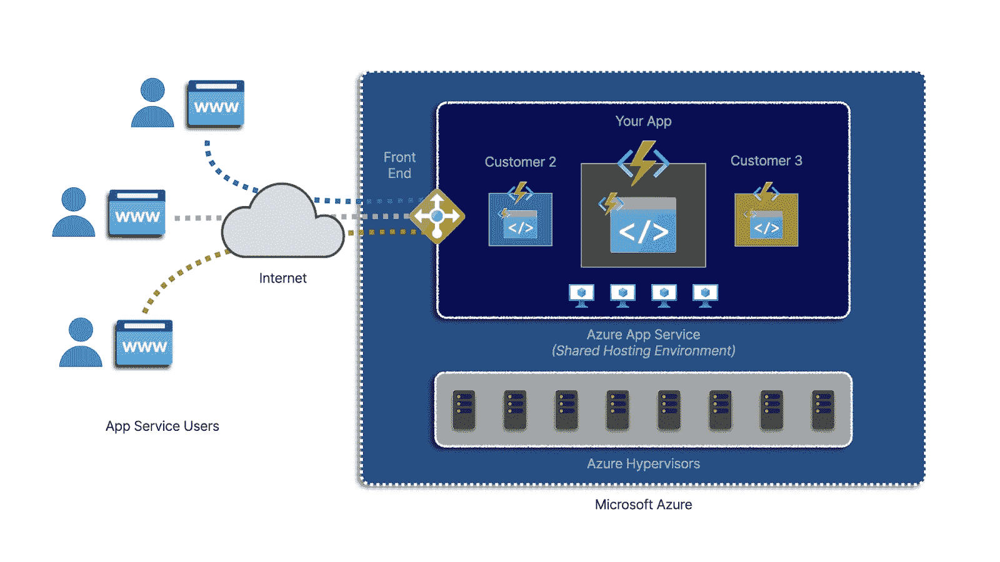
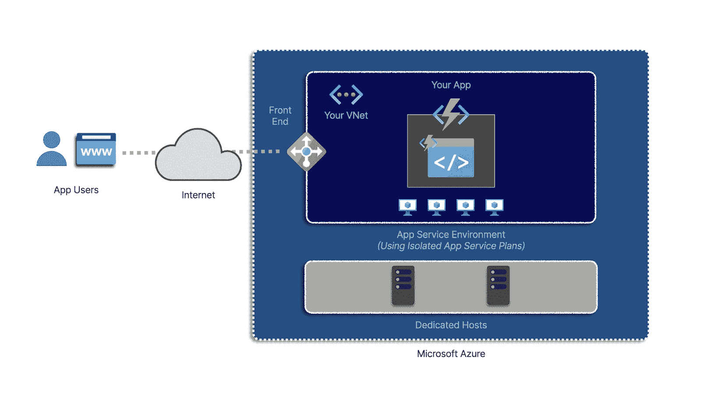

# 通过应用服务环境在 Azure 中隔离您的应用|云专家

> 原文：<https://acloudguru.com/blog/engineering/how-to-isolate-your-apps-in-azure-with-app-service-environments>

在这篇博文中，我们将讨论如何使用应用服务环境来帮助保护 Microsoft Azure 中的应用。

在云中构建 web 和无服务器应用变得越来越普遍。当你想到利用像[微软 Azure](https://acloudguru.com/blog/engineering/what-is-microsoft-azure) 、 [AWS](https://acloudguru.com/blog/engineering/what-is-amazon-web-services-aws) 或 [GCP](https://acloudguru.com/blog/engineering/what-is-google-cloud-platform-gcp) 这样的云提供商变得越来越容易时，你就会明白为什么了。

云计算可以让您更轻松地部署可扩展、高性能、甚至可全球访问的应用程序，通常比传统的托管平台省力得多。

然而，还有一些东西也变得越来越常见:头版新闻报道公司应用程序和数据的安全漏洞。

* * *

## 通往更好职业的钥匙

[从 ACG 开始](https://acloudguru.com/pricing)通过 AWS、Microsoft Azure、Google Cloud 等领域的课程和实际动手实验室改变你的职业生涯。

* * *

## 如何在 Azure 中隔离应用？

因此，如果您正在询问(或被询问)有关安全性的问题，您并不孤单。你可能会被问到的一个具体问题是:我如何将我的应用程序与其他客户隔离开来？

有几种技术可以保护 Azure 中的应用。在这篇博客中，我们将通过了解应用服务环境来关注一种特定的方法。

## 有哪些 App 服务环境？

应用服务环境(也称为 ASE)允许您通过使用隔离的计算和虚拟网络资源在 Azure 中托管应用程序，因此您的应用程序可以与其他客户工作负载更加隔离。

你为什么要这么做？如果你正在构建一个必须遵守严格标准的应用程序，这通常是很重要的——比如在处理机密信息时。

为了理解这是如何工作的，以及为什么这很重要，我们将看看 Azure 应用服务的幕后，并特别关注它与应用服务*环境*的不同之处。因为你将会了解到，应用服务环境实际上很容易建立和运行，并且与 Azure 应用服务非常相似(只是更具隔离性)。

## 什么是 Azure App 服务？

如果你在 Azure 中构建一个 web 应用，你可以使用 Azure 应用服务。Azure 应用服务是一种流行的 PaaS 产品，可以简化 web 应用部署和托管。Azure 应用服务提供负载平衡、自动扩展和 SSL 加密等功能，而无需管理底层基础设施。

Azure App Service 还支持 Azure Functions，这是一种 Azure 服务，通过允许您专注于正在实现的功能的单独代码，来帮助您构建无服务器应用程序。您可以配置触发器，以便代码只在需要时运行，并简化与其他 Azure 服务的集成。

当你使用 Azure App Service 时，你可以以比你自己管理所有必需的基础设施的成本低得多的价格获得所有这些功能。

## 应用服务应用是否运行在共享基础设施上？

云提供商如何提供比你更便宜的服务？通过规模经济。Azure App 服务是一个*多租户*服务。也就是说，许多客户与您共享相同的基础架构。

微软确保你的应用与其他客户分开，但当你保护你的解决方案时，了解其他客户确实与你共享服务元素是很重要的。

使用 Azure App Service 时，您的应用需要负载平衡、前端连接、出站连接和计算来执行代码。根据您使用的是共享应用服务计划还是专用应用服务计划，许多组件将与其他人共享。

这对于云计算来说很正常。其他人(如微软)管理许多客户共享的基础架构。这也是为什么它有助于理解云中的[共享责任。](https://docs.microsoft.com/en-us/azure/security/fundamentals/shared-responsibility)

那么，如果你想在云中开发一个解决方案，但是不允许使用共享基础设施，会发生什么呢？

在处理必须保持安全的信息时，这种情况很常见。例如，对于某些政府或国防机构，可能不允许在共享基础架构上处理最高级别的机密信息。

## **为什么要使用 App 服务环境？**

在这些场景中，有可能以更隔离的方式利用应用服务功能。现在可能已经不足为奇了——您可以通过使用 ASE 来实现这一点。

尤其是使用 ASE 第 3 版，将您的 Web 应用或功能应用部署到隔离的基础架构变得非常容易。所有这些对开发者体验的改变都很小，并且可以访问普通应用服务应用可用的相同类型的功能。

使用 ASE 隔离基础架构有两种主要方式。

*   首先，您可以利用专用主机，这意味着您的应用将在其上运行的底层虚拟机管理程序仅对您可用。不再与其他顾客分享。

*   其次，您的应用服务环境可以部署到您自己的虚拟网络中，确保您能够更好地控制应用的网络安全、入口和出口。

如果你正在构建一个只能内部访问的应用，你可以使用内部 ASE。这确保了只允许通过虚拟网络进行访问。另一方面，如果仍然需要公共可访问性，您可以部署外部 ASE。

配置好应用服务环境后，部署 web 或功能应用的流程与普通应用服务应用的流程大致相同。您将像以前一样配置一个应用程序，但不是为您的位置选择像 West US 这样的位置，而是选择您之前为您的位置配置的 ACE。

使用 ASE 时仍然需要应用服务计划，但您将选择一个独立的计划。这是指你的应用程序将与其他应用程序隔离开来。您可能还会注意到，该计划提供了与以前相同的功能，但具有更大的规模，这是一个额外的好处！

## 了解有关 Azure security 的更多信息

安全性通常是一种平衡行为，需要考虑很多事情。您可能想知道如何保护您用于 ASE 的虚拟网络，甚至想知道如何保护一个普通的应用服务应用。

如果你有兴趣了解更多关于在 Azure 中保护许多服务的信息，从身份到应用程序秘密，你可能会对我们的 [AZ-500 微软 Azure 安全技术课程](https://acloudguru.com/course/az-500-microsoft-azure-security-technologies-qxRJr)感兴趣。这是一门深入的实践课程，旨在通过 Azure 解决方案的实际操作为您准备 AZ-500 考试。

* * *

[**得到蔚蓝云痛苦辞典**](https://get.acloudguru.com/cloud-dictionary-of-pain)
说云不一定要辛苦。我们分析了数以百万计的回复，找出了最容易让人犯错的概念。抓住这个[云指南](https://get.acloudguru.com/cloud-dictionary-of-pain)获取 Azure 中一些最痛苦术语的简洁定义。