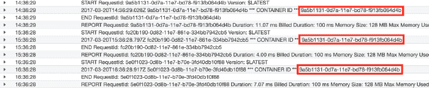

# 如何让您的 AWS Lambda 功能保持温暖|云专家

> 原文：<https://acloudguru.com/blog/engineering/how-to-keep-your-lambda-functions-warm>

*了解如何安排 CloudWatch 事件规则来解冻 AWS Lambda 函数，并帮助将响应时间从 3 秒减少到几百毫秒。*

* * *

**通往更好职业的钥匙**

[立即开始 ACG](https://acloudguru.com/pricing) 通过 AWS、Microsoft Azure、Google Cloud 等领域的课程和实际动手实验室来改变你的职业生涯。

* * *

使用无服务器架构有很多优点，有数百篇优秀的文章赞美它的优点，但一个令人痛苦的缺点是不常用的无服务器功能的响应时间通常很慢。

这是因为，有时，创建函数的容器不会被重用。因此，对于某些请求，AWS 需要在处理请求之前用您的代码重新提供一个容器。

对于后台任务，这显然不是问题。但是，如果你有一个由用户输入触发的任务，并且在收到响应之前阻止你的应用程序，那么这个函数必须是热的，这样你的响应时间可以是几百毫秒，而不是 3 秒。

另一方面，有时您的代码只是冻结在一个容器中，在处理新的请求之前可以“解冻”,这只需要几毫秒。

理想情况下，AWS 会有一个类似“保持温暖”的选项，您可以切换并同意支付更多费用来让 AWS 让未使用的容器一直运行。唉，这还没有(还没有？)已经实现，所以我们的下一个最佳选择是使用 CloudWatch 计时器。

那么如何才能让我们的 AWS Lambda 函数保持温暖呢？正如在[栈溢出](https://stackoverflow.com/questions/42877521/is-it-possible-to-keep-an-aws-lambda-function-warm?noredirect=1#comment72860693_42877521)中所建议的，你需要每 5-15 分钟 ping 你的 Lambda 函数来保持它们的热度。这比你想象的要容易。

## 1.创建 Amazon CloudWatch 事件规则

首先，打开 AWS 控制台(是的，[有一种方法可以通过 CLI](http://docs.aws.amazon.com/AmazonCloudWatch/latest/events/RunLambdaSchedule.html) 做到这一点)，然后进入 [CloudWatch](https://acloudguru.com/hands-on-labs/using-cloudwatch-for-resource-monitoring) 。从那里，转到`Events`并点击`Create rule`。将事件类型设置为`Schedule`，每 1 分钟运行一次该事件。

然后从`Targets`列表中选择您想要的 Lambda 函数并保存。然后，您需要创建一个名称和描述。

就是这样！你现在每 1 分钟检测一次 Lambda 函数。

## 2.测试 Amazon CloudWatch 事件规则

为了测试我们的计时器是否真的让函数保持活动，我们将创建一个函数，在全局范围内(在单个函数之外)将惟一的`awsRequestId`存储在一个名为`containerID`的变量中。

从技术上讲，这不是容器的 ID，但它会告诉我们一个容器是否被后续请求重用，因为我们只在尚未定义值的情况下写入它。

在部署这个函数、设置一个计时器并等待一段时间后，您可以检查您的 CloudWatch 日志，您会看到`containerID`在请求之间持续存在，这告诉我们，如果调用之间的间隔少于 1 分钟，AWS 会保持函数的热度。

所以为了科学起见，我继续为 1-15 分钟，以及 30、45 和 60 分钟的间隔设置了间隔计时器。这应该让我们知道 AWS 能让这些容器保温多长时间。

## 3.检查结果

快进 8 小时，我们就有结果了。我希望结果足够有趣，可以创建一个漂亮的图表，但是相反，我发现所有函数都是这种模式。

基本上，所有 Lambda 函数在实验期间都保持温暖，除了在世界协调时 14:00 左右的某个时候，AWS 决定重置所有容器，而不管它最近是否被使用过。

即使是 1 小时的 ping 也连续几个小时使用同一个容器。

These requests were 1 hour apart, but still used the same container.

所以看起来(至少从这个实验来看)脉冲的频率并不那么重要…

无论哪种方式，每 15 分钟左右 ping 一次仍然几乎不花什么钱，所以没有理由吝啬你的 CloudWatch 定时器。

* * *

## 获得更好职业所需的技能。

掌握现代技术技能，获得认证，提升您的职业生涯。无论您是新手还是经验丰富的专业人士，您都可以通过实践来学习，并在 ACG 的帮助下推进您的云计算职业生涯。

* * *

Sam Corcos 是 CarDash *的联合创始人，这是一家全方位的汽车礼宾服务提供商，消除了汽车服务、护理和维护的麻烦。他也是* [*学凤凰*](http://learnphoenix.io/) *的作者，以及* [*视线图*](http://sightlinemaps.com/) *的创始人。*