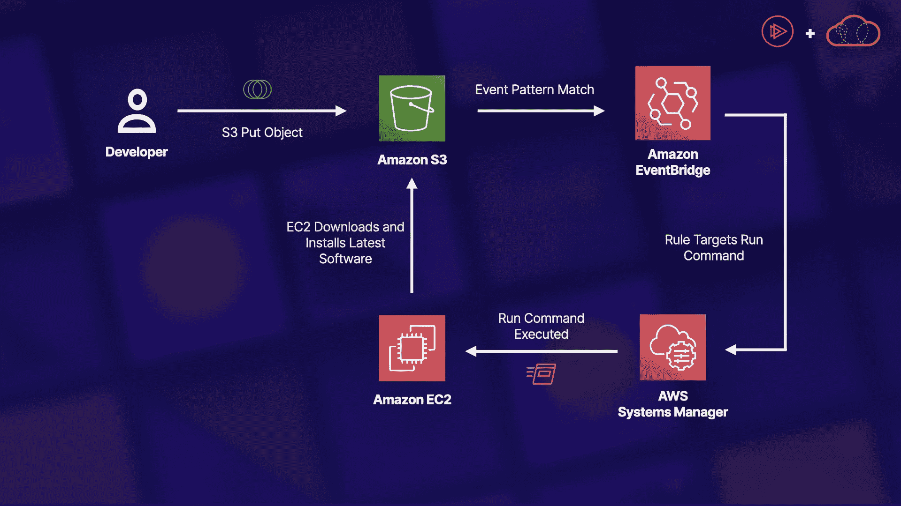
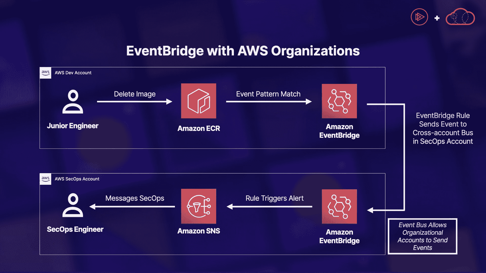

# 使用 EventBridge 集中 AWS 组织事件|云专家

> 原文：<https://acloudguru.com/blog/engineering/how-to-use-eventbridge-to-centralize-aws-organizations-events>

Amazon EventBridge 是一种无服务器的事件路由服务，允许我们实时对传入的事件做出反应。在本帖中，我们将采用一个场景，展示如何在 AWS 组织内实现跨帐户通知，然后利用 EventBridge 将集中的事件流转发到第三方 SaaS 工具。

* * *

**加速您的云计算职业生涯**

云专家让你轻松(也很棒)提升你的云事业——即使你对技术完全陌生。查看 [ACG 的免费课程](https://acloudguru.com/blog/news/whats-free-at-acg)或[现在就开始](https://acloudguru.com/pricing)免费试用。

* * *

## 什么是亚马逊 EventBridge？

Amazon EventBridge 是 AWS 提供的原始 CloudWatch Events 服务的演变。它允许我们利用无服务器事件总线，根据我们帐户内的传入事件实时执行操作任务。

这项服务的美妙之处在于我们可以完全定制实现。以前，当我们必须使用 CloudWatch 事件时，我们只能利用默认的事件总线，并且集成选项非常有限。

然而，使用 Amazon EventBridge 允许我们从头到尾完全定制选项和设置。

*   您的团队想要几个定制的事件总线用于不同的用例？亚马逊 EventBridge 提供了这种服务。
*   您想要配置多个规则以允许在单个事件总线上并行处理事件吗？亚马逊 EventBridge 也提供这种服务。
*   哦，你还希望能够在 AWS 帐户和地区之间发送事件？！亚马逊 EventBridge。😉

## 第三方 SaaS 供应商

Amazon EventBridge 为我们提供了许多默认的集成，截至本文发布时，共有 [34 个认证合作伙伴](https://docs.aws.amazon.com/eventbridge/latest/userguide/eb-saas.html)。相当令人印象深刻！

这些受支持的集成使我们能够轻松地将我们的事件总线与我们选择的 SaaS 供应商连接起来——比如 DataDog、PagerDuty 和 MongoDB 等等。

当使用这些支持的平台时，我们根据发送到 Amazon EventBridge 和从 Amazon event bridge 接收的数据执行我们自己的自定义操作。

一个完美的例子是传呼机责任。我们可以轻松监控我们帐户中的特定事件模式，当匹配时，利用一个使用 PagerDuty 连接的规则，以便我们的运营团队可以接收警报并采取适当的补救措施或步骤。

* * *

**[学习 AWS 的 10 个有趣的动手项目](https://acloudguru.com/blog/engineering/10-fun-hands-on-projects-to-learn-aws)** 学习 AWS 没有比使用所提供的服务来构建真实世界的应用程序更好的方法了。看看这些 [10 个好玩的 AWS 项目](https://acloudguru.com/blog/engineering/10-fun-hands-on-projects-to-learn-aws)，难度各不相同。

* * *

## AWS 默认服务

你会问，我们可以在 EventBridge 中使用多少 AWS 服务？嗯，简单来说，一个 **lot** ！

下面是当前支持的 AWS 服务的详细列表，这些服务可以生成默认的服务事件，这些事件很容易与 EventBridge 一起使用:[来自 AWS 服务的事件](https://docs.aws.amazon.com/eventbridge/latest/userguide/eb-service-event.html)

如您所见，有许多服务可供我们使用！

让我们以这个示例架构为场景:

### 方案

我们有一个托管在 EC2 compute 上的简单内部应用程序，它运行在一个自定义软件上，该软件在一个私有的 S3 存储桶中存储和更新。

早些时候，在实现 EventBridge 之前，每当我们想要更新软件时，都会花费运营团队数小时的时间。

现在，使用 EventBridge，我们可以将这个过程从几个小时缩短到仅仅几分钟(T3)。通过利用来自托管我们的定制软件的特定私有存储桶的 S3 `PutObject` API 调用，我们可以在我们的事件总线上创建 EventBridge 规则，并进行模式匹配。一旦生成了`PutObject`事件，我们就利用 EventBridge 规则来监视特定资源( *S3 桶*)上的特定事件( *PutObject* )。

使用我们创建的规则，我们可以设置一个定制 Systems Manager 自动化文档的目标，该文档使用`RunCommand`功能在目标 EC2 实例上执行软件更新 EventBrige 允许我们完全自动化那些需要花费大量时间才能完成的繁琐任务。

EventBridge 允许我们实施一个完全无服务器的解决方案来自动化我们的定制软件更新！🚀

## AWS 组织

我们前面提到的 EventBridge 提供的一个令人惊叹的功能是使用跨帐户和跨地区设计来利用服务的能力。由于这个强大的功能，我们可以利用 EventBridge 来帮助我们根据 AWS 组织内任何帐户中发生的事件采取行动。

以下面的图表为例:

### 方案

通过在安全帐户的 SecOps 事件总线上设置一个资源策略，SecOps 小组可以很容易地允许组织内的所有帐户(或特定的组织单位)向集中的事件总线发送事件。然后，他们可以通过事件总线上的规则进行模式匹配，该规则查找从组织帐户中生成的需要审查和潜在解决的特定事件。

对于上面的这个例子，我们有一个初级工程师，他恶意地或意外地从他们的开发帐户中删除了一个 Amazon 弹性容器注册映像。SecOps 不希望任何初级工程师能够清除图像；相反，他们只希望高级工程师这样做。

为了识别此类问题，他们与组织共享其事件总线，创建允许组织跨帐户和跨区域发送事件的资源策略，然后在每个子 AWS 帐户的默认事件总线上实现一个规则。

此默认规则将是传入 ECR 事件中删除操作类型字段的模式匹配。一旦匹配，它会将该事件发送到 SecOps 帐户事件总线，然后他们可以按照自己认为合适的方式处理该事件。

在本例中，他们只需使用社交网络向 SecOps 工程师团队发送警报。然而，我们也可以集成一个像 PagerDuty 这样的 SaaS 来处理警报和通知。

## 了解更多关于 Amazon EventBridge 的信息

如果你准备好了解更多关于亚马逊 EventBridge 服务及其提供的所有惊人功能，一定要查看亚马逊 EventBridge 课程的[介绍。](https://learn.acloud.guru/course/introduction-to-amazon-eventbridge/dashboard)

在本课程中，我们将介绍服务本身的基础知识，并对其工作原理有一个深入的了解。在基础之上，我们将在更深的层次上深入一些中间话题。我们将讨论诸如事件源、事件规则和目标或 API 目的地之类的东西。甚至会有一个部分显示我们可以在何处以及如何实施基于跨帐户资源的策略，该策略允许我们利用跨帐户和跨区域 EventBridge 架构。

### 跟上所有云的步伐

*[在 YouTube 上订阅云专家](https://www.youtube.com/c/AcloudGuru/?sub_confirmation=1)的每周云新闻和更新。您也可以在[脸书](https://www.facebook.com/acloudguru)上喜欢我们，在 [Twitter](https://twitter.com/acloudguru) 上关注我们，或者在 [Discord](http://discord.gg/acloudguru) 上加入对话！*

* * *

[**获得痛苦的云词典**](https://get.acloudguru.com/cloud-dictionary-of-pain)
说云不一定要努力。我们分析了数以百万计的回复，找出了最容易让人犯错的概念。抓住这个[云指南](https://get.acloudguru.com/cloud-dictionary-of-pain)获取一些最痛苦的云术语的简洁定义。