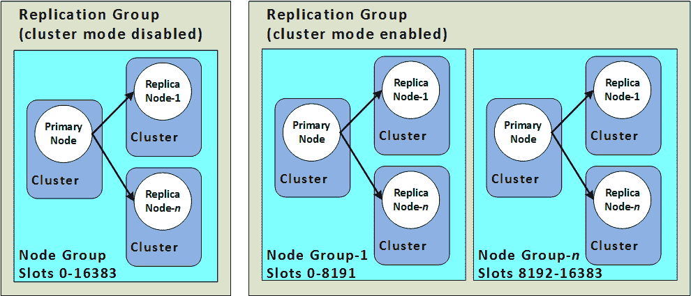

# 在云上使用 Redis？以下是你应该知道的十件事

> 原文：<https://acloudguru.com/blog/engineering/how-to-use-redis-on-cloud>

大规模操作有状态分布式系统是很难的，Redis 也不例外。托管数据库通过承担大量繁重的工作使生活变得更容易，但是您仍然需要一个良好的体系结构并应用最佳实践——无论是在服务器(Redis)上还是在客户机(应用程序)上。

这篇博客文章涵盖了一系列与 Redis 相关的最佳实践、技巧和诀窍，包括集群可伸缩性、客户端配置、集成和指标。虽然我会不时地引用亚马逊 memory db T1 和 T2 elastic cache T3 来描述 Redis，但是大多数(如果不是全部)都适用于 Redis 集群。

这绝不意味着是一份详尽的清单。我只是选择了 10，因为这是一个很好的，有益健康的数字！

让我们直入主题，从您在扩展 Redis 集群方面有哪些选择开始。

* * *

**通往更好职业的钥匙**

[立即开始 ACG](https://acloudguru.com/pricing) 通过 AWS、Microsoft Azure、Google Cloud 等领域的课程和实际动手实验室来改变你的职业生涯。

* * *

## **1。可扩展性选项**

你可以将*放大*或者将*缩小*:

*   纵向扩展(纵向)–您可以增加单个节点/实例的容量，例如从[亚马逊 EC2](https://aws.amazon.com/ec2/instance-types/) `db.r6g.xlarge type`升级到`db.r6g.2xlarge`
*   横向扩展(水平)–您可以向群集中添加更多节点

将*向外扩展*的需求可能由几个原因驱动。

如果您需要处理*读取繁重的*工作负载，您可以选择添加更多副本节点。这适用于 Redis 集群设置(如`MemoryDB`)或非集群主副本模式，如集群模式禁用的[elastic cache](https://docs.aws.amazon.com/AmazonElastiCache/latest/red-ug/Replication.Redis-RedisCluster.html)。

如果您想增加*写*容量，您会发现自己受到主副本模式的限制，应该选择基于 Redis 集群的设置。您可以增加集群中碎片的数量——这是因为只有主节点可以接受写入，并且每个碎片只能有一个主节点。

这还具有提高整体高可用性的额外好处。



*图 1: Redis(禁用集群模式)和 Redis(启用集群模式)集群——Redis 文档的 ElastiCache】*

## **2。在扩展您的集群之后，您最好使用这些副本！**

大多数 Redis 集群客户端(包括`redis-cli`)的默认行为是将所有*读取*重定向到*主*节点。如果您添加了读取副本来扩展读取流量，它们将处于闲置状态！

您需要切换到 [READONLY](https://redis.io/commands/readonly/) 模式，以确保处理所有读取请求的副本不仅仅是被动的参与者。确保正确配置 Redis 客户端——这将因客户端和编程语言而异。

例如，在 [Go Redis 客户端](https://github.com/go-redis/redis)中，您可以将`ReadOnly`设置为 true:

```
client := redis.NewClusterClient(
	&redis.ClusterOptions{
		Addrs:     []string{clusterEndpoint},
		ReadOnly:  true,
		//..other options
	}) 
```

要进一步优化，还可以使用`RouteByLatency`或`RouteRandomly`，两者都会自动开启`ReadOnly`模式。

*你可以参考一下* [*Java 客户端比如莴苣*](https://lettuce.io/core/release/reference/index.html#readfrom.read-from-settings)

## **3。使用读取副本时要注意一致性特征**

您的应用程序可能会从副本中读取陈旧数据——这是*最终一致性*在起作用。由于主节点到副本节点的复制是*异步*，因此您发送到主节点的写入可能尚未反映在读取的副本中。

当您有大量读取副本时，尤其是跨多个可用性分区时，很可能会出现这种情况。如果这对于您的用例来说是不可接受的，那么您将不得不求助于使用主节点进行读取。

MemoryDB 或 ElastiCache for Redis 中的 [ReplicationLag 指标](https://docs.aws.amazon.com/memorydb/latest/devguide/metrics.memorydb.html)可用于检查副本在应用主节点的更改方面落后多少(以秒为单位)。

### **强一致性呢？**

在`MemoryDB`、[的情况下，主节点的读数是强一致的](https://docs.aws.amazon.com/memorydb/latest/devguide/consistency.html)。这是因为客户端应用程序只有在写入(到主节点)到*持久多 AZ 事务日志*之后才会收到成功的写入确认。

## **4。请记住，您可以影响您的键在 Redis 集群中的分布方式**

Redis 没有使用一致散列(像许多其他分布式数据库一样)，而是使用散列槽的概念。总共有 16384 个槽，散列槽的范围被分配给集群中的每个主节点，并且每个键属于特定的散列槽(从而被分配给特定的节点)。如果键属于不同的哈希槽，在 Redis 集群上执行的多键操作将无法工作。

但是，你并不完全受集群的支配！可以通过使用*散列标签*来影响密钥的放置。因此，您可以确保特定的键具有相同的哈希槽。

例如，如果您将客户 ID 42 的订单存储在名为`customer:42:orders`的散列中，将客户概要信息存储在`customer:42:profile`中，那么您可以使用花括号{}来定义将被散列的特定子串。

在这种情况下，我们的键是`{customer:42}:orders`和`{customer:42}:profile`—`{customer:42}`现在驱动散列槽的放置。现在我们可以确信这两个键都在同一个散列槽中(因此是同一个节点)。

## **5。你考虑过缩小规模吗？**

你的应用是成功的，它有很多用户和流量。您横向扩展了集群，但事情仍然进展顺利。厉害！

### 但是如果你需要缩减规模呢？

在这样做之前，您需要注意几件事情:

*   每个节点上都有足够的空闲内存吗？
*   非高峰时段可以这样吗？
*   它将如何影响您的客户端应用程序？
*   在此阶段，您可以监控哪些指标？(如`CPUUtilization`、`CurrConnections`等。)

参考 MemoryDb for Redis 文档中的一些[最佳实践，以更好地规划扩展。](https://docs.aws.amazon.com/memorydb/latest/devguide/best-practices-online-resharding.html)

## **6。当事情出错时…**

面对现实吧，失败是令人羡慕的。重要的是你是否为他们做好了准备？对于 Redis 集群，需要考虑以下几点:

*   面对失败，您是否测试过您的应用/服务行为？如果没有，请做！使用 MemoryDB 和 ElastiCache for Redis，您可以利用[故障转移 API](https://docs.aws.amazon.com/memorydb/latest/devguide/autofailover.html#auto-failover-test) 来模拟主节点故障并触发故障转移。
*   您有副本节点吗？如果您只有一个带有单个主节点的碎片，那么如果该节点出现故障，您肯定会停机。
*   你有多个碎片吗？如果您只有一个碎片(包含主碎片和副本碎片)，那么在该碎片的主节点出现故障的情况下，群集将无法接受任何写入。
*   **您的碎片是否跨越多个可用性区域？如果你有跨多个 AZ 的碎片，你将更好地准备处理 AZ 故障。**

在所有情况下，MemoryDB 确保在节点替换或故障转移期间不会丢失数据

### **无法连接 Redis，求助！**

*Tl；DR:可能是网络/安全配置*

这是一件经常让人犯错的事情！使用 MemoryDB 和 ElastiCache，您的 [Redis 节点在一个 VPC](https://docs.aws.amazon.com/memorydb/latest/devguide/vpcs.html) 中。如果您有一个部署到计算服务的客户端应用程序，如 [AWS Lambda](https://docs.aws.amazon.com/lambda/latest/dg/welcome.html) 、 [EKS](https://docs.aws.amazon.com/eks/latest/userguide/what-is-eks.html) 、 [ECS](https://docs.aws.amazon.com/AmazonECS/latest/developerguide/Welcome.html) 、 [App Runner](https://docs.aws.amazon.com/apprunner/latest/dg/what-is-apprunner.html) 等。，您需要确保您拥有正确的配置，特别是在 VPC 和安全组方面。

这可能因您使用的计算平台而异。例如，你如何[配置一个 Lambda 函数来访问 VPC](https://docs.aws.amazon.com/lambda/latest/dg/configuration-vpc.html) 中的资源，与 App Runner 如何做(通过一个 [VPC 连接器](https://docs.aws.amazon.com/apprunner/latest/dg/network-vpc.html))或者甚至 EKS(尽管从概念上来说，它们是相同的)相比，会有些许不同。

## **8。Redis 6 带有访问控制列表——使用它们！**

没有理由不对您的 Redis 群集应用身份验证(用户名/密码)和授权(基于 ACL 的权限)。`MemoryDB`符合 Redis 6，且[支持 ACL](https://docs.aws.amazon.com/memorydb/latest/devguide/clusters.acls.html) 。然而，为了与旧的 Redis 版本保持一致，它为每个帐户配置了一个*默认*用户(用户名为**默认**)和一个不可变的 ACL，称为开放访问。如果您创建了一个`MemoryDB`集群并将其与该 ACL 相关联:

*   客户端可以连接*而无需*认证
*   客户端可以在任何键上执行*任何*命令(也没有权限或授权)

作为最佳实践:

*   定义显式 ACL
*   添加用户(以及密码)，以及
*   根据您的安全要求配置访问字符串。

您应该监控身份验证失败。例如，MemoryDB 中的 [AuthenticationFailures](https://docs.aws.amazon.com/memorydb/latest/devguide/metrics.memorydb.html) 指标为您提供了失败的身份验证尝试的总数——设置警报以检测未授权的访问尝试。

### **别忘了外围安全**

如果您已经在服务器上配置了 TLS，不要忘记在您的客户机上也使用它！例如，使用 Go Redis:

```
client := redis.NewClusterClient(
	&redis.ClusterOptions{
		Addrs:     []string{clusterEndpoint},
		TLSConfig: &tls.Config{MaxVersion: tls.VersionTLS12},
		//..other options
	}) 
```

不使用它会给你带来不太明显的错误(比如一个普通的`i/o timeout`)并使事情难以调试——这是你需要小心的事情。

## **9。有些事情你不能做**

作为托管数据库服务，MemoryDB 或 elastic cache[限制对某些 Redis 命令](https://docs.aws.amazon.com/memorydb/latest/devguide/restrictedcommands.html)的访问。例如，你*不能*使用[集群](https://redis.io/commands/cluster/)相关命令的子集，因为集群管理(缩放、分片等。)是由服务本身负责的。

但是，在某些情况下，你也许可以找到替代方案。以监控运行缓慢的查询为例。虽然您*无法使用[配置集](https://redis.io/commands/config-set/)对`latency-monitor-threshold`进行*配置，但是您可以在[参数组](https://docs.aws.amazon.com/memorydb/latest/devguide/components.html#whatis.components.parametergroups)中设置`slowlog-log-slower-than setting`，然后使用`slowlog` get 对其进行比较。

## 10。使用连接池

您的 Redis 服务器节点(即使是强大的节点)资源有限。其中之一是支持一定数量的并发连接的能力。大多数 redis 客户机提供连接池，作为有效管理 Redis 服务器连接的一种方式。重用连接不仅有利于 Redis 服务器，而且由于开销更少，客户端性能也得到提高——这在高容量场景中非常重要。

ElastiCache 为[提供了一些您可以跟踪的指标](https://docs.aws.amazon.com/AmazonElastiCache/latest/red-ug/CacheMetrics.Redis.html):

*   `CurrConnections`:客户端连接的数量(不包括读取副本的数量)
*   `NewConnections`:特定时间段内服务器已经接受的连接总数。

## **11。(奖励)使用合适的连接模式**

这是一个显而易见的错误，但我还是要把它说出来，因为这是我见过的最常见的“入门”错误之一。

您在客户端应用程序中使用的连接模式将取决于您是否使用独立的 Redis 设置，即 Redis 集群(很可能)。大多数 Redis 客户对它们进行了明确的区分。例如，如果您使用的是启用了`MemoryDB`或`Elasticache`集群模式的 [Go Redis 客户端](https://github.com/go-redis/redis)，则需要使用 [NewClusterClient](https://pkg.go.dev/github.com/go-redis/redis#NewClusterClient) (不是 [NewClient](https://pkg.go.dev/github.com/go-redis/redis#NewClient) ):

```
redis.NewClusterClient(&redis.ClusterOptions{//....})
```

*有意思的是，还有*[*universal client*](https://pkg.go.dev/github.com/go-redis/redis#NewUniversalClient)*选项哪个更灵活一点(在写这篇文章的时候，这是在 Go Redis v9)*

如果你没有使用正确的连接模式，你会得到一个错误。但有时，根本原因会隐藏在一般的错误信息后面——所以您需要保持警惕。

## **结论**

您做出的架构选择最终将由您的特定需求驱动。我建议您浏览以下博客文章，深入了解 MemoryDB 和 ElastiCache for Redis 的性能特征，以及它们如何影响您设计解决方案的方式:

Abhishek 目前是 AWS 的首席开发人员，专注于数据库。在他的职业生涯中，他身兼数职，包括工程、产品管理和开发者权益。他的大部分工作都围绕着开源技术，包括分布式数据系统和云原生平台。Abhishek 也是一名开源贡献者、热心的博客作者和作家。