# 我们如何在云专家 ACG 减少λ冷启动

> 原文：<https://acloudguru.com/blog/engineering/how-we-reduced-lambda-cold-starts-at-acg>

从第一天开始，云专家就是一家完全没有服务器的公司。

Sam Kroonenburg 在创建云专家时选择无服务器的原因是为了[缩短上市时间](https://acloud.guru/series/serverlessconf-nyc-2019/view/from-one-to-43)。五年后，无服务器已经成为该组织不可思议的生产力助推器。它实现了小而精的产品团队每天多次向产品交付特性的梦想。无服务器架构意味着这些团队可以花更少的时间管理基础设施，花更多的时间构建功能。

但是，正如他们所说，天下没有免费的午餐。在无服务器的情况下，这意味着我们必须专门设计我们的应用程序来解决随之而来的性能问题。我们提高性能的方式？最小化冷启动的影响和 lambda 函数之间的通信。以下是方法。

## 我们如何通过 GraphQL 模式拼接减少 Lambda 冷启动的影响并缩短交付周期

什么是冷启动？[这里](https://mikhail.io/serverless/coldstarts/aws/)是一个极好的解释。

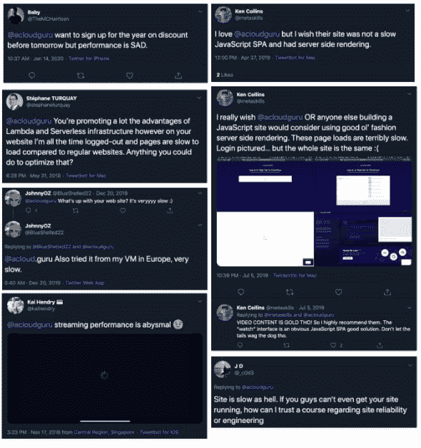

*Feedback from students that performance is important*

当谈到管理冷启动的影响时，首先要考虑的是驱动前端行为的请求-响应 API。对于云专家来说，我们的 API 层是用 GraphQL 编写的。

缓慢的响应速度是我们研究改进 GraphQL 层的主要原因。第二点，我们想提高开发人员的满意度。这可以通过减少生产时间([交付周期](https://clubhouse.io/blog/lead-time-what-is-it-and-why-should-you-care/))来实现。对于像扩展或取消 API 这样的常见更改，我们不希望开发人员在两个地方进行更改，这可能需要对每个步骤进行额外的部署和代码审查。

让我们回顾一下架构的发展，以及这些变化是如何减少性能问题并缩短交付周期的。

## 使用 web 系列的 GraphQL 初级读本

GraphQL 的主要吸引力是在一个请求中获取单个页面所需的所有数据。这个决定尤其重要，因为我们同时也在构建我们的第一个移动应用程序。为了让 GraphQL 能够在一个请求中获取数据，必须有一个端点能够解析整个应用程序数据图。那个入口点就是我们的**网关**。我们的网关只是用作一个单一的入口点，并且在设计上不包含业务逻辑。

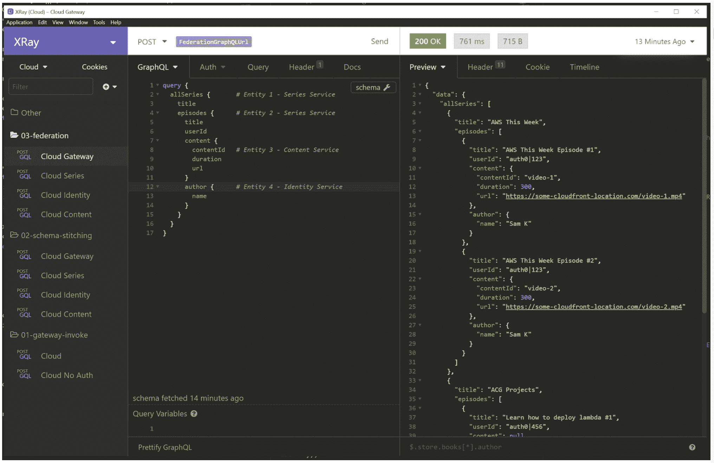

 *A typical request that would be used for loading our web series page. For example, this [landing page](https://acloud.guru/series/aws-this-week)*.

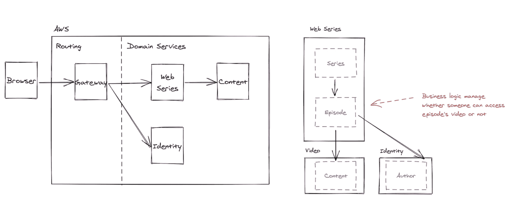

*Systems architecture / entity association of microservices involved in resolving web series.*

GraphQL 只是一个查询格式的规范。它没有规定一些关键的细节:**模式定义应该存在于何处，数据如何在微服务内解析(域内)，以及数据如何在服务间解析(域间)**。两种不同的架构方法调整这两个变量。

## Graphql 网关调用的 Lambda 函数

[代码](https://github.com/ACloudGuru/blog-acg-graphql-evolution/tree/master/01-gateway-invoke)

**模式定义的位置**:位于网关上

**数据解析**:网关执行 Lambda 调用进入微服务解析数据；网关拥有内部和内部类型的连接。

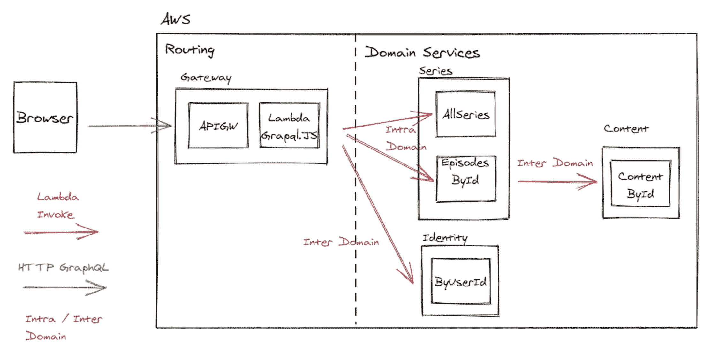

*Service to service was managed through AWS SDK Lambda Invoke*.

这种架构方法只是在网关上使用了 GraphQL.js。这个网关将拥有整个模式，并管理我们后端的查询解析。这样，网关将使用 AWS SDK 的 Lambda Invoke 来访问每个微服务。

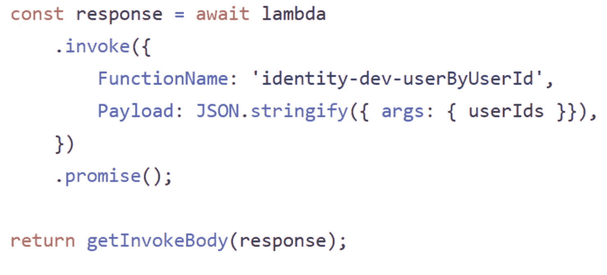

*An example AWS Lambda Invoke call the the gateway would make. (*[*Reference*](https://github.com/ACloudGuru/blog-acg-graphql-evolution/blob/7cff1d84c9a88356a633abefea0b6379b6eddee7/01-gateway-invoke/gateway/src/handler.js#L57)*)*

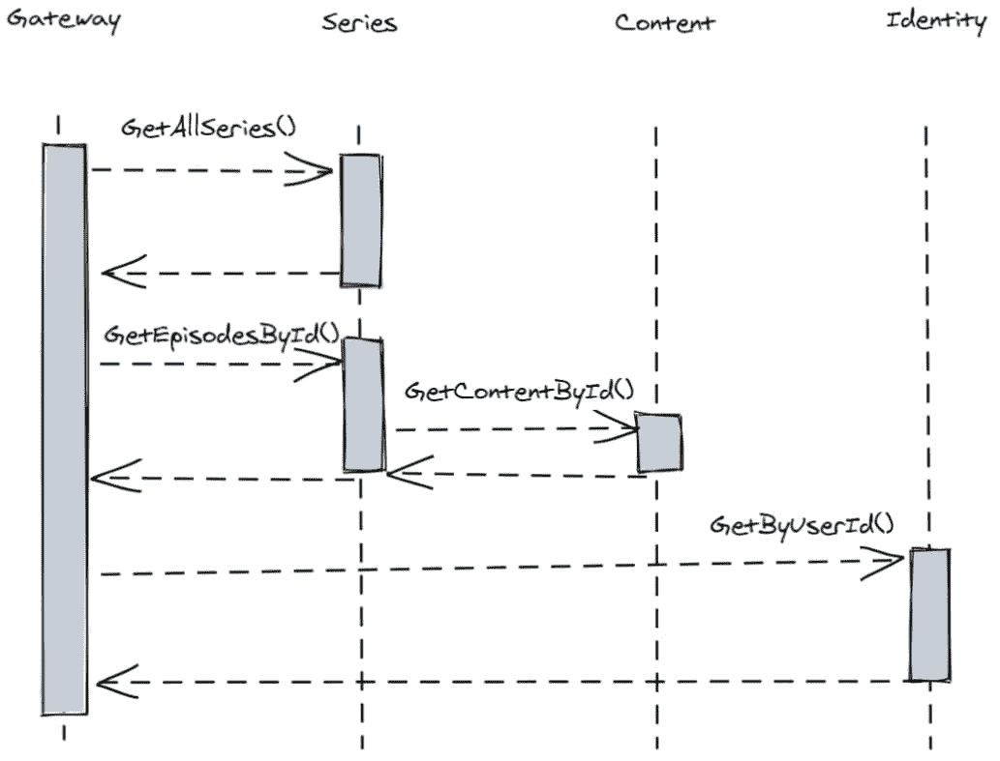

*Data resolution for query is orchestrated by the gateway.*

数据的分辨率如下:

*   网关解析所有系列
*   当系列已知时，网关然后要求该系列中的所有剧集
*   由于剧集实体拥有访问权限，它拥有关于某人是否应该观看该剧集的[业务逻辑](https://github.com/ACloudGuru/blog-acg-graphql-evolution/blob/7cff1d84c9a88356a633abefea0b6379b6eddee7/01-gateway-invoke/series/src/episodesBySeriesId.js#L71)
*   一旦剧集被解析，只有这样，网关才能从我们的身份服务中解析作者

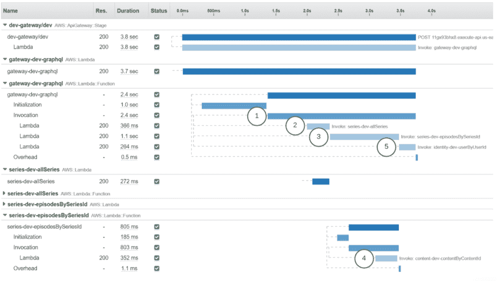

*A sequence diagram illustrated with XRay. Series + Identity called on gateway, and content called on series*.

XRay 说明了两件关键的事情:初始化一个冷 lambda 函数所花费的时间，以及获取数据所花费的时间。每个 lambda 容器只需进行一次初始化，因为相同的容器将被后续请求重用(直到容器被回收)。

我们注意到这个查询跨越了五个 lambda 函数来解析所有需要的数据。有两种类型的 lambda 函数:频繁调用的 lambda 函数(网关 lambda)和可能不调用的 lambda 函数(2x 系列、1x 内容、1x 身份)。

上面的例子是 lambda 函数的最佳例子。(它们很少依赖代码，因为代码依赖会导致更长的冷启动时间。)在典型的例子中，大多数 lambda 冷启动大约是一秒钟。这意味着用户点击四个 lambdas 不热的页面(15 分钟内没有被调用)可能会经历五秒钟的延迟。哎哟。

这种架构方法还有几个其他问题:

*   GraphQL 模式[存在于网关](https://github.com/ACloudGuru/blog-acg-graphql-evolution/blob/7cff1d84c9a88356a633abefea0b6379b6eddee7/01-gateway-invoke/gateway/src/handler.js#L9)上。这需要在更改 API 时进行两次部署——增加了交付时间，降低了开发人员的满意度
*   通信与 lambda 相关联，这意味着我们不能拥有不使用 Lambda 功能的微服务。(这在从 Linux Academy 平台整合实验室和操场时变得非常重要。)

## 模式拼接

[代码](https://github.com/ACloudGuru/blog-acg-graphql-evolution/tree/master/02-schema-stitching)

**模式定义**的位置:在每个微服务中

**数据解析**:网关将查询解析委托给微服务；网关拥有域间类型的连接；微服务拥有域内类型的连接。

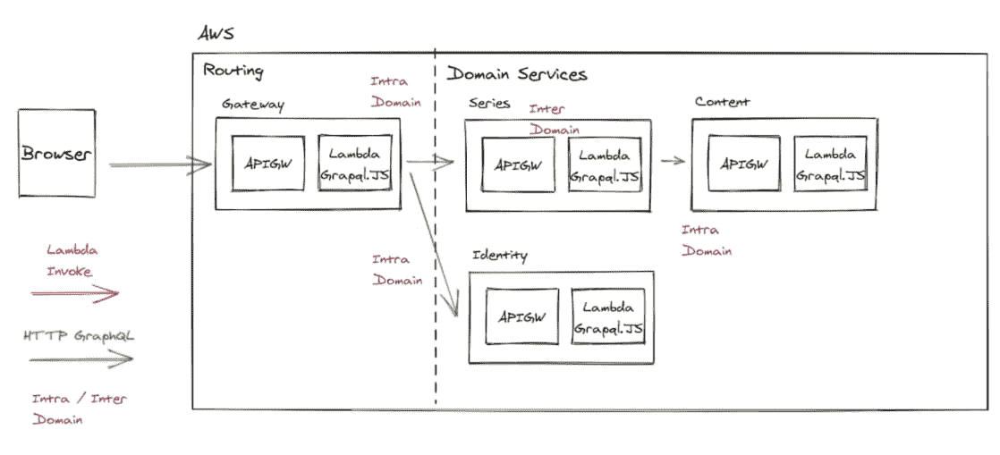

*Now communicating from the gateway to the downstream services using schema delegation / stitching. RPCs also managed through connecting via GraphQL*.

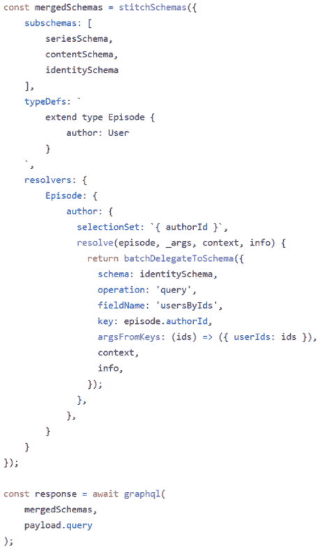

*Stitching the schemas together and doing a cross domain link between episode and author entities together on the gateway. (*[*Reference*](https://github.com/ACloudGuru/blog-acg-graphql-evolution/blob/7cff1d84c9a88356a633abefea0b6379b6eddee7/02-schema-stitching/gateway/src/handler.js#L63)*)*

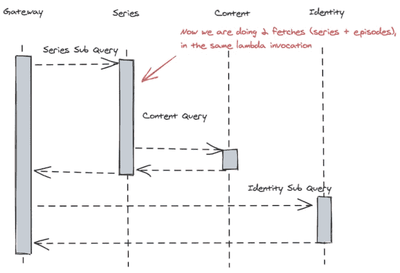

*We delegate sub queries to responsible microservices*

数据的分辨率如下:

*   网关将查询的 web 系列部分委托给系列服务
*   由于剧集实体拥有访问权限，它具有关于某人是否应该观看剧集的业务逻辑，因此它仍然管理内容服务的解析
*   一旦剧集的解析发生，只有这样，网关才能通过身份服务委托作者的解析

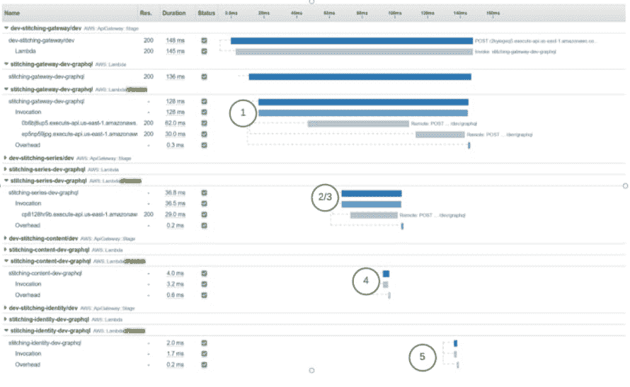

用 x 射线说明的序列图。在网关上调用系列+标识；系列上调用的内容。由于[λ可能变暖](https://acloudguru.com/blog/engineering/how-to-keep-your-lambda-functions-warm)，冷启动初始化被省略。

使用这种方法，每个微服务的 API 现在被表示为单个 lambda 函数。这做了两件事:

*   域内连接(例如，连续剧+剧集解析发生在同一个 lambda 函数内，而不是跨越两个 lambda 函数)。这减少了可能的启动次数+服务到服务的调用时间
*   lambda 可能会更热，因为整个服务只有一个 lambda 函数

我们已经从五个可能的冷启动减少到四个(网关、系列+剧集、内容、作者)，**尽管每个 lambda 都不太可能有冷启动**，因为 API lambda 正在为该微服务处理许多不同的操作。

从拥有模式的网关过渡到模式拼接解决了第一种方法中的一些问题:

*   对 API 和服务的更改可以在一次部署中完成，从而缩短了我们的交付时间
*   不再耦合到 AWS lambda，因为我们使用 HTTP 进行通信

这种方法确实存在一些问题，尽管它也有一些缺点:

*   网关仍然必须管理域间连接(尽管与域内连接相比可能性较小)
*   使用 API 网关增加了额外的延迟(从技术上讲，Lambda Invoke 仍然可以做到这一点)
*   安全性由 x-api-keys 而不是 IAM 管理

监控变得更加困难，因为一个服务处理的所有 API 请求只有一个 GraphQL lambda。我们已经决定使用一个特定于 GraphQL 的服务来解决这个问题(阿波罗引擎)。添加一个额外的服务并不意味着我们现在有多个地方可以搜索 API 请求的问题。

为了让网关知道如何委托请求微服务，我们必须查询每一个微服务。(此时我们有 40 多个。)查询服务微服务将引入更长的冷启动或高速缓存无效问题。我们最终通过添加内部服务发现解决了这个问题。每次有请求进来，网关都会向服务发现工具发出一个请求，以获取每个微服务的整个模式、url 和 api 键。**注意**:服务发现没有包含在示例代码中，增加了三个额外的自省调用。

## 冷启动分析

为了比较不同的方法，我们使用 ApacheBench，然后将结果导出到 Excel 中。为了捕捉冷启动的效果，之前所有功能都被重新部署。需要考虑的是，这个 ApacheBench 测试是完全合成的(一次完成)，并不代表真实世界的流量(在一天中交错进行)。

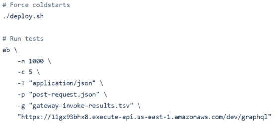

*ApacheBench running performance testing (*[*Reference*](https://github.com/ACloudGuru/blog-acg-graphql-evolution/blob/master/01-gateway-invoke/performance.sh)*)*

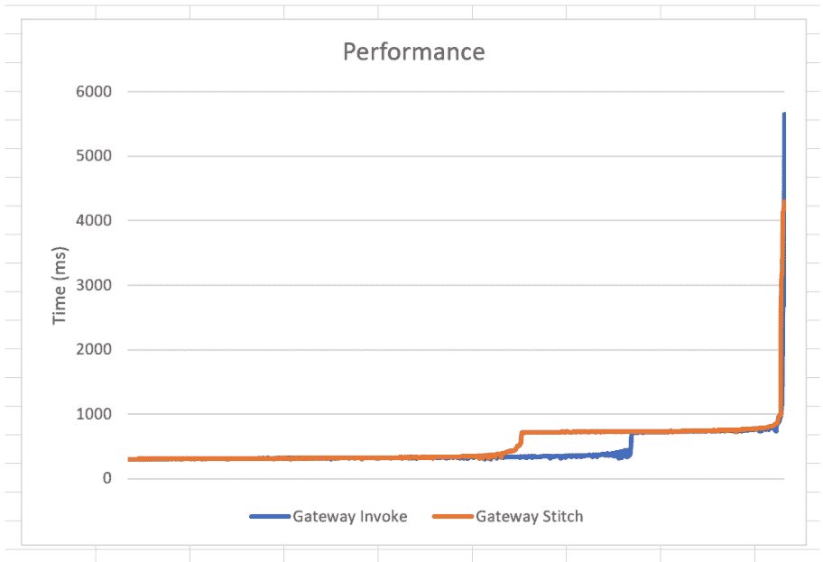

*Gateway Invoke vs. Schema Stitching (*[*Raw Results*](https://github.com/ACloudGuru/blog-acg-graphql-evolution/blob/master/Results.xlsx)*)*

数据结果中似乎有两个关键差异。

在这个特定的查询模式中，拼接有低 20%的 p99(五秒到四秒)。较低的 p99 是由于在解析系列数据时少了一个 lambda 函数调用/冷启动。在综合测试中不容易显示的是冷启动的减少，因为 lambda 函数被对这些微服务的其他调用保持温暖。我们怀疑，与网关方法拥有的许多 lambda 函数相比，单个 API lambda 函数的利用率更高。这意味着随着时间的推移，冷启动次数会明显减少。

网关调用性能在 p60-p70 标志之间较好。在模式拼接方法中，我们在微服务之间通信时引入了 API 网关。似乎添加 API 网关会给结果增加额外的差异。如果我们决定继续使用 lambda invoke 进行模式拼接，而不是 API Gateway，这可能会减少不一致性。

## 提前期分析

要确定我们的网关上发生的 API 变化的确切数量有点困难。不过，我们可以通过使用从我们的 Apollo Studio changelog 中提取的数据进行一些粗略的计算。我们可以看到，在 9 月份，我们对 GraphQL 模式进行了大约 230 次更改。

*Apollo Studio calculating GraphQL schema diff*

通过查看 diff 中包含的内容，似乎大约有 20 个部署中有模式更改。一个模式的改变可能需要大约三个工程小时，一个 PR(另一个审查代码的工程师的上下文切换)和部署网关，这不是没有道理的。这意味着，通过捆绑和部署模式变更以及代码变更，我们可能每月节省 60 个小时。

## 结论

为了提高整体学生体验，我们进行了一些重大的架构更改。

模式拼接允许更少的冷启动，当它们*发生*时，它们的影响会更小(至少 20%)。迁移到 schema stitch 还大大减少了从开发到生产的 API 变更的交付时间(我们所有的工程师，大约每月 60 小时)。

下一步是什么？改进是永无止境的努力。因此，我们认为通过利用 [Apollo Federation](https://github.com/ACloudGuru/blog-acg-graphql-evolution/tree/master/03-federation) ，我们可以将我们的性能和交付时间向前推进一步。

#### 关于作者

Dale 自 2015 年以来一直是一名无服务器开发者，当时无服务器框架仍被称为 Jaws。他对无服务器系统如何帮助开发人员减少构建高弹性系统的时间特别感兴趣，尽管他们说戴尔喜欢无服务器的真正原因是因为他可以舒服地睡一整夜。