# 我在这里告诉你真相，好的，坏的和丑陋的 AWS X 射线和λ|一个云大师

> 原文：<https://acloudguru.com/blog/engineering/im-here-to-tell-you-the-truth-the-good-the-bad-and-the-ugly-of-aws-x-ray-and-lambda>

AWS [早在 5 月份就宣布了对 AWS X-Ray 的 AWS Lambda 支持的全面可用性——我花了一些时间来尝试它。虽然我看到了大量的价值，但它目前的局限性极大地限制了它在复杂系统中的有用性。](https://aws.amazon.com/blogs/aws/aws-lambda-support-for-aws-x-ray/)

特定于 AWS Lambda 的文档有点支离破碎，所以我依赖一些实验，并从几个来源拼凑线索:

我发现记录注释和元数据并不像在[样本](http://docs.aws.amazon.com/xray/latest/devguide/scorekeep-lambda.html)中宣传的那样工作——尽管我可能做错了什么。

**2017 年 07 月 03 日更新:** *这篇文章发表后，AWS 的人取得了联系，并友好地澄清了这里强调的一些问题，这些问题是由糟糕的文档引起的，他们将在不久的将来纠正这些问题。向下滚动以查看相关部分的说明。*

### 示例应用程序

我创建的示例项目以一个名为`service-a`的 Lambda 函数为中心，这个函数调用了许多下游系统:

*   发布到 SNS 主题
*   在 S3 得到和放置一个物体
*   获取并在 DynamoDB 中放置一行
*   使用 Lambda API 调用另一个 Lambda 函数(`service-c`)
*   向由另一个 Lambda 函数支持的 API 网关端点发出 HTTP 请求——图中的`service-b`、`error`和`timeout`函数分别表示成功、错误和超时的情况

### 好人

一旦我破解了魔法咒语，我就能得到结果。这花费了更多的时间和精力——但总的来说，大多数功能在第一次(或第二次)询问时就像宣传的那样工作了。

下面是对`service-a`函数的跟踪，包括 Lambda 初始化该函数所花费的时间，以及它与之对话的各种下游系统——所有这些都嵌套在自定义子段下。

它甚至包括使用 Lambda API 调用的`service-c`函数的踪迹——以及它发布到 SNS 所花费的时间。

`service-a`的服务地图包括作为下游依赖的`service-c`，以及`service-c`对 SNS 的依赖。

### 坏消息是——它总是一个 200 的响应代码

当通过 API 网关端点和错误调用`service-a`函数时，相应的跟踪仍然报告 200 响应代码。

大概 X 射线看到的是一个`200 response from the Lambda service whose payload indicates a 502 response to the API Gateway invocation`，所以它认为“嘿，这是一个 200！”。

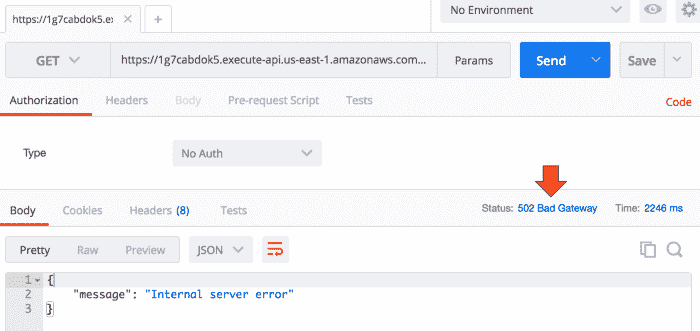

The service-a endpoint errored with 502

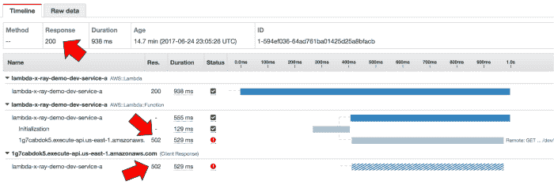

But the trace reported a 200 response code because (presumably) the AWS Lambda service itself reported a 200

奇怪的是，`error`函数的跟踪也报告 200，尽管它自己的状态字段表明它出错了。

这种行为对我来说既困惑又矛盾——也许我误解了它是如何工作的。可悲的是，x 光片的[概念](http://docs.aws.amazon.com/xray/latest/devguide/xray-concepts.html)页面也没有解释`Error`和`Fault.`之间的区别

虽然这现在看起来有点麻烦，但是当您需要诊断生产中的问题时，无法快速识别错误跟踪将对您造成最大的伤害。最有可能的是，当你时间压力最大的时候。

* * *

**更新 2017 年 7 月 03 日:**AWS 确认错误被报告为 200 的原因是由于 Lambda 服务返回了 200 响应(带有指示错误的有效载荷)。一种解决方法是使用过滤表达式 `service() { fault }` *，它返回包含故障的所有轨迹。*

* * *

### 跟踪不会跨越 API 网关

当`service-a`函数向 API 网关端点发出 HTTP 请求时，跟踪会在 API 网关端点处停止，并且不会扩展到由 API 网关触发的 Lambda 函数。

这种行为与我测试的所有 3 个端点一致— ` service-b`、`error`和`timeout`。

对于这个测试，在发出 HTTP 请求时，我遵循了 X-Ray [文档](http://docs.aws.amazon.com/xray/latest/devguide/xray-sdk-nodejs-httpclients.html)并使用 X-Ray SDK 来包装 Nodejs `https`模块。

我可以看到跟踪 id 在传出的 HTTP 请求中被正确传递，并被处理 Lambda 函数接收。

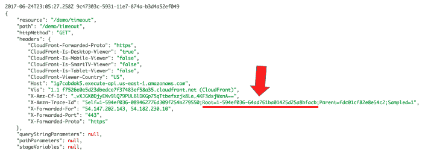

Trace IDs are passed along the HTTP headers in the GET request to the timeout function invocation.

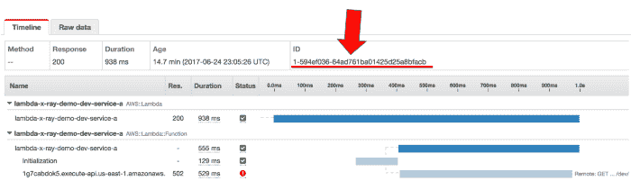

The root trace ID correctly match the segment ID of the originating function’s trace.

这是我期望在这种情况下看到的服务地图——其中`service-a`的跟踪通过 HTTP 请求到达 ap I 网关，并包括对`timeout`函数的调用。

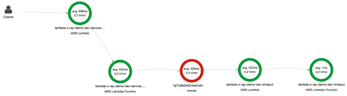

WARNING: this is not a screenshot! This is a composed image of what I would like to see — where traces follow through to Lambda invocations behind the failing HTTP request

相反，实际的服务映射在 API 网关处停止。

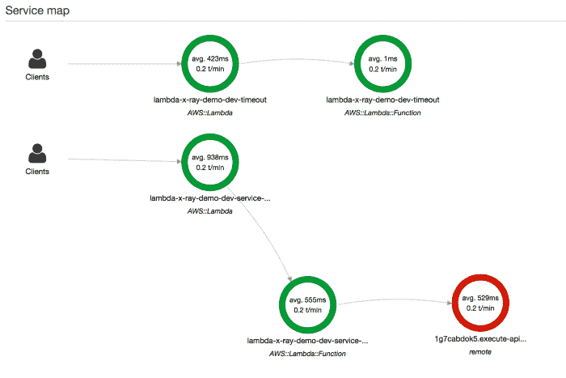

The trace does not follow through to the Lambda function behind the outgoing HTTP request

然而，当直接调用另一个 Lambda 函数时(使用 Lambda API 和[包装的](http://docs.aws.amazon.com/xray/latest/devguide/xray-sdk-nodejs-awssdkclients.html) AWS SDK ),跟踪按预期工作。

也许限制在于 API 网关？

下面您可以看到直接调用`service-c`所花费的时间，但是对`service-b`的跟踪停止在 API 网关层。

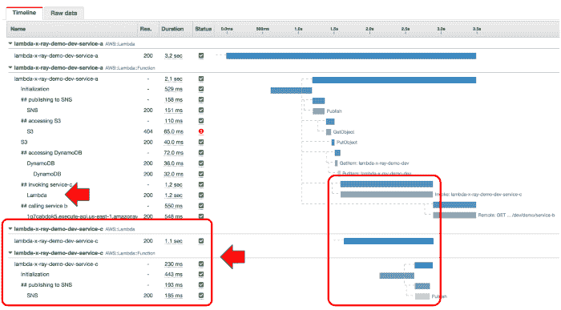

### **丑陋的-n**o 采样

根据 Lambda 关于 X 射线的[文档](http://docs.aws.amazon.com/lambda/latest/dg/lambda-x-ray.html)，请求应该以每分钟 1 个请求的速度进行采样。

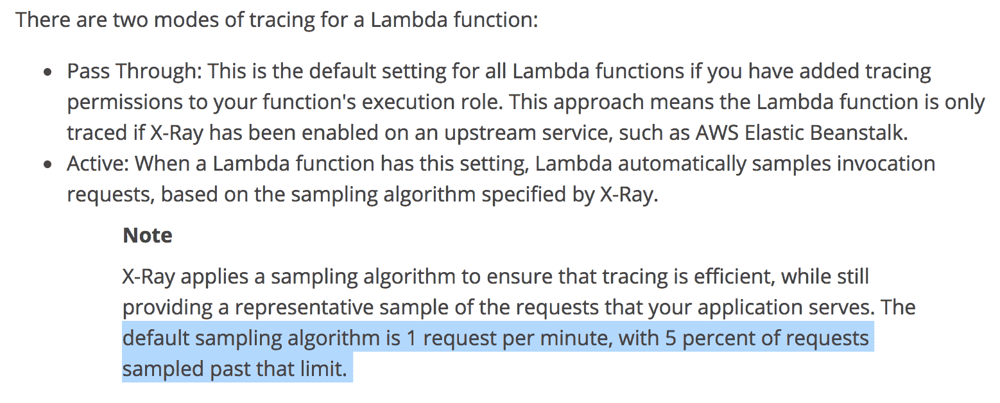

然而，在我的实验中情况并非如此。**每个请求都被采样**，从下面截图中的`age`痕迹可以看出。当通过 API 网关和 Lambda 管理控制台调用 Lambda 时，这种行为是一致的。

虽然 X 射线服务本身并不昂贵(每百万次追踪 5 美元)，但如果你不愿意通过系统追踪每一个请求，这仍然是一笔很容易就会出现在你身上的费用。

例如，我在 Gamesys 用大约 100 万 DAU 开发了一款相当成功的社交游戏。按照每天大约 2 . 5 亿次用户请求计算，X-Ray 的成本为 5 * 250 * 30 天= 37500 美元，超过了我们当时的整个 AWS 账单！

**2017 年 07 月 03 日更新:** *这原来是文档的问题，它没有提到采样是基于量的，只有当你达到一定量的请求时才开始。*

* * *

想要深入了解 AWS X-Ray 等 AWS 开发工具吗？看看这些云专家课程！

* * *

### 注释和元数据仅适用于子段

有一件事就是拒绝工作——尽管我已经遵循了[示例](http://docs.aws.amazon.com/xray/latest/devguide/scorekeep-lambda.html)——向根段添加注释和元数据:

```
module.exports.handler = (event, context, callback) => {
  ...
  let segment = AWSXRay.getSegment();
  let n = Math.random() * 3;
  segment.addMetadata('random', `${n}`);      // this doesn't work
  segment.addAnnotation('path', event.path);  // this doesn't work
  ...
}
```

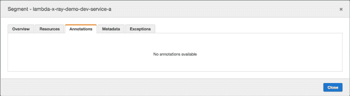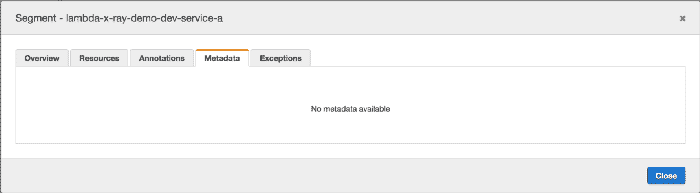

有趣的是，给子段添加注释和元数据效果很好。

```
let publishSNS = segment => {
  return new Promise((resolve, reject) => {
    console.log('publishing to SNS topic');

    let f = co.wrap(function* (subsegment) {
      ...
      subsegment.addAnnotation('topic', topicArn);
      subsegment.addMetadata('message', 'test');
      let req = {
        Message: message,
        TopicArn: topicArn
      };
      yield sns.publishAsync(req);
      subsegment.close();
      resolve();
    });

    AWSXRay.captureAsyncFunc("## publishing to SNS", f, segment);
  });
};
```

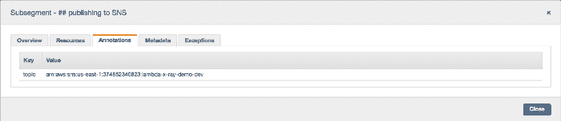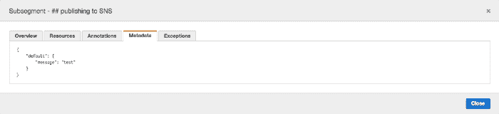

查看日志，我发现了一些有趣的事情:根段的段 ID 与 X 射线跟踪中的段 ID 不匹配。

例如，我在处理程序中获取我的函数的根段，并将其记录到 CloudWatch 日志中。

```
const AWSXRay = require('aws-xray-sdk');
module.exports.handler = (event, context, callback) => {
  ...
  // this should be the root segment for my function
  let segment = AWSXRay.getSegment();
  console.log(JSON.stringify(segment));
  ...
}
```

在日志中，我可以看到段 ID 是 *05b2b9ac6c9e5682* 。

但是在 X 射线跟踪中，根段的段 ID 是*2 b 7 D5 B4 a2 d 96 e 9*。

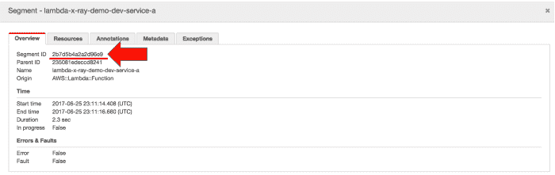

The segment ID of the root segment doesn’t match the one the function fetched at runtime.

此外，跟踪 ID 也不同:

*   在日志中是*1–59504311-d 765 e 7 accb 8558871 fa 89 d6d*
*   在 X 射线控制台中是*1–59504312–5e F2 a3 EDA 0 C1 B2 C4 d 64 DD a00*

这很奇怪，所以我决定在 X 射线控制台的日志中跟踪跟踪 ID，从冷启动开始。

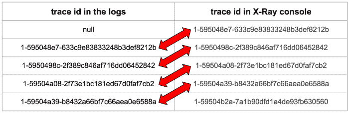

From the data it’s clear to see that AWSXray.getSegment() returns the root segment from the previous invocation

答对了。看起来这是 Nodejs 的 X-Ray SDK 中的一个错误，其中`AWSXray.getSegment()`从之前的调用中返回根段。

**2017 年 07 月 03 日更新:** *虽然 X-Ray SDK wrt 在跟踪 trace-id 时有一个 bug，但根本不支持向根段添加注释和元数据，文档中没有明确说明。您可以通过创建一个覆盖整个函数调用的子段来解决这个问题，作为您的自定义根段，并在那里附加任何与调用相关的注释和元数据*。

### 真相

所以你有它，我的周末与 AWS X 射线和λ的恶作剧🙂

> “我来**这里告诉你真相**，**好的、坏的和丑陋的**。”—奥利弗·诺斯

总的来说，我对我所看到的印象深刻，并认为 X 射线会给我在 Yubl 建造的[无服务器架构增加很多价值。然而，无法跨越 API 网关端点的跟踪使得它对我们的生态系统来说用处不大。](https://medium.com/@theburningmonk/yubls-road-to-serverless-part-1-overview-ca348370acde)

此外，X 射线服务侧重于执行时间，并帮助您识别性能瓶颈。然而，分布式跟踪还有一个 X 射线不关心的重要方面——通过确保在所有日志消息中捕获一组相关 id 来帮助您调试系统。

虽然您可能可以使用 X-Ray 提供的跟踪 id，但是您仍然有责任在所有日志消息中捕获它们，并将您的所有日志传播到一个易于搜索的位置。我们在 Yubl 的无服务器架构中投入了一些精力来实现分布式跟踪，你可以在这个[帖子](https://hackernoon.com/yubls-road-to-serverless-part-3-ops-6c82139bb7ee)中读到详细信息。

您在生产中使用 X 射线吗？我很乐意听到你对这项服务的想法和反馈，以及在评论区寻找任何陷阱！

* * *

## 获得更好职业所需的技能。

掌握现代技术技能，获得认证，提升您的职业生涯。无论您是新手还是经验丰富的专业人士，您都可以通过实践来学习，并在 ACG 的帮助下推进您的云计算职业生涯。

* * *

*感谢阅读！如果你喜欢你所读的，点击下面的❤按钮，以便其他人可以找到它。可以* [*在 Twitter 上关注我*](https://twitter.com/theburningmonk) *。*