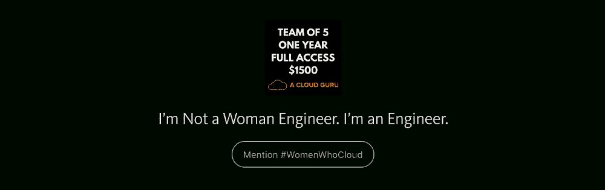

# 通过责任合作伙伴提高云计算的包容性和多样性

> 原文：<https://acloudguru.com/blog/engineering/increasing-inclusion-and-diversity-in-the-cloud-through-accountability-partners>

## 我们需要更多像安妮-珍妮特这样的#女人

在 2016 AWS re:Invent 的一次闪电谈话中，Anne-Jeanette 分享了她在 Capital One 担任云架构师的经历。她描述了导致她失去家园的卡特里娜飓风的破坏，Capital One 提供的惊人支持，以及她在灾后恢复系统时了解到的云计算的价值。

听 Anne-Jeanette 说，很明显她非常专注、有弹性且技术敏锐，因此毫不奇怪她获得了 AWS 解决方案架构师认证，这是他们大规模云采用和人才转型工作的一部分。

作为云架构师，Anne-Jeanette 与交付团队密切合作，为复杂的业务问题设计和实施云原生解决方案。作为一名从业者，她拥有丰富的经验，对整个软件开发生命周期有着深刻的理解。Anne-Jeanette 非常重视持续交付和集成的 DevOps 实践。

Anne-Jeanette 也是一个“实干家”,她被相对较少的获得 AWS 认证的女性所激励。在最近的一篇博客中，她创建了# WomenWhoCloud challenge，以鼓励其他女性与她一起参加 AWS re:Invent 2017 认证休息室。

[我不是女工程师，我是一名工程师——我从机械师到 AWS 认证解决方案架构师的旅程——acloudguru.com](https://acloudguru.com/blog/engineering/im-not-a-woman-engineer-i-m-an-engineer)

作为# WomenWhoCloud 挑战的一部分，她建立了一个由 20 名女性组成的学习团队，名为“Rev It Up”，是她们的指定责任伙伴。她正在指导她的团队学习云计算的基础知识——并使用云专家[的课程帮助每个参与者在 re:Invent 之前获得 AWS 认证。](https://acloud.guru/courses)

Anne-Jeanette 希望通过 AWS 认证项目让成千上万的高技能女性涌入市场，从而为云计算行业创造公平的竞争环境。除了学习当今市场相关技能的教育益处外， [AWS 认证解决方案架构师在薪酬最高的 IT 认证名单中名列榜首](http://www.forbes.com/sites/louiscolumbus/2016/02/21/15-top-paying-it-certifications-in-2016-aws-certified-solutions-architect-leads-at-125k/#28ee59776702)。

> 理想情况下，云中有如此多的女性，以至于不再需要#WomenWhoCloud。

她以团队为基础的指导方法的一个重要部分是问责制。她创建了一个 Slack 频道来检查参与者，帮助回答问题并鼓励他们进步。根据她的方法和反馈，一位云专家正在努力进一步增强我们的学习平台，以促进更多基于团队的学习功能。

> 如果你对团队功能有什么建议，请在下面留言给我的兄弟，[Sam krooneburg](https://medium.com/u/d414b9320eff?source=post_page-----7be9dc0a62ec--------------------------------)和他的 ace 开发团队！

A Cloud Guru 团队期待在 2017 AWS re:Invent 上看到 Anne-Jeanette，并在认证休息室与多元化和包容性的云大师社区一起交流。*干杯！*

* * *

为了支持 Anne-Jeanette 的努力，并帮助鼓励其他领导者赞助学习团队，我们创建了一个新的团队订阅。

A Cloud Guru is now offering a special subscription rate to support sponsors of the #WomenWhoCloud movement

要获得#WomenWhoCloud 群组的特别优惠:

1.  访问我们的[新的云专家“团队”页面](https://acloud.guru/teams)
2.  点击“告诉我们”
3.  提交表格时提及# WomenWhoCloud

[***云专家*** *课程*](https://acloud.guru/courses) *由对云计算有着共同热情的行业专家讲授。我们努力为我们不断增长的云大师社区服务，他们在我们的* [*论坛*](https://acloud.guru/forums/home) *、研讨会、聚会和* [*会议*](https://acloud.guru/serverless) *中慷慨地贡献他们的见解。跟上一个云宗师剧组*[*@ acloudguru*](https://twitter.com/acloudguru)*。*