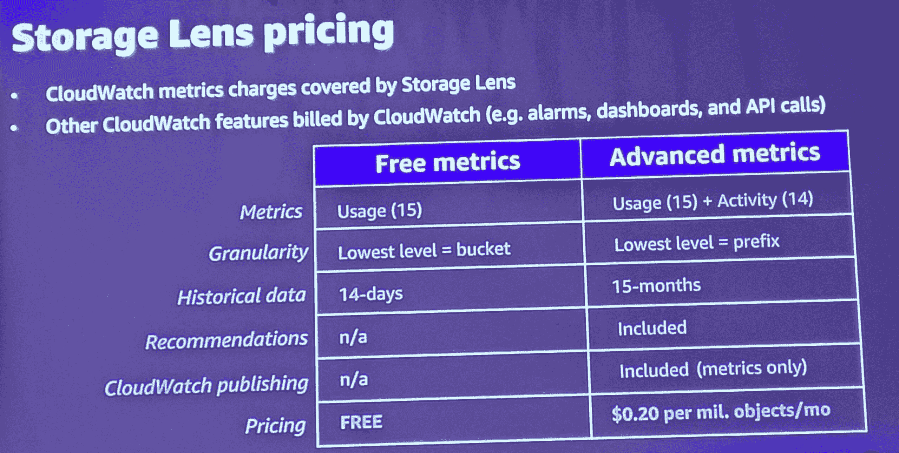

# 为 S3 存储镜头介绍 CloudWatch publishing

> 原文：<https://acloudguru.com/blog/engineering/introducing-amazon-cloudwatch-publishing-for-s3-storage-lens>

随着我们从 [AWS re:Invent 2021](https://acloudguru.com/blog/tag/reinvent2021) 向前迈进，新闻和公告尘埃落定，我们剩下了这么多新的服务、功能和玩具可以玩。但我想说的是，亚马逊 CloudWatch publishing 为 S3 存储镜头增加了一个公告，这个公告可能没有引起人们的注意。

* * *

## 加速您的职业发展

[从 ACG 开始](https://acloudguru.com/pricing)通过 AWS、Microsoft Azure、Google Cloud 等领域的课程和实际动手实验室改变你的职业生涯。

* * *

## 什么是 S3 存储镜头？

[亚马逊 S3 存储镜头](https://aws.amazon.com/s3/storage-analytics-insights/)是一款存储分析工具，可让您了解对象存储的使用情况和活动。它现在支持亚马逊 CloudWatch。(查看[AWS 博客](https://aws.amazon.com/about-aws/whats-new/2021/11/amazon-s3-storage-lens-metrics-cloudwatch/)了解更多信息。)

当您的 S3 使用和成本变得越来越难以监控和了解时，您将需要开始使用 S3 存储镜头。 S3 存储镜头有助于深入了解您的使用和活动趋势，并提出可行的建议，以确保您以符合最佳实践的经济高效的方式使用 S3。

## S3 存储镜头增加了云手表支持

Storage Lens 允许您使用交互式仪表板来汇编来自整个组织、特定客户、区域或时段的数据。到目前为止，您还不能将这些仪表盘中的任何一个带入 CloudWatch，必须在两个仪表盘选项之间切换。

那么，AWS 已经提供了人们想要的:一站式仪表板查看！

S3 存储镜头现在能够连接到 CloudWatch，以便您的仪表盘都在一个地方。不再需要在仪表板视图之间来回切换！

## 前缀级报告

除了这项新功能之外，还有一种新的方法可以更深入地挖掘数据。您将能够使用 S3 的第一个也是唯一的前缀级报告！这有助于您深入了解特定的对象组，这些对象组可能在同一个存储桶中，但是属于不同的项目，并且由前缀分隔。

这一新的合并将允许总共 29 个使用和活动指标、15 个月的历史趋势和交互式图表。

您将能够享受 CloudWatch 的警报和基于您设置的指标触发的操作，并通过 SSO、电子邮件地址或公开共享您的仪表盘。*和*您将能够使用 CloudWatch API 访问存储镜头指标。

"但是使用 S3 存储镜头和云手表不会增加成本吗，杰西？"你可能会问。(我要提醒你，我无法通过博客听到你的声音，但这是一个好问题！)没有！

当您在 Storage Lens 中启用 CloudWatch 发布时，CloudWatch 的成本包括在 Storage Lens 成本中。请参见下图，了解更多信息。

为了能够选择使用 CloudWatch 发布，您必须升级到 Storage Lens advanced。但在我看来，这很值得。

总而言之，这是一个伟大的公告，将有助于您监控、管理和维护您的 S3 使用。提示起立鼓掌！要了解完整的细节，请在这里阅读 AWS 文档[。](https://docs.aws.amazon.com/AmazonS3/latest/userguide/storage_lens.html)

更多 S3 相关新闻，请查看我们的新 [S3 冰川即时检索存储类](https://acloudguru.com/blog/engineering/s3-glacier-instant-retrieval-deep-dive-which-s3-storage-class-is-right-for-me)的深度潜水。继续牛逼吧，云大师们！

* * *

## 保持在云的顶端

*在 [Twitter 上关注 ACG](https://twitter.com/acloudguru)和[脸书](https://www.facebook.com/acloudguru)，在[YouTube 上订阅一个云专家](https://www.youtube.com/c/AcloudGuru/?sub_confirmation=1)来获取你能处理的所有云更新！此外，加入我们令人敬畏的 [Discord 社区](https://discord.com/invite/acloudguru)，与训练有素的架构师和其他志同道合的阴云密布的人进行数字交流。*