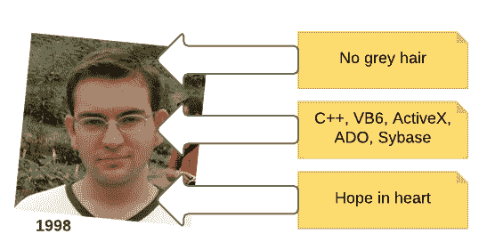
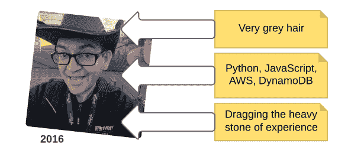

# 成为云专家的旅程

> 原文：<https://acloudguru.com/blog/engineering/my-personal-journey-to-the-cloud>

## 你好，我叫詹姆斯。我自己承认我是一个云- 酒精*，我已经离开这里 7 年了。”*

像我这样的人没有自助小组——技术是我的天性。我五岁时拥有了我的第一台电脑，从那时起，我就像大多数孩子收集毛绒玩具一样收集技术。

我 12 岁开始为当地的一家计算机杂志写稿，当时是英国的一家全国性杂志。当我上大学的时候，我在一个英国平台上有一个名为*甲骨文图文电视*的固定专栏。

“You’ll never need more than 16KB of RAM.” Let me just type that reminder into my 4GB Pixel….

做些很酷的小孩的事情和逛商场会更容易，但是把醒着的每一个小时都花在思考所有可以用机器解决的问题上让我太忙了。

## 我在交易大厅的第一份工作:软件开发员

在大学获得计算机科学学位后，作为一名软件开发人员开始工作是一段不和谐的经历。他们在学校没有教过必须在开发团队中工作，也没有培训过任何人如何理解古老复杂的系统。在学校，你从一个空白的屏幕开始，自己做一些漂亮的东西，这在工作中很少发生。

If you show this picture to ANYONE… oh wait, it’s the Internet.

我的团队为对冲基金、投资组合经理等开发了电子交易软件。大多数交易发生在开盘和收盘时，就像一天两次的黑色星期五，强调后端。随着平台的增长，我们的基础设施正在扼杀我们，数据量扼杀了任何在不使系统离线的情况下解决问题的尝试。

最重要的是，我们的用户是交易者——在好日子里，他们是混蛋。他们的需求不断变化，并通过心灵感应进行交流。他们在一次停机中完全丢失了它，并且不能容忍坏数据、缺失功能或草率的用户界面。

聪明、多变且要求苛刻的用户——为他们工作最终成为对当今用户群最好的培训。

## 成为一名开发人员给我上了几堂人生课:

*   用户不知道他们想要什么。至少，不是他们想要的最终版本。他们能看清接下来一百英尺的路，但是除了车灯之外的任何东西都是未知的。矛盾的是，我们只能知道短期内要做什么，但我们的脚手架必须永远工作。
*   开发人员低估了需要付出的努力。所有开发人员都有一个不变的问题，那就是无法估计事情需要多长时间。80%的完成很快，然后最后的 20%就要花很长时间，如果有的话。你增加了他们的估计，你的老板增加了你的估计，交货仍然是*晚*。
*   **稳定就是一切**。您的系统应该不会失败。在任何情况下，都不要让它失败。但是如果你真的失败了，每一次停机都必须被调查和补救，这样它就不会再发生了。

## 出错时继续下一步:产品管理

2000 年代中期，我搬到了湾区，在初创公司做了几年技术产品经理。这是在以前有网站想法的人现在都有移动想法的阶段。

> 在旧金山湾区，产品经理是一名程序员，他会受到客户的呵斥，还会制作没人使用的路线图。

随着我们进入移动领域，我们的用户是拥有手机的普通人，而我们的竞争对手要么是资金雄厚的初创公司，要么是知名的技术精英。我们的开发团队要小得多，预算也更紧，然而我们宏大的抱负似乎没有注意到我们已经为成功做好了可怕的准备。

移动使得扩展问题对初创公司来说不可克服——购买新服务器消耗了预算，配置负载平衡器和数据库复制浪费了本应用于完善 UI 的开发时间。投资者和创始人通常厌倦了他们真实工作的艰辛，被淘金热所吸引，他们的使命是成为下一个价值十亿美元的应用程序，没有收入，却有一大群用户。

当时，有 iOS，Android，Windows 和黑莓，都使用不同的框架和语言，看起来这些可能会进一步分裂。我们试图将十几个屏幕的应用程序放在一起，这些应用程序可以在一天内构建成一个. NET 桌面应用程序。然而，我们确实设法发布了应用程序，解决了问题，并建立了一些业务。

## 作为产品经理，我学到了:

*   **你不够了解**。您的团队在网络、安全、扩展、电气工程、机器代码等方面的知识存在缺口。当你面对转向这些领域的问题时，对你的产品来说就像流沙一样。开发人员喜欢棘手的问题，并且有着好奇的头脑，所以这类问题是一种诱惑。
*   复杂是进步的死亡。当您的团队拥有所有的部分时，他们编写复杂的代码将系统锁在一起。但是当开发者只能用 API 和其他系统对话，不知道是怎么实现的时候，就写简单的代码，让系统模块化。
*   **梦不是代码**。如果你不能让你的想法在电子表格或流程图中发挥作用，它就不能用代码来构建，不管投资者或风投说它有多简单。

Understanding the problem domain is key to building good solutions.

## 探索云应用的更好方式

大约在 2010 年的某个时候，我清楚地意识到，作为一个开发团队，我们可以自信地编写可靠的应用程序，在同一栋大楼的机器上运行。但是部署是困难的——一旦应用程序进入生产阶段，它们的性能就会下降。

我们使用一些云应用已经有一段时间了，但是直到绝对必要的时候，我们才开始认真使用 AWS。一个客户端应用程序已经开始获得动力，而我们没有钱在内部扩大规模，所以我们很快成为了 AWS 的用户*。意识到我们别无选择，这是一个偶然但有点令人担忧的时刻——但这很快成为了 T4 事实上的制造产品的方式。*

*在这段时间里，我有过一些灵光乍现的时刻:*

*   ***基础设施是地狱**。它激发了每个人内心的修修补补，它是阻止你写代码的干扰。无论你如何努力，你也不能管理好它。所以不要。*
*   ***开发-准备-生产不工作**。它不够复杂，不能阻止错误到达客户手中，最终只是提供了一个质量的假象。每个服务都需要在每个阶段进行版本控制，相应地路由传入流量。*
*   ***敏捷即美丽**。我们在做瀑布的同时也在做，因为那被认为是专业的。当我读到[敏捷宣言](http://agilemanifesto.org/)时，我几乎哭了——我知道从现在开始这就是我们构建软件的方式。*

### *在维加斯发生的事…变成了职业*

*2012 年，我参加了在拉斯维加斯举行的第一届 AWS re:Invent 会议，这改变了一切。目睹了围绕该平台的整个生态系统，很明显，许多人一直在努力解决同样的问题，并且有许多很好的解决方案可用。*

*有一个挥之不去的问题，为什么没有其他人提供这种服务——亚马逊是镇上唯一的游戏，要么他们有令人难以置信的先见之明，要么我们都对整个云的事情过于乐观。这种滞后持续了数年——它让 AWS 领先竞争对手 6 年，这就是为什么它的能力仍然领先竞争对手。*

*在我们店里，无论如何我们都不是第一个使用云的人，但是我们全心全意地拥抱它。在 6 个月内，出现了许多意想不到的副作用:*

*   ***我们变得真正敏捷**。我们的用户仍然不知道他们想要什么，开发人员仍然低估了工作，但是构建产品的动力已经改变了。我们可以一角钱旋转，做出根本性的改变，而不会摧毁房子——或者摧毁预算。*
*   ***我们没有很好理解的事情，为我们理解了**。云带走并解决了许多*计算机科学*的问题。这让我们可以专注于开发应用程序，我们的生产力(和盈利能力)直线上升。*
*   ***我们的应用变得非常好**。许多软件并不流行，也没有通过投资，但它们非常稳定，可扩展，看起来像一个更大团队的产品。我为那些没有成功的应用程序哭泣。*

## *我作为云技术产品经理的未来*

*在使用云解决方案作为我所开发的所有产品的基础时，我不得不不断提高我的技术水平。仅仅做一个有路线图和线框的产品经理是不够的——我需要知道可靠的模式和可信的实践来创建最好的技术架构。*

*这意味着不断的培训，承担编程项目，随着环境的变化学习新的框架。这也意味着对会议和研讨会做出承诺，这已经成为我预算中的一个自动项目。*

*在业务方面，云让我有信心评估可行性和可能的成本，更可靠地预测时间框架，并帮助业务合作伙伴了解业务理念和技术的交汇点。在许多方面，敏捷、云和精益之间的概念是如此地交织在一起，以至于我经常认为它们是围绕同一件事情的不同观点。*

> *快速失败、少浪费、不断学习并始终为客户提供价值—云是实现这一目标的核心。*

### *仍然有一些道路颠簸*

*仍然有很多反对者。在加利福尼亚的日子之后，我在一些更传统的公司工作，这就像是跳进了德洛尔，把时钟调成了“失败”。*

*他们都在努力应对老化、脆弱、昂贵的 IT 基础架构，这些基础架构提供的商业价值有限，而且没有希望在未来帮助他们创新或脱颖而出。这些公司正在等待一代高管退休，等待竞争威胁重新唤醒曾经让它们成为巨头的胃口。*

*行业中也有造假者，他们多年来对云不屑一顾，嘲笑亚马逊，声称它永远不会成功。现在，他们争先恐后地推广他们自己的云，使用的工具和合同都很有限。*

*甲骨文(Oracle)等跟风者试图将落后者带入云生态系统，但他们没有为技术提供任何基础或改变游戏规则的东西。5 年前他们说云不安全，现在他们说*只有*他们的云是安全的，所以我认为恐惧可以推动任何东西的销售。*

*但我的生活信条是“去那些让你出名的地方，而不是被容忍的地方。”我在这里不是要说服去年的 IT 专业人士，我们行业的变化正以几何级数加速。我在这里是因为我致力于使用[云及其工具箱](https://acloudguru.com/aws-cloud-training)来构建解决下一轮问题的下一代软件。我想进入机器学习和人工智能领域，从 *onClick* 转向*预测*——云是所有这一切发生的地方。*

*这就是我的故事。我们这些伴随着电脑长大的极客孩子中的大多数都没有成为史蒂夫·乔布斯或杰夫·贝索斯，但这是一段奇妙的旅程。机会无处不在，未来从未如此光明。我叫詹姆斯。在过去的 7 年里，我一直自认是一个云酒精。我认为这永远不会改变。*

**

* * *

## *获得更好职业所需的技能。*

*掌握现代技术技能，获得认证，提升您的职业生涯。无论您是新手还是经验丰富的专业人士，您都可以通过实践来学习，并在 ACG 的帮助下推进您的云计算职业生涯。*

* * *