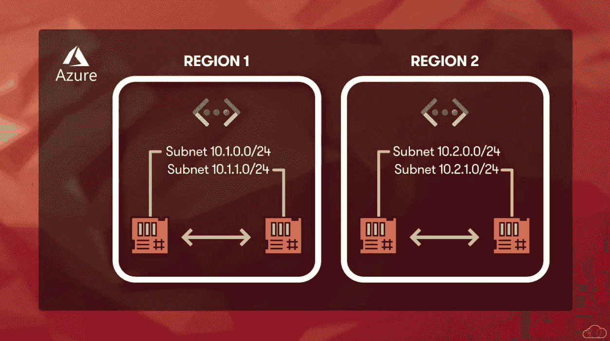
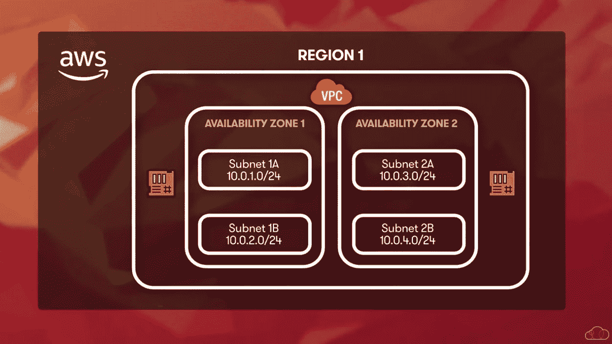
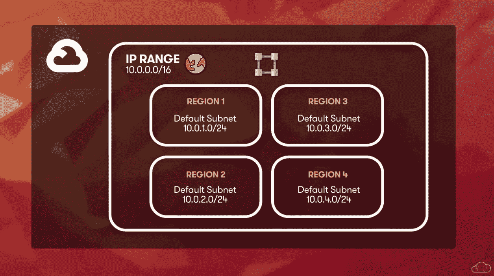
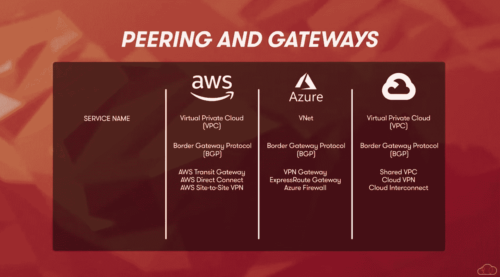
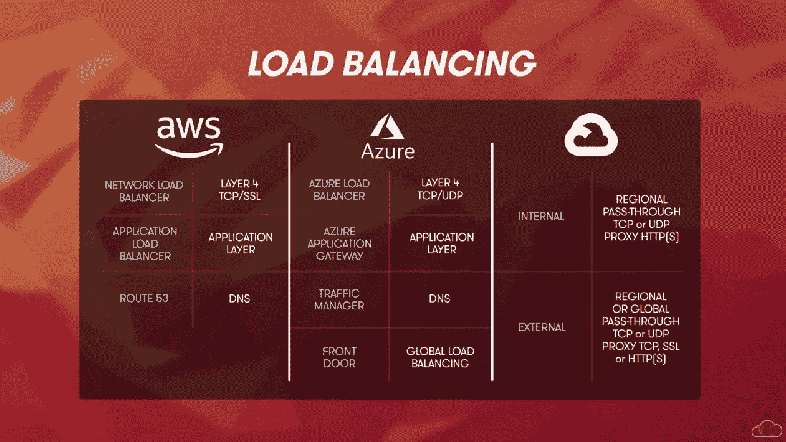

# 网络服务对比:AWS vs Azure vs Google Cloud

> 原文：<https://acloudguru.com/blog/engineering/networking-services-compared-aws-vs-azure-vs-google-cloud>

在这篇文章中，我们的[云提供商比较系列](https://acloudguru.com/videos/cloud-provider-comparisons)的一部分，我们来看看网络——将所有精彩的云服务连接在一起的主干——以及网络服务如何在不同的云提供商之间进行比较。我们将探索基本的网络、网关、对等和负载平衡器。我们开始吧！

* * *

**通往更好职业的钥匙**

[立即开始 ACG](https://acloudguru.com/pricing) 通过 AWS、Microsoft Azure、Google Cloud 等领域的课程和实际动手实验室来改变你的职业生涯。

* * *

## 云如何改变了网络？

自拨号上网时代以来，网络的基本原理多年来没有多大变化，但网络的实现方式却发生了很大变化。

自从拨号上网时代以来，它变得更加可靠，谢天谢地，速度也快多了。网络是资源和服务相互通信的方式。对于内部网络，我们必须部署和配置路由器、交换机和防火墙，应用固件更新和更换硬件是一项常见的工作。

但是云终结了这些任务。

虽然硬件不再是我们的问题，但网络仍然存在，我们仍然负责配置和保护它。

什么是虚拟网络？

让我们从基础开始，网络。Azure、谷歌云平台和亚马逊网络服务都提供了一个虚拟网络。可以把它想象成一个托管在云中的虚拟路由交换机。它是所有服务连接并用来相互通信的东西。

## 在 Azure 中，虚拟网络被称为 VNet。

对于 AWS 和 GCP，网络被称为虚拟私有云或 VPC。

*   在每种情况下，它们都有相似的功能。它们包含一个或多个子网，并允许资源和子网之间的通信。
*   网络基础

每个云提供商都有区域的概念。区域是一个或多个数据中心的组合。将工作负载分散到多个区域通过在这些区域复制服务来提供高可用性。我们还可以将资源放在离客户更近的地方。

## Azure 和 AWS 之间网络利用区域的方式相似，而 GCP 则不同。

微软 Azure

使用 Azure，虚拟网络或 VNet 存在于一个区域中。子网被添加到 VNet，并且资源被分配到该子网，默认情况下，VNet 中的所有资源可以相互通信，包括不同子网上的资源。

### 默认情况下，他们也可以访问互联网。为了连接到该子网，资源必须与 Vnet 位于同一区域。如果高可用性需要冗余，另一个虚拟网络将部署到不同的区域。

自动警报系统

像 Azure 一样，VPC 是在有 AWS 的地区创建的。AWS 中的 VPC 使用可用性区域，这些区域是不同的位置，与另一个可用性区域中的故障隔离，子网存在于这些可用性区域中。

### 在 AWS VPC 中，有两种类型的子网，公共子网和私有子网。公共子网可以访问互联网，而私有子网则不能。

默认情况下，AWS 中所有连接到 VPC 的资源或实例都可以在 VPC 内通信。

谷歌云(GCP)

与 AWS 和 Azure 相比，GCP 采用了一种不同的方法来与我们的全球 VPC 实现联网。

### 顾名思义，全球 VPC 跨越多个地区，不与任何特定地区相关联。这是一种全球资源。创建全球 VPC 网络时，系统会在每个 GCP 地区创建子网。子网是特定于区域的。

默认情况下，所有实例(例如虚拟机)都可以在网络中相互通信。

对等和网关

现在我们已经了解了每个提供商的网络和子网，让我们看看如何连接它们，以便我们可以在服务中的不同 VPC 和 Vnets 之间进行通信。毕竟，如果我们不能与云服务交流，云服务就没有那么有用。

## 每个提供商都支持虚拟网络之间的对等。

例如，Azure 支持 vnet 之间的对等，允许对等的 vnet 进行通信。

AWS VPCs 也支持对等。

*   还有 GCP 的 VPC。
*   但是对于所有这三种情况，不支持可传递对等。因此，如果网络 A 与网络 C 的 B and B 对等，网络 A 和网络 C 将无法通信，至少在我们在 A 和 C 之间添加另一个对等之前是如此
*   然而，这种解决方案不能很好地扩展，如果我们再增加一个网络，我们需要三个以上的 peerings 来让它们全部通信。随着网络数量的增长，这将很难管理。我们需要的是一个轴辐式解决方案，允许我们用一个连接来连接多个网络。这是通过网关实现的。

微软 Azure

在 Azure 中，VNet 成为一个集线器和一个集线器和辐条，对等用于将辐条 VNet 连接到集线器，集线器包含一个在不同网络之间路由流量的网关。

### 网关支持虚拟网络之间的连接传输。网关也支持 Azure 之外的连接。VPN 网关支持网关和 VPN 端点之间的 VPN 连接，例如，支持到内部网络的连接。

ExpressRoute 网关支持 Azure 和具有专用 ExpressRoute 连接的内部网络之间的连接。快速路由连接是第三方网络上的安全冗余连接。

自动警报系统

对于 AWS，可传递网关用于连接多个 VPC。网关的转接连接到一个区域内的 VPC，并允许流量在它们之间流动。

### 如果涉及多个地区，地区间对等连接网关的转接，提供网络之间的连接。

使用虚拟专用网关，可以通过 VPN 连接到远程网络。

对于专用连接，AWS 直连网关用于在内部网络和 VPC 之间提供专用的高带宽专用连接。

在这种情况下，数据中心和 AWS 之间的连接需要第三方提供商。这些提供商位于 AWS 数据中心附近，在内部网络和 AWS 之间提供了一个私有的、可靠的连接。

谷歌云(GCP)

这就把我们带到了谷歌云服务。请记住，GCP 的 VPC 是跨区域的，默认情况下所有子网都可以通信。

### GCP 介绍了项目的概念。VPC 是项目的一部分，VPC 内部的子网可以通信，但不能与另一个项目中的 VPC 通信。为了让两个 VPC 进行通信，我们需要添加 VPC 对等。

就像 Azure 和 AWS 一样，GCP 的对等是不可传递的。也就是说，如果我们添加第三个项目和 VPC，并与 VPC 和项目 2 对等，则项目 1 和项目 2 可以通信，项目 2 和项目 3 可以通信，但项目 1 和项目 3 无法通信，除非我们添加另一个对等关系。

GCP 还有一个特色，叫做共享 VPC。这提供了灵活性，允许多个项目利用一个中央 VPC，在这里可以控制和集中管理连接。

有两种网关用于本地网络的混合连接，包括通过公共互联网连接提供安全连接的云 VPN。

GCP 还提供云互联服务。这与 Azure ExpressRoute 和 AWS 私有虚拟连接一样，提供了私有专用电路上的安全连接。

所有服务都使用边界网关协议或 BGP 来管理不同内部和云网络之间的路由。如果您计划使用对等或连接到本地网络，则不能有任何重叠的子网。因此，规划 IP 地址空间非常重要。

关于混合连接的另一个注意事项是，他们不仅可以将云网络连接到本地网络，还可以连接多个云服务，从而能够实施真正的多云战略，并在每个服务之间实现安全连接。

[**获得痛苦的云词典**](https://get.acloudguru.com/cloud-dictionary-of-pain)
说云不一定要努力。我们分析了数以百万计的回复，找出了最容易让人犯错的概念。抓住这个[云指南](https://get.acloudguru.com/cloud-dictionary-of-pain)获取一些最痛苦的云术语的简洁定义。

负载平衡

* * *

网络的另一个重要特性是在多个服务实例之间分配连接的能力。这被称为负载平衡。

* * *

## 负载平衡不仅有助于提高可用性，而且通过将工作负载分散到同一服务的多个实例中，也有助于提高性能。

实现负载平衡的方法有很多，Azure、AWS 和 GCP 有不同的选项来满足任何负载平衡需求。

Azure 有一个协议级负载平衡器，叫做 Azure Load Balancer。负载平衡可以通过一个名为 Azure 应用网关的应用级负载平衡器来扩展。Azure 还提供了一个名为 Traffic Manager 的域名服务或 DNS 负载平衡器。它使用名称到 IP 地址的解析来根据您定义的规则分配连接，并使用名为“前门”的全局负载平衡器来支持 SSL 卸载，并根据您配置的规则将流量路由到最近的资源。

正如您所料，AWS 还提供了多种负载平衡解决方案。AWS 中的网络负载平衡器基于传输层或 SSL 流量层来分配连接。应用负载平衡器在应用层做出路由决策，使用基于路径的路由来引导流量。AWS 还提供了一个名为 Route 53 的 DNS 负载平衡器。Route 53 使用 DNS 根据您配置的规则路由流量，这些规则包括 DNS 端点的健康检查、地理位置和基于延迟的决策。

*   最后但同样重要的是与 GCP 的负载平衡。谷歌云与其他的略有不同。有两种基本类型的负载平衡器，内部和外部。使用内部负载均衡器，客户端请求来自 Google Cloud 内部，内部负载均衡器是区域性的。它可以使用 TCP 或 UDP 端口来管理流量，或者内部负载平衡器可以是使用 HTTP 或 HTTPS 来引导流量的代理。当客户端连接来自互联网时，使用外部负载平衡器。外部负载平衡器可以是区域性或全球性的，并使用直通或代理模式来路由流量。

*   当我们比较这些选项时，请记住，在使用负载平衡器规划高可用性时，跨多个地区或地理位置正确设计服务以及构建和冗余与负载平衡解决方案同样重要。

*   例如，如果我们部署了一个负载平衡器，但其背后的资源都在一个数据中心，如果该数据中心变得不可用，该解决方案将面临风险。更好的解决方案是使用全局、区域或内部和外部负载平衡器的组合来设计高可用性解决方案。但那是改天的话题…

要了解有关网络的更多信息，请查看以下课程:

想了解更多关于云计算和技术领域最热门的技能吗？[开始免费试用](https://acloudguru.com/pricing)或查看[本月的免费云培训](https://acloudguru.com/blog/news/whats-free-at-acg)。你也可以[在 YouTube 上订阅一位云专家](https://www.youtube.com/c/AcloudGuru/?sub_confirmation=1)的每周云新闻，像我们一样关注[脸书](https://www.facebook.com/acloudguru)，在 [Twitter](https://twitter.com/acloudguru) 上关注我们，并加入 [Discord](http://discord.gg/acloudguru) 上的对话。

[**看点:解决“没有经验”的云招聘问题**](https://get.acloudguru.com/solving-no-experience-cloud-problem-webinar)
没有工作是得不到经验的。但是谁会雇佣没有经验的你呢？谜题！[观看这一免费的点播网络研讨会](https://get.acloudguru.com/solving-no-experience-cloud-problem-webinar)，进行关于云计算职业发展的小组讨论，并获得您的第一份云计算工作。

Looking to learn more about cloud and the hottest skills in tech? [Start a free trial](https://acloudguru.com/pricing) or check out [this month’s free cloud training](https://acloudguru.com/blog/news/whats-free-at-acg). You can also [subscribe to A Cloud Guru](https://www.youtube.com/c/AcloudGuru/?sub_confirmation=1) on YouTube for weekly cloud news, like us on [Facebook](https://www.facebook.com/acloudguru), follow us on [Twitter](https://twitter.com/acloudguru), and join the conversation on [Discord](http://discord.gg/acloudguru).

* * *

[**WATCH: Solving The “No Experience” Cloud Hiring Problem**](https://get.acloudguru.com/solving-no-experience-cloud-problem-webinar)
You can’t get experience without a job. But who’ll hire you without experience? Conundrum! [Watch this free, on-demand webinar](https://get.acloudguru.com/solving-no-experience-cloud-problem-webinar) featuring a panel discussion on cloud career development and getting your first cloud job.