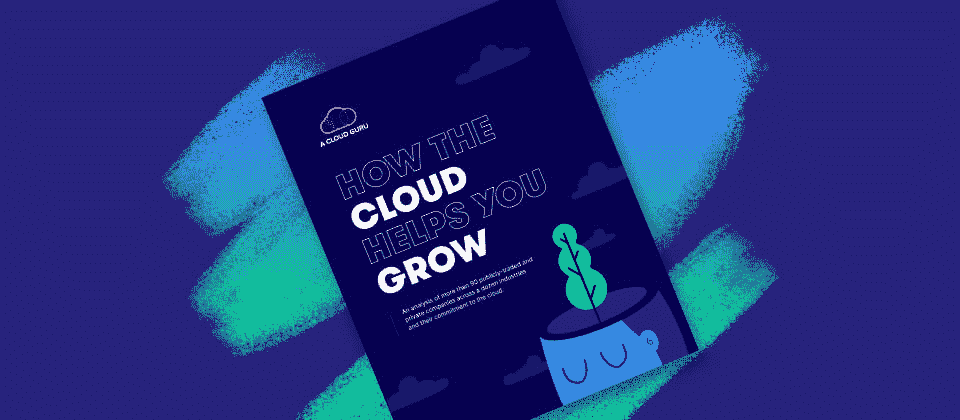

# 面向 PostgreSQL 的全新 AlloyDB 和可靠的开源软件服务

> 原文：<https://acloudguru.com/blog/engineering/new-alloydb-for-postgresql>

你好，云大师！你可以看出[本月的](https://learn.acloud.guru/series/gcp-this-month/view/405)谷歌云平台公告是一件大事，因为谷歌即将上线的两个新的云区域甚至不是最大的新闻！*这一*荣誉由谷歌的新 AlloyDB 产品分享，该产品与亚马逊的“Aurora”数据库竞争，他们的新服务通过——好吧，让我们不要破坏惊喜！阅读到最后，找出答案——或者如果你感到不耐烦，就向下滚动。

* * *

**通往更好职业的钥匙**

[立即开始 ACG](https://acloudguru.com/pricing) 通过 AWS、Microsoft Azure、Google Cloud 等领域的课程和实际动手实验室来改变你的职业生涯。

* * *

## PostgreSQL 的新 AlloyDB

我们这个月的第一个大新闻是谷歌为 PostgreSQL 开发的*闪亮*新 [AlloyDB 产品。该产品似乎介于云 SQL 和云扳手之间。此外，尽管他们拒绝在其营销帖子中使用明确的术语，但谷歌显然打算以此与亚马逊的 Aurora 数据库直接竞争，并吸引人们离开甲骨文。](https://cloud.google.com/blog/products/databases/introducing-alloydb-for-postgresql)

他们的文章开头写道，“企业正在努力摆脱遗留数据库系统，需要一种替代方案来实现应用程序的现代化。”在第二段中，他们声称“在我们的性能测试中…AlloyDB 的事务性工作负载速度也比亚马逊的同类服务快两倍。”

关于 AlloyDB 我首先需要明确的是，它目前处于预览版。因此，就此得出具体结论并不公平。但我认为，尝试回答一些最有可能的问题仍然是有价值的，这些问题是关于它如何工作，以及一旦它准备好进入黄金时间，它将如何融入人们的架构。

对于它如何工作的问题，我们可以转向谷歌关于它的文章。公告帖子没有涉及太多细节，但 [Google 写了另一篇文章](https://cloud.google.com/blog/products/databases/alloydb-for-postgresql-intelligent-scalable-storage)解释 AlloyDB 如何构建为具有 PostgreSQL 处理层，该处理层使用新的数据库感知存储层，该存储层反过来使用 Google 的分布式文件系统。这额外的一层意味着处理和存储之间更好的分离。值得一提的是，这似乎很像亚马逊如何在[构建 Aurora](https://docs.aws.amazon.com/AmazonRDS/latest/AuroraUserGuide/Aurora.Overview.html) 。

然而，第二篇文章描述了 AlloyDB 如何使用列引擎，这让我想起了 BigQuery、Amazon Redshift 或 Oracle 产品。而*这个*可能就是为什么谷歌可以宣称“在我们的性能测试中，它在事务性工作负载上比标准 PostgreSQL 快 4 倍多，在分析性查询上快 100 倍。”

现在，这肯定是非常有趣的，尤其是关于分析查询快一百倍的那一点！谷歌还表示，当它们全面上市时，将提供 99.99%可用性服务水平协议。这个*包括*维护，因为“AlloyDB 自动检测大多数数据库故障并在几秒钟内恢复，与数据库大小和负载无关”。

不过，我确实需要稍微调整一下，因为这是一个早期产品。我的意思不仅仅是因为它还在预览中。我的意思是，要想与亚马逊的 Aurora 直接竞争，它似乎需要在其他一些领域迎头赶上。例如，我还没有发现 AlloyDB 可以取代 Aurora 全球数据库的地方。这似乎仍然是一个由 Cloud Spanner 更好处理的领域。此外，因为 AlloyDB 似乎需要您提供和手动扩展实例来处理容量，所以它的最低月成本看起来将比 Aurora Serverless v2 高得多，后者理论上可以缩减到几乎为零—只有存储。

但我还不会放弃 AlloyDB！当它发布的时候，它肯定会在一些架构中占有一席之地。我相信谷歌人已经在忙着让它变得更好了。

* * *

* * *

## 新的有保证的开源软件服务

我们的另一个主要新闻是谷歌宣布他们即将推出的放心开源软件服务，也称为放心 OSS。现在，这个名字可能会让你们中的一些人觉得是自命不凡的胡言乱语，但我想告诉你为什么我认为这是一件大事。

我先来解释一下这个问题。目前，在软件开发中，我们*所有*都使用公开可用的包、模块、库、框架等。来构建我们的应用程序。试图在没有开源项目支持的情况下构建一切*将会使我们处于竞争劣势，这种情况只会发生在*最具限制性和官僚主义的项目上。我们其余的人继续前进，完成我们的工作。但是，通过将我们没有编写和控制的代码整合到我们的应用程序中，我们给了那些控制代码的人影响我们的权力。**

我们当然也受到了影响。还记得 2016 年 left pad 的创造者[是如何让互联网轰动一时的吗？如果你不熟悉这个故事，请阅读这篇文章。当然，这只是一个例子。](https://www.theregister.com/2016/03/23/npm_left_pad_chaos/)

现在*有*一些我们可以做的事情来缓解这个问题——比如在我们的构建文件中固定版本号，以便我们只包含我们已经审查为安全的软件包版本。虽然，不幸的是，这甚至不能解决像取消发布 Leftpad 这样的问题。相反，我们需要自己制作这些包的副本，并自己管理它们。但是这些包也使用其他包，所以我们需要包含这些依赖项。等等，等等，几乎永远！毫不夸张地说，[一个简单的“Hello World”应用程序可能会轻松地从*几十万*其他人的代码行中获取数据。](https://twitter.com/BrianVerm/status/1276175013327056896)其中任何一行的改变都可能将我们的应用变成恶意软件。因此，我们可能需要审查所有的变更。

这显然是一场噩梦。使用这些软件包的全部目的是让我们能够完成我们的工作，对吗？不要用一个问题换另一个问题。

这是谷歌即将推出的可靠开源软件服务的全部内容。谷歌已经有团队负责我提到的所有仔细审查，因为他们是一家大公司。当然，*如果你使用 Assured OSS 服务，你*仍然不会亲自审查所有这些东西*，但我相信谷歌会比我自己更好地审查所有这些东西。另外，我只是没有时间。*

*至于服务本身，你可以[阅读文章](https://cloud.google.com/blog/products/identity-security/introducing-assured-open-source-software-service)来了解更多关于 Google 如何扫描、分析和模糊测试包，然后构建、签名并通过 Artifact Registry 分发它们。谷歌指出，“有保证的操作系统预计将在 2022 年第三季度进入预览版。”*

*现在，让我们来看看这个月的一些小故事吧！*

* * *

## *新的谷歌云区域现已在西班牙马德里开放*

*首先，我们来谈谈我提到的那两个新开的地区:[第一个是在西班牙的马德里地区，叫做欧洲-西南 1。](https://cloud.google.com/blog/products/infrastructure/new-google-cloud-region-in-madrid-spain-now-open) [第二个在俄亥俄州哥伦布市，叫 us-east-5。](https://cloud.google.com/blog/products/infrastructure/new-google-cloud-region-in-columbus-ohio-is-open)是的，这是美国东部的*第五个*谷歌云区域，这还不包括加拿大东部的两个*更远的*区域。这使得谷歌新的全球总数达到 33 个地区，由 100 个区域组成。由于我们正在统计，他们在全球还有 [146 个网络边缘位置](https://cloud.google.com/vpc/docs/edge-locations)。*

## *具有云功能的 BigQuery 远程 UDFx*

*谷歌这个月做的另一件很酷的事情是给 [BigQuery 调用你的云函数](https://cloud.google.com/blog/products/data-analytics/extending-bigquery-functions)的能力，作为其查询处理的一部分。现在你可能想知道为什么你会选择使用这个*付费的*选项，而不是免费的内置用户定义函数(UDF)。嗯，一个原因是内置的只支持 Javascript 或 SQL，而云函数支持一大堆其他语言。另一个原因是，云功能可以调用其他服务，让你做一些事情，例如，与外部令牌进行交互，以及*可以极大地简化你的一些合规性要求。**

## *现货虚拟机现已正式上市，采用新的定价模式*

*本月，谷歌新推出的“定点虚拟机”将取代“可抢占的”虚拟机。您仍然可以使用旧的方式创建可抢占的虚拟机，但现在将根据新的现货虚拟机可变定价模型进行收费。可抢占的虚拟机过去有固定的成本，但现场虚拟机的价格会根据需求而变化，因此[查看博客文章](https://cloud.google.com/blog/products/compute/google-cloud-spot-vms-now-ga)来了解这些细节如何适用于您。*

*好了，让我们以一些快速更新结束，这样你就可以决定是否要阅读这些文章以获得更多信息:*

* * *

**

*[**云 ROI:云技能如何产生实际回报**](https://get.acloudguru.com/how-the-cloud-helps-you-grow)我们分析了来自近 100 家公司的信息，以确定承诺对云成熟度的影响。在[这份指南](https://get.acloudguru.com/how-the-cloud-helps-you-grow)中，看看企业投资云技能和技术能获得多少价值。*

* * *

### *获得更多的 GCP 新闻善良在你身上！*

*嗯，这个月到此为止！我希望你从这些更新中获得价值。别忘了，你可以加入我们的 [Discord](https://discord.gg/zbvhJz66VE) 来讨论各种各样的事情，并在你的技术学习之旅中获得社区的支持。你也可以在[的推特](https://twitter.com/acloudguru)和[的脸书](https://www.facebook.com/acloudguru)上关注 ACG，在[的 YouTube](https://www.youtube.com/c/AcloudGuru/?sub_confirmation=1) 上订阅一个云专家，每月更新 GCP 的信息。*

*想了解更多关于云和 GCP 的信息吗？查看我们每月更新的[免费课程](https://acloudguru.com/blog/news/whats-free-at-acg)的轮换阵容。(不需要信用卡！)*