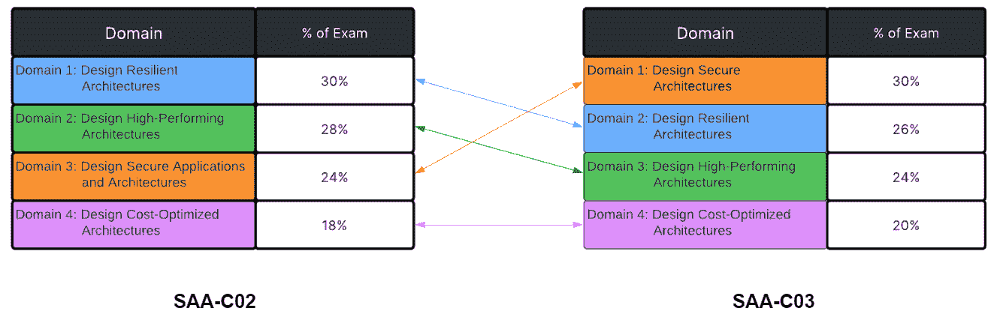

# 新的 AWS SAA 考试(SAA-C03):你需要知道的一切

> 原文：<https://acloudguru.com/blog/engineering/new-aws-saa-c03-exam>

随着新版本的 AWS 解决方案架构师助理考试(SAA-C03)最近发布，许多人问我们这两种考试之间的区别是什么，以及他们应该如何准备。

我们决定整理一个快速资源来帮助改变，并涵盖你需要知道的一切。

## SAA C02 和 SAA C03 有什么区别？

根据我们对新考试的体验，以及 AWS 官方公告和文档，SAA-C02 和 SAA-C03 非常相似。

考试的组织结构基本保持不变，但权重略有变化，以反映新服务和流程的引入。SAA-C03 中超过 90%的任务陈述已经包含在 SAA-C02 中！

这是一个好消息，因为这意味着如果你正在学习 SAA-C02 的课程，内容将在很大程度上与考试的更新版本保持一致。这意味着你仍然为通过 SAA-C03 考试打下了良好的基础。

一些额外的好消息是，考试的难度和组成也仍然相对相同:

*   考试将包括多项选择和多项回答(回答)问题。
*   没有简答题或任何动手实验考试场景。
*   考试时长约 130 分钟，评分方式相同:满分为 100-1000 分，及格分数为 720 分或以上。

就费用而言，考试费用仍为 150 美元，可以在设施中进行，也可以远程进行。

如果你还没有开始准备考试，我们建议你尽快开始，这样你就可以做好充分的准备。以下是我们提供的一些课程和模拟考试，可能会有所帮助:

1.  [AWS 认证解决方案架构师助理(SAA-C02)课程](https://learn.acloud.guru/course/certified-solutions-architect-associate/overview)
2.  [AWS 认证解决方案架构师助理(SAA-C02)实践考试 1](https://learn.acloud.guru/course/certified-solutions-architect-associate/learn/370ffd3a-a089-48b3-bf93-9489451dba10/67be35b9-2276-4357-aa8a-525031d0126c/quiz/67be35b9-2276-4357-aa8a-525031d0126c)
3.  [AWS 认证解决方案架构师助理(SAA-C02)实践考试 2](https://learn.acloud.guru/course/certified-solutions-architect-associate/learn/370ffd3a-a089-48b3-bf93-9489451dba10/2b6e8c45-e4a0-41d7-85cc-3fea3c225772/quiz/2b6e8c45-e4a0-41d7-85cc-3fea3c225772)

这些课程目前正在更新，以反映考试的变化和补充。与此同时，本文将为您提供补充信息和文档，帮助您准备 SAA-C03，最好配合参加上面列出的 *AWS 认证解决方案架构师助理课程*。

## **那么，什么*****随着 SAA-C03 发生了变化？***

*下面，您将看到两次考试之间的域是如何变化的。你会注意到**设计安全架构**(以前设计安全应用和架构)已经从 24%上升到 30%，而**设计弹性架构**和**设计高性能架构**都下降了 4%。**设计成本优化的架构**增长了 2%，但仍然是最小的加权领域。*

**

*SAA-C03 中会引入一些新的服务，您可以查看[考试指南](https://d1.awsstatic.com/training-and-certification/docs-sa-assoc/AWS-Certified-Solutions-Architect-Associate_Exam-Guide_C03.pdf)以查看考试中可能出现的所有服务的列表。还会有一些问题来测试您对 AWS 服务的理解和应用，这些问题您应该已经很熟悉了，我们当前的课程中也会涉及到。*

*您可能希望查看有关考试指南中新增服务的 AWS 文档。认识到服务是什么，它的目的，并对它的使用有一个实际的理解，这将有助于你准备考试。*

*需要回顾的内容很多，但我们推荐您关注以下一些关键的新服务:*

### ***分析***

*亚马逊 OpenSearch 服务—[什么是亚马逊 OpenSearch 服务？](https://docs.aws.amazon.com/opensearch-service/latest/developerguide/what-is.html)*

*亚马逊 Kinesis 客户端库(KCL)–[使用 Kinesis 客户端库](https://docs.aws.amazon.com/streams/latest/dev/shared-throughput-kcl-consumers.html)*

*AWS 湖形成——[什么是 AWS 湖形成？](https://docs.aws.amazon.com/lake-formation/latest/dg/what-is-lake-formation.html)*

### ***机器学习和 AI***

*亚马逊征用——[亚马逊征用是什么？](https://docs.aws.amazon.com/rekognition/latest/dg/what-is.html)*

*亚马逊 SageMaker—[亚马逊 sage maker 是什么？](https://docs.aws.amazon.com/sagemaker/latest/dg/whatis.html)*

### ***应用集成***

*亚马逊 MQ—[什么是亚马逊 MQ？](https://docs.aws.amazon.com/amazon-mq/latest/developer-guide/welcome.html)*

*亚马逊 AppFlow-[什么是亚马逊 app flow？](https://docs.aws.amazon.com/appflow/latest/userguide/what-is-appflow.html)*

*AWS AppSync-[什么是 AWS app sync？](https://docs.aws.amazon.com/appsync/latest/devguide/what-is-appsync.html)*

### ***计算***

*AWS 前哨站-[什么是 AWS 前哨站？](https://docs.aws.amazon.com/outposts/latest/userguide/what-is-outposts.html)*

### ***数据库***

*亚马逊 DynamoDB 加速器-[DAX:它是如何工作的](https://docs.aws.amazon.com/amazondynamodb/latest/developerguide/DAX.concepts.html)*

*Amazon 弹性缓存 for Redis--[何谓 Amazon 弹性缓存 for redis？](https://docs.aws.amazon.com/AmazonElastiCache/latest/red-ug/WhatIs.html)*

*Amazon KeySpaces-[什么是 Amazon key spaces(针对 Apache Cassandra)？](https://docs.aws.amazon.com/keyspaces/latest/devguide/what-is-keyspaces.html)*

### ***无服务器&集装箱服务***

*亚马逊弹性容器注册中心—[什么是亚马逊弹性容器注册中心？](https://docs.aws.amazon.com/AmazonECR/latest/userguide/what-is-ecr.html)*

*亚马逊弹性容器服务–[外部实例亚马逊 ECS Anywhere](https://docs.aws.amazon.com/AmazonECS/latest/developerguide/ecs-anywhere.html)*

*AWS 新闻博客-[亚马逊 EKS 随处可见](https://aws.amazon.com/blogs/aws/amazon-eks-anywhere-now-generally-available-to-create-and-manage-kubernetes-clusters-on-premises/)*

*亚马逊弹性无处不在的 Kubernetes 服务-[亚马逊 EKS 无处不在](https://aws.amazon.com/eks/eks-anywhere/)*

### ***混合环境&迁移服务***

*AWS 应用程序迁移服务–[什么是 AWS 应用程序迁移服务？](https://docs.aws.amazon.com/mgn/latest/ug/what-is-application-migration-service.html)*

### ***安全性、身份和合规性***

*AWS 证书管理器(ACM)–[什么是 AWS 证书管理器？](https://docs.aws.amazon.com/acm/latest/userguide/acm-overview.html)*

*AWS 安全令牌服务(STS)–[AWS 安全令牌服务参考](https://docs.aws.amazon.com/STS/latest/APIReference/welcome.html)*

*AWS 安全中心–[什么是 AWS 安全中心？](https://docs.aws.amazon.com/securityhub/latest/userguide/what-is-securityhub.html)*

### ***存储服务***

*AWS 备份—[什么是 AWS 备份？](https://docs.aws.amazon.com/aws-backup/latest/devguide/whatisbackup.html)*

*亚马逊 FSx for Lustre-[什么是亚马逊 FSx for Lustre？](https://docs.aws.amazon.com/fsx/latest/LustreGuide/what-is.html)*

*亚马逊 Windows 版 FSx—[什么是 Windows 文件服务器版 FSx？](https://docs.aws.amazon.com/fsx/latest/WindowsGuide/what-is.html)*

### ***其他服务***

*AWS ParallelCluster-[什么是 AWS parallel cluster？](https://docs.aws.amazon.com/parallelcluster/latest/ug/what-is-aws-parallelcluster.html)*

*亚马逊 Kinesis 视频流-[什么是亚马逊 Kinesis 视频流？](https://docs.aws.amazon.com/kinesisvideostreams/latest/dg/what-is-kinesis-video.html)*

*亚马逊 QuickSight-[什么是亚马逊 quick sight？](https://docs.aws.amazon.com/quicksight/latest/user/welcome.html)*

*我们**强烈建议**阅读 [AWS SAA-C03 考试指南](https://d1.awsstatic.com/training-and-certification/docs-sa-assoc/AWS-Certified-Solutions-Architect-Associate_Exam-Guide_C03.pdf)，以确保您对考试中可能出现的所有服务有一个基本的了解。*

## *什么没变？*

*当前课程中涵盖的所有服务都保留在新的考试指南中。我们建议您仔细阅读我们的 SAA-C02 课程内容和 AWS 文档。其中包括(但不限于):[框架的支柱](https://docs.aws.amazon.com/wellarchitected/latest/framework/the-pillars-of-the-framework.html)， [EC2](https://docs.aws.amazon.com/AWSEC2/latest/UserGuide/concepts.html) ，[亚马逊 S3](https://docs.aws.amazon.com/AmazonS3/latest/userguide/Welcome.html) ，[弹性容器服务](https://docs.aws.amazon.com/AmazonECS/latest/developerguide/Welcome.html)，[弹性 Kubernetes 服务](https://docs.aws.amazon.com/eks/latest/userguide/what-is-eks.html)， [AWS 系统经理](https://docs.aws.amazon.com/systems-manager/latest/userguide/what-is-systems-manager.html)，[亚马逊 API 网关](https://docs.aws.amazon.com/apigateway/latest/developerguide/welcome.html)，以及 [AWS 节约计划](https://aws.amazon.com/savingsplans/compute-pricing/)。*

### ***帮助准备**需要关注的一些领域:*

*   *灾难恢复和高可用性:它们之间的区别是什么，以及如何实现它们。*
*   *确保了解 AWS 类别中类似服务之间的差异，如应用程序集成、存储、内容交付、安全性和法规遵从性、数据库。*
*   *了解如何在 AWS 中保护、扩展和降低多层应用程序的成本。*

### ***一些有助于准备的推荐 AWS 白皮书:***

### ***AWS 提供的考试资源:***

*[AWS 认证解决方案架构师–助理概述](https://aws.amazon.com/certification/certified-solutions-architect-associate/?ch=sec&sec=rmg&d=1)*

*[AWS 认证解决方案架构师助理(SAA-C03)考试指南](https://d1.awsstatic.com/training-and-certification/docs-sa-assoc/AWS-Certified-Solutions-Architect-Associate_Exam-Guide_C03.pdf)*

*[AWS SAA-C03 样题](https://d1.awsstatic.com/training-and-certification/docs-sa-assoc/AWS-Certified-Solutions-Architect-Associate_Sample-Questions_C03.pdf)*

## *结论*

*我们希望这对您有所帮助，并祝您在 AWS 认证解决方案架构师助理考试中好运。直到下次，继续牛逼！*

* * *

## *加速您的职业发展*

*[从 ACG 开始](https://acloudguru.com/pricing)通过 AWS、Microsoft Azure、Google Cloud 等领域的课程和实际动手实验室改变你的职业生涯。*

* * *