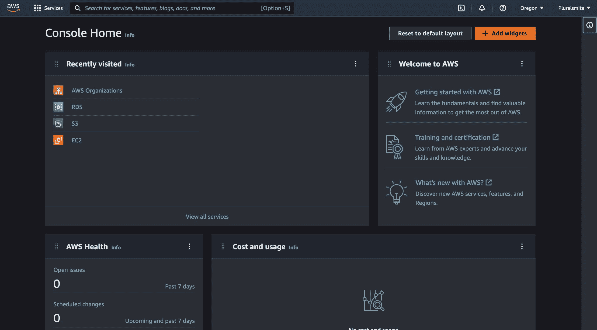

# 十月新闻综述:AWS 有什么新功能？

> 原文：<https://acloudguru.com/blog/engineering/october-2022-aws-news>

你好，云大师！想知道 AWS 这个月发生了什么变化，但还没有找到时间查看几周的头条新闻？这里是你需要知道的所有信息。

* * *

## 加速您的职业发展

[从 ACG 开始](https://acloudguru.com/pricing)通过 AWS、Microsoft Azure、Google Cloud 等领域的课程和实际动手实验室改变你的职业生涯。

* * *

## 亚马逊文件缓存现已全面上市

[Amazon File Cache 是一个很酷的新服务](https://aws.amazon.com/about-aws/whats-new/2022/09/amazon-file-cache-generally-available/)，它提供了一个可扩展的高速亚毫秒级缓存，允许 EC2 实例访问存储在不同位置(例如，在您自己的数据中心)的数据。

创建文件缓存时，它可以链接到多个数据存储，例如:

*   数据中心中的 NFS 文件系统
*   基于云的文件系统，如 Amazon FSx
*   S3

您还可以将多达八个文件系统链接到一个缓存。

一旦创建了缓存，EC2 实例就像普通文件系统一样挂载缓存。当您的工作负载第一次请求数据时，[文件缓存](https://aws.amazon.com/filecache/)会自动将数据加载到缓存中，并作为传统文件系统呈现给您的应用程序。它甚至会释放不再使用的数据。

它支持传输中和静态加密，与内部网络的通信使用直接连接或 VPN。这是一种很好的方式来[缓存您的本地文件系统](https://aws.amazon.com/blogs/aws/amazon-file-cache-a-high-performance-cache-on-aws-for-your-on-premises-file-systems/)，以便 AWS 中的 EC2 工作负载可以安全地访问您的数据。

## 新开发人员助理(DVA-C02)和 DevOps 工程师专业(DOP-C02)考试

AWS 认证开发人员助理考试和 AWS 认证 DevOps 工程师专业考试[正在更新](https://aws.amazon.com/certification/coming-soon/)！这将使这些考试更加符合行业格局、趋势变化以及云专业人员的工作实践。如果你目前正在准备这两种考试中的任何一种，不要担心——这种转变要到明年才会发生。

参加当前开发人员助理考试(DVA-C01)的最后日期是 2 月 27 日，DevOps 工程师专业人员将于 3 月 6 日换岗。之后，只有新的考试(DVA-C02 和 DOP-C02)可用。

想知道他们在更新什么吗？查看 [AWS 认证开发人员助理考试指南](https://d1.awsstatic.com/training-and-certification/docs-dev-associate/AWS-Certified-Developer-Associate_Exam-Guide_C02.pdf)和 [AWS 认证开发人员工程师专业考试指南](https://d1.awsstatic.com/training-and-certification/docs-devops-pro/AWS-Certified-DevOps-Engineer-Professional_Exam-Guide_C02.pdf)以获得关于领域的完整分类。

* * *

*从这些 [10 个有趣的动手项目开始构建你的云计算技能，学习 AWS](https://acloudguru.com/blog/engineering/10-fun-hands-on-projects-to-learn-aws) 。*

* * *

## AWS Trainium 驱动的 EC2 实例正式上市

AWS Trainium 驱动的 EC2 实例[现在已经进入全面上市](https://aws.amazon.com/blogs/aws/amazon-ec2-trn1-instances-for-high-performance-model-training-are-now-available)，随着最初在 re:Invent 2021 上预览的 [Trn1 实例家族](https://aws.amazon.com/ec2/instance-types/trn1/)的全面发布。

[AWS Trainium 处理器](https://aws.amazon.com/about-aws/whats-new/2022/10/ec2-trn1-instances-high-performance-cost-effective-deep-learning-training)是一种新的专用芯片，专门为深度学习算法的训练而设计。除了在命名比赛中获得木勺奖，Trainium 是那些非常有趣的工程壮举之一，AWS 在那里创造了一个高度适应深度学习独特需求的微处理器。它能够更有效地存储常见的数据类型，并加速随机舍入。

借助 AWS Neuron，您可以轻松集成 PyTorch 或 Tensorflow 上运行的解决方案，从而轻松利用这项新技术。当构建高度复杂的语言模型时，如 GPT-3，AWS 声称训练成本降低了 50%，潜在地产生了巨大的差异(尽管对于具有非常特定用例的客户来说)。

## 台北和德里的新本地区

AWS 已经宣布在台北和德里设立两个新的本地专区。

对于 AWS 的全球基础设施来说，本地区域仍然是一个相对较新的概念，会给特定位置的应用程序带来个位数的延迟。这为您的解决方案带来了更高的性能，但也解决了其他问题，如数据驻留需求。

如果您在请求传遍全球的过程中等待了几秒钟，那么云的威力就不那么令人印象深刻了。例如，如果您的公司运行用于多人游戏的服务器，您可以将 EC2 实例部署到许多用户附近的本地区域。这将延迟降低到可能不到 10 毫秒，从而带来卓越的体验。

现在全球有 18 个本地区域，还有 33 个正在规划中，云离用户从未如此之近。

* * *

你是想开始你的 AWS 职业生涯还是想让你的技能更上一层楼？我们的 AWS 学习路径提供定制的路径，让您的云计算之旅更加精彩！

* * *

## RDS 和 EC2 的自动化连接

[RDS 现在支持在现有 RDS 或 Aurora 数据库和同一个 VPC 中的 EC2 实例之间自动建立连接](https://aws.amazon.com/about-aws/whats-new/2022/10/amazon-rds-automating-connectivity-set-up-existing-rds-aurora-database-ec2-compute-instance/)。

这很好，因为这意味着从 RDS 控制台中，您现在可以选择是否要自动配置连接。就像[在同一个 VPC](https://docs.aws.amazon.com/AmazonRDS/latest/UserGuide/ec2-rds-connect.html) 中选择一个实例一样简单，一切都会自动为您配置，包括您的实例和数据库所需的安全组。多酷啊。

## AWS 上的 RedHat Enterprise Linux 工作站

[用于加速 GPU 实例的 red hat Enterprise Linux(RHEL)Workstation](https://aws.amazon.com/about-aws/whats-new/2022/10/red-hat-enterprise-linux-rhel-workstation-aws/)现已在 AWS Marketplace 上市。这种基于云的远程桌面解决方案允许来自世界任何地方的最终用户访问 Red Hat 工作站。[你可以在 AWS 市场](https://aws.amazon.com/marketplace/search/results?searchTerms=RHEL+Workstation)或者 EC2 控制台上找到它们。

它们使用 RedHat 版，运行在支持 GPU 的实例类型上，如 G3、4 和 5，以及 P2 和 3。这些实例类型适用于动画、计算机辅助设计、科学研究或医学成像。

对于任何需要基于 RedHat Linux 的高性能远程桌面解决方案的人来说，这些都是非常棒的。

## AWS 控制台现在提供了黑暗模式

在本周一个非常令人兴奋的 AWS 控制台生活质量更新中，您现在可以[在黑暗模式下导航您的 AWS 服务](https://aws.amazon.com/about-aws/whats-new/2022/10/dark-mode-support-aws-management-console/)！

打开黑暗模式使控制台用户能够以新的视角体验控制台，深灰色背景和灰白色文本旨在减少眼睛疲劳，并有可能延长使用控制台时笔记本电脑的电池寿命。大多数流行的网站和应用程序都包含某种形式的黑暗模式，所以看到这个功能最终在 AWS 控制台中出现是非常令人兴奋的。

该功能仍处于测试阶段，但如果您想试用，可以通过在 AWS 控制台中导航到您的帐户设置来访问它。

这就是 AWS 十月份最大的头条新闻！

* * *

* * *

## 想了解每周 AWS 新闻吗？

查看本周 AWS 的每周新闻综述。加入我们的专家主持人，因为他们涵盖了你需要知道的关于过去一周发展的一切，保持简短、有趣和信息丰富。

无论您是刚刚开始您的云之旅，还是您已经了解自己的东西，每个人都有适合自己的东西！

## 云快乐免费证书准备

在今年年底之前，作为“云快乐”活动的一部分，你可以[注册免费的认证准备](https://www.pluralsight.com/offer/cloud-certification)和 Pluralsight 技能或云专家。你可以免费访问 AWS、Azure、GCP、Kubernetes 和 Terraform 上的课程——当我们说免费时，我们指的是真正的免费。有这么多选择，你可能不确定[如何选择适合你的课程](https://acloudguru.com/blog/engineering/choosing-free-cert-prep-cloudhappy)。别担心，没有错误的答案，你唯一可能犯的错误就是根本不做选择！