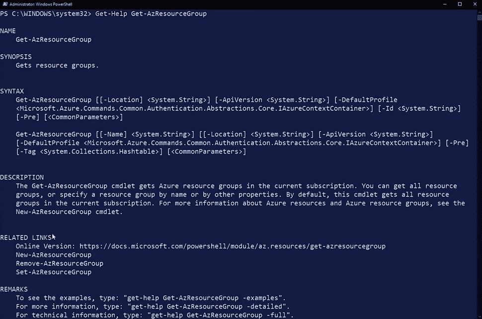
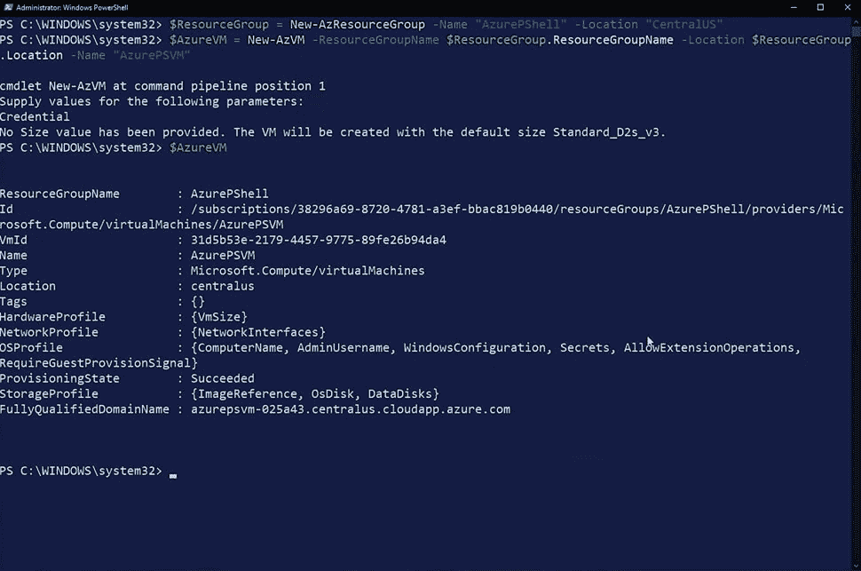
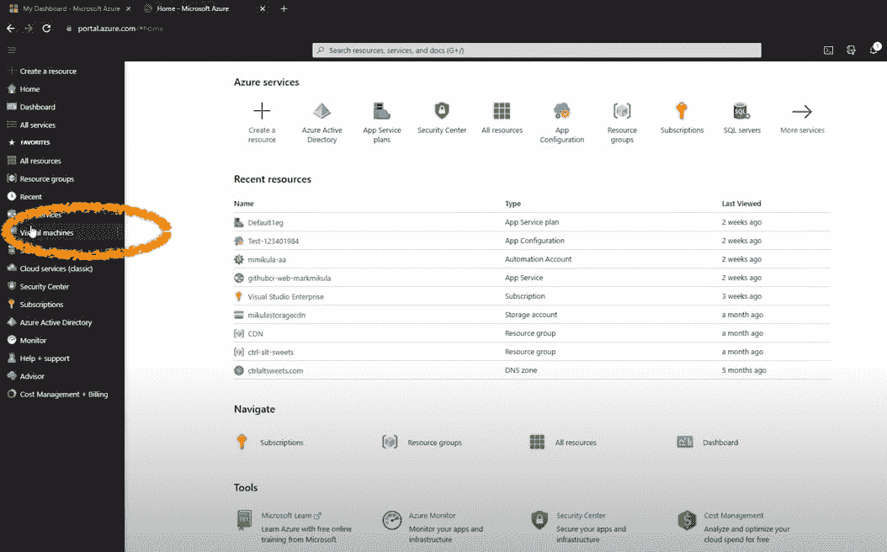

# Azure PowerShell 初学者指南

> 原文：<https://acloudguru.com/blog/engineering/one-shell-to-rule-them-all-5-reasons-to-use-powershell-for-cloud-management>

十多年来，PowerShell 一直是 Windows 管理员最喜欢的解决方案，它能够自动执行微软生态系统中几乎所有的任务。从管理用户帐户、服务器、数据库等等，它的用途是无止境的！有了 Azure 模块，你可以用同样的基本原则轻松掌控你的 Azure 环境。

在这篇文章中，我想向您介绍 PowerShell 和 Azure PowerShell，提供一些关于开始使用 PowerShell 的提示，并给出使用 PowerShell 进行云管理的五个好理由。

* * *

## 通往更好职业的钥匙

[从 ACG 开始](https://acloudguru.com/pricing)通过 AWS、Microsoft Azure、Google Cloud 等领域的课程和实际动手实验室改变你的职业生涯。

* * *

如果您是 PowerShell 新手，或者一般来说是脚本新手，可能很难知道从哪里开始。你看到了潜力。你想自动化所有的事情，但是当你不知道你不知道什么的时候，你如何开始使用 PowerShell 呢？

让我们先快速介绍一下 PowerShell。把这当成一个小小的 PowerShell 101。我们将向您介绍一些开始使用 PowerShell 的技巧，并通过一些实验来学习基础知识。然后，我们将进入 Azure PowerShell，更深入地研究一些您想知道的 cmdlets，并讨论如何使用 Azure PowerShell 创建 Azure VM。

### 目录

**PowerShell 是什么？**

## 简而言之，PowerShell 是一种脚本语言和命令行 Shell，由微软开发，用作任务自动化解决方案。虽然它最初是 Windows 独占的，但现在它是跨平台的，可以在 Linux、macOS 和 Windows 上运行。

为什么选择 PowerShell？

### 有许多非常好的脚本语言可用，那么为什么要选择 PowerShell 呢？

首先，它的语法布局良好，在各种任务中保持一致，易于学习和有效使用。

*   第二，与大多数实用程序不同，它的输出是对象而不是文本，允许您在命令之间进行更高级别的交互。

*   最后，因为它是跨平台的，所以您可以编写一个脚本来管理所有的操作系统——即使您有一个混合操作系统的环境(很多人都是这样)。

*   PowerShell 的所有输入和输出都使用对象，这使得它的工作方式有点像模板。它通过其灵活性和故障诊断及重用代码的能力，实现了一种更自然、更实用的脚本编写方法。

它的两个主要特性是模块和 cmdlets。

什么是模块？

### 模块是组合在一起的一组相关功能和资源。您可以安装用于查询数据库、管理 VMware 环境或排除网络故障的模块。你甚至可以创建自己的模块。

Azure PowerShell 实际上是一个你安装使用的 PowerShell 模块。(我们稍后将深入探讨 Azure PowerShell。)

什么是 cmdlet？

### cmdlet 是执行操作的单个轻量级命令。

首先要知道 PowerShell 的 cmdlets 是以*动词-名词*格式构建的。因此，如果我想要得到一个命令列表，那么我可以直观地知道使用`Get-Command`。这将为我拉回系统上所有可用命令的列表。

获得帮助

### 命令列表很棒，但前提是你知道如何使用它们。因为帮助是我们需要得到的，所以我们可以通过 PowerShell 深思熟虑的语法再次知道`Get-Help`是我们需要运行的。

将它与 cmdlet 名称一起使用，如下所示，您将获得从语法定义到完整示例的信息。默认情况下返回基本信息，但是一定要添加 **-full** 标志来返回所有信息。

`Get-Help Get-Process -full`

另外，记住不要把事情搞得太复杂。我们的本能是谷歌我们的问题，无论是脚本语法还是如何修补干墙。跟着你的直觉走！

微软在他们所有的 cmdlet 在线上都有很棒的文档，简单地谷歌一下 cmdlet 名称就能让你很快找到。在使用 PowerShell 十多年后，我们也在做同样的事情——所以这并不可耻！

探索 PowerShell 的 cmdlets

## 你可以自己开始探索 PowerShell 的 cmdlets，但是让我们给你一些我们最喜欢的例子来激发你的创造力。

查找特定模块的 Cmdlets

### 很多时候，您正在使用一个特定的产品，但是可能已经安装了几个模块。在这些情况下，当简单地运行`Get-Command`时，很难对所有可用的 cmdlets 进行排序。对于这些情况，将您的搜索限制到特定的模块，甚至特定的动词！例如，如果我想查看 Azure SQL 模块中的所有“Get-”cmdlet，我可以运行以下命令:

`Get-Command -Module Az.SQL -Verb Get`

为 Win 安装管道

### 如前所述，PowerShell 优于其他语言的突出特性之一是输出对象而不仅仅是纯文本的能力。

例如，要列出 Linux 机器上的进程，我会使用命令`ps`。这当然有效，但是如果您需要做一些更强大的事情，比如通过管道将输出传递给`kill`命令，该怎么办呢？为此，您必须使用其他命令来解析字符串输出，比如`grep` 和`awk`。可能看起来像这样:

`kill $(ps -e | grep httpd | awk '{print $1}')`

然而，由于 PowerShell 输出对象而不是简单的纯文本，我们可以很容易地引用由`Get-Process`列出的每个进程，以及这些对象的单个元素。要执行上面列出的相同操作，我们可以这样做:

`Get-Process httpd | Stop-Process`

这是一个更简单、更优雅的操作，因为我们将关于“httpd”的信息作为一个对象进行传递，这使得我们要传递到的 cmdlet 可以很容易地辨别出它所需要的信息。当我们将变量设置为等于 cmdlet 结果时，情况也是如此，如下所示:

`$var = Get-Process httpd`

`$var.Id`

在上面的例子中，我设置变量`$var`等于 cmdlet 返回的对象。然后，我可以通过添加句点和属性名来引用 Id 属性。这在编写脚本时变得非常强大，允许您轻松访问您需要的确切信息，而无需大量复杂的`grep`、`awk`、或`sed`操作。

有一个模块可以解决这个问题

### PowerShell 与众不同的另一个方面是它的模块库以及这些模块之间的一致性。无论我是针对 Azure、Active Directory 还是 SQL Server 编写脚本，都有一个相应的模块。我可以导入其中的一个或全部，并与另一个一起使用。我甚至可以从 PowerShell Gallery 中下载第三方模块，并将它们循环使用。一些很酷的例子是:

**在远程实例上执行 SQL Server 代理作业:**

`Invoke-Sqlcmd -ServerInstance "SQLINSTANCENAME" -Database MSDB -query "EXEC dbo.sp_start_job N'My_AwesomeJob';"`

**将广告组成员资格从一个用户复制到另一个用户:**

`Get-Aduser user1 -Properties memberof | select -ExpandProperty memberof | ForEach-Object -Process {$groupName = ($_ -split ',*..=')[1]; Add-ADGroupMember -Identity $groupName -Members user2}`

**启用 Windows 防火墙规则组:**

`Enable-NetFirewallRule -DisplayGroup "Remote Service Management","Remote Event Log Management","Remote Desktop"`

Azure PowerShell 是如何工作的？

## 当您安装 Azure PowerShell 模块时，SDK 会作为模块的一部分自动安装——这是 PowerShell 中使用模块的众多酷功能之一。

你可能连接到 Azure 的每一种方式都通过一个叫做 Azure 资源管理器的管理接口。该接口验证并授权您想要执行的任何操作。对于 Azure PowerShell 和 Azure 命令行界面，它们使用软件开发工具包(SDK)来连接到 Azure 资源管理器并执行操作。

[**得到蔚蓝云痛苦辞典**](https://get.acloudguru.com/cloud-dictionary-of-pain)
说云不一定要辛苦。我们分析了数以百万计的回复，找出了最容易让人犯错的概念。抓住这个[云指南](https://get.acloudguru.com/cloud-dictionary-of-pain)获取 Azure 中一些最痛苦术语的简洁定义。

* * *

[](https://get.acloudguru.com/cloud-dictionary-of-pain)

你用 PowerShell 做什么？

* * *

## PowerShell 中有如此多的特性、实用程序和模块，您可以创建、管理、监控和自动化的唯一限制就是您自己的想象力！你还想要例子吗？当然可以！

使用它升级到您的网站，管理您的 web 应用程序

*   使用它将您的文件服务器迁移到 Azure blob 存储
*   您甚至可以创建和管理您的用户，并分配角色或其他组成员
*   这就是令人难以置信的地方。PowerShell 模块有数百个，包括用于 [AWS](https://acloudguru.com/blog/engineering/what-is-amazon-web-services-aws) 、 [GCP](https://acloudguru.com/blog/engineering/what-is-google-cloud-platform-gcp) 、 [VMware](https://acloudguru.com/blog/engineering/what-is-vmware-hybrid-cloud) 等等的模块。PowerShell 确实是所有管理任务的一站式商店。

Azure PowerShell 易于使用，功能强大，非常灵活，允许用户基于他们的语言知识来管理和自动化大量其他解决方案、产品和服务。

比尔·盖茨曾经说过:“我选择一个懒惰的人去做一件艰苦的工作。因为一个懒惰的人会找到一个简单的方法去做。”对我来说，这就是 Azure PowerShell。这是管理 Azure 资源的简单方法。从自动化您的日常任务到复杂的脚本和部署场景，PowerShell 都能满足您的需求。

Azure PowerShell 入门

## 让我们看看如何安装 Azure PowerShell，如何访问它，以及如何使用它来管理您的 Azure 资源。

*安装 Azure PowerShell*

### 只需两步即可安装 Azure PowerShell:

右键单击“开始”菜单并打开 Windows PowerShell。

1.  在命令行中，运行`Install-Module` cmdlet。使用`Az`作为名称参数，并在末尾添加一个`Force`开关。
2.  如何访问 Azure PowerShell

```
Install-Module -Name Az -Force
```

## 安装完成后，您有三个连接到 PowerShell 的选项:

**本地**:使用 Connect-aza account cmdlet 连接到您的 Azure 帐户。当您看到 Microsoft Azure 弹出窗口时，请登录您的 Azure 帐户。您现在已登录 Azure。

*   **云壳**:去 shell.azure.com。当您看到 Microsoft Azure 弹出窗口时，请登录您的 Azure 帐户。如果这是您第一次登录，它会显示没有装载存储，因此您需要创建存储。有两种不同的环境可供选择——PowerShell 和 Bash。确保您使用的是 PowerShell。

*   **Azure 门户**:进入 Azure 门户。右上角的菜单中有一个命令提示符图标(见下图)。它将打开屏幕底部的一个外壳。同样，您可以在 PowerShell 和 Bash 之间进行选择。您也可以调整此窗口的大小。

*   了解基本 Azure cmdlets

## 如上所述，cmdlet 是 PowerShell 语法的基本组件。它包含执行某个操作所需的所有代码。例如，`Get-AzResourceGroup`将列出我所有可用的资源组。

**参数和自变量**

### 许多 cmdlets 也有收集信息的参数，以便执行该操作。如果我在我的 `Get-AzResourceGroup` cmdlet 后面加上一个空格和一个连字符，我就可以使用 tab 键来滚动所有可用的不同参数。有些是必需的，有些是可选的。一旦到达可用参数的末尾，它将返回到列表的开头。

为了向参数提供信息，您需要输入一个参数。在参数后面，你要加一个空格，你要在双引号内提供参数。例如:

按回车键，你就会得到信息。

```
Get-AzResourceGroup -Name "ctrl-alt-sweets'
```

***变量***

### PowerShell 是一种面向对象的语言，这意味着您可以创建一个变量，然后在脚本中使用它。让 cmdlet 成为变量很简单。

PowerShell 中的变量由美元符号后跟名称来定义。在本例中，我将为资源组命名为 RG，然后添加等号。

这一次当你按下回车键时，没有信息返回。这是因为信息现在存储在变量中。如果您通过简单地命名变量来再次查询该变量，它会返回已经提取的信息。

```
$RG = Get-AzResourceGroup -Name "ctrl-alt-sweets'
```

返回的每一条不同的信息都可以单独引用。

例如，如果我调用变量并使用一个点，并且我要搜索类似于`location`的东西，它将返回该信息。这对于在脚本中引用这些信息非常有用。

**获得帮助**

### 所有 cmdlets 都有帮助。输入`Get-Help`，然后输入您想要获得帮助的 cmdlet。当您按 Enter 键时，它会给出一个概要、完整的语法列表、cmdlet 功能的描述、相关链接，有时还会给出相关的命令、示例和其他注释。

您也可以在`Get-Help`和您的 cmdlet 中使用参数。



如上所示，如果您为带有 `Get-AzResourceGroup`的示例添加一个参数，它将返回几个基于不同信息的示例。

```
Get-Help Get-AzResourceGropu -examples
```

如何使用 Azure PowerShell 创建 Azure VM

## 要创建 VM，首先使用`New-AzResourceGroup`创建 Azure 资源组。你会想把它变成一个变量，因为当你创建 Azure VM 时，你需要它来传递信息。请务必添加名称和位置参数。

接下来，您将使用`New-AzVM`创建 Azure VM，使其也成为一个变量。

```
$ResourceGroup = New-AzResourceGroup -Name "AzurePShell" -Location "CentralUS"
```

确保传递资源组名称变量和位置变量，然后添加 name 参数。这些项目是创建虚拟机所必需的。

一旦你按下回车键，PowerShell 将要求你的凭证。这些不是您的凭证，而是虚拟机的凭证。请记住，密码具有与 Azure 门户相同的复杂性要求。

```
$AzureVM = New-AzM -ResourceGroupName $ResourceGroup.ResourceGroupName -Location $ResourceGroup.Location -Name "AzurePSVM"
```

PowerShell 将完成创建虚拟机的过程。

输入您创建的虚拟机的变量，您将看到它具有完全限定的域名、位置和虚拟机 ID。您不仅可以看到该命令的所有输出，还可以将这些输出用作传递给其他 cmdlets 或脚本的信息。

要检查并查看它是否已被创建，请转到 Azure 门户并从 hamburger 菜单中选择虚拟机。



然后单击虚拟机以查看详细信息。



接下来，您将希望通过使用`Remove-AzResourceGroup`命令删除资源组来进行清理。请确保包含资源组名称变量。在末尾添加一个 Force 开关，强制它删除资源组中的所有内容。

这个命令可能需要一段时间，所以您可能希望使用`AsJob`开关将这个命令作为一个作业来运行，这样您就可以在此期间继续使用 PowerShell。

当一个 Azure 虚拟机被创建时，它会随之创建大量其他 Azure 资源。因此，通过三行代码，我们能够创建一个资源组，创建一个 Azure 虚拟机和所有相关资源，并删除该资源组。

```
Remove-AzResourceGroup -Name $ResourceGroup.ResourceGroupName -Force -AsJob
```

*希望提升您的云计算技能？查看[本月的免费 ACG 课程阵容](https://acloudguru.com/blog/news/whats-free-at-acg)，包括我们闪亮的新 [AZ-400 DevOps 认证考试课程](https://acloudguru.com/course/az-400-designing-and-implementing-microsoft-devops-solutions)。只需[创建一个免费账户](https://acloudguru.com/pricing)并升级。不需要信用卡！*

* * *

为什么应该使用 PowerShell？

* * *

## ***使用 PowerShell 进行云管理的 5 个理由***

### 为什么 PowerShell 在今天作为云管理工具有意义？它可能不是人们的默认选择，尤其是对于自动化 Linux 的东西。但是这就是 PowerShell 值得考虑的原因——更重要的是，这就是为什么*可能是最好的选择。*

一个不太可能的自动化英雄的崛起

### 到 2020 年，云计算的增长已经非常巨大。你很难找到一个组织不[将部分基础设施迁移到云](https://acloudguru.com/blog/business/what-is-cloud-migration)，如果不是完全转换的话。随着 COVID 的出现，原本是一场云竞赛变成了全速冲刺。企业突然迫切需要扩展他们的网站，实现远程工作，并提供非接触方式为客户带来价值。没有比通过云更好的方式来实现快速和可扩展的服务，因此人们比以往任何时候都更多地利用它的潜力。

随着所有这些新的和现有的云利用，非常需要一个可靠的自动化战略。如果您手动管理所有云资源，保持保持竞争力所需的速度和灵活性很快就会变得非常困难。但是，您使用什么工具来管理所有这些资源，尤其是当您将它们分布在多个云或数据中心时？

一个不太可能的英雄出现了:PowerShell。

这可能令人惊讶，特别是考虑到已经有很多像 Python 这样伟大而流行的工具。是什么让 PowerShell 值得考虑，更不用说是“最佳”选项了？

借我你的耳朵，我想告诉你这个经常被忽视的来自微软的害群之马。以下是您应该考虑使用 PowerShell 进行云管理的五个原因。

1.跨平台安装

#### 您可以在自己选择的机器上使用 PowerShell。

虽然 PowerShell 在微软的领导下首次亮相，但现代版本是跨平台的。直到今天，许多人仍然认为它是一个严格的 Windows 工具。但事实上，随着 PowerShell 7 的发布，它甚至是开源的。在过去的几年里，微软确实改变了他们的论调，拥抱开源和 Linux 社区，而 PowerShell 似乎是其中的一个关键部分。

这对开发人员和系统管理员来说都是好消息，因为这意味着您可以在自己选择的机器上使用这个强大的自动化工具。只要你有一个网络浏览器，你甚至不需要安装 PowerShell。[微软 Azure](https://learn.acloud.guru/search?query=&cloudProviders%5B0%5D=Azure&page=1) 已经将其直接集成到他们的门户中，允许你直接从浏览器中使用 Azure 云外壳。

这个工具在后台利用 Ubuntu 机器为您提供一个 shell 体验，不仅可以在全球范围内访问，而且可以在会话之间保持不变。

2.我喜爱的对象

#### PowerShell 的一个关键与众不同的特性是它能够处理对象，而不仅仅是文本。

例如，如果我运行 *Get-Process* ，它将为我返回一个正在运行的进程列表。乍一看，这看起来与任何其他工具中的任何其他文本列表一样。但令人惊讶的是，它实际上是一个对象列表。我可以引用该对象的单个属性，甚至可以在其他命令中有选择地使用它们。这种简单的差异在编写脚本或动态使用命令时会产生重大影响，以至于这个特性本身对使用其他工具的用户来说就很有吸引力。

3.通过你的力量组合

#### PowerShell 模块让你升级你的能力。

PowerShell 的另一大特点是模块。基本上，这些是你可以很容易地导入到你的会话中来立即升级你的能力的附件——有点像 Neo 在他的矩阵训练椅中。

这不仅允许您使用各种产品(如 Active Directory、SQL Server 和 AWS 或 GCP 资源)，还允许您在同一时间*做这件事*。这意味着您可以使用一个脚本来管理本地 AD 权限，从数据库中提取查询，并提供云资源。可能性真的是无限的，完全由你定制。

4.这很有意义

#### PowerShell 的语言直观且可重复。

有时，当我们讨论技术选择时，我们可能会迷失在功能比较、语法细微差别和竞争的杂草中。我们最终会忘记，我们是需要完成工作的人，语言的简单性会对我们的日常工作生活产生巨大影响，无论是好是坏。

在我看来，这是 PowerShell 的一个亮点。不太了解 PowerShell？别担心。[开始使用 PowerShell](https://acloudguru.com/course/getting-started-with-powershell) 很容易。这种语言的整个结构是以一种直观和可重复的方式设计出来的**。**所有命令都采用动词-名词格式。所以你说你想采取的行动，以及你想对什么采取行动。

如前所述，为了获得流程，我运行了`Get-Process`。如果我想获得命令列表，我使用`Get-Command`。如果我想添加一个用户到现有的 Azure 广告组，我会使用`Add-AzADGroupMember`。你明白了。

这不仅有助于记住您经常使用的命令，而且在短时间内，您几乎可以猜出该命令是什么——即使您以前从未使用过它。由于模块之间的一致性，您也可以经常猜测它的参数。这对于那些不熟悉这门语言或自动化的人来说特别有帮助。

**5。PowerShell 酷毙了**

最后一个非常技术性的观点:PowerShell 非常有趣。

在我职业生涯的早期，我在完成一个项目后遇到了 PowerShell，在这个项目中，我必须维护一个遗留的 VBScript 文件。在那次痛苦的经历之后，踏入 PowerShell(当时还处于起步阶段)就像喝了一口水。我无法相信完成强大的任务是如此容易，而且随着时间的推移，它只会变得更好。从那以后，我有机会在各种脚本和日常管理任务中使用它，编写自己的模块，并在多个操作系统和环境中实现它。这是一次我非常享受的狂野之旅，而且越走越有趣。

TL；博士？

### 以下是 PowerShell 如此神奇的原因。

Powershell 是一种脚本语言和 Shell，您可以从任何机器上运行它(甚至是没有安装它的机器，通过云 Shell)。

*   它可以管理 Windows 和 Linux 机器。
*   PowerShell 允许您管理 Azure、AWS 和 GCP 上的云资源。
*   PowerShell 允许您以简单但强大的方式完成所有这些工作。将所有这些都放入 Azure PowerShell Runbook 中，您的同事也可以用一种可重复的方式来完成这些任务。
*   不要让它是微软制造的这个事实欺骗了你，也不要被对它的普遍误解所阻碍。亲自了解新的 PowerShell，我想你会像我一样喜欢它。

使用 ACG 启动您的 PowerShell 游戏

## 想了解更多关于 PowerShell 的信息吗？查看一些云专家的其他 PowerShell 课程。

*想跟上万物云？* [*在 YouTube 上订阅一位云大师*](https://www.youtube.com/c/AcloudGuru/?sub_confirmation=1) *获取每周云相关新闻。你也可以像我们一样关注*[](https://www.facebook.com/acloudguru)**，关注我们的* [*推特*](https://twitter.com/acloudguru) *，或者加入* [*不和谐*](http://discord.gg/acloudguru) *的对话！**

*兰登·福勒和马克·米库拉对此文亦有贡献。*

**Landon Fowler and Mark Mikula contributed to this post.**