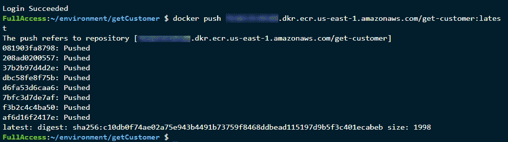
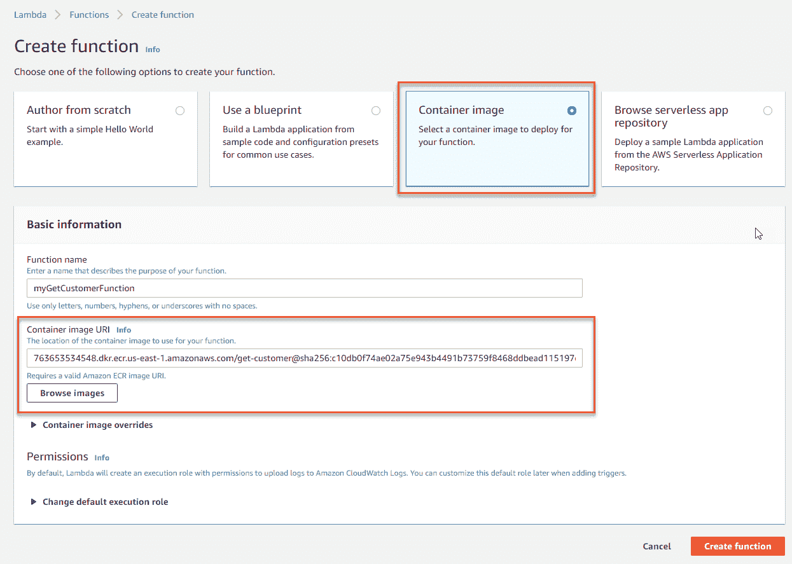
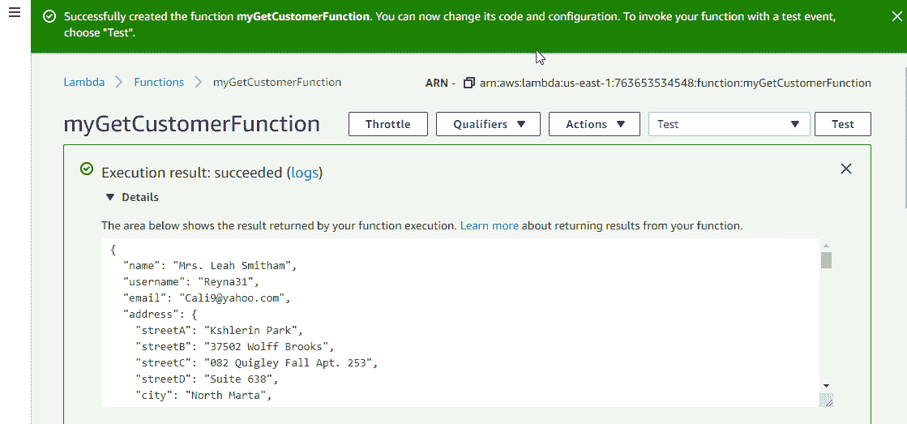
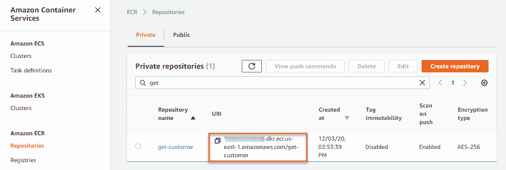
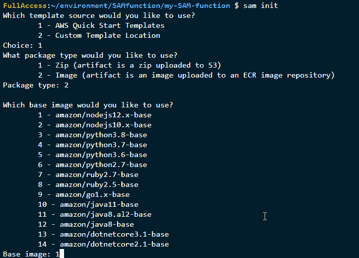
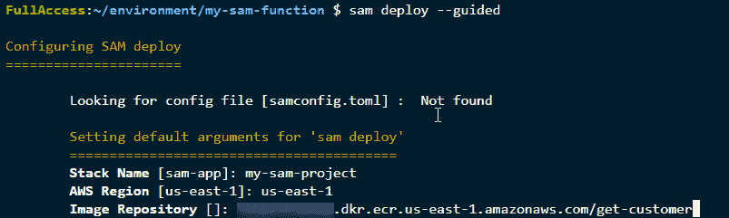
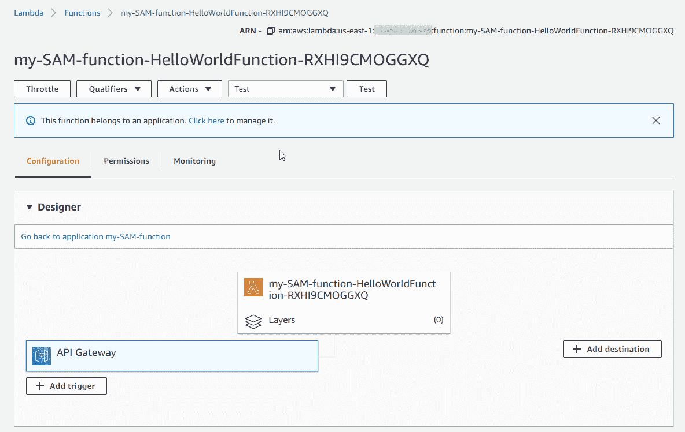

# 将 AWS Lambda 打包成容器映像|云专家

> 原文：<https://acloudguru.com/blog/engineering/packaging-aws-lambda-functions-as-container-images>

在 [AWS re:Invent 2020](https://reinvent.awsevents.com/) 上宣布了对 [AWS Lambda](https://aws.amazon.com/lambda/pricing/) 的容器映像支持。这是 AWS 功能即服务产品的一个重要新增功能。Lambda 在管理可伸缩性、高可用性和容错方面为开发人员提供了许多好处，并且还支持按价值付费的模型。通过支持函数的容器封装，Lambda 现在成为了广大开发者的一个选择。

在这篇文章中，我解释了这个新功能提供了什么，并浏览了一个教程，展示了如何构建一个容器[映像并在 Lambda 函数](https://acloudguru.com/blog/engineering/serverless-image-optimization-and-delivery)中运行。

## 为什么 AWS 增加了对容器打包的支持？

在这个改变之前，Lambda 部署包是一个 zip 文件。zip 文件包含代码以及任何库和依赖项。你可以手动上传这个文件，或者使用自动化工具，如 [AWS 无服务器应用模型](https://aws.amazon.com/serverless/sam/)(AWS SAM)[AWS CDK](https://aws.amazon.com/cdk/)，或者[无服务器框架](https://www.serverless.com/)。

然而，许多客户已经投资了基于容器的部署工具和工作流。除了 CI/CD、安全性和治理工具之外，还包括 Docker。Docker 是一个非常强大的运行和管理容器的工具(如果你想提高你的技能，你可以通过获得 Docker 认证来做到这一点)。有了这一改变，开发人员可以从统一的开发和部署过程中受益。

* * *

你是想开始你的 AWS 职业生涯还是想让你的技能更上一层楼？我们的 AWS 学习路径提供定制的路径，让您的云计算之旅更加精彩！

* * *

## 使用容器包装功能的好处

Lambda 将基于容器的函数视为不可变的实体。调用时，作为容器映像部署的函数按原样运行。这意味着部署包在不同的环境中是不可变的，包括桌面、 [CI/CD 流程和 Lambda 执行环境](https://acloudguru.com/blog/engineering/continuous-deployment-with-serverless-and-circleci)。

对于工作负载较大的开发人员来说，基于容器的部署包现在最大可达 10 GB。这释放了许多新的工作负载可能性，尤其是对于数据密集型或依赖性密集型应用程序。对于机器学习或数据分析，这允许开发人员利用无服务器计算的优势。如果您使用 PyTorch、NumPy 和类似的库，以前的 250 MB 部署包限制阻止了许多工作负载使用 Lambda。

这种新方法还提高了不同 AWS 计算选项之间的可移植性。你可以为你的代码选择一个首选的基于映像的方法，这样在 AWS Fargate 或 Amazon EC2 等服务之间实现可移植性就更容易了。

## 它是如何工作的

有了容器映像支持，Lambda 支持 [Docker 映像清单模式](https://docs.docker.com/registry/spec/manifest-v2-2/)和[开放容器倡议(OCI)规范](https://opencontainers.org/)(版本 1.0 起)。它支持来自[亚马逊弹性容器注册中心](https://aws.amazon.com/ecr/) (ECR)的容器映像部署。

Lambda 服务提供了各种预安装运行时的基本映像选项。这些基础映像将由 AWS 进行修补和维护。目前支持的运行时有 dotnetcore2.1、dotnetcore3.1、go1.x、java8、java8.al2、java11、nodejs12.x、nodejs10.x、python3.8、python3.7、python3.6、python2.7、ruby2.5、ruby2.7、provided.al2、provided。开发者也可以提供他们自己的基于 Linux 内核的映像。

这里一个有趣的新组件是[运行时接口客户端](https://docs.aws.amazon.com/lambda/latest/dg/runtimes-images.html) (RIC)。ric 是在运行时将客户功能代码与 Lambda API 集成在一起的包装器。这些都预装在 AWS 提供的基本映像上。对于您构建的映像，您必须确保 RIC 存在。有一个[开源版本](https://github.com/aws/aws-lambda-python-runtime-interface-client)用于定制基础映像。

还有一个运行时接口仿真器(RIE ),使您能够在本地测试功能代码。在开发和其他生产前环境中，通过发送 HTTP 请求来测试功能非常有用。模拟器在容器内部的端口上监听 HTTPS 请求，然后包装这些请求并作为事件提供给函数。这也是一个[开源项目](https://github.com/aws/aws-lambda-runtime-interface-emulator/)。

Lambda 执行环境在运行时提供了一个只读文件系统。要写入文件，您可以访问 512MB /tmp 存储空间。默认用户是唯一受支持的用户，这使得 Lambda 能够在调用期间提供最低特权的安全权限。

## 许多事情不会改变

将 Lambda 函数打包成容器映像的能力带来了新的功能，但许多事情并没有改变。如果您是一名现有的 Lambda 开发人员，并且对您当前构建和部署应用程序的方法感到满意，那么您不需要做任何改变。如果你想使用这种新型包装，你可以依靠许多东西继续工作，因为他们以前没有。

Lambda 的资源和操作模型完全相同。这意味着自动扩展特性、跨多个可用性区域的高可用性以及安全性和隔离模型是相同的。

性能配置文件也仍然取决于映像大小、运行时选择以及函数的依赖性。我在这个 [YouTube 视频](https://www.youtube.com/watch?v=FTCaOQJvG6Y)中讨论的许多优化技巧仍然适用于基于容器的 Lambda 函数。Lambda 定价也是一样的，不管你用哪种打包方式。

Lambda 的主要特性仍然适用于基于容器的函数。您可以继续使用提供的并发性、扩展、Amazon 弹性文件系统(EFS)和 X 射线集成。您还可以像以前一样让这些函数访问您的 VPC，使用保留并发，或者将成功和失败处理路由到 Lambda 目的地。

## 如何将 Lambda 函数打包成容器映像

为了展示这在实践中是如何工作的，本演练使用了一个基于 Linux 的环境，其中已经安装了 [AWS CLI](https://aws.amazon.com/cli/) 、 [Node.js](https://nodejs.org/en/download/) 和 [Docker](https://docs.docker.com/get-docker/) 。

1.创建应用目录，设置 npm，安装用于生成测试数据的 [Faker.js 包](https://www.npmjs.com/package/faker):

```
mkdir getCustomerFunction
cd getCustomerFunction
npm init –y
npm i faker --save
```

2.创建一个名为 *app.js* 的文件，粘贴以下代码。这与您在常规 zip 文件部署中使用的 Lambda 处理程序代码相同:

```
const faker = require('faker')
module.exports.lambdaHandler = async (event, context) => {
    return faker.helpers.createCard()
}
```

3.创建一个名为 *Dockerfile* 的文件，并粘贴以下代码。这指导 Docker 如何构建容器，安装任何必要的包，并显示 Lambda 处理程序在哪里可用。

```
FROM public.ecr.aws/lambda/nodejs:12
COPY app.js package*.json ./
RUN npm install
CMD [ "app.lambdaHandler" ]
```

完成这些步骤后，我的 IDE 看起来像这样:


4.使用 Docker 通过以下功能代码构建一个映像:

```
docker build -t get-customer .
```

5.在 ECR 中创建新的存储库，并将 Docker 映像推送到 repo。将<accountid>替换为您的 AWS 帐户 ID，将<region>替换为您的首选 AWS 地区:</region></accountid>

```
aws ecr create-repository --repository-name get-customer --image-scanning-configuration scanOnPush=true

docker tag get-customer:latest <accountID>.dkr.ecr.<region>.amazonaws.com/get-customer:latest

aws ecr get-login-password | docker login --username AWS --password-stdin <accountID>.dkr.ecr.us-east-1.amazonaws.com

docker push <accountID>.dkr.ecr.<region>.amazonaws.com/get-customer:latest
```



## 将容器图像作为 Lambda 函数调用

一旦图像被推送到 ECR，您就可以在新的 Lambda 函数中使用它。在 [Lambda 控制台](https://console.aws.amazon.com/lambda/home)中，选择**创建功能**，然后在*基本信息*面板中选择新的容器图像。选择**创建功能**完成该过程。



在下一页中，当使用容器图像成功创建函数时，会出现一个通知。你可以像测试任何常规 Lambda 函数一样测试这个函数。选择 **Test** 后，你会看到函数代码返回的随机测试数据:



在 Lambda 控制台中，您可以设置超时(1–900 秒)和内存分配(128 MB 到 10，240 MB)。10 GB 的限制是一项新功能，提高了以前的最大内存 3 GB。

## 使用 AWS SAM 实现流程自动化

使用 AWS SAM 可以自动构建和部署基于容器的 Lambda 函数。为此，您需要安装 [AWS SAM CLI](https://docs.aws.amazon.com/serverless-application-model/latest/developerguide/serverless-sam-cli-install.html) 。你需要 ECR 回购 URI-要找到它，导航到 [ECR 控制台](https://console.aws.amazon.com/ecr/repositories)并从 *get-customer* 回购中复制 URI。



本演练使用前面创建的 ECR repo 部署完全相同的功能。首先，您使用 AWS SAM 来初始化一个项目，以生成一个示例函数和 *Dockerfile* 。接下来，使用 build 和 deploy 命令来自动构建映像，推送到 ECR repo，并创建 Lambda 函数。

从终端:

1.输入 *sam init* 启动 AWS SAM 向导。

2.选择“1–AWS 快速入门模板”。

3.您可以选择 zip 或图像部署。选择 2–图像。

4.您可以选择您喜欢的运行时基础映像。在这种情况下，选择 1–Amazon/nodejs 12 . x-base。



5.对于*项目*名称，输入‘我的 sam 功能’。这将创建一个包含 AWS SAM 模板、自述文件和单元测试的样例项目。

6.导航到 *my-sam-function* 项目中的 *hello-world* 函数目录，打开 app.js，粘贴以下函数代码并保存更改:

```
const faker = require('faker')
module.exports.lambdaHandler = async (event, context) => {
    return faker.helpers.createCard()
}
```

7.将终端放在 *my-sam-function* 项目目录中，构建项目:

```
sam build
```

8.使用 AWS SAM 部署的引导模式部署基于容器的功能:

```
sam deploy –guided
```

对于*栈名*，输入‘my-Sam-project’，输入首选区域，然后输入之前复制的 ECR 库 URI。



部署完成后，新功能会出现在 Lambda 控制台中。您可以通过使用之前使用的*测试*选项来调用该函数。



## 结论

有了 Lambda 的新容器映像支持，您可以使用 Docker 来打包您的自定义代码和 Lambda 函数的依赖项。10 GB 部署包限制使得部署不适合现有 250 MB 文件配额的较大工作负载成为可能。

在这篇文章中，我展示了如何构建 Docker 映像并在 Lambda 服务中部署该映像。我还展示了如何使用 AWS SAM 来简化样板项目的生成、构建映像和部署功能。

现在是在 AWS 中发展云技能和提升职业水平的最佳时机。

要获得更多帮助您充分利用基于 Lambda 的应用程序的技巧和诀窍，请访问[无服务器世界](https://serverlessland.com/)。