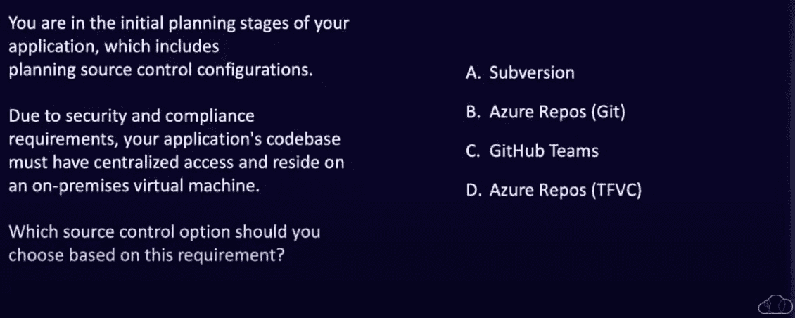
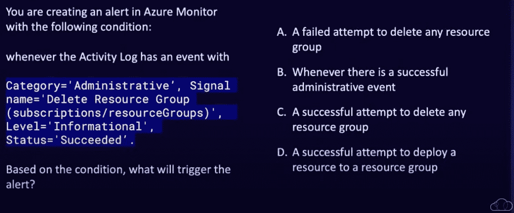
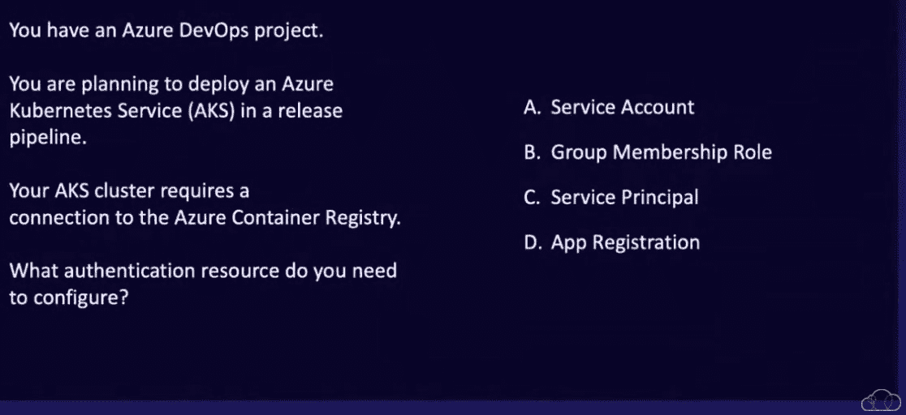
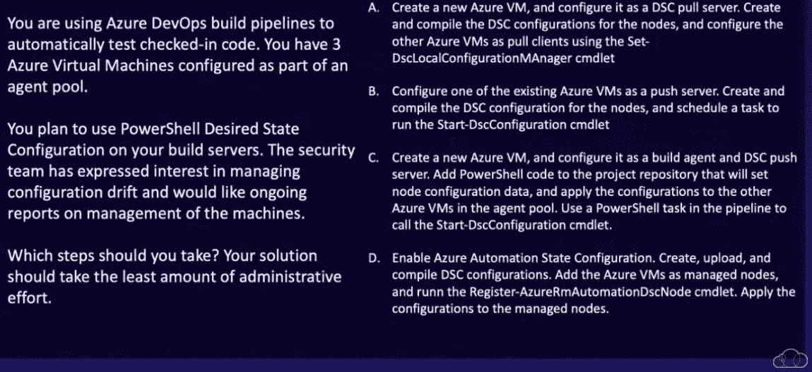

# AZ-400 学习指南:免费 Azure 考试演练|云专家

> 原文：<https://acloudguru.com/blog/engineering/prep-for-the-az-400-for-free-join-our-live-azure-exam-walkthrough>

*在这篇文章中，云专家 Azure 培训架构师马修·乌拉森和马克·米库拉提供了考试技巧，并以 AZ-400 Microsoft DevOps 解决方案考试的形式带您浏览了示例问题和答案*。

找出哪条 Azure 认证道路适合你？如果你已经通过了 [Azure 基础](https://acloudguru.com/course/az-900-microsoft-azure-fundamentals)的考试，并且已经获得了 [Azure 开发者助理](https://acloudguru.com/course/microsoft-certified-azure-developer-exam-az-203-prep)或 [Azure 管理员助理](https://acloudguru.com/course/az-104-microsoft-azure-administrator-certification-prep)证书，你可能已经准备好参加专家级的微软认证:DevOps 工程师专家认证和 [AZ-400:设计和实施微软 DevOps 解决方案](https://acloudguru.com/course/az-400-designing-and-implementing-microsoft-devops-solutions)。

* * *

## 通往更好职业的钥匙

[从 ACG 开始](https://acloudguru.com/pricing)通过 AWS、Microsoft Azure、Google Cloud 等领域的课程和实际动手实验室改变你的职业生涯。

* * *

如果您正准备参加 AZ-400 设计和实施 Microsoft DevOps 解决方案考试(或者只是好奇考试内容)，我们可以随时为您提供帮助！请继续阅读，或在 [YouTube](https://youtu.be/a6FfQdMdLOw?t=584) 上观看本次会议。

为了让你的学习更加努力，到 11 月底， **[ACG 新的 AZ-400 课程](https://acloudguru.com/course/az-400-designing-and-implementing-microsoft-devops-solutions)将免费提供**。你所需要的只是一个 ACG 账户——这也是免费的！

还不是 ACG 会员吗？[创建一个免费账户](https://acloudguru.com/pricing)(不需要信用卡)，准备好赢取 AZ-400——并查看我们其余的[免费云课程](https://acloudguru.com/blog/news/whats-free-at-acg) —以确保您在云领域的成功。

准备好迎接 AZ-400 了吗？请继续阅读！

* * *

### 目录

* * *

**AZ-400**考哪些技能？

## 下面是你将在微软的 AZ-400 上测试的内容:

开发仪器策略

| 5–10% | 制定现场可靠性工程或 SRE 战略 |
| 5–10% | 制定安全和合规计划 |
| 10–15% | 发展和促进沟通与协作 |
| 10–15% | 管理源代码管理 |
| 10–15% | 定义和实现持续集成 |
| 20-25% | 定义和实施持续交付和发布管理策略 |
| 10–15% | 准备 AZ-400 需要多长时间？ |

## 如果你以前有与 Azure 合作的经验，与 Azure DevOps 组织合作的经验，与 Azure Pipelines 合作的经验，你可以在 4-6 周内为 AZ-400 做好准备。但一般来说，这取决于你以前使用 Azure、DevOps 流程的经验水平，你使用 Git 或 GitHub 的熟练程度，或者只是 Git 工作流，使用 CI/CD 流程，等等。即使你有使用 DevOps 的经验，但不是专门使用 Azure devo PS——特别是 Azure Pipelines 和 YAML 格式，也可能有一点点学习曲线。

如果你没有使用 Azure 的经验，你可能应该先从 AZ-104 考试或 AZ-204 考试开始。

如果你有使用 Azure 的经验，但没有使用 DevOps 组织的经验，或者你没有真正使用 GitHub 工作流那么多，至少再增加半个月的准备时间——可能总共大约 2-3 个月。但这些都是非常粗略的估计，你的里程可能会有所不同！

AZ-400 有多硬？

## 使用 DevOps，无论您是在与微软、谷歌、内部还是其他公司合作，都有一个假定的开发人员和运营人员的知识水平，其中也包括安全性。很少有人——除了极少数独角兽之外——实际上同时拥有这两方面的深厚知识。

DevOps 对大多数人来说很难，因为这个等式中至少有一半对你来说是完全陌生的。这是一个很难涉及的话题。你不会一夜之间成为这方面的专家。所以，如果你在纠结这些问题，不要难过。继续努力吧。AZ-400 是一项具有挑战性的考试，但只要付出时间和努力，你就能做到！

AZ-400 上有多少问题？

## 您将有 150 分钟的时间来完成这项考试。问题总数在 40-60 之间，这取决于微软给你什么。

这意味着每个问题大约有 2-3 分钟的时间。(出于这个原因，我建议你跳过难题，稍后再来。请注意，可能有几个问题无法重新讨论，但这将在这些问题中指出。)

**如何通过 AZ-400？**

## 微软提供了一些很棒的资源，包括实验室和一些非常酷的课程。还有在 ACG 的 [AZ-400 课程，它按领域贯穿所有主题。它旨在为您提供所需的一站式资源。](https://acloudguru.com/course/az-400-designing-and-implementing-microsoft-devops-solutions)

最重要的是，你会想亲身体验与这次考试相关的所有技术，比如 [Azure Pipelines](https://acloudguru.com/hands-on-labs/building-infrastructure-with-azure-pipelines) 。

[**得到蔚蓝云痛苦辞典**](https://get.acloudguru.com/cloud-dictionary-of-pain)
说云不一定要辛苦。我们分析了数以百万计的回复，找出了最容易让人犯错的概念。抓住这个[云指南](https://get.acloudguru.com/cloud-dictionary-of-pain)获取 Azure 中一些最痛苦术语的简洁定义。

* * *

我应该先吃 AZ-104 还是 AZ-204，还是两者都吃，再吃 AZ-400？

* * *

## 在一个拥有无限时间和资源的完美世界里，这两者都可以让你完美地适应 AZ-400。但是在现实世界中，你只需要一个就够了。对于考试，选择你最擅长的一面，然后加倍努力学习你较弱的一面。

如果我没有开发者背景，先去找 AZ-500 再找 AZ-400 好吗？

## 这不是必需的。AZ-104 的安全概念对于 AZ-400 来说已经足够了。显然， [AZ-500(微软 Azure 安全技术)](https://acloudguru.com/course/az-500-microsoft-azure-security-technologies-la)也将涵盖这一点。但是对于 AZ-400 呢？可能有点矫枉过正。

**AZ-400 之后该怎么办？**

## 安全是一件大事。不管你的背景如何，这都是一个有用的特质，因此 AZ-500 在某种程度上是添加到你简历中的一个很好的东西。

**我如何提高自己的开发技能，为 AZ-400 及更高版本做准备？**

## 如果你像我们中的许多人一样来自管理员或运营背景，那么几乎任何与云工程或云相关的工作都会有某种开发人员方面的内容。特别是在未来的 5 到 10 年里，这种开发人员技能组合很可能会真正区分出谁真正能够在他们的云职业生涯中向上爬。那些愿意并且能够弥补自己在运营和开发方面的知识差距的人——反之亦然——进入 DevOps 在某种意义上是一种将自己踢出巢穴的好方法，并迫使你开始学习这两方面。

**AZ-400 样题试题**

## 下面的考试问题样本是你将在考试中看到的问题类型的合理示例，包括一些你在 AZ-400 中可能会遇到的冗长和情景驱动的问题。这些问题来自我们的 [AZ-400 练习 exa](https://practice-exam.acloud.guru/edfd1636-66ce-46e2-9c9d-345fc0b8dd82) m(本月[免费提供](https://acloudguru.com/blog/news/whats-free-at-acg)以及我们的 [AZ-400 课程](https://acloudguru.com/course/az-400-designing-and-implementing-microsoft-devops-solutions))。

**样题#1**

看问题的时候，先考虑你需要重点关注的重点。就这个问题而言:

*源控制*

*   *集中式*
*   *本地虚拟机*
*   所以，有了这三条信息，我们可以先排除 GitHub 团队。GitHub Teams 是 GitHub 内置的一个团队管理功能，但是 GitHub Teams 本身不是一个源代码控制配置，所以我们可以找到答案。

接下来，我们需要一个集中的源代码控制方法。相比之下，Git(或者确切地说是 Azure Repos Git)本质上是一种*去中心化的*源代码控制方法，所以 Git 不是集中式的，所以我们可以直接扔掉它，然后剩下 subversion 或 Azure Repos 使用 TFVC，这是 team foundation 版本控制的缩写。现在，这两种都是集中式源代码控制方法。然而，使用 TFVC 的 Azure Repos 不能在本地机器上运行——相反，它只能在 Azure DevOps 组织内部的 Azure Repos 中托管或运行，而不是在本地。因此，Subversion，这种不太常用但仍然存在的集中式源代码控制方法，可以在本地虚拟机上运行，也可以在其他任何地方运行。基于这些信息，这是我们唯一正确的答案。

考试小贴士#1: *小心干扰物！微软喜欢给你一堵文字墙，可能会把你引向错误的方向。看看这些关键特征，确保你走在正确的方向上。*

* * *

**样题#2**

* * *

这个问题信息量很大。这里的关键信息是作为信号的“删除资源组”和“状态为成功”因此，我们需要知道我们是否能够成功删除资源组。其他信息很好了解，但最终与问题无关。

记住这一点，正确答案是成功尝试删除任何资源组，或 c。

**考试提示 2** : *理解服务如何工作并影响其他服务。* *对于监控和现场可靠性工程，有许多不同的部分，你需要了解所有的部分是如何协同工作的*

* * *

**样题 3**

* * *

让我们从需要关注的关键点开始:

*连接*

*   *Azure 容器注册中心*
*   *认证资源*
*   基于以上，让我们继续，把我们不正确的答案扔出去。我们的第一个错误答案是 A，服务帐户。Microsoft 不建议使用服务帐户来创建访问权限。

组成员角色更侧重于对资源的权限，但它本身不是身份验证资源。

微软表示，应用程序注册不会授予 AKS 对 Azure 容器注册服务的访问权限。

考虑到这一点，服务主体是我们的认证方法，它将允许您将一个 Azure 服务安全地认证到另一个服务。所以基于此，答案 C，服务原则，是我们的正确答案。

这又回到了上面同样的考试技巧:你需要理解其他服务如何与其他服务交互。在这种情况下，Azure Kubernetes 服务于 Azure 容器注册中心，服务主体肯定是一个托管身份。肯定不想要服务帐户，因为那些有密码，服务主体是受管理的身份，密码由 Azure Active Directory 管理。

 **样题第 4 题**

下一个是一个冗长的问题。在 AZ-400 认证考试中看到这样的问题，不要感到惊讶。

尽管这是一个非常罗嗦的问题，有一大堆罗嗦的答案，但这里真的有一种更简单的解释。

我们需要关注的部分是安全团队已经表达了对管理配置漂移的兴趣。正因为如此，他们还希望得到关于机器管理的持续报告。

现在从技术上来说，答案中的每一个方法实际上都可以用于构建服务器的初始期望状态配置。然而，报告服务器和关于机器管理和配置漂移的报告是它的一个关键方面。

另一个关键方面是，他们也表示有兴趣用自己的机器来管理这种配置偏差。正因为如此，所有其他的管理推送服务器，配置为 DSC 拉取服务器——除了启用 Azure Automation 状态配置之外的一切都不包括任何报告方面以及最终引入其他机器来管理配置漂移。

因此，Azure Automation State Configuration 将能够为安全团队生成这些定期报告，它也将成为管理未来可能发生的大规模配置漂移的最佳解决方案。

基于此，D 是我们的正确答案。

**考试小贴士#3** : *将问题分解，利用相关信息进行逻辑求解。*

* * *

与云大师一起为 AZ-400 做准备

* * *

## 对于 AZ-400 和更高版本，云专家拥有您在云领域取得成功所需的工具。

想要跟上云的所有事物？在 YouTube 上订阅一位云专家的每周微软 Azure 新闻(以及其他云提供商的新闻)。你也可以在[脸书](https://www.facebook.com/acloudguru)上喜欢我们，在[推特](https://twitter.com/acloudguru)上关注我们，或者在[不和谐](http://discord.gg/acloudguru)上加入对话！

[**看点:解决“无经验”的云招聘问题**](https://get.acloudguru.com/solving-no-experience-cloud-problem-webinar)
需要经验才能得到工作，但需要工作才能得到经验。这是一个多云的第 22 条军规！[观看免费点播的网络研讨会](https://get.acloudguru.com/solving-no-experience-cloud-problem-webinar)，了解帮助数十人获得第一份云计算工作的 ACG 挑战赛。

* * *

[**WATCH: Solving The “No Experience” Cloud Hiring Problem**](https://get.acloudguru.com/solving-no-experience-cloud-problem-webinar)
Need experience to get a job, but need a job to get experience. It’s a cloudy Catch-22! [Watch this free, on-demand webinar](https://get.acloudguru.com/solving-no-experience-cloud-problem-webinar) with insights from the ACG challenge that helped dozens get their first cloud job.