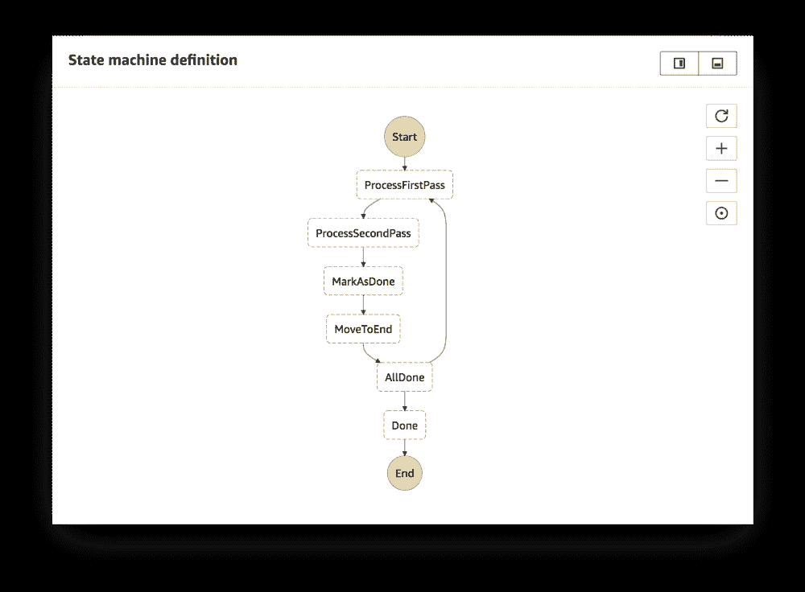
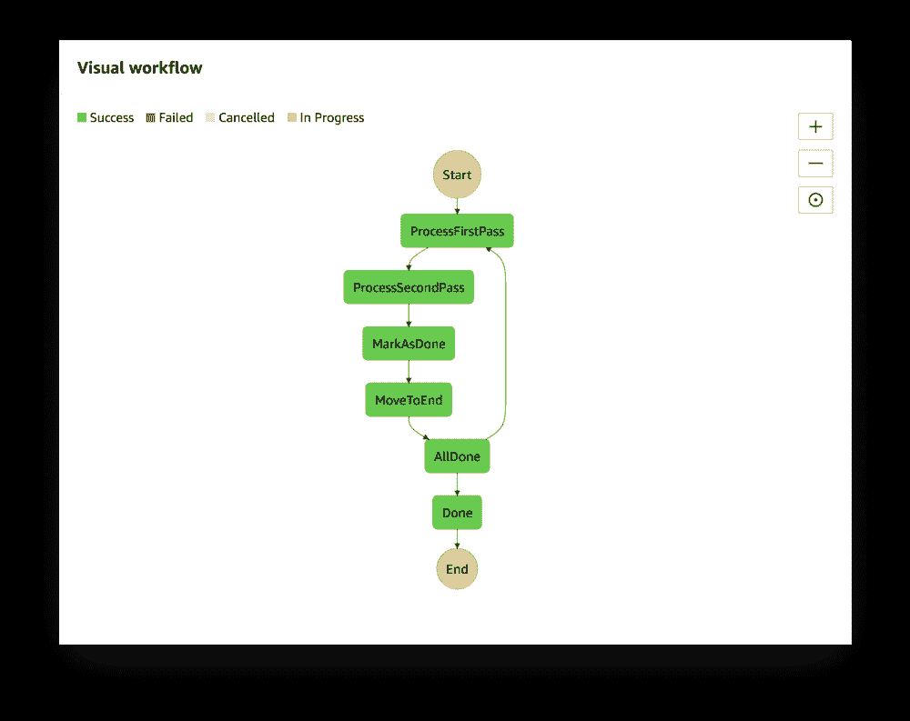

# 如何使用 AWS Step 函数处理作业

> 原文：<https://acloudguru.com/blog/engineering/processing-an-arbitrary-number-of-jobs-with-aws-step-functions>

AWS Step Functions 基于任务和状态机的概念，使用基于 JSON 的 [Amazon States 语言](https://states-language.net/spec.html)来定义工作流。在本文中，我们将探索如何使用 AWS 步骤函数建立工作流，以迭代任意数量的复杂任务。

示例项目使用迭代器模式来处理作业的动态列表。

> ***更新:*亚马逊已经自** [**推出支持动态并行**](https://aws.amazon.com/blogs/aws/new-step-functions-support-for-dynamic-parallelism/)

在标记为的[处，我们使用带有 AWS 步骤函数的*迭代器模式*来智能处理会议录音。一旦音频文件被处理，参与者就可以访问和搜索对话。](https://marked.ai/)

对于每个会议，要处理的文件数量取决于一系列因素—通话人数、导致受影响人员部分录音的连接中断、某人因不同原因不得不离开通话并在稍后返回。无论如何，后处理工作流应该同样好地处理所有场景。

**TL；DR** 处理一个任务列表，总是在列表中的第一个任务上执行任务，将任务标记为完成，并移动到数组的末尾，重复执行，直到所有任务都完成。GitHub 上的[提供了完整的样本项目。](https://github.com/christianklotz/aws-step-functions-iterate-sample)

AWS 步骤功能允许您将多个 AWS 服务协调到无服务器工作流中，以便您可以快速构建和更新应用程序。[使用步骤函数](https://acloudguru.com/blog/engineering/how-the-saga-pattern-manages-failures-with-aws-lambda-and-step-functions)，您可以设计和运行工作流，将 AWS Lambda 和 Amazon ECS 等服务整合到功能丰富的应用程序中。工作流由一系列步骤组成，一个步骤的输出作为下一个步骤的输入。

### 迭代次数

AWS 文档中描述的[迭代器模式在为每次迭代工作的步骤不执行任何特定的](https://docs.aws.amazon.com/step-functions/latest/dg/tutorial-create-iterate-pattern-section.html)[输入和输出处理](https://docs.aws.amazon.com/step-functions/latest/dg/amazon-states-language-input-output-processing.html)时工作得非常好。

但是我们如何处理执行处理和就地修改状态机数据的迭代呢？让我们想象一个工作流，它在执行时将一系列作业作为输入。

```
{
  "jobs": [{
    "name": "First job"
  }, {
    "name": "Second job"
  }]
}
```

每个作业应该由两个任务处理，将结果添加到状态机数据中，最终产生以下输出:

```
{
  "jobs": [{
    "name": "First job",
    "firstResult": "success",
    "secondResult": "success"
  }, {
    "name": "Second job",
    "firstResult": "success",
    "secondResult": "success"
  }]
}
```

关键的一点是，在处理工作流时，为每个单独的作业设置了`firstResult`和`secondResult`。

***注:*** *亚马逊一般建议尽量保持状态机数据小，在 S3、DynamoDB 或其他地方存储较大的对象，使用工作流内的引用。*

### 亚马逊州语言的限制

由于 Amazon States 语言的限制，不可能使用完整的 [JsonPath](https://github.com/json-path/JsonPath) 语法来选择或查询 jobs 数组。相反，我们可以只在数组的第一项上执行任务，在处理完成后将作业标记为 done，并将其移动到数组的末尾。

为了确定工作流是否已经结束，每个迭代都以另一个步骤结束，该步骤检查队列中的下一个作业(总是数组中的第一个项目)是否已经被标记为完成。这导致了下面完整的工作流定义。



The workflow runs until all jobs are done

```
{
  "Comment": "Processes an arbitrary list of jobs.",
  "StartAt": "ProcessFirstPass",
  "States": {
    "ProcessFirstPass": {
      "Type": "Pass",
      "Result": "success",
      "ResultPath": "$.jobs[0].firstResult",
      "Next": "ProcessSecondPass"
    },
    "ProcessSecondPass": {
      "Type": "Pass",
      "Result": "success",
      "ResultPath": "$.jobs[0].secondResult",
      "Next": "MarkAsDone"
    },
    "MarkAsDone": {
      "Type": "Pass",
      "ResultPath": "$.jobs[0].done",
      "Result": true,
      "Next": "MoveToEnd"
    },
    "MoveToEnd": {
      "Type": "Task",
      "Comment": "Moves the currently processed job to the end of the array",
      "InputPath": "$.jobs",
      "ResultPath": "$.jobs",
      "Resource": "${ProcessMoveToEnd.Arn}",
      "Next": "AllDone"
    },
    "AllDone": {
      "Type": "Choice",
      "Choices": [
        {
          "Variable": "$.jobs[0].done",
          "BooleanEquals": true,
          "Next": "Done"
        }
      ],
      "Default": "ProcessFirstPass"
    },
    "Done": {
      "Type": "Pass",
      "End": true
    }
  }
}
```

步骤`ProcessFirstPass`和`ProcessSecondPass`都可以是 Lambda 函数或活动。在这个例子中，一个`Pass`状态足以演示这个流程。

将数组中的第一项移动到末尾的函数是作为 Lambda 函数实现的[。我选择了 Go——但是如果你更喜欢 Node.js 或 Python，从技术上来说，你可以在你的 CloudFormation 模板](https://acloudguru.com/blog/engineering/running-webpack-on-aws-lambda)中提供源代码甚至[作为内联文本。](https://docs.aws.amazon.com/AWSCloudFormation/latest/UserGuide/aws-properties-lambda-function-code.html)

```
package main
import (
  "github.com/aws/aws-lambda-go/lambda"
)
func handler(list []interface{}) ([]interface{}, error) {
  if len(list) == 0 {
    return list, nil
  }
  return append(list[1:], list[0]), nil
}
func main() {
  lambda.Start(handler)
}
```

拼图的最后一块是工作流本身的执行:

```
aws stepfunctions start-execution \
  --state-machine-arn <STATE_MACHINE_ARN>
  --input "{\"jobs\": [{\"input\": \"First job\"}, {\"input\": \"Second job\"}]}"
```

但是这会导致运行时错误，因为检查任务完成情况的`Choice`步骤需要设置`done`属性。

```
{
  "error": "States.Runtime",
  "cause": "An error occurred while executing the state 'AllDone' (entered at the event id #13). Invalid path '$.jobs[0].done': The choice state’s condition path references an invalid value."
}
```

为了正确开始执行，为所有作业提供默认值`false`。

```
aws stepfunctions start-execution \
  --state-machine-arn <STATE_MACHINE_ARN>
  --input "{\"jobs\": [{\"input\": \"First job\", \"done\": false}, {\"input\": \"Second job\", \"done\": false}]}"
```



🎉🎉🎉

```
{
  "startDate": 1534268042.564, 
  "executionArn": "arn:[...]:83a1d843–0a60–45b7–8e6b-3be8077cfd09"
}
```

### 循序渐进的方法

这个例子展示了如何使用 AWS 步骤函数处理作业的动态列表。值得指出的是，本文概述的方法没有利用并行性，而是顺序处理所有作业。要获得完整的工作版本，请参见 GitHub 上的示例项目。查看这篇关于动态并行特性的文章，该特性被添加到阶跃函数中。

我希望听到您对这种方法的反馈，或者您自己对 AWS Step 函数的体验。请在下面留下您的评论或在 Twitter[**@**christianklotz](https://twitter.com/christianklotz)上与我联系。

* * *

## 获得更好职业所需的技能。

掌握现代技术技能，获得认证，提升您的职业生涯。无论您是新手还是经验丰富的专业人士，您都可以通过实践来学习，并在 ACG 的帮助下推进您的云计算职业生涯。

* * *