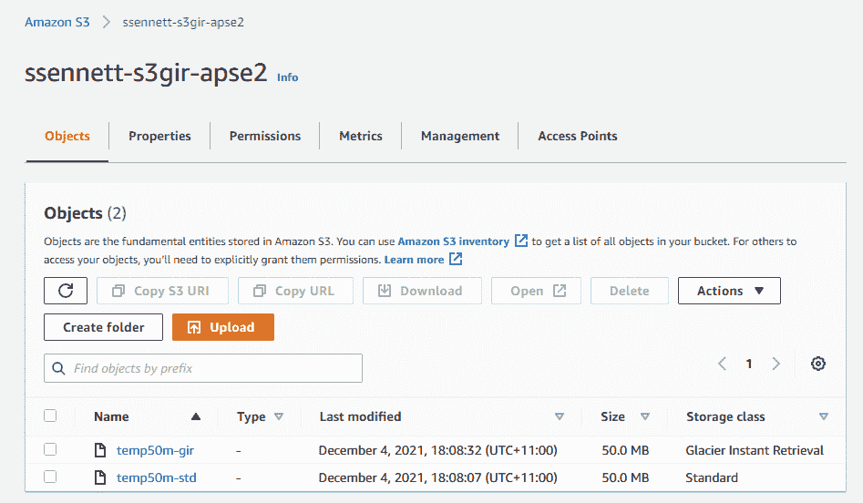
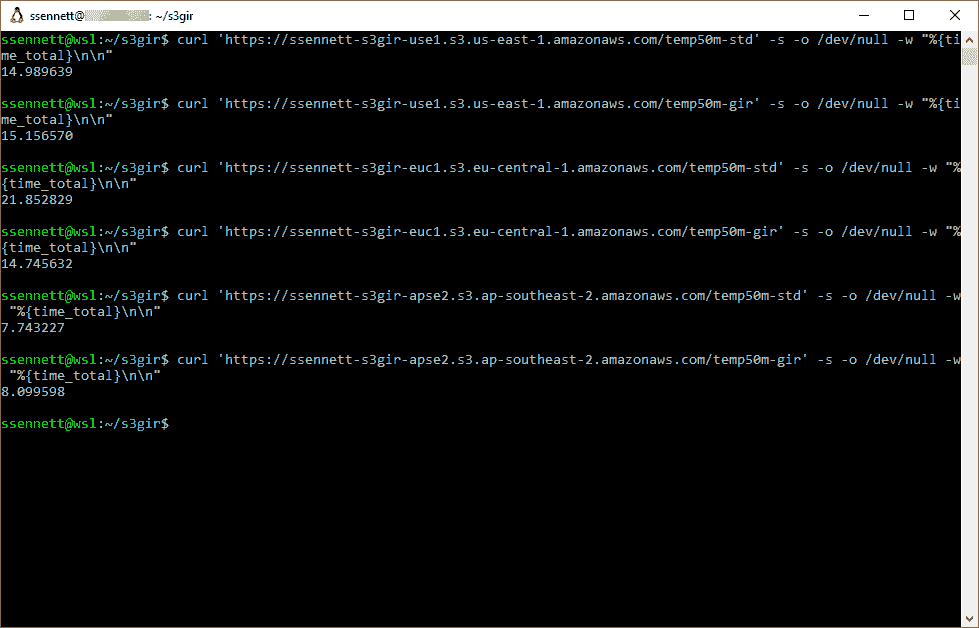
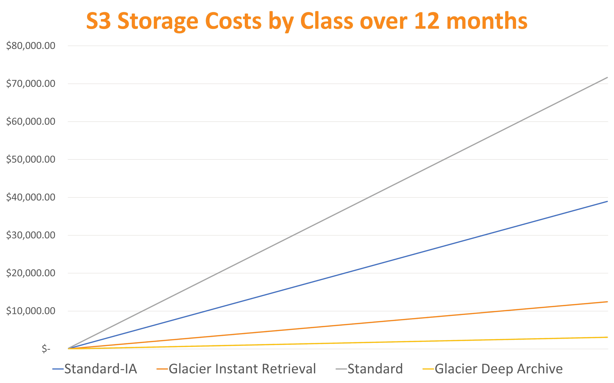
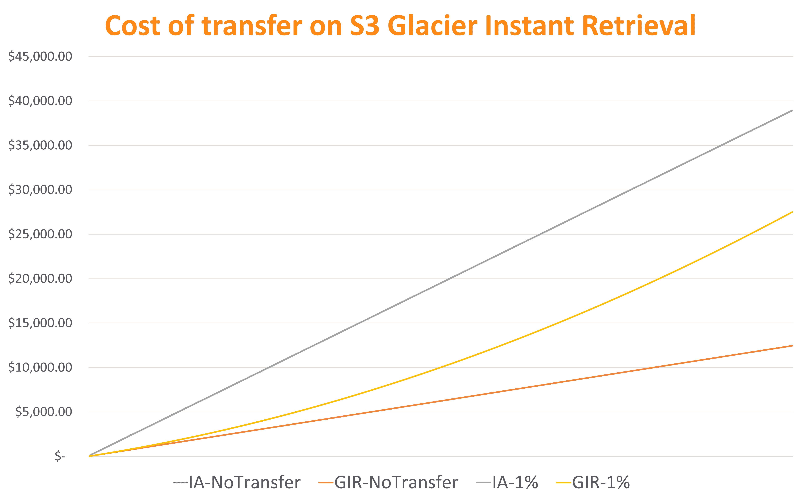
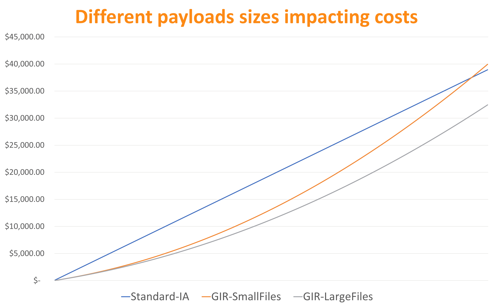
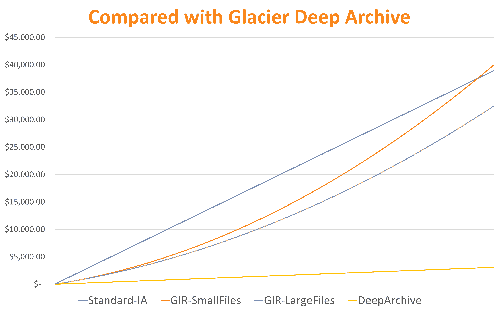
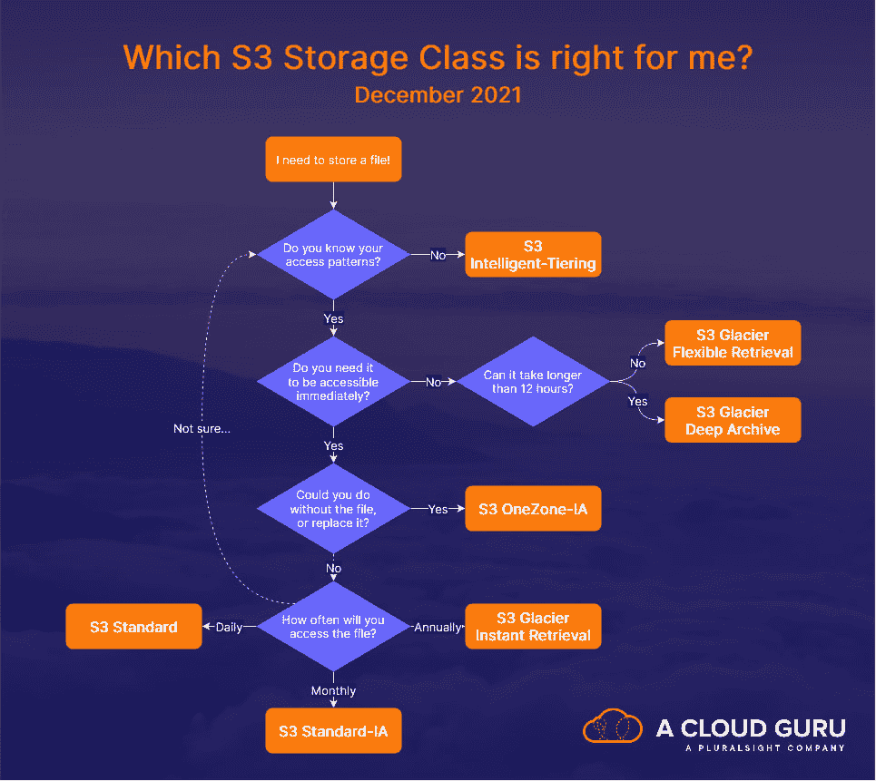

# 哪种 S3 储物类适合您？|云专家

> 原文：<https://acloudguru.com/blog/engineering/s3-glacier-instant-retrieval-deep-dive-which-s3-storage-class-is-right-for-me>

在本帖中，我们将接触 S3 冰川即时检索，看看这个新的 AWS 存储类能帮你节省多少。此外，我们还提供信息图，帮助您确定哪种 S3 存储产品最适合您的需求。

AWS re:Invent 2021 带来了一大堆消息，但其中一个很容易被错过的是[新的亚马逊 S3 冰川即时检索存储类](https://aws.amazon.com/blogs/aws/amazon-s3-glacier-is-the-best-place-to-archive-your-data-introducing-the-s3-glacier-instant-retrieval-storage-class/)。

### 其他 AWS re:Invent 2021 亮点

* * *

## 加速您的职业发展

[从 ACG 开始](https://acloudguru.com/pricing)通过 AWS、Microsoft Azure、Google Cloud 等领域的课程和实际动手实验室改变你的职业生涯。

* * *

“我们现在不需要它，可能几年后也不会需要。但是当我们需要它的时候，我们会需要它*现在*是存储的一个常见用户故事。

多年来，AWS 为我们提供了许多选择，尤其是 S3，但对即时访问的需求使冰川及其低成本成为许多公司无法企及的。

S3 冰川即时检索旨在为您提供两全其美的解决方案，即低成本和同步即时访问。但是，这是适合您的 S3 存储课程吗？

## 试驾 S3 冰川即时检索

首先，让我们看看 S3 冰川即时检索到底有多“即时”。

我们将首先在全球几个不同的地区创建一些新的 S3 存储桶，移除它们的公共访问阻止，并确认它们已准备就绪:

现在让我们制作一个随机文件，并向每个桶上传两个版本；一个使用 S3 标准，一个使用新的 S3 冰川即时检索，同时将文件的 ACL 设置为 Public。

有趣的是，`aws s3 cp`并不支持新的存储类；只有`aws s3api put-object`做到了；不确定是疏忽还是故意。如果`put-object`对你不起作用，你可能需要更新你的 AWS 命令行界面。

由于我们正在处理一项新功能，让我们在 AWS 控制台中仔细检查一下，以确保新的存储类按预期应用:

现在我们已经将文件放入桶中，让我们使用`curl`将它们拉回来，并获得每次传输的总响应时间。

好的，看起来不错！由于我到不同地区的距离和正常(澳大利亚)互联网的可变性，一些结果有点不同，但它们都在同一范围内。

关于为什么 ap-southeast-2 特别快，这是由于我在澳大利亚的位置，这使我尽可能地靠近这个地区(至少在明年 [AWS 推出墨尔本地区](https://www.allthingsdistributed.com/2020/12/aws-announces-second-australia-region.html)之前)。

## 利用 S3 冰川即时检索节省成本

使用 S3 冰川即时检索是否省钱取决于你打算如何使用它。

让我们做一些成本建模(哦，令人兴奋！)完全基于存储和检索成本，看看看起来如何。无论存储类别如何，数据传输等其他成本都是相同的。我们将使用截至 2021 年 12 月美国东部 1 区的 [S3 价格](https://aws.amazon.com/s3/pricing/?nc=sn&loc=4)。

首先，让我们纯粹看一下存储成本，看看零数据传输是什么样子。我们将与其他一些 [S3 存储类别](https://aws.amazon.com/s3/storage-classes/)进行比较:S3 标准、S3 标准-IA 和 S3 冰川深层档案，以供参考:

不出所料，Deep Archive 仍然是最便宜的，而 Standard 是最贵的。但 Standard-IA 和 Glacier Instant Retrieval 之间的差异相当显著，成本降低了 68%，正如[官方公告宣称的](https://aws.amazon.com/about-aws/whats-new/2021/11/amazon-s3-glacier-instant-retrieval-storage-class/)。

但魔鬼在细节，这里的细节是检索成本。

让我们看一下，如果我们在一年中只检索 100TB 的 1%(分为每天 2，875 个 1MB 文件),比较 Standard-IA 和 Glacier 即时存取检索，会是什么情况:

信不信由你，即使在一年的时间里从我们的桶中取出 1TB 也不会改变 Standard-IA 那么多(事实上只有 0.03%)。另一方面，冰川即时存取检索显示了显著的差异(54.7%)。

Glacier Instant Retrieval 的检索成本比 Standard-IA 贵得多，特别是因为它是为存档目的而设计的。事实上，每 GB 的检索成本是这个价格的三倍，而 GET 请求要贵出惊人的 10 倍。

但即使在这里，下载量这么大，我们还是比 Standard-IA 便宜 30%！这是不容忽视的。

您正在检索的文件类型也很重要。在我们的上一个场景中，我们每天使用 5250 个 1MB 的文件；普通文档或 PDF 的大小。但是在另一种情况下，我们假设每天有 5 个 1GB 大小的文件；中等媒体项目的规模。在我们的 100TB 存储桶中，这两项合计约为每年 1.8TB。

我们将这两个与 Standard-IA 进行比较:

相比之下，Glacier Instant 的检索成本随着大文件数量的减少而增加。对于这里相同的总传输大小，有近 20%的差异。我们还可以看到 Glacier 即时访问实际上变得比标准的非频繁访问更加昂贵。

再次:S3 冰川即时检索是一个**档案**；文件不应该用于访问，但需要在需要时快速可用。当物品保持原样时，我们的成本节约是惊人的。

与此同时，S3 冰川深层档案馆继续保持其一贯的惊人的便宜，只要你能承受检索的延迟，比任何其他解决方案都便宜 90%以上。

我们应得的英雄。

## 我的用例呢？

这是最古老的规则:**了解你的业务需求**。

如果您有出于业务原因需要保留的对象，并且绝对需要立即访问，S3 冰川即时检索可以完全满足您的需求。

如果它可以等待甚至几分钟，S3 冰川灵活检索(以前只是 S3 冰川)可以继续为您节省堆，甚至更多，如果几个小时或几天是一个选项，在那里你可以使用 S3 冰川深度档案。

但是，有时我们不知道实际的业务需求是什么，因为业务可能不知道。对于这些情况，我们有 S3 智能分层

## S3 智能分层

AWS 可能比你更了解你的数据使用模式。我们可以利用这一点，通过 [S3 智能分层](https://aws.amazon.com/s3/storage-classes/intelligent-tiering/)让我们的生活变得更加轻松。

这不是新功能，我就不深究了。但在这种情况下，当我们试图找到使用不同存储类别(如 Standard-IA 或 Glacier Instant Retrieval)之间的界限时，我们可以让 AWS 为我们管理这一点。

如果您不太确定您的数据是否属于 Glacier 即时检索，智能分层可以让您不再头疼。虽然您确实为这种便利支付了少量费用(每 1，000 个对象 0.0025 美元)，但这很容易被将文件放在最佳存储类别中所节省的成本抵消。

## 信息图:哪个 S3 存储班适合我？

毫无疑问，S3 冰川即时检索可以并将为许多企业节省大量资金。这确实给使用哪些存储类的问题增加了一些新的复杂性。因此，这里有一个方便的信息图表来帮助指导这一过程。(编辑:感谢推特上的詹姆斯·瓦桑森指出原文中的一个错误！)

阻碍 S3 冰川的一个因素是对异步请求的恐惧，以及这对我们的应用程序意味着什么。S3 冰川即时检索使用与 S3 标准和标准 IA 相同的同步 API，无需应用程序重构。

对于合规案例，这是显而易见的。但是，对于拥有数 TB 数据的组织来说，这也是非常好的选择，因为他们相信人们不会访问这些数据，但是企业宣称“任何东西都必须随时可以访问”，同时比使用 Standard-IA 节省更多成本。

这是一个很好解决的问题。

* * *

## 保持在云的顶端

*在 [Twitter 上关注 ACG](https://twitter.com/acloudguru)和[脸书](https://www.facebook.com/acloudguru)，在[YouTube 上订阅一个云专家](https://www.youtube.com/c/AcloudGuru/?sub_confirmation=1)来获取你能处理的所有云更新！此外，加入我们令人敬畏的 [Discord 社区](https://discord.com/invite/acloudguru)，与训练有素的架构师和其他志同道合的阴云密布的人进行数字交流。*