# SageMaker Studio Lab:如何免费体验 ML

> 原文：<https://acloudguru.com/blog/engineering/sagemaker-studio-lab-how-to-experiment-with-ml-for-free>

在本帖中，我们将讨论如何使用亚马逊 SageMaker Studio 实验室免费开始机器学习。

从 [AWS re:Invent 2021](https://acloudguru.com/blog/tag/reinvent2021) 出来，我们看到了对 [AWS 的推动，使机器学习变得可访问和包容](https://acloudguru.com/blog/engineering/aws-pushes-to-make-machine-learning-accessible-inclusive)。宣布了亚马逊 SageMaker 的扩展，[亚马逊 SageMaker 工作室实验室](https://aws.amazon.com/about-aws/whats-new/2021/12/amazon-sagemaker-studio-lab-no-configuration-ml-service/)(目前在预览中)。

SageMaker Studio Lab 是一项免费的机器学习服务，允许您快速旋转 Jupyter 笔记本电脑，并且不需要复杂的配置即可开始。该服务的目标受众是希望学习和尝试机器学习的开发人员、学生和数据科学家。我喜欢 SageMaker Studio 实验室帐户与 AWS 帐户分开，只需要一封电子邮件就可以创建，不需要信用卡！

如果你是机器学习的新手，这项免费服务是一个很好的入门方式。

## 申请实验室账户

要[申请免费的 SageMaker Studio 实验室账户](https://studiolab.sagemaker.aws/requestAccount)，你需要输入一个有效的电子邮件地址。有一个等待用户体验该服务的名单，目前仍在预览中。一旦有了访问权限，您就可以启动项目的运行时并打开一个基于 JupyterLab 的笔记本。

## 实验室帐户的组成部分

SageMaker Studio Lab 为您提供了一个单个项目，该项目具有至少 15 GB 的持久存储、CPU (T3.xlarge)和 GPU (G4dn.xlarge)运行时、企业安全性和基于 JupyterLab 的用户界面。当我选择计算类型并开始会话时，我的会话时间限制为 12 小时。

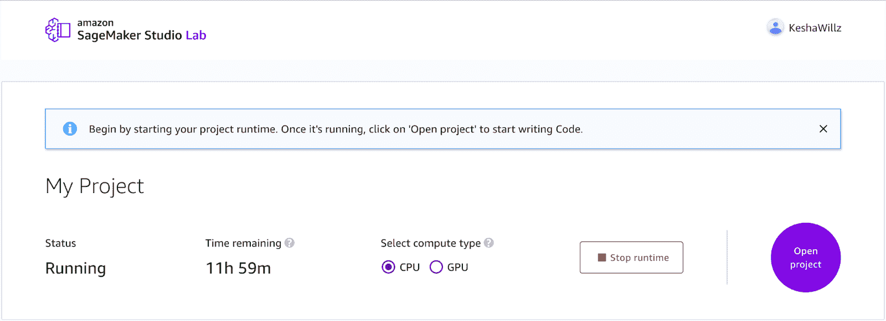

CPU 最适合通用计算任务，而 GPU 最适合专门优化在 GPU 上运行的机器学习算法。通过进一步的研究，我了解到 CPU 运行时间被限制在 12 小时，而 GPU 运行时间被限制在 4 小时。一旦剩余时间达到零，您将不得不再次重新启动项目运行时，但是您的所有文件(包括笔记本)都将保存到永久存储中。

## 训练机器学习模型

运行时只需要几分钟就可以启动，打开项目后，您会看到一个包含有用信息的入门屏幕。如果你是机器学习的新手，我建议你完整阅读入门页面。

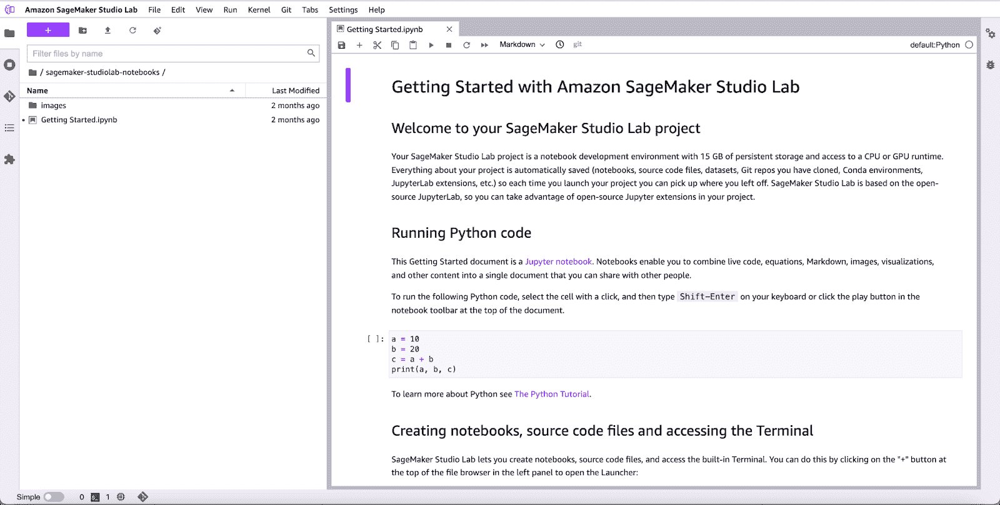

当我探索这个接口时，我很高兴看到与 Git 的集成，它允许我访问本地存储库、初始化存储库或克隆现有的存储库。

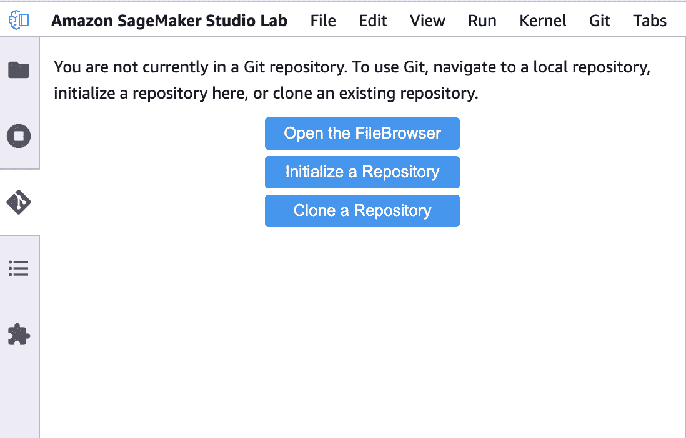

对于这个例子，我创建了一个空的笔记本，而不是克隆现有的代码。

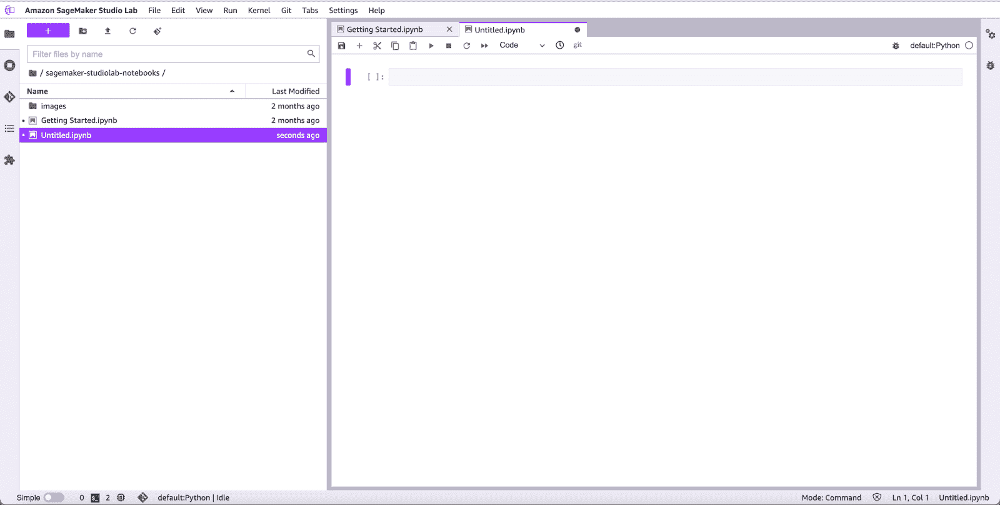

正如您所料，SageMaker Studio 实验室与常见的数据科学和机器学习库一起工作。我安装了[熊猫](https://pandas.pydata.org/)和 [Scikit-learn](https://scikit-learn.org/stable/index.html) ，然后将它们导入到我的项目中。

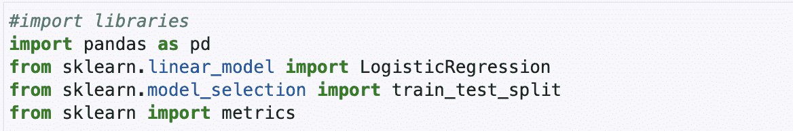

*   Pandas 是 Python 编程语言的数据分析和操作库。
*   Scikit-learn 是一个 Python 编程语言的机器学习库。该库易于使用且健壮，因为它具有各种分类、回归和聚类学习算法。
*   **LogisticRegression** 是 Scikit-learn 中的一个类，它允许您将逻辑回归应用于二元分类问题，从而得出是(即 1)或否(即 0)的预测。

现在，我准备开始写 Python 代码来训练一个定制的机器学习模型。加载训练模型所需的数据有几个选项。对于这个简单的例子，我从本地机器上传了 CSV 格式的预先存在的犯罪数据。

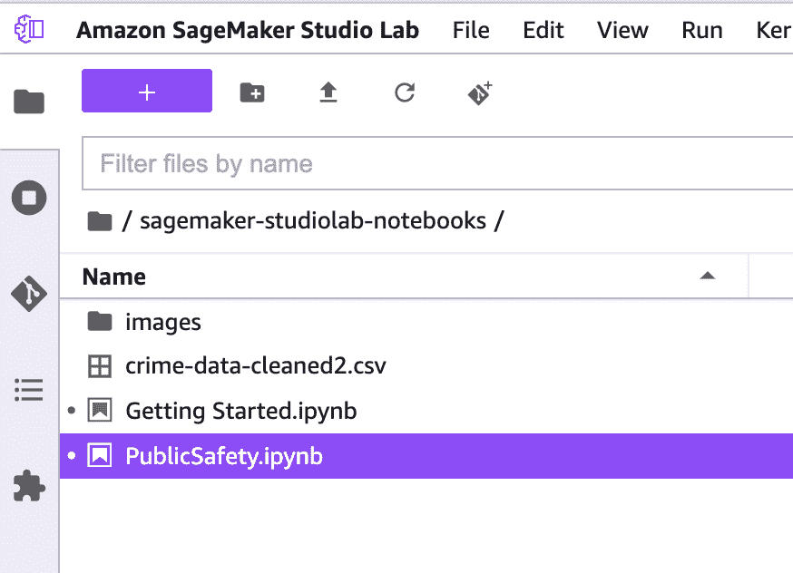

犯罪数据(crime-data-cleaned2.csv)由经过清理和预处理的[来自英国](https://data.police.uk/data/)的街道级拦截和搜索犯罪数据组成。数据集中的每一行代表一个停车和搜索记录，在每个记录中，一列(即 CommittedCrime)标识该停车是否导致逮捕。该数据集经过预处理，并以一种机器可以轻松找到趋势和模式的格式放置。

接下来，我定义列标题，因为 CSV 文件中没有提供它们。然后，我使用 read_csv()将 CSV 文件读入 Pandas [数据帧](https://pandas.pydata.org/docs/reference/api/pandas.DataFrame.html)。

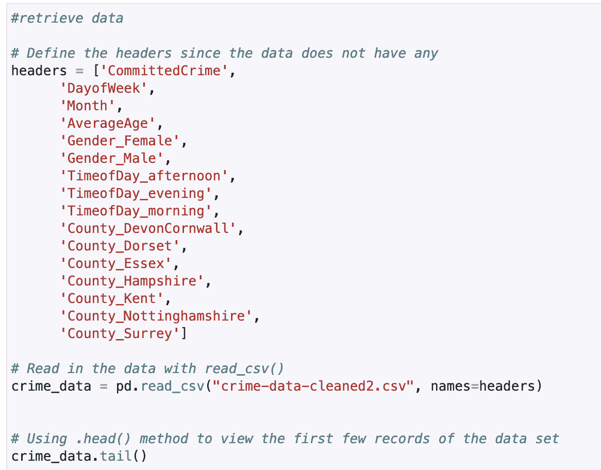

接下来，我检查 CommittedCrime 列上的类分布，这表明一次停车是否导致了一次逮捕，以确保我的数据集是平衡的。在 49.79%和 50.21%，我的数据集很平衡。

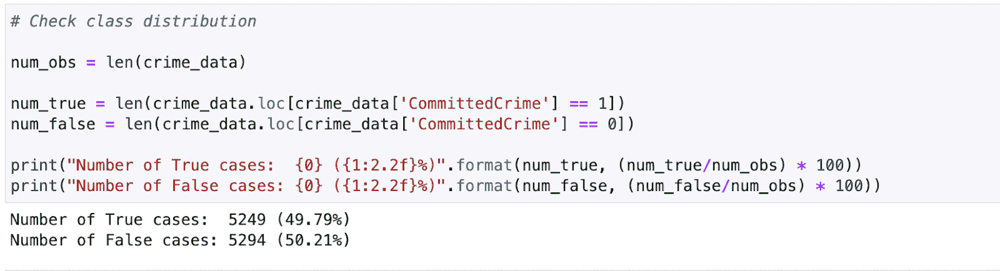

接下来，我使用 Scikit-learn 的 train_test_split()函数将数据分成 70%用于训练，30%用于处理。

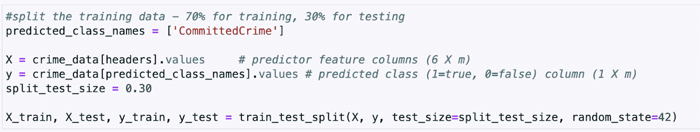

我确认拆分成功。

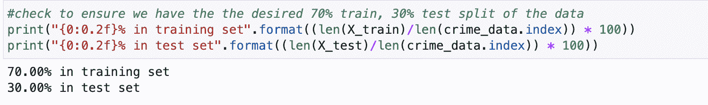

然后，我创建逻辑回归对象，并使用 fit()训练模型。

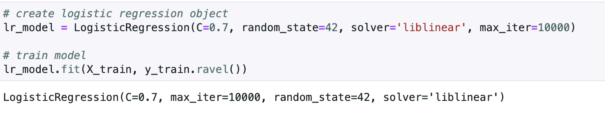

现在我有了一个训练好的预测犯罪的模型，我可以评估它的性能，并将其用于任何需要预测犯罪的应用程序。

## 下一步是什么

当你准备好了，你可以将你的 SageMaker Studio 实验室项目转移到 SageMaker Studio，以利用亚马逊 SageMaker 的附加功能。你需要有一个 AWS 帐户，并设置 SageMaker 工作室。参见 SageMaker 工作室实验室[文档](https://docs.aws.amazon.com/sagemaker/latest/dg/studio-lab-use-migrate.html)获取分步说明。

## 我的想法

总的来说，我对 SageMaker Studio 实验室打开的大门感到非常兴奋。它是完全免费的，不需要提供账单和信用卡信息，这是一个巨大的胜利。此外，它是一项独立的服务，不依赖于 AWS 帐户。作为之前与亚马逊 SageMaker 合作过的人，我发现使用 SageMaker Studio Lab 训练模型很容易。

如果你一直对机器学习很好奇，现在就是你开始的机会。

#### 关于作者

[*凯莎·威廉姆斯*](https://twitter.com/keshawillz) *是一位屡获殊荣的技术领导者。她还是 AWS 机器学习英雄、AWS 合作伙伴大使和 Alexa 冠军。*