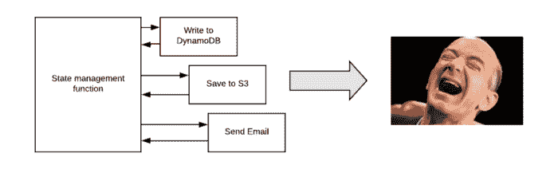
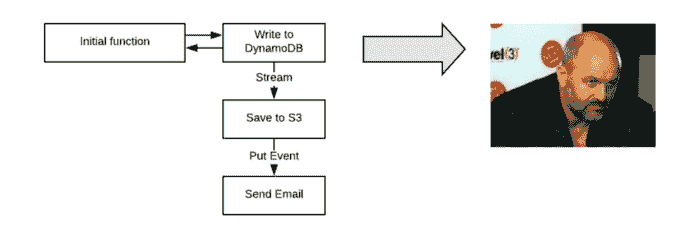
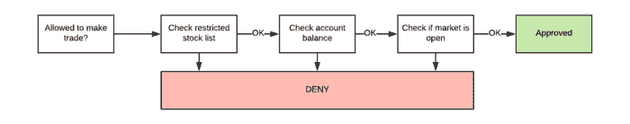

# 使用 async  AWS Lambda 节省时间和资金

> 原文：<https://acloudguru.com/blog/engineering/save-time-and-money-with-aws-lambda-using-asynchronous-programming>

当你以 100 毫秒为增量支付计算费用，而数百万次调用只需要几分钱时，过分担心 Lambda 函数的执行长度就有点过头了。直到它不是。

收紧你的 Lambda 账单的最简单方法之一是*而不是*为等待买单——这意味着拥抱 async。花钱买闲不好。

使用“旧世界”电脑的后遗症导致了一些“沉没成本”的想法——如果任务无所事事也没关系，因为 CPU 反正是不活动的。

但是在无服务器的情况下，时间是操作成本中最大的因素，所以你必须以稍微不同的方式来看待你的流程。

无服务器社区中的许多人警告 Lambda 中的异步操作是有道理的——但他们主要是警告开发人员已经从旧世界转移到新世界的单片函数。

常见的情况是，某种状态管理或控制器函数调用一系列其他函数，让调用函数无所事事:

This makes Jeff Bezos rich…er.

在 Node 中，自从 async/await 的出现使得将异步代码转换成顺序操作变得轻而易举以来，这种情况变得更加普遍。用这种方法，你要付两次钱——一次是每个“步骤”功能，另一次是等待和控制功能。对于不常使用的函数来说，这没什么大不了的，但是根据我的经验，这是一种糟糕的做法，原因有二:

1.  在现实世界中，这些控制器函数调用其他控制器函数，而其他控制器函数又调用其他嵌套的控制器函数，因此您可能会有*多个*函数都在等待返回值，所有这些函数都在同时运行，并记入您的 AWS 账单。
2.  当任何事情有意义地扩大时，它变得更加明显，人们开始声称 Lambda 并不像他们想象的那么便宜。

这种方法有两种替代方案。第一种是通过使用它们所等待的本机 AWS 服务中的事件来分解这些步骤。写入 DynamoDB 记录后，使用 stream 事件启动 S3 任务，然后使用 S3 中的 ObjectCreated 事件启动发送电子邮件的 Lambda。

在这个版本中，你不用为 DynamoDB 或 S3 完成它们的工作所花费的时间付费:

Werner would like this approach to serverless engineering

开发者开始意识到我们这些无服务器的孩子是在从事编写胶水的工作，但是这种设计仍然不常见。这部分是因为回到无服务器之前的“旧世界”，让三个独立的应用程序做如此琐碎的事情是一种讽刺，尤其是当我们已经为 CPU 付费的时候。但是当我们为时间付费时，运行更多的功能并不是我们的问题。它的可扩展性也更强。

第二种选择是 [AWS 步骤函数](https://acloudguru.com/blog/engineering/processing-an-arbitrary-number-of-jobs-with-aws-step-functions)，它选择状态管理或控制器任务的角色。这是一个非常好的服务，可以解决整个问题，你应该用它做任何事情——除了它非常昂贵。虽然每 1，000 次状态转换 0.025 美元听起来不多，但如果您有更复杂的工作流，它会很快增加。

Step 函数对于像订单管理这样的长期工作流来说非常棒，但是对于管理一些短期的步骤来在 AWS 中移动数据来说，通常是多余的。实际上，费用让我敬而远之，但是当他们提供免费服务的时候(#awswishlist！)，无服务器状态管理将变得轻而易举。

### 良好的异步:事件源中有多条记录

当 Lambda 给你一个事件源时，你通常会得到一个事件记录，但并不总是这样。如果对记录进行顺序迭代，这会对 Lambda 函数的持续时间产生惊人的影响。

幸运的是，在 Node 中并行处理这些记录并不重要。在本例中，我们的 processRecord 函数将计时器设置为 1 秒，测试事件中有 3 条记录，但总的执行时间只有 1048 毫秒，而不是 3000 毫秒:

为什么？processRecord 函数(几乎)同时为每个记录和 Promise.all 调用，等待所有承诺被解析，有效地允许您并行运行所有请求。在实践中，你必须对被拒绝的承诺做出解释。

当然，在某些情况下，您可能无法并行运行这些程序，但是如果可以的话，这样可以节省大量时间。好的异步创建了 win，而 Promise.all / Records.map 方法是这个问题的简单答案。

查看这篇文章，了解如何[配置 Lambda 函数来扩展负载测试操作](https://acloudguru.com/blog/engineering/serverless-browser-automation-with-aws-lambda-and-puppeteer)，使其成为管理实例群的一种经济有效的替代方法。

### 良好的异步:多个并发任务

如果您的函数在执行前必须检查许多事情，那么值得看看是否有任何事情可以并发运行，或者您的代码是否按预期运行。例如，我的交易功能 allowedToTrade 检查受限股票列表、用户的账户余额，如果市场开放，则在批准或拒绝之前:

My code looks like this:

我执行我的交易……错过了市场。在这个函数中，它一次按顺序执行一个检查，这样可以快得多。每项任务都是独立的，并且可以并发执行，因此稍作更改，它就会运行得更快:

### 针对时间进行优化

*   在无服务器中，时间就是金钱——我们应该优化使用的时间，而不是创建的函数的数量。目标是避免等待，避免 Lambda 无所事事时付费。
*   NodeJS 中的 Async 很简单——只需几行节点就可以从流程图转移到代码，async/await 关键字消除了回调问题。
*   错误的异步创建等待 AWS 服务执行某些操作的控制器函数。当你在 AWS 上等待的时候，你可以经常使用事件或者步骤函数来找到一个更好(也更便宜)的方法。
*   好的异步可以通过在有意义的地方并行执行来大大缩短执行时间。常见的例子包括多个事件记录和多个并发任务。

* * *

## 获得更好职业所需的技能。

掌握现代技术技能，获得认证，提升您的职业生涯。无论您是新手还是经验丰富的专业人士，您都可以通过实践来学习，并在 ACG 的帮助下推进您的云计算职业生涯。

* * *