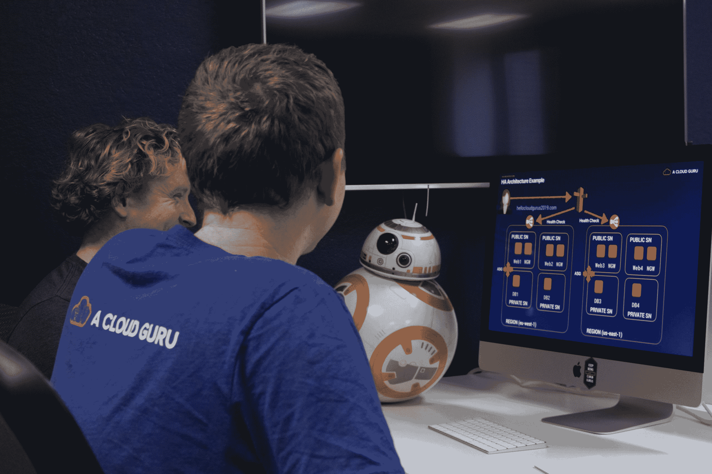

# 我们正通过新的投资|一位云专家开始下一阶段的增长

> 原文：<https://acloudguru.com/blog/news/series-b-funding>

你好，云大师！我们很高兴地宣布，我们刚刚完成了一轮 3300 万美元的投资，为我们提供了大量的资源来壮大我们的团队，扩展我们的课程库，并开发一些伟大的新功能。

就在短短几年前，我们还是一个单一的课程，现在我们已经发展成为一个成熟的云学习平台，课程涵盖多个云平台、服务和学科。

为此我们要感谢你。

> 如果没有社区的大力支持，我们就不会有今天的成就。迄今为止，已有超过 850，000 名工程师参加了我们的课程，我们云专家向你们每一个人致以最深切、最衷心的感谢。我们非常谦卑。

那么，这种新的投资资金对你来说意味着什么呢？

更多课程、实验和视频。我们的内容团队已经在全力为多个公共云提供商制作新课程，包括 AWS、Microsoft Azure 和 Google Cloud。有了额外的资金，我们将扩大我们的团队，进而扩大我们的课程库，以涵盖更多的云服务和新兴主题领域。敬请期待！

更多新东西——更快。随着我们的团队不断壮大，教师、工程师、制作人、开发人员、设计人员等不断增加，我们将有能力同时制作更多引人入胜的课程，因此您可以期待我们的发布会变得更加频繁和详尽。更多云好给你，更经常！

**更多功能帮助您掌握云计算。**在过去的一年里，我们推出了许多功能，以便在您学习云计算时更好地帮助您。我们最新发布的 ACG 学习路径揭开了决定掌握哪些云技能的神秘面纱，并为您提供了一个指导课程，带您从初学者到六个不同专业领域的专家。您可以期待更多精彩的功能即将推出，我们将确保在它们推出时通知您，以便您可以充分利用它们。

**面向企业客户的更深入的人才管理工具。**对于我们的企业客户，我们计划继续扩展我们的管理和开发功能，以帮助您更好地支持团队培训，并加快您采用云的速度。

再次感谢你们所有人，感谢你们在这个奇妙的旅程中支持我们。你们所有人是我们做我们所做的事情的原因，也是我们走到今天的原因。

继续牛逼吧，云大师们！

