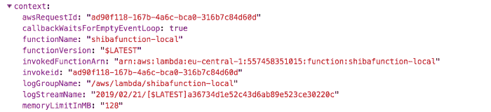

# 无服务器功能和应用基础

> 原文：<https://acloudguru.com/blog/engineering/serverless-functions-in-depth>

在本教程中，您将学习无服务器功能和无服务器应用程序的基础。虽然本教程主要针对不熟悉无服务器领域的前端开发人员，但对于那些希望了解更多关于无服务器功能的人来说，这是一个很好的深度学习。

* * *

在加州大学伯克利分校最近发表的一篇名为“*简化的云编程:关于无服务器计算的伯克利观点*的文章中，做出了这样的预测:

> **“无服务器计算将成为云时代的默认计算模式，在很大程度上取代有服务器计算，从而结束客户端-服务器时代。”**

无服务器[是云中所有服务中增长最快的](https://www.cbinsights.com/research/16-enterprise-it-trends-2019/)。无服务器计算产业[预计将在 2021 年增长到 77 亿美元](https://www.cbinsights.com/research/serverless-startups-to-watch-expert-intelligence/)，而 2016 年为 19 亿美元。

### 无服务器应用程序

那么什么是无服务器应用程序呢？这是我的定义:

无服务器应用运行在无状态计算容器中，这些容器是事件驱动的、短暂的(作为服务的功能，可能持续一次调用)，并且完全由您选择的云提供商管理。这些应用程序无缝扩展，不需要任何服务器操作。

这个想法是你以函数的形式编写你的应用程序代码。当您部署您的功能时，您需要一种方法以事件的形式调用它。

如果从客户端应用程序调用代码，该事件可能来自某种类型的 API 网关(http 请求)，来自另一个无服务器功能的*事件，或者来自另一个云服务的事件(例如在上传某些内容后来自亚马逊 S3)。*

您的云提供商代表您执行功能代码。云提供商还负责供应和管理服务器，以便在调用时运行代码。

### 前端开发人员面临的无服务器挑战

对于许多刚接触云计算的[前端开发人员&开发人员](https://acloudguru.com/blog/engineering/why-do-you-care-so-much-about-your-backend-when-your-customers-dont)来说，问题在于用户界面&开始使用这种类型的架构的过程并不像它可能的那样简单明了&工具超出了我们习惯使用的领域。

在云提供商的基础上构建了许多抽象概念来简化这一过程——例如，无服务器框架、Terraform 和无服务器应用模型(SAM)等提供了框架和工具来简化这些资源的供应和部署。

虽然很多时候你仍然需要理解基本的术语&行话来开始使用这些工具。

[Amplify 框架](https://aws-amplify.github.io/)提供了一个抽象层，我认为它非常适合从您的前端环境部署&云功能。我觉得这种方法不仅对于前端开发人员来说是完美的，而且与传统的做事方式相比是一个飞跃。

在本教程中，我将使用 Amplify 框架在 AWS 上创建、部署、更新、连接和删除[云函数的整个过程。](https://acloudguru.com/blog/engineering/processing-an-arbitrary-number-of-jobs-with-aws-step-functions)

### 调用函数

部署无服务器功能后，该功能本身需要有一种被调用的方式。同样，调用这些函数有三种主要方式:

1.  通过 HTTP 端点
2.  通过 [aws-sdk](https://docs.aws.amazon.com/AWSJavaScriptSDK/latest/AWS/Lambda.html) (多次来自另一个功能)
3.  来自云中的事件(上传图像时的 S3，在您的数据库中创建项目时，等等..)

我们将从前端应用程序调用该函数，因此我们将通过 HTTP 端点与它进行交互。您通常需要做几件事情来让它与 AWS 一起工作:

1.  创建函数。
2.  在 API 网关中创建 API 端点
3.  配置 API Gateway 将 http 请求转发给函数。

Amplify 框架允许我们用一个命令设置所有这些。**我们开始吧！**

## 入门指南

我们将要部署的函数将是一个从另一个 API 获取[柴犬图片的函数。柴犬 API 没有启用 CORS，所以我们不能直接从浏览器与 API 交互。这种情况的明显例子是在服务器上构建它，所以我们将在一个无服务器的函数中这样做。](https://shibe.online/)

我们要做的第一件事是创建一个客户端应用程序。您可以使用您选择的框架(即 React、Vue、React Native、Angular 等..)对于这个项目。从这个客户端项目中，我们将向我们创建的无服务器应用程序发出请求。

一旦你创建了你将用来测试你的功能的客户端应用程序，进入这个目录&进入下一步。

### 安装和配置 Amplify CLI

我们接下来要做的是安装和配置 Amplify CLI

```
npm install -g @aws-amplify/cli
amplify configure
```

> 如果这是你第一次配置 Amplify &想要了解它是如何工作的，看看这个视频。

一旦安装并配置了 CLI，我们将初始化一个新的 Amplify 项目。这将引导我们完成几个步骤&询问我们希望项目如何建立的问题。

```
amplify init
```

> CLI 应该检测您正在工作的项目的类型&在您选择了应用程序名称、环境名称和 IDE 选项之后，自动填充大多数字段。

`amplify init`命令是 Amplify powered cloud 应用程序的一次性初始化步骤。您为每个项目(JavaScript、iOS 或 Android)运行一次，将您的应用程序与 AWS 后端连接起来。要了解这个命令在幕后做什么，请查看文档。

一旦我们初始化了 Amplify 项目，我们就可以创建第一个 Lambda 函数了。为此，请运行以下命令:

```
amplify add api
? Please select from one of the below mentioned services REST
? Provide a friendly name for your resource to be used as a label for this category in the project shibaapi
? Provide a path (e.g., /items) /pictures
? Choose a Lambda source ❯ Create a new Lambda function
? Provide a friendly name for your resource to be used as a label for this category in the project: shibafunction
? Provide the AWS Lambda function name: shibafunction
? Choose the function template that you want to use: Serverless express function
? Do you want to edit the local lambda function now? n
? Restrict API access n
? Do you want to add another path? n
```

> 刚刚发生了什么？Amplify CLI 提供了两种资源:AWS Lambda 函数&API 网关配置，允许我们通过 HTTP 端点与之交互。在文件夹 **amplify/backend** 中，我们现在应该看到两个新文件夹: **api** & **函数**。

现在，我们可以通过运行 amplify `push`命令在我们的帐户中创建这些资源:

```
amplify push
```

现在我们的 Lambda 函数已经部署好了，并且已经上线了！

## λ函数

Lambda 函数的基础代码是 CLI 为我们创建的，位于**amplify/back end/function/shiba function**。

Lambda 函数通常有一个所谓的[处理程序](https://docs.aws.amazon.com/lambda/latest/dg/nodejs-prog-model-handler.html)函数，负责调用 Lambda 函数。你可以在**shiba function/src/index . js**中看到我们的 handler 函数。如果我们愿意，我们可以直接引用&来使用这个函数，但是在我们的例子中，我们使用的是[无服务器快速框架](https://github.com/awslabs/aws-serverless-express):

```
// amplify/backend/function/shibafunction/src/index.js
const awsServerlessExpress = require('aws-serverless-express');
const app = require('./app');
const server = awsServerlessExpress.createServer(app);
exports.handler = (event, context) => {
  console.log(`EVENT: ${JSON.stringify(event)}`);
  awsServerlessExpress.proxy(server, event, context);
};
```

> 上述代码会将所有请求转发到 **shibafunction/src/app.js** 中定义的路由。

无服务器 express 框架基本上允许我们创建一个 [express 应用程序](https://expressjs.com/),并在 Lambda 函数中完成路由& http 动词，因此我们可以在其中做更多的事情，而不仅仅是一个基本的 JavaScript 函数。

如果你在 **app.js** 中查找，你会看到为我们创建的所有路线。我们来看看**app . get**&**app . post**:

```
// amplify/backend/function/shibafunction/src/app.js
app.get('/pictures', function(req, res) {
  // Add your code here
  res.json({success: 'get call succeed!', url: req.url});
});
app.post('/pictures', function(req, res) {
  // Add your code here
  res.json({success: 'post call succeed!', url: req.url, body: req.body})
});
```

在这些函数中，我们有一个可用的请求和响应(req & res)参数。

请求(`req`)将在所有具有`event`&`context`的操作(`req.apiGateway`)上有一个`apiGateway`属性。

*   `[context](https://docs.aws.amazon.com/lambda/latest/dg/nodejs-prog-model-context.html)`包含关于函数本身的所有元数据。



*   `event`表示导致 lambda 调用的事件或触发器。该事件将包含关于 API 调用的数据&元数据，在我们的例子中，像头、路径、&甚至用户数据，如果 API 受身份验证保护的话。

在 put、post 或 delete 操作中，我们还可以访问 body 对象。主体将包含我们想要发送给 API 的任何数据(我们稍后将研究如何发送主体对象)。

那么我们如何调用这个函数？我们用 Amplify 的 [API 类别来做。它是这样工作的。API 有六种不同类型的操作:](https://aws-amplify.github.io/docs/js/api#using-rest)

*   API.get
*   API.post
*   API.put
*   API.delete
*   API.head
*   API.graphql

> 因为我们使用的是 REST API，所以我们不会使用`[graphql](https://aws-amplify.github.io/docs/js/api#using-aws-appsync)`操作。

要调用一个端点，需要设置`apiName`(必选)、`path`(必选)和`options`(可选)参数，每个方法返回一个承诺:

```
// definition: API.get(apiName, path, options)
// Use this in your client application to interact with the API
import { API } from 'aws-amplify'
API.get('shibaAPI', '/pictures')
  .then(response => console.log({ response }))
  .catch(err => console.log({ err }))
// or
const response = await API.get('shibaAPI', '/pictures')
console.log({ response })
```

如果我们使用 put、post 或 delete，我们也可以在第三个参数中传递主体:

```
const body = { userId: '22' }
API.post('shibaAPI', '/pictures', { body }}
```

如果我们想传递标题:

```
const headers = { username: 'naderdabit' }
API.get('shibaAPI', '/pictures', { headers })
```

或者我们可以两者都通过:

```
const body = { userId: '22' }
const headers = { username: 'naderdabit' }
API.post('shibaAPI', '/pictures', { body, headers }}
```

## 创建我们的自定义 Lambda 函数

现在，让我们更新我们的函数来调用柴犬 API。

我们需要做的第一件事是在我们的函数包中安装 [axios](https://github.com/axios/axios) ,这样我们就可以从它发出 http 请求。导航到**amplify/back end/function/shiba function/src&从命令行安装:**

```
yarn add axios
# or
npm install axios
```

接下来，我们需要在 lambda 函数中打开 app.js。这里，我们将更新 app.post 函数来调用 API

```
// amplify/backend/function/shibafunction/src/app.js
// first require axios at the top of the file
const axios = require('axios')
// next, update the app.post function
app.post('/pictures', async function(req, res) {
  let number = 5
  if (req.body.number) {
    number = req.body.number
  }

  try {
    const response = await axios.get(`http://shibe.online/api/shibes?count=${number}`)
    const data = response.data
    res.json({err: null, success: 'post call succeed!', data })
  } catch (err) {
    res.json({ err: err })
  }
});
```

现在，因为我们已经改变了我们的功能代码，我们需要在我们的后端更新它。这很容易做到，我们只需再次运行`push`命令:

```
amplify push
```

> 这将把后端文件夹中的任何更改更新到 AWS 后端。

现在，我们应该能够从我们的客户端应用程序调用 API 了。让我们从 API 中请求 30 张图片:

```
const shibaData = await API.post('shibaapi', '/pictures', { body: { number: 30 }})
console.log('shibaData:', shibaData)
# or
API.post('shibaapi', '/pictures', { body: { number: 30 }})
  .then(data => console.log('data: ', data))
  .catch(err => console.log('error:', err))
```

## 测试

现在我们已经有了一个可以运行的功能，如果我们想在将它部署到我们的环境之前在本地进行更改和测试，会怎么样呢？嗯，我们很容易做到。Amplify 有一个命令允许我们在本地调用和测试 lambda 函数。

因为我们的功能本质上只是一个 express 应用程序，所以我们可以启动我们的 express 服务器&通过 curl 命令或 Postman 之类的工具向它发出请求。

### 调用函数

让我们调用一个 lambda 函数，在我们的例子中它将启动 express 服务器。

**设置端口** 如果您正在运行 React 应用程序，默认端口被设置为 3000，这与 express 应用程序将要运行的默认端口相同。如果您想指定不同的端口，您可以在文件底部的 **app.js 中进行更改:**

```
// shibafunction/src/app.js
app.listen(3001, function() {
  console.log("App started")
});
```

现在，让我们调用这个函数:

```
amplify function invoke shibafunction
```

*   ？提供包含您的处理函数的脚本文件的名称: **index.js**
*   ？提供要调用的处理函数的名称:**处理函数**

这将启动 express 服务器。我们可以发出 curl 请求，或者使用类似 Postman 的东西来发出请求:

### **获取请求**

```
curl ‘localhost:3000/pictures’
```

### 发布请求:

```
curl ‘localhost:3000/pictures’ -X POST
```

### **发布请求，正文:**

```
curl ‘localhost:3000/pictures’ -X POST \
-d ‘{ “number”: 7 }’ -H “Content-Type: application/json”
```

## 更新 API

如果我们想改变我们的 API，比如添加额外的路由或添加身份验证，该怎么办？为此，您可以从 CLI 运行`update`命令:

```
amplify update api
```

这将引导您完成更新 API 的几个步骤。如果您想要添加或更改路由，您需要在将新路由添加到您的 **<函数 name > /src/app.js** 之前，首先使用该命令更新配置。文件将工作。

## 多重环境

如果您想通过创建一个新功能进行试验&在不影响您当前环境的情况下进行测试，该怎么办？

您可以克隆您当前的环境，这将部署全新的沙盒资源，允许您测试、部署和删除新功能，而不会影响您的主环境。

要了解更多关于如何设置多个环境的信息，请查看这里的文档。

## 删除功能

现在我们已经启动并运行了我们的应用程序，当我们想要删除我们的函数时会发生什么呢？我们可以使用 amplify CLI 来做到这一点。

### 删除函数& api

```
amplify remove api
amplify remove function
amplify push
```

### 删除整个项目和所有资源

## 结论

无服务器是当今最有趣和发展最快的技术之一。我真的很高兴能在这个领域工作&我觉得不管你为什么平台或云提供商构建，花时间学习这个真的是很好的投资——微软和谷歌也提供他们自己风格的无服务器。

要阅读我关于如何利用无服务器构建全栈应用的想法，请查看我的帖子[无服务器计算时代的全栈开发](https://medium.com/@dabit3/full-stack-development-in-the-era-of-serverless-computing-c1e49bba8580)。

Amplify 还支持许多其他类别，如认证、GraphQL、S3 等等。要了解更多关于这些类别的信息，请点击这里的文档。

* * *

## 获得更好职业所需的技能。

掌握现代技术技能，获得认证，提升您的职业生涯。无论您是新手还是经验丰富的专业人士，您都可以通过实践来学习，并在 ACG 的帮助下推进您的云计算职业生涯。

* * *

*我的名字是* [*纳德达比特*](https://twitter.com/dabit3) *。我在*[*AWS Mobile*](https://aws.amazon.com/mobile/)*工作，负责类似*[*AWS app sync*](https://aws.amazon.com/appsync/)*和*[*AWS Amplify*](https://github.com/aws/aws-amplify)*这样的项目。我也是*[*React Native in Action*](https://www.manning.com/books/react-native-in-action)*&React Native Training*[*React Native Training*](https://medium.com/react-native-training)*&*[*OpenGraphQL*](https://medium.com/open-graphql)*的作者。*