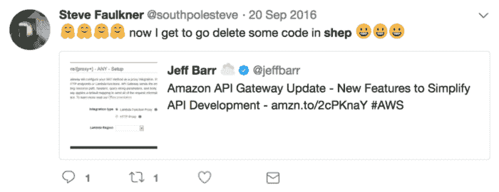

# 无服务器正在吞噬堆栈，人们都吓坏了，他们应该是

> 原文：<https://acloudguru.com/blog/engineering/serverless-is-eating-the-stack-and-people-are-freaking-out-and-they-should-be>

欢迎来到“无服务器超级英雄”！在这里，我与工具制造商、创新者和开发人员聊天，他们正在探索“无服务器”云应用的全新世界。

在本期节目中，我采访了 Steven Faulkner，他是 LinkedIn 的高级软件工程师，也是 T2 business T3 的前工程总监。为了清晰起见，以下采访经过了编辑和压缩。

## AWS Lambda 在容器上加盖了一个大的弃用标志

[**福里斯特布拉萨尔**](https://twitter.com/forrestbrazeal) **:在你之前的公司 business，我听说当你改用无服务器后，你的托管成本降低了大约百分之四十。你能谈谈之前所有的钱都去了哪里，以及你是如何实现这种成本改善的吗？**

史蒂文·福克纳(Steven Faulkner):我认为有 40%落在了那里。最初的结果甚至更好。我们有一项服务，每月花费约 2500 美元，在 Lambda 上降到每月约 500 美元。

Bustle 是一家媒体公司——它有很多内容，有很多病毒式的、峰值流量——所以跟上这些并不总是最容易的事情。我们利用了 EC2 的自动缩放，这很有效……除非它不起作用。但是当我们迁移到 Lambda 时，我们不仅节省了大量资金，还因为 business 的流量基本上是白天的一半，我们看到无服务器解决了所有这些令人头疼的扩展问题。

### 全栈无服务器应用

**另一方面，您是否发现无服务器带来了任何意想不到的成本增加？**

毫无疑问，有些事情成本更高，或者可以更便宜地完成，而不是在无服务器的情况下。当我在 business 的时候，他们正在研究一些关于数据管道的东西，并决定完全不使用无服务器，因为通过 Lambda 太贵了。

最终，尽管托管成本对我们来说是一件有趣的事情，但它很快成为我们转向无服务器的相对非因素。这为我们节省了资金，这很酷，但无服务器的吸引力实际上更多的是我们的团队开发和部署这些应用程序的速度。

在 business，我们只有一个兼职“运营”人员。有了无服务器，这些责任就分散到了我们的团队中，这让我们所有人可以更专注于应用程序，而不是如何部署它。

我们当中任何一个已经从事无服务器工作一段时间的人都知道“NoOps”的承诺听起来可能很棒，但现实是所有系统都需要维护和保养，即使是那些你几乎无法控制的系统。您的团队如何让您的无服务器应用程序在生产环境中平稳运行？

我也不喜欢“NoOps”这个词；这是一个误称，误导了人们。毫无疑问，在无服务器的情况下，我们花时间回答了这个问题:“我们如何知道这个系统内部发生了什么？”

那时 IOPipe 刚刚起步，所以我们是他们的第一批客户之一。我们使用 IOPipe 来获得一些可观察性，然后 CloudWatch 变得更好，亚马逊 X 射线进入了画面，使事情变得更好。从那时起，Bustle 还建立了一系列工具，这些工具可以获取所有的 Lambda 日志和数据，并进行一些转换——稍微擦洗一下——然后将其发送到像 [DataDog](https://www.datadoghq.com/) 或 [Scalyr](https://www.scalyr.com/) 这样的地方进行分析、搜索、度量和报告。

但我不想撒谎，我仍然不认为它超级棒。它达到了可行的程度，我们可以操作，不会觉得我们总是错过实际发生的事情，但还有很大的改进空间。

**另一个常见的无服务器痛点是本地开发和调试。你对此有何反应？**

我写了一个名为 [Shep](https://github.com/bustle/shep) 的框架，business 仍然使用它来部署我们所有的生产应用程序，并且它处理本地开发部分。它允许您在本地开发 NodeJS 应用程序，然后将其部署到 Lambda。它可以在 Lambda 拥有环境变量之前处理环境变量，并对版本控制和使用 webpack 进行捆绑有一定的了解。所有你不想让普通开发人员担心的东西。

我在 business 的头几个月构建了 Shep，从那以后，[无服务器框架](https://serverless.com/framework/)变得越来越好。[山姆](https://github.com/awslabs/serverless-application-model)已经有所好转。整个生态系统都变得平稳了。如果我今天做这件事，我可能不需要写谢普。但在当时，那绝对是我们必须做的。

Amazon API Update with features to simplify API development.

**你发现了无服务器领域的一个有趣的现实，那就是:它发展得如此之快，以至于很容易创建许多很快就会过时的工具和粘合代码。你认为这是真的吗？**

这么说非常公平。几个月前，我在 Twitter 上发了一个帖子，我自己也意识到 Shep 不再是我做部署的方式。当 AWS 发布他们自己的工具时，开始似乎总是很糟糕，所以诱惑是用你自己的工具来填补这些空白。

但亚马逊 AWS 服务反应迅速，变得更好。因此，我认为我学到的经验是尽可能依赖 AWS，或者在 AWS 的基础上构建，并使其可插拔，以便当它变得更好时，您可以恢复到 AWS 工具。

老实说，我并不羡慕那些根据自己开发的工具来瓜分无服务器市场的人。我不认为这是一件长期可持续的事情。

当我与开发人员和系统管理员交谈时，我感觉我遇到了很多关于无服务器概念的愤怒。人们总是想告诉我为什么它永远不会为他们工作的三个原因。为什么你认为这个概念会激发如此多的敌意，你如何试图改变人们对此的看法？

很大一部分原因是我们一次贬低了这么多东西。与容器之类的东西相比，我确实觉得这是一个很大的进步。Kelsey Hightower 曾经说过这样的话:容器使你能够利用现有的范例并将其向前推进，而无服务器是一个全新的范例。

所以所有这些人们已经发明并投入时间、金钱和资源的东西正在消失，这是令人痛苦的。这不会在一夜之间发生，但是任何时候你创造的东西让人们觉得他们花了 10 年做的事情已经过时了，这是很难的。我真的不知道我是否有一个好办法来解决这个问题。

我的无服务器目标是更快地构建东西。我是一名产品开发人员；那是我的背景，那是我喜欢做的事情。我想创造世界上发生的很酷的事情，而无服务器让我比其他方式做得更好更快。因此，当有人来找我说“我很难过，这种旧的做事方式正在消失”，我很难同情。

听起来你在强调，无服务器运动更多的是商业价值，而不是技术。

没错。但是这个世界是一个大帐篷，可以容纳各种各样的东西。我在 Kubernetes 上看到了围绕 [OpenFaaS](https://github.com/openfaas/faas) 和各种服务功能的变化，我对这些东西没有特别的用途，但我可以看到他们这样做的企业，如果它有助于人们过渡到无服务器，那就太好了。

那么，你对无服务器的定义是什么？

我总是开玩笑说“原生云”会是一个更好的无服务器术语，但不幸的是，它已经被使用了。我认为无服务器实际上是关于托管服务的。比如，谁负责拥有我的应用程序所依赖的这个东西是否保持不变？功能即服务只是其中的一小部分。

我的描述是:功能即服务是云粘合剂。所以如果我在做一架模型飞机，胶水是这个过程中必不可少的一部分，但不是最重要的部分。没有人会看着你的飞机模型说:“哇，你用的胶水太神奇了。”关键在于你如何把所有这些部分组合在一起，而 FaaS 做到了。

而且，正如 Joe Emison 指出的那样，你也不仅仅局限于一家云提供商的服务。我是亚马逊 AWS 的 Algolia 的大用户。我喜欢使用 Algolia 与 Firebase，或 Netlify。无服务器就是把这些碎片粘在一起。接下来就要看服务提供商是否真的做好他们的工作了。随着时间的推移，希望供应商做得越来越多。

Serverless stack

我们看到[无服务器思维吃掉了堆栈](https://acloudguru.com/course/building-a-full-stack-serverless-application-on-aws)的所有不同部分。为了加速这一过程，功能即服务确实是一个关键点。下一大块是数据库。明年我们会看到很多创新。 [FaunaDB](https://fauna.com/) 在那个领域做了一些很酷的事情， [CosmosDB](https://azure.microsoft.com/en-us/services/cosmos-db/) 也是如此。我相信 Redis 风格的无服务器产品也缺少一块市场，这种产品甚至可以说出 Redis 命令，但在引擎盖下是自动分布和可扩展的。

**目前寻求采用无服务器的公司面临的合法障碍是什么？**

可能最大的是:你如何处理遗留事物的迁移？在 business，我们最终主要围绕无服务器重新设计我们的整个平台，这是一个选择，但肯定不是每个人都可以使用。但即使在那时，我们第一次推出无服务器服务时，我们关闭了所有的 Redis 实例——因为 Lambda 启动了所有这些容器，我们达到了连接限制，这在普通应用程序中是绝对想不到的。

因此，如果您在某个地方的大型机上有某个东西，它习惯于只有 20 个连接，然后您将一些上游服务转移到 Lambda，突然它有 10，000 个连接，而不是 20 个。你有麻烦了。如果你在过去的四、五年里整体上接受了面向服务的架构，那么你可能会有一个更好的时机，因为你可以说“好吧，所有这些东西都是通过 API 相互通信的，所以我们可以用无服务器的功能来代替单一的服务。”

**您对其他新兴的无服务器堆栈趋势感兴趣吗？**

在这一点上，我们已经用无服务器解决了许多容易解决的问题。就像你如何处理环境变量，或者你将如何构建一个存储库，并使开发人员能够快速编写这些函数，我们开始建立一些非常好的最佳实践。

接下来会发生的是，我们将围绕架构进行更多的迭代。我如何将这四个服务粘合在一起，连接它们的 Lambda 函数看起来如何？我们还没有无服务器的轨道——这并不意味着它实际上是一个 Lambda 函数。也许它允许您在一个文件中编写一组相互通信的函数，然后使用 webpack 之类的东西来拆分这些函数，并以对您的应用程序有意义的方式部署它们。

我们甚至可以在运行时对此做出反应。你可以有一个应用程序，它实际上正在查看代码中发生的事情，并且说:“哇，你的代码的这一部分花了很长时间来运行；我们应该让它拥有自己的 Lambda 功能，我们应该自动部署它，并为您设置 SNS 触发器。”这一切都是不切实际的，但我认为我们离拥有这些工具不远了。

因为说到底，作为一名开发人员，我并不关心 Lambda，对吗？我的意思是，我现在必须关心，因为这是我工作的层，但是如果我可以移动一层，在那里我只是编写业务逻辑，代码得到适当的分割，这是真正的魔法。

* * *

## 获得更好职业所需的技能。

掌握现代技术技能，获得认证，提升您的职业生涯。无论您是新手还是经验丰富的专业人士，您都可以通过实践来学习，并在 ACG 的帮助下推进您的云计算职业生涯。

* * *

*Forrest Brazeal 是 Trek10 的云架构师和无服务器社区倡导者。他编写了无服务器超级英雄系列，并在一位云大师那里绘制了“*[*【FaaS】和愤怒的*](https://info.acloud.guru/faas-and-furious) *”卡通系列。如果你有一个无服务器的故事要讲，请不要犹豫* [*让他知道*](https://forrestbrazeal.com/contact/) *。*