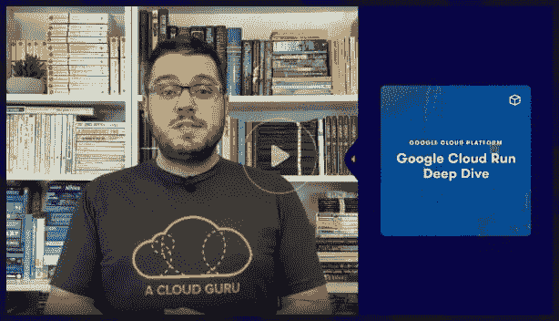

# 容器，满足无服务器:谷歌云运行入门|云专家

> 原文：<https://acloudguru.com/blog/engineering/serverless-meets-containers-with-google-cloud-run>

随着云原生应用程序开发成为标准实践，许多开发人员在看似对立的无服务器和容器范例之间分裂。

[无服务器](https://acloud.guru/learn/94e427e8-ef0a-4d15-9994-75d75da1fa37)解决方案提供了终极抽象，将微服务隔离成可以独立管理和扩展的组件。但是有一个权衡:您的服务必须是事件驱动的，并且您必须符合您的云供应商的无服务器框架。

同时， [container](https://acloud.guru/learn/introduction-to-containers-and-docker) 解决方案为开发人员提供了最大的自由，因为它们可以打包任何运行时、编程语言或框架，同时仍然提供一个独立的工作单元。然而，编排容器以使它们可以投入生产需要大量的工作(除非你的兼职是作为一名 [Kubernetes](https://acloud.guru/learn/kubernetes-deep-dive) 管理员)。

但是如果我告诉你有一种方法可以结合这两种方法呢？

好消息！有。我会告诉你的。现在是[谷歌云运行](https://acloud.guru/learn/67fbd730-5b17-4423-a7a6-89637548af92)。

## Google Cloud Run 是什么？

#### Google Cloud Run 提供了容器的所有好处，在无服务器环境中运行。开始使用云运行再简单不过了。

在谷歌云项目中，你会在菜单的计算部分找到云运行。云运行部署称为服务。要创建一个，只需点击**创建服务**。

你需要给你的服务起一个名字，所以按照传统，让我们从**Hello**(Hello World)开始。

接下来，我们需要选择一种身份验证方法。我们的 Hello World 应用程序将是一个公共的 web 服务，所以我们将选择**允许未经身份验证的调用。**

当我们点击下一个的**时，我们将被要求选择一个容器图像。对于这个演示，点击**选择**并选择演示容器。或者您可以只输入容器图像 URL:**

`gcr.io/cloudrun/hello`

然后点击**创建**，观看神奇的事情发生！云运行服务总是通过 HTTP 端点访问，因此 Google 的全局负载平衡器会自动配置为使用 SSL 保护的 URL 为您的新服务提供服务。几分钟后，您将看到服务 URL。点击链接查看你的 Hello World 应用程序！

如果您对您的服务进行任何更改，您将获得一个新的版本。您可以轻松地回滚到以前的版本，甚至可以在不同版本之间划分流量，以测试新功能。

## **使用容器给你运行任何东西的灵活性**

当然，任何新技术的真正考验是*它会运行毁灭吗*？当然，在这种情况下，由于一个名为 **HTTP-Doom** 的项目，Cloud Run 成功通过了测试。

Cloud Run 需要在 Google Container Registry 中找到它的映像，所以让我们抓取 HTTP-Doom 容器映像，快速重新标记它，并将其推送到我们的项目中。您可以从 GCP 项目中的云 Shell 终端运行这些命令。只需将<project-id>替换为您项目的 ID:</project-id>

`docker pull mattipaksula/http-doom`

`docker tag mattipaksula/http-doom gcr.io/<project-id>/http-doom`

`docker push gcr.io/<project-id>/http-doom`

现在我们*可以*通过我们项目的 UI 来启动我们的毁灭服务，但是当我们都超级酷和像黑客一样的时候，让我们看看从命令行启动它有多容易:

`gcloud run deploy doom --image gcr.io/<project-id>/http-doom`

Cloud Run 会连续问我们三个问题，我们可以用一些默认值覆盖这些问题，但这是一个学习练习！

*   首先，当出现提示时，我们将选择使用完全托管版本的 Cloud Run。Anthos 也有 Cloud Run，但那是另外一篇博客文章——或者一系列文章！
*   接下来，根据提示选择一个区域。随便挑一个离你最近的。
*   最后，当被询问时，输入 **Y** 来允许未经验证的调用。同样，这只是问你是否希望这是一个公共 web 服务的一个很长的方式。

命令完成后，您将获得新的云运行服务的 URL，或者您可以在 GCP 控制台的云运行部分再次找到它。点击链接，你会看到在你的浏览器中呈现的毁灭的超现实主义！当然 FPS 很烂，但这不是重点！

## **具有无服务器优势的容器**

我们现在已经看到了运行容器化的应用程序是多么容易，它具有生产就绪的可伸缩性和负载平衡，而无需启动任何服务器或担心任何复杂的容器编排清单。

我们还获得了真正无服务器解决方案的所有优势。除了能够扩展到成千上万的实例，如果没有人使用我们的服务，它将扩展到零。

对于开发人员来说，云运行是将他们的容器投入生产的最简单、最灵活的方式。我们只是触及了云运行的皮毛。通过使用私有服务、发布/订阅触发器和自定义路由，Cloud Run 成为了微服务架构中的一等公民。

## **深入了解云运行**

和我一起深入了解谷歌云运行。在这 6 小时的课程中，我们将学习如何掌握部署、与其他 GCP 服务集成，以及安全可靠地运行云。您将通过获得实际云运行应用的实践经验，并了解它们如何融入现代云原生堆栈中来学习。

[Get a deep dive in Google Cloud Run from A Cloud Guru.](https://acloud.guru/learn/67fbd730-5b17-4423-a7a6-89637548af92)

下次你想为云构建一个无服务器应用时，你将不再受供应商框架的约束，也不会被 YAML 淹没。云运行是您期待已久的更好、*更棒的*应用部署方式！