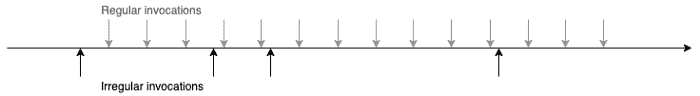
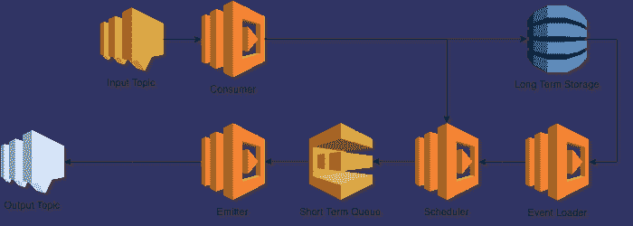
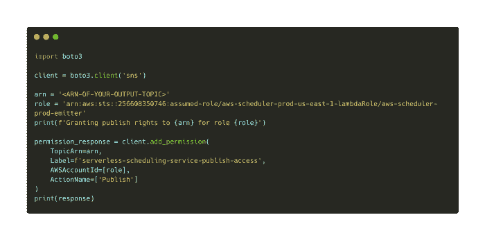
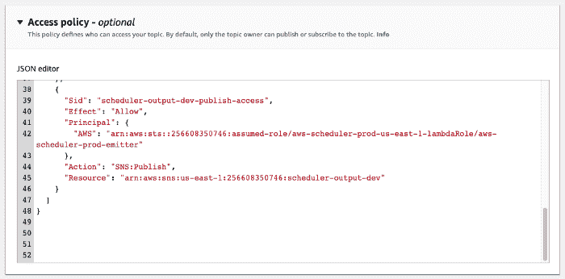
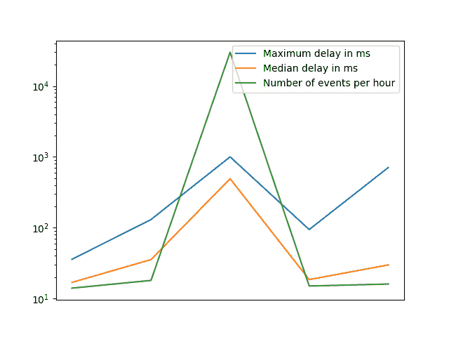

# 无服务器调度程序(SNS) |云专家

> 原文：<https://acloudguru.com/blog/engineering/serverless-scheduler>

该项目允许开发人员快速精确地安排事件，允许大量开放任务，并可扩展

## 亚马逊简单通知服务(SNS)

AWS 提供了许多优秀的服务，但在临时调度方面仍有潜力。我们使用术语临时调度来表示不规则的时间点调用，例如 32 小时一次，4 天一次。

Comparison of regular and irregular invocations

扎克·查尔斯向[展示了几种实现无服务器调度的方法](https://medium.com/@zaccharles/there-is-more-than-one-way-to-schedule-a-task-398b4cdc2a75)，每种方法在成本、准确性或未来时间方面都有各自的缺点。

在[崔琰](https://medium.com/u/d00f1e6b06a2?source=post_page-----23dec8edde06--------------------------------)的[对 step 函数作为一种特别调度机制的分析](https://theburningmonk.com/2019/06/step-functions-as-an-ad-hoc-scheduling-mechanism/)中，他列出了三个主要标准:

1.  **精度**:任务的执行离我的预定时间有多近？越近越好。
2.  **扩展—开放任务的数量**:解决方案是否可以扩展以支持许多开放任务。即已调度但尚未执行的任务。
3.  **扩展—热点:**该解决方案能否扩展到在大约同一时间执行许多任务？例如，数百万人设置了一个计时器来提醒自己观看超级碗，所以所有的计时器都在接近开球时间时启动。

本文展示了我的[无服务器调度器](https://github.com/bahrmichael/aws-scheduler)以及它如何根据这些标准执行。后续文章将进一步研究伸缩性和成本。

## **概述**

该服务的两个输入接口是 SNS 输入主题和输出主题，前者接收要安排的事件，后者由消费帐户托管。

每个输入事件都必须包含一个 SNS 输出主题的 ARN，一旦预定时间到来，有效负载将发布到该主题。

Architecture of the scheduling service

在内部，该服务使用 DynamoDB 表来存储长期事件。预定时间少于 10 分钟的事件被直接放入短期队列。

此队列使用 DelaySeconds 属性让消息在适当的时间变得可见。事件加载器功能基本上是一个 cron 作业。发射器函数最终将事件发布到所需的主题。

## **用途**

调度服务接受一个事件，该事件带有一个字符串负载、一个目标主题、预定的执行时间和一个用户代理。后者主要是识别来电者。

上面的 python 代码发布了一个带有自定义字符串负载的事件。请确保您填写了所有四个字段，否则该活动可能会被取消。更多信息请参见本文末尾的*故障排除*部分。

请注意，我们必须创建自己的 SNS 主题，该主题必须向无服务器调度程序授予发布权限。 [quickstart 项目包含一个脚本](https://github.com/bahrmichael/aws-scheduler-testing#prerequisites)，帮助您创建 SNS 主题。公共无服务器调度器的 AWS 角色是*arn:AWS:STS::256608350746:assumed-role/AWS-scheduler-prod-us-east-1-λrole/AWS-scheduler-prod-emitter*

您也可以手动为您的 SNS 主题分配额外的访问策略。

之后，您需要一个 [lambda 函数，它从您的输出主题中消费](https://docs.aws.amazon.com/en_pv/lambda/latest/dg/with-sns-example.html)事件。

就是这样。您可以使用[快速启动项目](https://github.com/bahrmichael/aws-scheduler-testing#prerequisites)快速安排和接收您的第一个活动。去试试吧！

## **评估**

让我们回到引言中提到的标准:精度、规模和热点。

## 精确度

精确可能是最重要的。没有多少用例能够容忍事件迟到几分钟到几小时。然而，亚秒级的延迟对于大多数用例来说是可行的。

在过去的五天里，我每小时创建大约 1000 个事件的基本负载。发射器函数记录目标时间戳和当前时间戳，然后将它们进行比较以计算延迟。绘制这些数据给了我们下图。

如您所见，绝大多数低于 100 ms，最大值接近 1000 ms。当您查看直方图时，这一点变得更加清晰。

## **刻度**

在这里，对许多开放任务进行缩放是很容易的。SQS 和 DynamoDB 并没有硬性限制你可以处理多少个项目。因此，无服务器调度程序可以在存储器中保存数百万和数十亿个事件以供以后处理。

根据与 Daniel Vassallo 的讨论，我不认为 SQS 会成为瓶颈。

唯一的瓶颈是事件加载器函数。不过，它使用了一个专用索引，有助于确定哪些项目将很快被安排。然后，它只加载数据库 id，并将它们交给一个可伸缩的 lambda 函数，然后该函数将整个事件加载到短期队列中。

不同负载下的测试表明，瓶颈 lambda 函数每分钟能够处理超过 100，000 个事件，每月能够处理 43 亿个事件。由于成本增加，我没有进行更大规模的测试。欢迎投稿😉

## **热点**

当大量事件到达输入主题或者要在很短的时间内发出时，热点就会出现。

DynamoDB 被配置为使用按请求付费，这应该允许几乎无限的吞吐量峰值，但是当 DynamoDB 进行内部自动伸缩时，我必须添加一个重试机制。时间最关键的函数是*发射器*，它在向输出主题发出事件后执行任何可能的数据库操作。

SNS 输入话题和 SQS 短期队列预计不会在高压下变慢，但消费 lambdas 可能会。

[Randall Hunt](https://medium.com/u/c8eb1c0e04da?source=post_page-----23dec8edde06--------------------------------) 写了一篇 [AWS 博客文章](https://aws.amazon.com/blogs/aws/aws-lambda-adds-amazon-simple-queue-service-to-supported-event-sources/#additional-info-lambda-sqs)，深入探讨了这种情况下的并发和自动扩展。

> […]Lambda 服务将使用五个并行的长轮询连接开始轮询 SQS 队列。Lambda 服务监控正在进行的消息的数量，当它检测到该数量呈上升趋势时，它会将轮询频率增加每分钟 20 个 ReceiveMessage 请求，并将函数并发性增加每分钟 60 个调用。

虽然 lambda 函数的冷启动会导致延迟略微增加，但轮询行为或最终的 lambda 并发限制会导致重大延迟。

为了测试这一点，我计划在几秒钟内发布 30，000 个事件。虽然中位数上升了很多(可能是由于冷启动)，但这仍然不足以达到任何限制。

总结热点部分:负载非常高的非常尖锐的尖峰可能会成为一个问题，但这些尖峰太大了，我还无法测试它们。

我对 re:Invent 2019 即将到来的一场深入 SQS 的演讲很感兴趣。

## **故障排除和错误处理**

由于服务的异步特性，错误处理有点棘手。我决定不使用 API 网关端点来发布事件，因为它的成本为每百万事件 3.5 美元(相比之下，SNS 的成本为每百万事件 0.5 美元)。错误可以发布到另一个输出主题，即失败主题。

如果事件没有在您的输出主题中发布，请首先确保您将正确的事件推送到输入主题。它必须包含所有四个字段*有效载荷*、*日期*、*目标*和*用户*。所有这些都必须是字符串。

您还可以在事件中添加一个字段 *failure_topic* ,其中包含您希望收到错误通知的另一个 SNS 主题的 ARN。请注意，这必须与您的输出主题具有相同的无服务器调度程序发布权限。

## **结论**

无服务器调度程序在精度和规模上都表现出色。热点可能会成为一个非常尖锐的峰值和异常的量的问题，但实际的限制仍有待发现。

我很高兴看到你的测试结果和你对无服务器调度程序的看法。去尝试一下[快速启动项目](https://github.com/bahrmichael/aws-scheduler-testing#prerequisites)或者查看一下[源代码](https://github.com/bahrmichael/aws-scheduler)。您会将它附加到您自己的项目中吗？

更多的测试和见解将在接下来的几周内公布。

* * *

## 获得更好职业所需的技能。

掌握现代技术技能，获得认证，提升您的职业生涯。无论您是新手还是经验丰富的专业人士，您都可以通过实践来学习，并在 ACG 的帮助下推进您的云计算职业生涯。

* * *

#### 想要更多无用的好处吗？看看这些: