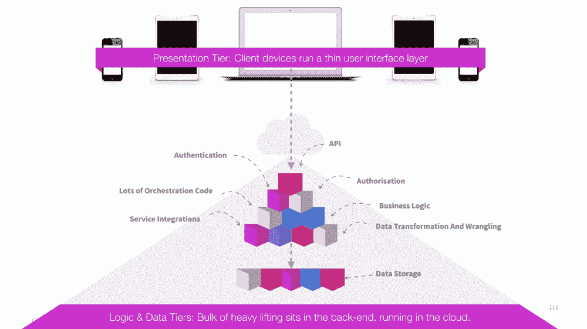
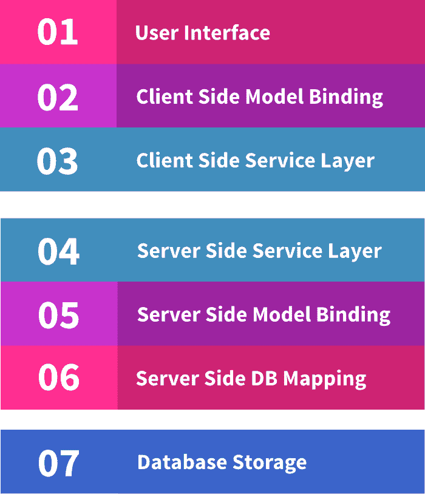
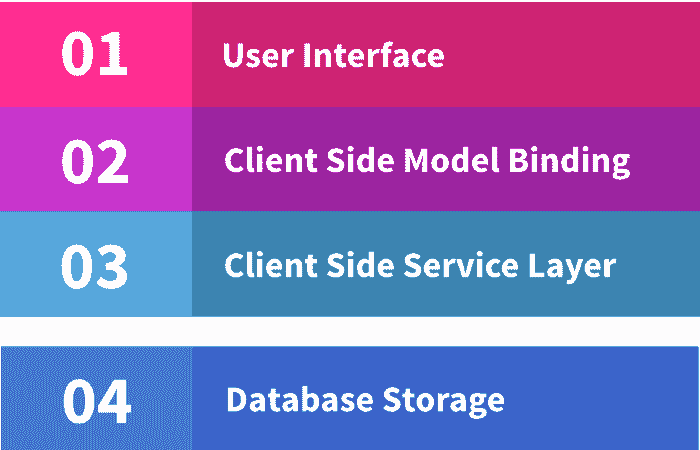
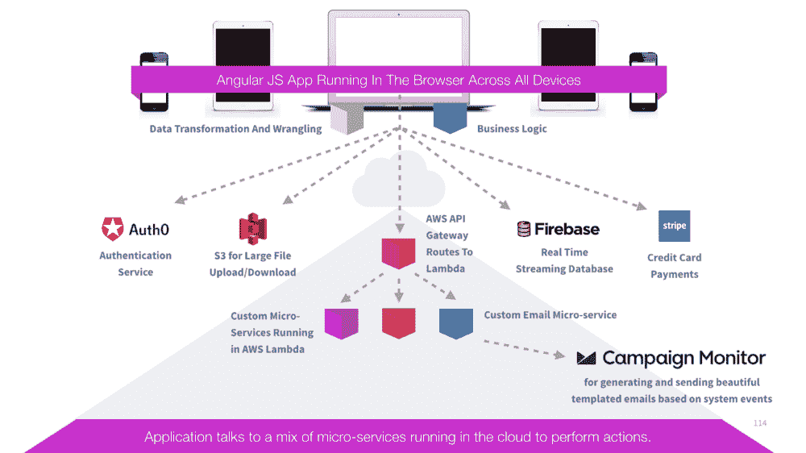

# 无服务器——软件架构的未来？

> 原文：<https://acloudguru.com/blog/engineering/serverless-the-future-of-software-architecture>

从我记事起，技术社区就有一个共识——计算的未来在于互联网连接的瘦客户端架构。

*你知道……*未来的愿景是轻型云连接设备的激增。故事是这样的，这些所谓的“瘦客户机”显示用户界面和[业务逻辑，繁重的工作发生在某个基于云的服务器](https://acloudguru.com/blog/engineering/evolution-of-business-logic-from-monoliths-through-microservices-to-functions)农场。这是典型的三层架构，繁重的工作放在后端。

但是我认为有其他的东西正在悄悄靠近我们，软件架构的另一种未来正在实现——基于无服务器架构。

这种未来的特点是富胖客户端应用程序直接与云数据存储和基于云的小型微服务进行对话，以实现受保护的工作负载和服务编排。

事实上，在过去的几个月里，我们一直在使用这样的架构构建一个大型在线社交学习平台[云大师](https://acloudguru.com/)。它的构建和持续改进速度极快，并且可以疯狂扩展。

## 无服务器架构与服务器架构

好，想象一个典型的三层架构:

用户界面实际上只是为用户驱动后端功能提供了一种方便的方式。但是这是低效的——有大量的重复。

如果你想给产品增加一个新的特性，你必须接触栈的每一层，从网络上的用户界面到服务器，然后再到数据存储。看看所有的层:

3-tier architecture — That’s a lot of layers to touch, just to add a new feature.

现在，假设您的用户界面应用程序可以包含当前位于后端的所有编排逻辑，并可以直接与一系列支持云的服务进行对话，以执行独特的功能，如身份验证、存储、通知等。

现在，当您想要添加新功能时，您只需将其添加到您的前端代码中(并可能在需要时调用云服务)。看看你现在只需要接触几层:

Serverless architecture — cuts out the middle-man and brings the UI closer to the data store

## 运行在云中的代码

您仍然需要编写一些运行在云中的代码，但是这些代码占用的空间会小得多。一些代码**必须**远程运行，因为它需要访问你不信任在某人的浏览器中运行的秘密。

例如:对于大多数信用卡支付提供商，采取对信用卡支付收费的最后步骤需要使用商家的秘密 API 密钥调用卡提供商的 API。其他所有事情，如输入卡的详细信息，都可以通过用户的浏览器直接与支付提供商对话来完成，这从 PCI 合规性的角度来看也很棒。

打最后一个电话来授权支付——你不能在用户的浏览器中加载那个秘密的 API 密匙。此外，您不能相信用户的浏览器会调用数据库来授权用户访问购买的内容——或者任何人都可以在其浏览器中编写一些 JS 代码来授权自己免费访问！

因此，在无服务器模式中，您可以在云端编写一个微小的微服务，一旦前端编排并排列好所有订单和支付细节，它就会调用卡支付。如果支付成功，该服务将授权用户访问数据库中购买的内容。该服务可以访问数据库中用户前端无法访问的部分。

在云专家 T1 时，我们编写了一系列运行在 AWS Lambda 中的 tiny node.js 微服务。我们使用 AWS API 网关来路由来自前端的请求，以调用这些 lambda 函数来为我们执行这些受保护的操作。

## 我们的使用案例—云专家的架构

这是一个云大师学习平台的架构图，展示了我们使用的一些云微服务:

请注意，我们在云中使用的每个服务都做一件事，而且做得非常好。我们使用的一些服务是第三方的(如 Auth0、S3、Firebase 和 Stripe)，一些是我们编写的自定义代码。

我们在云中的定制代码足迹绝对是最小的——仅限于在 AWS Lambda 中运行的几个 node.js 函数。这些功能执行受保护的操作，我们不能信任用户的浏览器来编排这些操作，例如:

*   完成卡支付并允许用户访问他们已付费的课程
*   向我们的一部分用户触发电子邮件(我们不能相信我们用户前端的代码会这样做，因为它会暴露其他用户的电子邮件地址*和*允许任何经过身份验证的用户向任何其他用户触发电子邮件)

## 什么推动了无服务器技术趋势？

这现在是可能的，因为:

*   我们有丰富的浏览器 MVC 框架，如 AngularJS，使我们能够编写大型和复杂的 web 应用程序，具有完整的构建系统和测试运行程序。
*   几乎所有你能想到的服务现在都支持 HTTP，并且支持通用的认证令牌交换协议，比如 JWT。这意味着用户的浏览器可以发送凭证，直接与您使用的不同云服务进行交互。
*   有针对大量功能的第三方云服务，它们都专注于做一件事，并且做得非常好。您现在可以将大量丰富的功能外包给云服务，例如:
    –用户认证
    –受保护文件下载/上传
    –信用卡支付
    –通知(电子邮件、短信、推送)
    –具有离线同步功能的实时流数据库访问

然后是用户偏好。如今，移动硬件功能强大，人们更喜欢更丰富、更快捷的用户体验。不幸的是，一个无处不在、永远可靠的互联网还没有到来。互联网用户经常遭受连接质量下降和连接丢失的情况仍然很普遍。因此，我们通常倾向于在我们的移动设备上使用更丰富、更强大的应用程序，这些应用程序可以处理离线情况，并在恢复在线时同步数据。

## 这安全吗？

当然，只要你愿意。

都在设计里。当引入新的云服务时，您需要在设计时考虑安全性——理解用户将使用他们的凭证直接与该服务交互。您需要了解如何锁定他们可以/不可以读写的内容。

如果您使用第三方服务，那么您必须了解如何锁定对该服务的访问。例如，使用 Firebase(一个实时流数据库)，您可以编写由数据库引擎执行的自定义安全规则，以确定哪些用户可以读取或写入数据库的不同部分。

如果您正在编写自己的微服务，那么您需要确保您的服务检查所传递的安全令牌的真实性，并验证用户的权利。

## 无服务器架构也是吗？

没有确切的定义，但我认为有一些基本特征可以将系统定义为无服务器系统:

*   运营商不需要自己运行和维护后端服务器
*   代码库的绝大部分(~ 95% +)位于前端
*   驻留在云中的代码只是绝对必须的代码——例如，出于安全目的，必须对用户浏览器不能信任的机密进行一些访问
*   前端充当协调器，调用大量基于云的服务来执行特定功能，例如接受信用卡支付、访问受保护的资源、发送电子邮件或推送事件通知

需要注意的是**这并不意味着没有任何服务器**。当然有，但是其他人正在管理、保护、维护和修补它们，减轻您的负担和责任，让您能够专注于构建您独特的产品。

## 值得吗？

绝对的！通过为云专家[使用无服务器方法，我们能够将一个完全交互式的在线社交学习平台推向市场，所用时间只是过去所需时间的一小部分。我们现在可以快速创新，并不断向用户界面添加新功能，而不必为每个新功能接触这么多层代码。](https://acloudguru.com/)

当然，它也有缺点，这种对传统架构的疯狂背离也带来了一系列挑战。

我们学到了很多，我们将在未来的博客文章中更深入地介绍我们使用的技术和我们必须克服的挑战。

## 获得更好职业所需的技能。

掌握现代技术技能，获得认证，提升您的职业生涯。无论您是新手还是经验丰富的专业人士，您都可以通过 ACG [AWS 架构师学习路径](https://acloudguru.com/learning-paths/aws-architect)在实践中学习并推进您的云计算职业生涯。

* * *