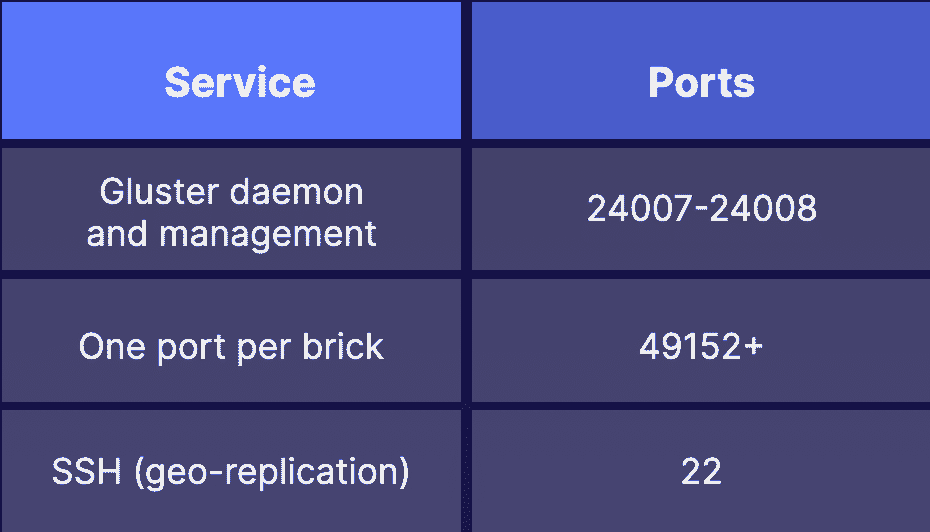

# Gluster 文件系统技巧:如何设置 GlusterFS 集群

> 原文：<https://acloudguru.com/blog/engineering/setting-up-glusterfs-cluster>

正在寻找可以扩展到 Pb 级的分布式存储解决方案吗？那么就值得你花时间去了解 GlusterFS。在这篇文章中，我解释了什么是 GlusterFS，如何建立一个简单的三音符 GlusterFS 集群，并分享了一些进一步学习资源的链接。

* * *

**通往更好职业的钥匙**

[立即开始 ACG](https://acloudguru.com/pricing) 通过 AWS、Microsoft Azure、Google Cloud 等领域的课程和实际动手实验室来改变你的职业生涯。

* * *

## 什么是 GlusterFS？

[GlusterFS](https://docs.gluster.org/en/latest/) 是一个软件定义的存储平台，非常适合企业环境和个人使用。它是开源和免费的，提供付费支持选项。GlusterFS 可以部署在裸机、容器、虚拟机甚至云环境中。

使用 GlusterFS 的一些好处包括:

*   可量测性
*   POSIX 符合性
*   多文件系统支持
*   不同工作负载的优化选项
*   地理复制
*   能够处理许多客户

## 如何设置 GlusterFS 集群

出于本文的目的，我将使用 Ubuntu 20.04 作为操作系统。但是，如果您愿意，可以使用不同的 Linux 发行版。主要的区别仅在于如何安装软件包(例如 yum、dnf 或 apt)。

我将使用三台具有以下 IP 地址和主机名的服务器。

```
10.0.2.101 server-1
10.0.2.102 server-2
10.0.2.103 server-3
```

## 入门指南

我们需要做的第一件事是确保系统之间能够相互通信。这可以通过将他们的名称和 IP 添加到`/etc/hosts`(在每台服务器上)来完成。另一种方法(也是首选的方法)是将这些系统添加到您的 DNS 解析器中。

关于防火墙的一个注意事项:GlusterFS 要求在任何防火墙上打开某些端口，以允许正确的通信。在本指南中，我不会启用任何防火墙。如果您打算使用防火墙，下面的图表列出了您需要打开的端口。



**端口砖块范围可以在/etc/glusterfs/glusterd.vol 中设置*

## 安装 GlusterFS

下面的步骤应该在每台服务器上完成，并且使用 sudo 或 root 用户。首先，更新 apt 的包列表。

```
apt-get update
```

更新完成后，就可以开始安装 GlusterFS 服务器和客户机包，并启动和启用 glusterd 服务。

```
apt install -y glusterfs-server glusterfs-client
systemctl enable --now glusterd 
```

## 设置您的储物空间(又名砖块)

既然您已经安装了 glusterFS 并且服务正在运行，那么是时候准备您的存储砖了。在要使用的存储设备上创建一个分区(在每台服务器上运行)。

```
parted --script -a optimal -- /dev/nvme1n1 mklabel gpt mkpart primary 1MiB -1
```

接下来，在新分区上放置一个文件系统，创建一个挂载点，并在每台服务器上挂载文件系统

```
mkfs.xfs -i size=512 /dev/nvme1n1p1
mkdir /gfs
mount /dev/nvme1n1p1 /gfs 
```

最后，我们需要在/gfs 中创建一个子目录。这将成为我们的一块砖。

```
mkdir /gfs/brick-1
```

* *如果您没有存储设备来创建分区，您可以创建目录`/gfs/brick-1`并使用它。这不是最佳实践，但出于演示的目的，它会工作得很好。

## 设置受信任的存储池

此时，您有三个运行 glusterfs 的服务器，以及一个将在您的第一个 GlusterFS 卷中使用的可用存储设备(或目录)。但是，在设置卷之前，需要创建一个受信任的存储池。这实际上是告诉 GlusterFS 使用什么主机进行存储。

从您的第一台服务器运行以下命令。如果您的服务器名称与本例中使用的不同，请在中替换。

```
gluster peer probe server-2
gluster peer probe server-3 
```

现在，您应该能够检查可信存储池的状态，并查看连接的服务器。

```
gluster pool list
```

## 创建您的第一个 GlusterFS 卷

现在您已经准备好创建您的第一个 glusterFS 卷了。有几种不同类型的卷，但在本演示中，您将创建一个分布式卷。这种类型的卷将文件分布在创建卷时使用的所有砖块上。

在第一台服务器上运行以下命令，创建一个名为`gfs_vol`的新分布式卷

```
gluster volume create gfs_vol server-1:/gfs/brick-1 server-2:/gfs/brick-1 server-3:/gfs/brick-1
```

在您可以开始使用您的卷之前，需要启动它。

```
gluster volume start gfs_vol
```

现在，您已经准备好装载该卷并开始使用它。您可以将它挂载到任何您想要的地方，这个例子是将卷挂载到/mnt

```
mount -t glusterfs server-1:/gfs_vol /mnt
df -h /mnt 
```

## 包装它

这就是创建一个基本的分布式 glusterFS 卷的全部内容！现在，您可以在该卷上创建文件。随着文件的创建，它们被分布在服务器上的砖块之间。

通过检查每个服务器上的目录或存储设备，您将看到由于分布不同而不同的文件。通过挂载点查看实际卷将提供对分布在集群中的所有文件的访问。

为了了解更多关于 GlusterFS、卷和管理的信息，我邀请您参加我的课程 [GlusterFS Deep Dive](https://acloudguru.com/course/glusterfs-deep-dive) 中的一位云专家。我希望在那里见到你，直到下一次，继续成为令人敬畏的大师！