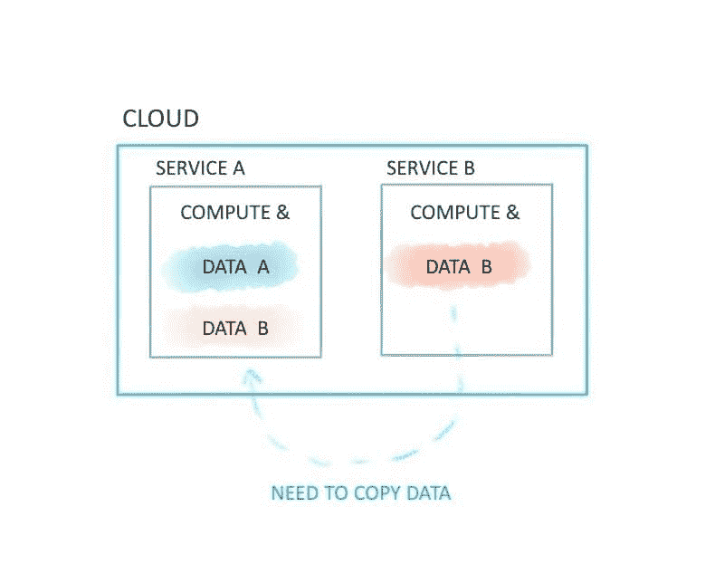
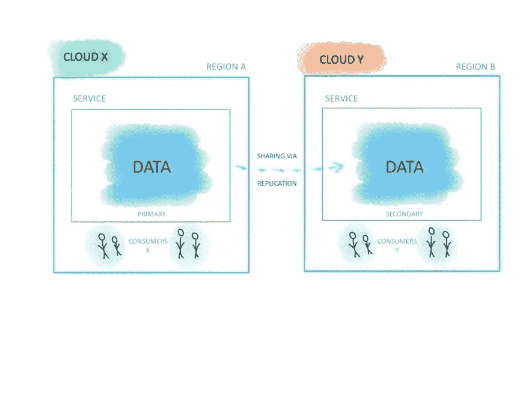
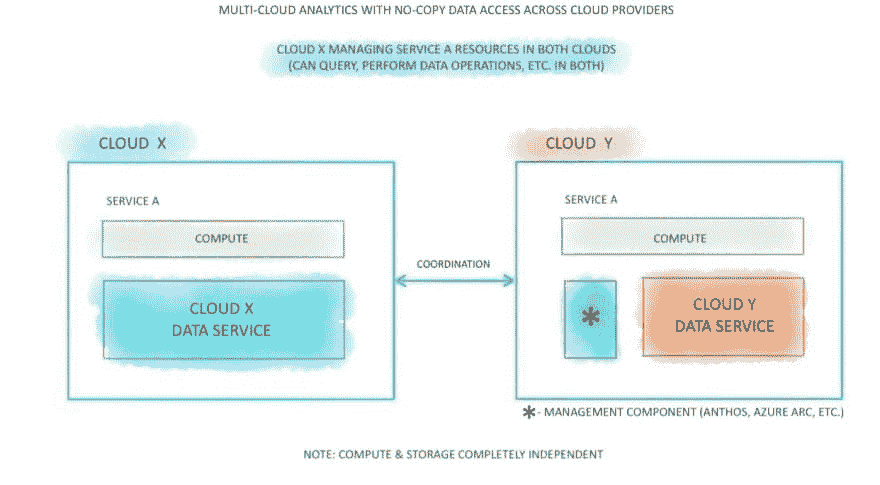
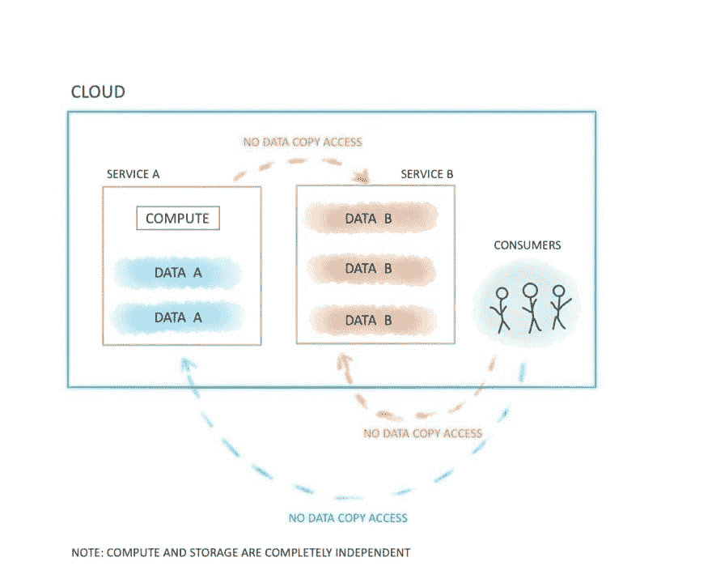

# 在云中共享数据:你应该知道的 4 种模式

> 原文：<https://acloudguru.com/blog/business/sharing-data-in-the-cloud-four-patterns-everyone-should-know>

让我们回顾一下云中数据共享的选项，以了解哪些是可用的，以及未来事情可能会越来越多地转移到哪里。这与许多面临数据移动成本、访问速度或尝试新的有前途的方法的风险等挑战的组织相关。

[多种云](https://acloudguru.com/blog/business/6-big-multi-cloud-questions-how-ge-uses-aws-and-azure)也开始参与数据共享。随着技术之间互操作性的提高，许多公司希望选择最佳的服务和产品来解决他们的场景——即使它们是不同云上的服务。例如，云 X 对 A 有利，云 Y 对 b 有利，这导致数据分布在不同的服务、区域或云上。甚至以不同云上的日志记录信息为例:组织仍然希望能够以最小的成本高效地查询和分析数据。

* * *

#### 需要一个解决方案来优化多云环境中的管理和治理？

[VMware CloudHealth](https://acloudguru.com/course/introduction-to-vmware-cloudhealth) 满足了这一需求。查看我们的课程，了解这一统一平台，通过一个仪表板来管理不同云提供商(如 AWS、Azure 和 Google 云平台)的资源。

* * *

对于云中的数据共享，我们可以采取挑战、权衡和多种方法。

## 通过复制共享数据(静态数据模式)

这里几个服务运行在同一个云中。计算和存储不是独立的。要处理来自另一个服务的数据，我们必须复制或移动它。如果这符合您的标准，那么对于简单的架构来说，这种方法没有任何问题。

## 无拷贝数据共享(直接访问模式)

这种方法很快被采用。同样，同一云中的多个服务。计算和存储完全分离。

现在有了更好的可扩展性，成本效益，直接访问数据。例如，这可以通过以下功能来实现:Azure Cosmos DB 的[Azure Synapse Link](https://docs.microsoft.com/en-us/azure/cosmos-db/synapse-link?WT.mc_id=datasharing-blog-alehall)、 [BigQuery 外部数据源](https://cloud.google.com/bigquery/external-data-sources)或[雪花数据共享](https://www.snowflake.com/workloads/data-sharing/)。

## 悬停多云复制数据共享(孪生模式)

“孪生模式”在第三方托管系统或您管理的跨多个云或区域的系统中很常见。

在这种方法中，跨多个云的系统的消费者可以访问来自不同云的数据。

这种技术需要复制，因此有成本和额外的复制时间，即使它是在地下发生的。这种方法的一个例子是在 Snowflake 中的[跨区域数据共享。](https://docs.snowflake.com/en/user-guide/secure-data-sharing-across-regions-plaforms.html)

## 多云无拷贝数据共享(数据门户模式)

在这种新兴的方法中，我们看到了跨多个云运行的服务、跨多个不同云服务的存储、计算和存储的分离，以及无需复制或移动数据的直接数据访问。

这是由像 Azure Arc 或谷歌 Anthos 这样的技术实现的。例如 [BigQuery Omni](https://cloud.google.com/blog/products/data-analytics/introducing-bigquery-omni) ， [Azure Arc 使能的数据服务](https://azure.microsoft.com/en-us/services/azure-arc/hybrid-data-services?WT.mc_id=datasharing-blog-alehall)。

## 云数据共享如何影响组织

为组织提供更好的数据共享选项，有两个主题是正确的:

*   存储和计算分离，链接到其他数据源以便直接访问。
*   将计算带到位于任何地方的数据的多云平台或混合平台( [Anthos](https://cloud.google.com/anthos) 、 [Arc](https://azure.microsoft.com/en-us/services/azure-arc?WT.mc_id=datasharing-blog-alehall) )。

对于云提供商来说，这意味着公司可能不会选择某些云服务，因为他们已经承诺使用某一种云并在那里存储数据。

如果公司可以在任何地方存储数据，方便访问和共享，他们也会调整决策。开发者体验、可编程性、互操作性、集成、开放标准——我认为这些因素在选择云服务时会变得更加普遍。

## 哪种云数据共享模式适合我？

我们回顾了四种不同且常见的数据共享方法，在一个云内或跨多个云。

通过复制实现数据共享的简单而通用的方法仍然是用例的一个很好的选择，在这些用例中，它们解决了特定场景的给定问题，等待公司的数据处理成本和延迟要求得到满足。

通过分离存储和计算实现直接数据链接的方法可显著降低数据移动成本，并有助于消除孤岛团队和庞大的数据湖，根据[数据网格](https://martinfowler.com/articles/data-monolith-to-mesh.html)概念，为按领域组织的数据产品团队提供更好的数据共享选项。

新兴的多云技术仍然需要发展和成熟，但它们真的很有前途，非常有用，可以让组织为正确的工作选择正确的工具，并专注于业务问题，而不会产生数据传输成本。

### 寻找更多的云善？看看这些:

### **关于作者**

Lena Hall 是微软 Azure 的工程总监，她专注于大规模分布式系统和现代架构。她在微软领导一个团队和技术战略，致力于大数据服务的产品改进。Lena 是推进、促进和推动云服务进一步加速的工程计划和战略背后的驱动者。Lena 在解决方案架构和软件工程领域拥有 10 年的经验，专注于分布式云编程、实时系统设计、高可伸缩性和高性能系统、大数据分析、数据科学、函数式编程和机器学习。此前，她是微软研究院的高级软件工程师。她共同组织了一个名为 ML4ALL 的会议，并且经常是 Kafka Summit、Lambda World 等会议的项目委员会的受邀成员。Lena 拥有计算机科学硕士学位。推特: [@lenadroid](https://twitter.com/lenadroid) 。领英:[莉娜·霍尔](https://www.linkedin.com/in/lena-hall/)。