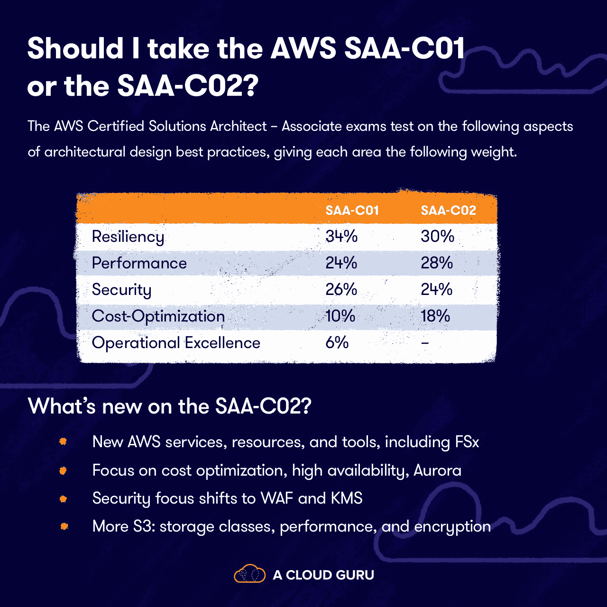

# 我应该走自动气象站 SAA C01 还是 SAA C02？

> 原文：<https://acloudguru.com/blog/engineering/should-i-take-the-saa-c01-or-saa-c02>

如果你准备好参加 AWS 认证解决方案架构师助理认证考试，你目前有两个考试选择:闪亮的新 SAA-C02 考试或即将退休的 SAA-C01 考试。我参加了两种考试，我知道自从 AWS 推出新的考试以来，许多人都很好奇该参加哪种考试。它们之间有什么区别，根据你的培训和知识，哪种考试可能最适合你？请继续阅读…

#### 测试，测试… 1，2…

如果你一直在准备 cert 考试，那么过去的几个月就有点难熬了。首先，我们屏住呼吸期待 AWS 和 Google Cloud 扩展在线证书测试。(如果你错过了，有了 [AWS](/blog/engineering/all-aws-certification-exams-now-available-online?__hstc) ，你现在可以远程参加任何考试，而[谷歌云](/blog/engineering/google-cloud-now-offers-online-exams?__hstc)让人们参加几场考试。)

然后是围绕考试和认证到期的所有变化。以认证解决方案架构师助理为例。…求你了！(提示 [rimshot](https://www.youtube.com/watch?v) 。)不过说真的，拿去吧。这是多年来的顶级云认证，它为您提供了 AWS 所有方面的广泛概述。或者，正如 AWS 所说，它“验证了在 AWS 上设计和部署满足客户需求的架构良好的解决方案的能力。”知道这些并不坏！

不确定如何规划你的 AWS 之路？查看 [*哪个 AWS 认证适合我？*](/blog/engineering/which-aws-certification-should-i-take?) *求助入门。*

* * *

### 在云计算专家的指导下边做边学

学得更快。动作快点。借助 AWS、Azure、Google Cloud 和 Linux 中的课程和实际动手实验室，立即实现转型。

* * *

#### 不要改变话题

值得注意的是，AWS 通常不会对他们的考试做出巨大的改变。他们通常也不会更新考试代码。因此，你可以正确地假设，虽然科目基本相同，但新的考试带来了重点的转移。

AWS 对新考试有什么看法？“这个新的考试版本(SAA-C02)包括所有领域的更新内容，以及与数据库、成本优化和安全性等类别的 AWS 平台创新相一致的新目标。AWS 认证定期更新这一考试，以反映 AWS 平台上的快速创新步伐和基于 AWS 云架构的最新最佳实践。”

那会是什么呢？旧的还是新的？一号门还是二号门？这里有一些要点，可以帮助你决定哪一个适合你。

#### 两次测试的故事

我在 2019 年 11 月参加了新 SAA-C02 的测试版，在 2018 年 10 月参加了 SAA-C01。为了使事情相对简单，我将把重点放在我在新的 SAA-C02 考试中看到的更新方面。

总的来说，我估计有三分之一的新考试采用了新的 AWS 服务、资源和工具。但我觉得其余的考试问题似乎经过了重新设计，以突出 AWS 服务和资源的架构和实施，而不是关于 AWS 资源和服务的具体数字和事实。在我的 beta 测试中，我看到的问题更多地集中在成本优化、安全性、 [Aurora 数据库 API](https://acloudguru.com/blog/engineering/getting-started-with-the-amazon-aurora-serverless-data-api) 、FSx 和 AWS 的架构上。

准备好了解真相了吗？让我们深入分析一下考试的几个不同方面。

##### 计算和网络

*   我个人觉得 SAA-C02 的网络问题比老的 SAA-C01 更难。
*   我看到了对理解高可用性以及如何在您的设计中实现它的高度关注。还有一些关于如何保护多层架构的问题，以及一些关于高性能计算场景的问题。具体来说，我看到了有关 VPN 和 Direct Connect 的问题，这些问题不仅涉及高可用性，还涉及了解各自的性能以及如何调配这两者。对 VPC 端点也有更深入的了解，因此了解接口端点和网关端点之间的差异，以及如何在您的设计中使用这两者。
*   我有一个关于资源访问管理器(RAM)的测试问题。所以我一定要理解 RAM 是什么，共享是如何工作的，以及 RAM 的局限性。我还有一个关于 Private Link 和 AWS Global Accelerator 的问题，我从未在 SAA C01 中看到过这两个功能。

##### 储存；储备

*   在我的 SAA-C02 测试中，我遇到了更多的 S3 问题。确保您了解 S3 存储类别，以及这些存储类别如何最适合特定场景。我还遇到了更多的 S3 性能问题，S3 加密更受欢迎，我认为这与新的更新考试一起增加了对安全性的更多关注。我还有一个关于 S3 事件的问题，这是我在 SAA C01 上没有看到的。
*   SAA-C02 考试中的另一个我在 SAA-C01 考试中没有看到的东西是 FSx。确保你对什么是 FSx 以及何时使用它有一个坚实的理解。

##### 数据库

*   我发现在我的 beta 测试中，Aurora 问题的数量比以前的 SAA-C01 测试有了巨大的变化。这一转变特别围绕 Aurora 无服务器以及 Aurora 和 Aurora 无服务器提供的高可用性。我建议理解 RDS 数据库实例和 Aurora 数据库实例背后的不同架构。此外，我还看到了更多围绕 DDB 和 DDB 流性能的 DynamoDB 问题。

##### IAM 和帐户

*   从 SAA-C01 到 SAA-C02，我在 IAM 下没有看到太大的变化，但我确实感觉到 AWS 组织和 Cognito 更有特色。

##### 应用服务程序

*   我也没有看到这个类别有大的变化。我建议您深入了解 SQS，了解 SQS 非常适合去耦架构，这样您的设计就不会相互依赖。我有一个更难的问题是关于 SQS 和 Kinesis 的，所以要理解两者以及它们如何一起工作。
*   让我们跳回 S3。对于 SAA-C02，请确保您了解如何设计区域性和全球性的高可用性。围绕这一设计，我有几个场景问题，因此为了实现全球高可用性，我们可以使用 S3 传输加速、跨区域复制或 S3 CloudFront。
*   我确实看到了对 Route 53 的更多关注，所以请确保您了解它是什么，它是如何工作的，以及 Route 53 如何与其他服务集成，以及 Route 53 路由的延迟。SAA-C02 也是新的，我在亚马逊 MQ 上有一个场景问题。

##### 灾难恢复和迁移

*   在新的考试中，我看到了一些关于数据库迁移服务(DMS)的问题以及一个关于 AWS DataSync 的问题。

##### 安全性

*   我想特别提到安全这一类别，因为安全报道似乎更多地关注 Web 应用程序防火墙(WAF)。当然还有 AWS 密钥管理系统(KMS)，所以请了解 KMS 及其合规级别。

##### 成本优化

*   最后，我想提一下成本优化。我发现我的 beta 测试非常关注成本优化的各个方面以及如何设计成本优化的架构。我肯定会花一些时间来了解哪些 AWS 服务可以帮助您使用经济高效的资源并优化您的架构成本。

#### 哪种考试最适合你？

我个人一直建议参加最新版本的考试。但这两种方式都会给你一个非常受欢迎的认证，有效期为三年。无论你选择哪种考试，只要有正确的计划和一些准备，就不会有太多的惊喜。

* * *

说云不一定很难。我们分析了数百万份回复，找出了最容易让学生出错的术语和概念。在这个云指南中，你会发现一些最令人头疼的云术语的简明定义。

* * *