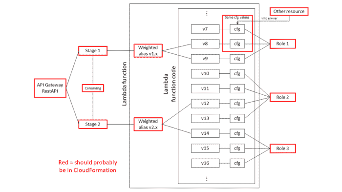

# AWS Lambda 和 CloudFormation 上的蓝绿色部署|云专家

> 原文：<https://acloudguru.com/blog/engineering/some-quick-thoughts-on-blue-green-deployment-for-lambda-with-cloudformation>

关于 Lambda 和 AWS [CloudFormation](https://acloudguru.com/blog/engineering/cloudformation-terraform-or-cdk-guide-to-iac-on-aws) 的部署，我想了很多。为 Lambda 添加了[加权别名，为 API Gateway](http://docs.aws.amazon.com/lambda/latest/dg/lambda-traffic-shifting-using-aliases.html) 添加了[加权别名，这意味着使用同一个端点分阶段“就地”部署代码现在是可能的——通常称为蓝绿色部署。](https://aws.amazon.com/about-aws/whats-new/2017/11/amazon-api-gateway-supports-canary-release-deployments/)

## 什么是蓝绿部署？

蓝绿色部署是一个持续的部署过程，通过拥有两个相同的生产环境(分别称为蓝色和绿色)来减少停机时间和风险。蓝绿色部署允许您在向新的应用程序版本发送生产流量之前对其进行测试。如果新部署的应用程序版本有问题，您可以比就地部署更快地回滚到以前的版本。

## 蓝绿色部署挑战

这种方法的一个后果是，您的应用程序同时有多个版本的函数代码处于活动状态。

从根本上说，版本化的 Lambda 代码感觉不属于 CloudFormation。最后，Lambda 函数的版本集可能看起来像是你的存储库历史的复制品。

您只希望使用中的*代码——您的活动分支——出现在使用 CloudFormation 的应用程序的托管基础架构中。所以我开始思考如何在 CloudFormation 之外发布函数，同时仍然链接到模板内的资源。*

## 不断增长的 AWS Lambda 版本列表

*除了…* 功能配置在慢慢变化，感觉可能属于云形态。配置指定了应该在 CloudFormation 中的 IAM 角色，并且环境变量可以引用其他 CloudFormation 资源。

然而，配置是用代码版本化的，所以在 CloudFormation 之外部署代码将不得不从堆栈中获取值。堆栈(即加权别名)还需要引用由该部署代码创建的 Lambda 版本。

所以它在自动气象站的云层中穿梭。不太好。

我在下面创建了一个图表来描述这个挑战。简明扼要地绘制图表实际上很烦人，因为这完全是关于它如何随时间演变的。😒

不断增长的 Lambda 版本列表似乎不属于 CloudFormation，因为模板会不断增长。功能配置与代码一起被版本化，因此将被部署在 CloudFormation 之外——但它在慢慢变化。这些函数还引用了 CloudFormation 中的资源。这两者都清楚地表明它应该存在于模板中。

一旦我找到了想要的模型——不管它是什么——我会[创建定制资源](https://github.com/iRobotCorporation/cfnlambda)来完成它——但我希望它能在未来为[山姆](https://github.com/awslabs/serverless-application-model)工作。

我目前对这个挑战的想法是:

### **AWS::Lambda::Placeholder** 

将会有一个资源表示 Lambda 函数*的存在*:它创建名称(并且仅在必要时，部署非功能性代码作为占位符)。与现有的 [AWS::Lambda::函数资源](http://docs.aws.amazon.com/AWSCloudFormation/latest/UserGuide/aws-resource-lambda-function.html)不同，除了(可选的)FunctionName 之外，它不接受任何属性。我将这个资源类型称为 AWS::Lambda::Placeholder。

### **AWS::Lambda::部署**

部署一个版本会有一个资源类型。它将采用 AWS::Lambda::Function 的所有属性，但有两处更改:

1.  FunctionName 对于放置占位符资源引用的位置是必需的
2.  CodeSha256 将是可用的，但也是可选的，以允许像现有的 AWS::Lambda::Version 资源那样防止竞争情况)

我将这个资源类型称为 AWS::Lambda::Deployment。当在模板中引用时，它将返回版本 ARN——并且可能将版本号作为属性。

与 AWS::Lambda::Version 不同，AWS::Lambda::Deployment 可以针对任何字段进行更新。这将导致一个新版本的出版。堆栈中将不再有对其先前部署的版本的任何引用，但该版本实际上不会被移除。

### **多个部署资源**

您可以拥有多个部署资源，对于您所引用的模板中的每个位置，都有一个版本——每个版本在上图中都有一个连接。

### **AWS::Lambda::existing deployment**

有一种方法来引用 Lambda 函数的现有版本是很有用的，这样，如果需要再次引用以前的版本，就可以直接插入它。可能是 AWS::Lambda::existing deployment。

## 进化的步骤

使用原始的图表并用蓝色标注 AWS::Lambda::Deployment 资源，演变看起来会是这样的:

**步骤 1:** 我们刚刚部署了第一个版本:

**步骤 2:** 现在假设我们刚刚更新了配置，为 Lambda 函数提供了更多内存。这不需要我们使用加权别名来部署，我们只需更新部署资源。

加权别名资源将使用新的版本引用进行更新。函数版本 v1 将不再出现在堆栈中的任何地方——但它仍然存在。

**步骤 3:** 现在我们已经有了一个代码更新，我们想使用加权别名来推出它。我们将添加一个新的部署资源来部署指定功能配置的新代码——即使它没有改变——并将加权别名指向它。我们在部署时会保留这两种部署资源，因为它们都在堆栈中被引用。

**步骤 4:** 部署完成后，我们可以更新堆栈以删除旧的部署资源，并更新加权别名以删除其对该部署的引用。

**第 5 步:**使用这种方法，下面是显示部署资源使用情况的更新图。

对于更简洁的模板，该选项将提供单独的配置资源。它本身实际上不会做任何事情，但是可以被多个部署引用。

我所建模的是基于一个概念系统，在这个系统中，使用你的基础设施图，比如 CloudFormation，你*没有*作为一级概念的功能。相反，假设您告诉您的事件源“使用这个 IAM 角色和这个配置执行这个代码工件(来自 S3)”。

在您的基础结构图中，您可以在两个节点(事件源和功能代码)之间创建一条边。edge 是第一个类概念，包含要调用的代码的配置。

这不一定是我想要的未来，但我认为从方向上来看，将短暂计算视为将业务逻辑融入系统并将其粘合在一起是有用的。

* * *

## 获得更好职业所需的技能。

掌握现代技术技能，获得认证，提升您的职业生涯。无论您是新手还是经验丰富的专业人士，您都可以通过实践来学习，并在 ACG 的帮助下推进您的云计算职业生涯。

* * *

关于蓝绿色部署的更多资源: