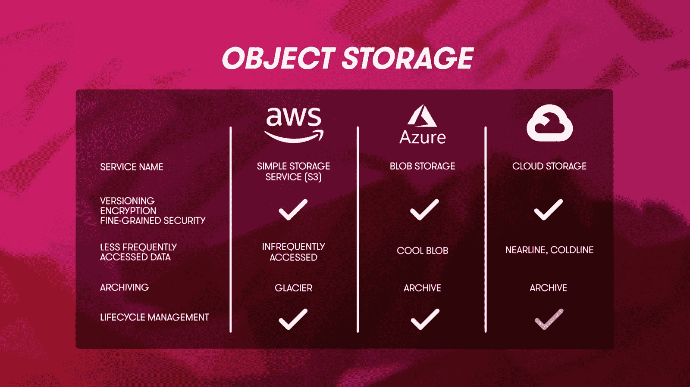
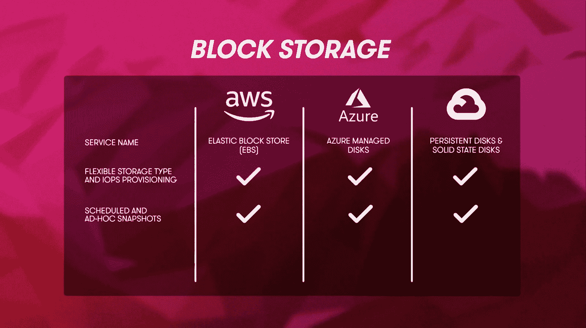
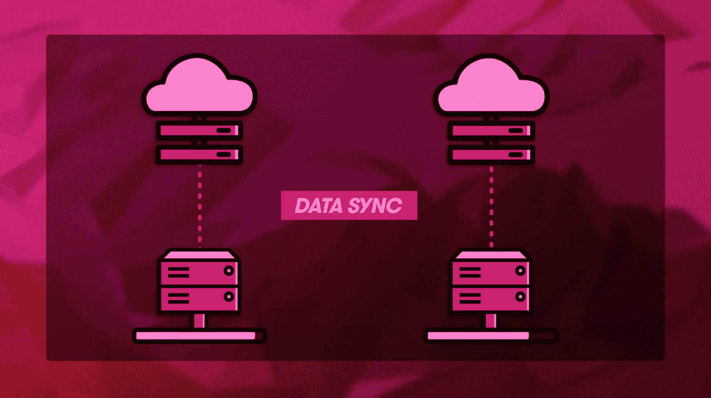

# 存储服务对比:AWS vs Azure vs GCP 

> 原文：<https://acloudguru.com/blog/engineering/storage-showdown-aws-vs-azure-vs-gcp-cloud-comparison>

在本帖中，我们来看看不同云提供商的存储选项。我们将看看 AWS、Azure 和 GCP 之间的相似之处、不同之处和值得关注的地方。

随着全球向远程和异步工作的转移不断增加，我们的数据存储需求也在增加。因此，毫无疑问，存储已经成为云提供商的基础，并为公司提供了一种相对简单的方式来开始使用云。

* * *

## 通往更好职业的钥匙

[从 ACG 开始](https://acloudguru.com/pricing)通过 AWS、Microsoft Azure、Google Cloud 等领域的课程和实际动手实验室改变你的职业生涯。

* * *

但是[亚马逊网络服务(AWS)](https://acloudguru.com/blog/engineering/what-is-amazon-web-services-aws) 、[微软 Azure](https://acloudguru.com/blog/engineering/what-is-microsoft-azure) 、[谷歌云平台(GCP)](https://acloudguru.com/blog/engineering/what-is-google-cloud-platform-gcp) 的存储服务对比如何？让我们看看他们如何在这个云提供商比较指南中*叠加*!

### AWS vs Azure vs GCP:云提供商比较

在云的世界里，并不都是苹果对苹果。以下是其他一些云比较指南。

## 什么是数据存储？

数据可以存储在纸张、磁盘、磁带、光盘上……甚至可以存储在细菌的 DNA 中。但是存储所有这些数据会占用空间和成本，而且一些数据存储介质并不是真正为长期设计的。进入云端。

云提供商已经知道如何大规模创建各种存储方法，从而以低成本实现高可靠性。您需要为您所使用的内容以及符合您需求的性能和功能付费。

最常见的数据存储形式是对象存储、归档存储、文件存储和块存储，每种类型适用于不同的用途。

* * *

[**抢云词典之痛**](https://get.acloudguru.com/cloud-dictionary-of-pain)
说云不一定要硬。我们分析了数以百万计的回复，找出了最容易让人犯错的概念。获取我们的[云指南](https://get.acloudguru.com/cloud-dictionary-of-pain)，获取云中一些最令人头疼的术语的简明定义。

* * *

## 对象存储比较:亚马逊 S3，Azure Blob 存储，谷歌云存储

说到对象存储，可以把对象想象成一个文件。你收集的令人印象深刻的爸爸笑话迷因是对象，它们可以存储在对象存储服务的云中。

AWS 称他们的对象存储服务为亚马逊简单存储服务，简称 S3。

GCP 有一个恰当的名字[谷歌云存储](https://cloud.google.com/storage)。

而 Azure 通过调用他们的服务 [Azure Blob Storage](https://azure.microsoft.com/en-au/services/storage/blobs/) (BLOB 的意思是“二进制大对象”)来提升极客配额。AWS 和 GCP 都称你放入数据的东西为“桶”，而 Azure 称之为“容器”

这些存储服务有很多共同点。它们都提供:

*   版本控制
*   静态加密
*   细粒度的安全性，包括使对象可公开访问或完全私有的选项

S3、云存储和 Blob 存储都提供存储类别层，存储类别的性能和冗余度越高，您支付的费用就越高。还有一些选项可以降低访问频率较低的数据的成本。这些存储类别称为:

* * *

*在[本帖](https://acloudguru.com/blog/engineering/s3-glacier-instant-retrieval-deep-dive-which-s3-storage-class-is-right-for-me)中，我们接触到了 AWS S3 冰川即时检索，并提供了一个信息图来帮助您决定哪种 S3 存储类别适合您的需求。*

* * *

### 对象存储归档

出于法规或法律原因，许多组织都需要将数据保留一段时间。这可能会变得昂贵。幸运的是，云提供商有自己的低成本归档解决方案。

在规定的保留期结束后，是否有义务删除数据？幸运的是，云提供商也在这些解决方案中内置了存储生命周期管理，并且可以自动删除过期的对象，而无需您手动执行此操作。神奇！

## 文件存储比较:亚马逊 EFS，Azure 文件，谷歌云文件存储

如果您正在寻找高性能存储，您会希望选择每秒输入/输出操作数或 IOPS 高的解决方案。这就是文件存储的用武之地。可以把它想象成网络上的共享驱动器。通用文件存储服务将提供网络文件系统(NFS)或服务器消息块(SMB)访问，允许其他系统通过网络连接并使用该存储，就像它是本地卷一样。

*   Azure 称他们的[文件为](https://azure.microsoft.com/en-au/services/storage/files/)。

与对象存储一样，这些服务非常相似，只是在协议、最大卷大小和性能方面略有不同。

不过，AWS 确实比其他提供商多了两个文件存储选项。[亚马逊 for Windows 版](https://aws.amazon.com/fsx/windows/)针对 Windows 服务器环境进行了优化，而[亚马逊 for Lustre 版](https://aws.amazon.com/fsx/lustre/)则针对高性能计算用例。

## 块存储比较:亚马逊 EBS、Azure 托管磁盘、谷歌持久磁盘和固态磁盘

如果您有需求—对速度的需求—数据块存储正是您需要的。把块存储想象成一个原始硬盘。它将提供最高的 IOPS。

这三家云提供商都有块存储选项，因为运行虚拟机非常需要它们。块存储让我们的虚拟机启动到他们的操作系统。

所有这些都提供类似的功能，允许您配置非常快速的 SSD 设备，或者使用更传统的磁性硬盘驱动器来节省一些资金。计划快照和临时快照允许您打包、恢复和复制数据块存储设备。所有提供商的数据块存储加密都只需点击鼠标即可完成。

## 数据传输

所有这些关于云的讨论都很好，但是首先，你实际上是如何将所有的数据放入云中的呢？

嗯，最基本的方法是使用 web UI 或命令行界面(CLI)从您选择的云提供商上传您的数据。AWS 和 Azure 还提供可下载的虚拟设备，可以安装在你自己的数据中心作为传输网关，在后台将数据同步到云。

但是，如果您的数据中心存储了数 Pb 的数据，该怎么办呢？即使有最快的互联网连接，传输所有这些数据也需要数年时间。朋友们，这就是为什么你永远不能低估送货卡车的带宽。

所有主要的云提供商都允许你用硬盘邮寄数据。

*   [Azure Data Box Disk](https://docs.microsoft.com/en-us/azure/databox/data-box-disk-overview) 基本上就是一个装满 SSD 硬盘的盒子，带 USB 3.0 端口。用多达 40 TB 的数据填满磁盘，将其运回微软，您的数据将加载到您的存储帐户中。Azure 还有一个容量高达 1 PB 的更大版本，名为 [Azure Databox Heavy](https://docs.microsoft.com/en-us/azure/databox/data-box-heavy-overview) ，有点像铁娘子巡演中拖着的 roadie 箱子。

*   GCP 有一个类似的硬件设备，称为[传输设备](https://cloud.google.com/transfer-appliance/docs/4.0)，它也可以在一次往返中容纳高达 1 PB 的数据。但是目前的数据导入之王是 AWS 和他们的[雪族](https://aws.amazon.com/snow/)。 [AWS Snowcone](https://aws.amazon.com/snowcone/?nc=sn&loc=3) 和 [AWS Snowball](https://aws.amazon.com/snowball/?nc=sn&loc=4) 设备都提供数据传输，并包括计算硬件，这使它们能够像小型 AWS 数据中心一样运行。

*   然后是 AWS 雪地车，被描述为“45 英尺长的加固集装箱，由半挂卡车牵引”。它将驱动到您的数据中心，插入电源，并以每秒 240 千兆位的速度接收高达 100 PB 的数据！

## AWS、Azure、GCP 哪个好？

我们在这里保持中立，说 AWS、Azure 和 GCP 的存储选项都非常相似。这是意料之中的。存储在很大程度上已经成为一种商品，提供商专注于提高性能和降低成本。

如果你想了解更多关于这些云服务的信息，可以从一位云计算专家那里开始免费试用涵盖这些服务的视频和动手实验。除了那辆摩托雪橇车。我们还没有这方面的动手实验(目前还没有！).

* * *

停止搜索，开始学习！[开始](https://acloudguru.com/pricing)与云专家一起动手，掌握最受欢迎的技术技能。