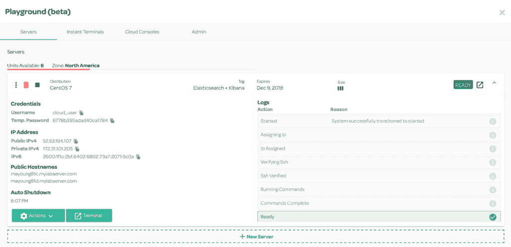
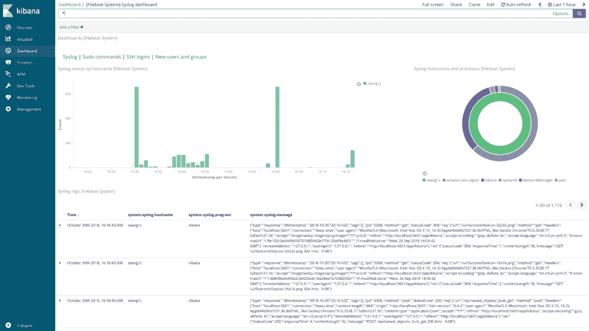
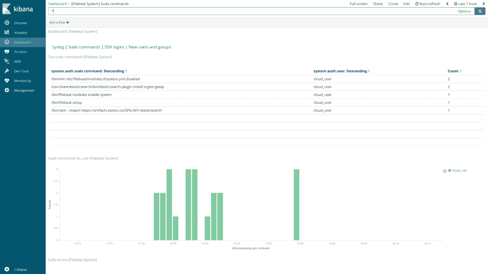
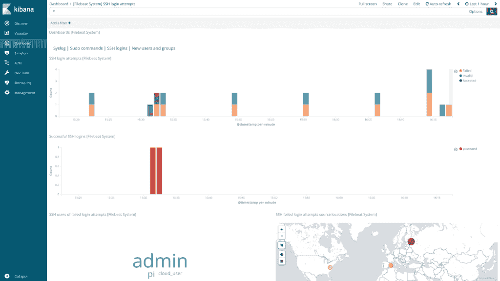
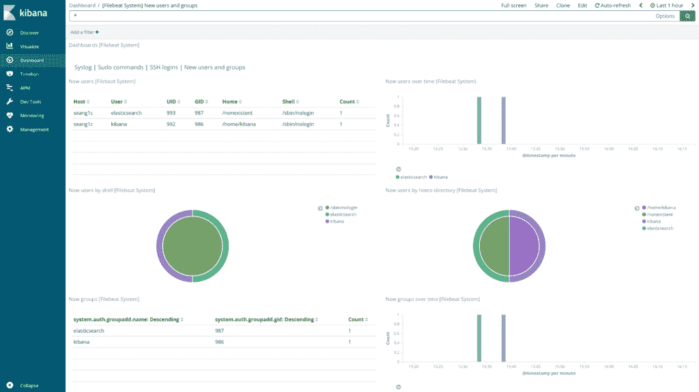
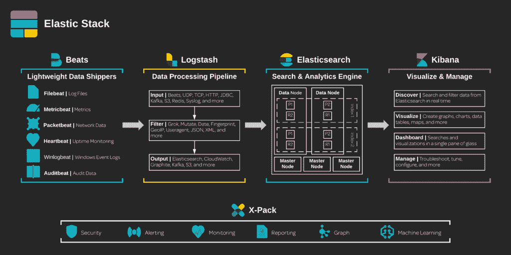

# 使用弹性堆栈的系统日志聚合

> 原文：<https://acloudguru.com/blog/engineering/system-log-aggregation-with-the-elastic-stack>

弹性堆栈可以无限配置，几乎可以用于任何涉及收集、搜索和分析数据的用例。为了使启动和运行变得容易，我们可以使用模块来快速实现预配置的管道。在这个简短的教程中，我们将使用系统模块来收集来自`/var/log/secure`和`/var/log/auth.log`的日志事件，然后通过模块在 Kibana 中创建的仪表板来分析这些日志事件。在这个演示中，我将在[云专家云操场](https://acloudguru.com/blog/engineering/system-log-aggregation-with-the-elastic-stack)上使用一个 t2.medium EC2 实例。如果您不是 Linux Academy 的订阅者，请随时关注您自己的云服务器或虚拟机。您所需要的只是一台带有 1 个 CPU 和 4 GB 内存的 CentOS 7 主机。否则，服务器已经为您预先配置好了！

[](https://wpengine.linuxacademy.com/wp-content/uploads/2018/10/Screen-Shot-2018-10-30-at-4.28.20-PM.png)

[](https://wpengine.linuxacademy.com/wp-content/uploads/2018/10/Screen-Shot-2018-10-30-at-4.28.20-PM.png)

Linux 学院云游乐场

## 弹性搜索

首先，我们需要安装 Elasticsearch 的唯一先决条件，一个 Java JDK。我将使用 OpenJDK，特别是`java-1.8.0-openjdk`包:

```
sudo yum install java-1.8.0-openjdk -y
```

现在我们可以安装 Elasticsearch 了。我将通过 RPM 进行安装，所以首先让我们导入 Elastic 的 GPG 密钥:

```
sudo rpm --import https://artifacts.elastic.co/GPG-KEY-elasticsearch
```

现在我们可以下载并安装 Elasticsearch RPM:

```
curl -O https://artifacts.elastic.co/downloads/elasticsearch/elasticsearch-6.4.2.rpmsudo rpm --install elasticsearch-6.4.2.rpmsudo systemctl daemon-reload elasticsearch
```

让我们启用 Elasticsearch 服务，使其在重启后启动，然后启动 Elasticsearch:

```
sudo systemctl enable elasticsearchsudo systemctl start elasticsearch
```

由 Filebeat 系统模块创建的摄取管道使用 GeoIP 处理器来查找在日志事件中找到的 IP 地址的地理信息。要做到这一点，我们首先需要将它安装为 Elasticsearch 的插件:

```
sudo /usr/share/elasticsearch/bin/elasticsearch-plugin install ingest-geoip
```

现在我们需要重新启动 Elasticsearch，以便它能够识别新插件:

```
sudo systemctl restart elasticsearch
```

## Kibana

我们已经导入了弹性 GPG 键，所以让我们下载并安装 Kibana RPM:

```
curl -O https://artifacts.elastic.co/downloads/kibana/kibana-6.4.2-x86_64.rpmsudo rpm --install kibana-6.4.2-x86_64.rpm
```

现在我们可以启动并启用 Kibana 服务:

```
sudo systemctl enable kibanasudo systemctl start kibana
```

因为 Kibana 和 Elasticsearch 都为单节点部署提供了合理的默认值，所以我们不需要对任何一个服务进行任何配置更改。

## Filebeat

现在我们可以安装将收集我们的日志的客户机 Filebeat。同样，因为我们已经导入了弹性 GPG 键，所以我们可以下载并安装 Filebeat RPM:

```
curl -O https://artifacts.elastic.co/downloads/beats/filebeat/filebeat-6.4.2-x86_64.rpmsudo rpm --install filebeat-6.4.2-x86_64.rpm
```

我们希望在 Elasticsearch 中存储带有 UTC 时间戳的日志事件。这样，Kibana 可以简单地从 UTC 转换到我们的浏览器在请求时间所在的任何时区。为了启用这种转换，让我们取消注释并启用`syslog`和`auth`部分的`/etc/filebeat/modules.d/system.yml.disabled`中的以下变量:

```
var.convert_timezone: true
```

现在我们可以启用系统模块并将模块资产推送到 Elasticsearch 和 Kibana:

```
sudo filebeat modules enable systemsudo filebeat setup
```

最后，我们可以启用并启动 Filebeat 服务，开始收集系统日志事件:

```
sudo systemctl enable filebeatsudo systemctl start filebeat
```

## 分析

默认情况下，Kibana 监听`localhost:5601`。因此，为了在我们的本地 web 浏览器中浏览 Kibana，让我们使用 SSH 通过端口转发登录到我们的主机:

```
ssh username@hostname_or_ip -L 5601:localhost:5601
```

现在，我们可以在本地 web 浏览器中导航到`https://localhost:5601`来访问我们的远程 Kibana 实例。从 Kibana 的侧面导航窗格中，选择**仪表板**并搜索“系统”以查看所有系统模块仪表板。更进一步，您可以创建自己的蜜罐，将您的主机暴露在互联网上，以收集更多的日志事件进行分析。

[](https://wpengine.linuxacademy.com/wp-content/uploads/2018/10/Screen-Shot-2018-10-30-at-4.17.10-PM-2.png)

系统日志仪表板

[](https://wpengine.linuxacademy.com/wp-content/uploads/2018/10/Screen-Shot-2018-10-30-at-4.17.21-PM-2.png)

Sudo 命令仪表板

[](https://wpengine.linuxacademy.com/wp-content/uploads/2018/10/Screen-Shot-2018-10-30-at-4.17.40-PM-2.png)

SSH 登录仪表板

[](https://wpengine.linuxacademy.com/wp-content/uploads/2018/10/Screen-Shot-2018-10-30-at-4.17.46-PM-2.png)

新用户和组仪表板

## 想了解更多？

从创建漂亮的可视化效果到管理弹性堆栈，[ki Bana markdown visualization](https://acloudguru.com/course/a-cloud-gurus-elastic-certified-analyst-exam-preparation-course)帮助您充分利用您的数据。在云专家[的](https://linuxacademy.com)，我们为弹性产品提供了大量精彩的学习内容。通过弹性堆栈基础课程，简要了解弹性堆栈中的所有产品。或者通过 Elasticsearch 深潜课程了解弹性堆栈的核心——Elastic search。当你准备好了，通过我们最新的认证准备课程，成为一名弹性认证工程师，证明你对弹性堆栈的掌握。所有这些课程都包含动手实验和课程，您可以使用自己的云专家云服务器来学习。你还在等什么？让我们变得有弹性！

[](https://wpengine.linuxacademy.com/wp-content/uploads/2018/10/elastic_stack.png)

弹性堆栈生态系统