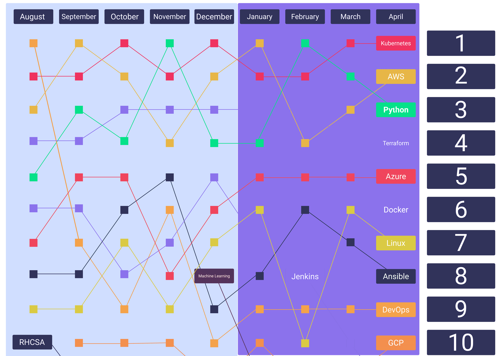

# 云十大:ACG 上搜索次数最多的云话题(2021 年 5 月)

> 原文：<https://acloudguru.com/blog/engineering/the-cloud-top-ten-the-most-searched-cloud-topics-at-acg-may-2021>

我们回顾了过去七个月来我们平台上的热门搜索，从八月份我们的 One Platform 发布到 2021 年 4 月。这种分析包括超过 100，000 个搜索，以确定哪些主题对我们的学习者最重要。

当我们在 3 月回顾我们的[热门搜索主题时，我们看到 Python、Kubernetes 和 AWS 是搜索次数最多的主题。这个月也一样。虽然出现了一些*和*新来者，但前五名基本保持不变——这恰恰表明了这些工具在云计算中的重要性。](https://acloudguru.com/blog/engineering/the-cloud-top-ten-the-most-searched-cloud-topics-at-acg)

但在这些顶级条款中，我们继续看到许多交易场所。Kubernetes 一直在争夺第一或第二名，而 AWS、Terraform 和 Python 则在争夺剩下的位置。

* * *

[**得到痛苦的云词典**](https://get.acloudguru.com/cloud-dictionary-of-pain)
*说云不一定要辛苦。在我们的[云指南](https://get.acloudguru.com/cloud-dictionary-of-pain)中，你会发现一些最令人头疼的云概念的简明定义列表。*

* * *

事不宜迟，以下是截至 4 月底我们的十大热门搜索:

谷歌云在冷板凳上呆了几个月后，本月重新进入我们的前十名。谷歌 I/O 计划于今年 5 月 18 日启动，因此我们可能会看到其云平台的大量更新。

不知道你到底在找什么？那么，为什么不去寻找一切呢？

自动化一大堆东西—IT、一致的配置管理、部署，通常不会破坏东西。似乎很简单，一个旨在修复 PEBKAC 现象的工具是最受欢迎的。

不言自明！我们(仍然)希望。

Docker 继续位于前十名的后半部分，尽管这并不一定意味着它的重要性低于其他热门搜索的云工具。Docker 仍然始终是我们的学习者关注的顶级开发工具之一。

Azure 继续保持甚至更强劲的势头。

想象一下，试着管理 VPC 里的所有东西。现在他们中的两个。现在两千。不好玩，对吧？好吧，随着应用程序不可避免地扩展到数亿用户，你真的需要自动化大部分工作。赞 Terraform。

所有机器训练的首选语言之一。随着机器训练在云技术上获得独一无二的地位，我们希望看到这一点在顶部持续表现。特别是，云提供商正在优化培训硬件，如谷歌的 TPU。

这是不言自明的。我们希望！

没有容器的生活是什么？根本不是生活。或者说，不是一种无障碍的生活。随着数亿人争相购买 Playstation 5，如果你的电子商务应用程序背后没有指挥，祝你好运。

这不一定是对云计算中技能和专业知识需求的全面看法。虽然在一定程度上代表了生态系统，但我们的搜索也是感兴趣的瞬间的快照。如果有任何这方面的优秀例子，那就是 Jenkins——一个不到十年的自动化工具——今年早些时候首次进入前十名。

因此，当考虑在构建云技术专业知识时将时间投入何处时，请始终考虑多个数据点。然而，我们确实希望我们的数据点至少也能帮助你决定把精力放在哪里。(如果你想把时间花在休息和/或在 Stardew Valley 建造一个农场上，这也完全没问题！)

* * *

希望提升您的云计算职业生涯？停止搜索，从今天开始学习。[开始](https://acloudguru.com/pricing)与云专家一起动手，掌握最受欢迎的技术技能。