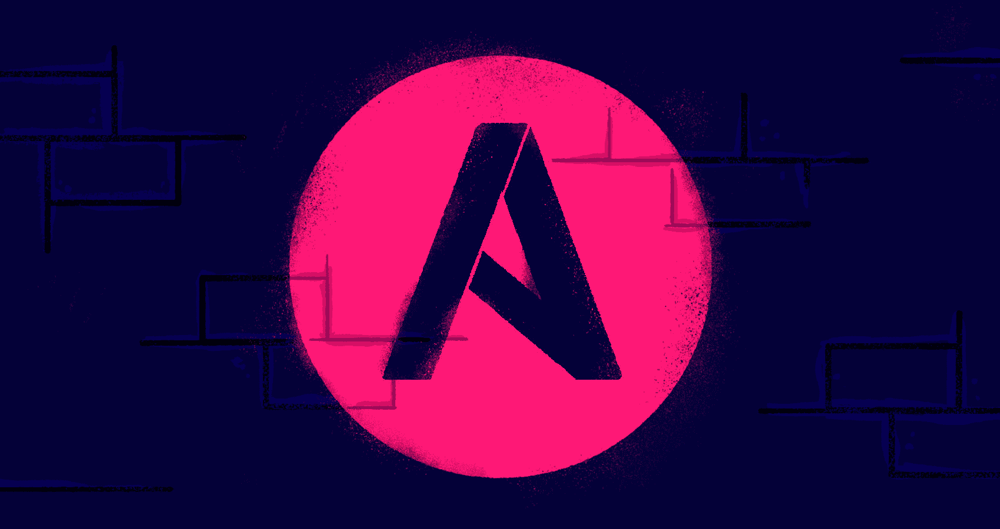

# 以下是 2021 年人们在 ACG 搜索最多的内容

> 原文：<https://acloudguru.com/blog/engineering/the-cloud-top-ten-the-most-searched-cloud-topics-at-acg>

我们搜索的内容透露了很多关于我们的信息。那么 2021 年你搜索的是什么？等等。不是特指你。(那会有点令人毛骨悚然。)不，在本帖中，我们将涵盖过去一年中我们的学习者在 A Cloud Guru 平台上搜索最多的技术主题。

事不宜迟，下面是 2021 年 ACG 十大热门搜索话题——云。

* * *

## 通往更好职业的钥匙

[从 ACG 开始](https://acloudguru.com/pricing)通过 AWS、Microsoft Azure、Google Cloud 等领域的课程和实际动手实验室改变你的职业生涯。

* * *

## 10.蔚蓝的

我们已经看到微软 Azure 在过去一年左右的时间里在我们的平台上获得了巨大的动力，但它在我们的榜单上排名第十。随着时间的推移，我们预计它会获得更多的关注——随着更多的公司(尤其是企业)选择从云开始，Azure 和其他公司转向云计算战略。

你可以通过每周视频系列 [Azure This Week](https://acloudguru.com/videos/azure-this-week) 来了解 Azure 的一切。

* * *

## 9.DevOps

不知道你到底在找什么？那么，为什么不去寻找一切呢？

DevOps 技能需求量很大，人们希望更好地了解晋升或进入这些角色所需的技能和工具。有道理！

如果你想了解或提升你的 DevOps 游戏，请查看我们的 [DevOps 学习路径](https://acloudguru.com/learning-paths/devops)。

* * *

## 8.詹金斯

一个新人出现了！詹金斯在 2021 年初首次出现在我们的十大搜索中。Jenkins 为开发人员提供了自动化部分软件开发的方法，如构建、测试和部署。金克斯。自动化是不是很棒？

好奇想接触詹金斯吗？查看我们的[通过参加](https://acloudguru.com/course/learn-jenkins-by-doing)课程学习詹金斯。

* * *

## 7.Linux 操作系统

Linux 运行着我们每天看到和使用的惊人数量的技术:公共和私人服务器、Roku、游戏控制台、NASA 太空机器人和大型强子对撞机。

想了解更多关于 Linux 的知识吗？我们掩护你！查看我们的 [Linux 培训](https://acloudguru.com/training-library/linux-training)。

刚刚开始？把你热爱 Linux 的眼睛放在我们的[免费云培训](https://acloudguru.com/blog/news/whats-free-at-acg)课程的循环综述上，其中包括[如何获得 Linux 工作](https://acloudguru.com/course/how-to-get-a-linux-job)和 [Linux 操作系统基础](https://acloudguru.com/course/linux-operating-system-fundamentals)。

* * *

## 6.自动警报系统

公共云之王不在我们的名单上，但它仍然是我们在各种内容类型中最受欢迎的话题之一，类似于[哪个 AWS 认证适合我？](https://acloudguru.com/blog/engineering/which-aws-certification-should-i-take)像 [AWS 认证解决方案架构师助理(SAA-C02)](https://acloudguru.com/course/aws-certified-solutions-architect-associate-saa-c02) 这样的课程全年都很受欢迎。

* * *

[**得到痛苦的云词典**](https://get.acloudguru.com/cloud-dictionary-of-pain)
*说云不一定要辛苦。在我们的[云指南](https://get.acloudguru.com/cloud-dictionary-of-pain)中，你会发现一些最令人头疼的云概念的简明定义列表。*

* * *

## 5.码头工人

Docker 是这样一个中流砥柱，它在列表中排名如此之高并不令人惊讶。Docker 一直是我们的学习者关注的顶级开发工具之一。

想获得 Docker 的实践经验吗？停止搜索！我们为您提供了深入的[边做边学](https://acloudguru.com/course/aws-certified-solutions-architect-associate-saa-c02)课程。

* * *

## 4.Ansible

自动化它。(一致！)配置管理。自动化部署。想象一下，自动完成以上所有工作并完全避免糟糕的配置。

全新的 Ansible？获取 Ansible 的[介绍，或者查看](https://acloudguru.com/course/introduction-to-ansible)[通过做](https://acloudguru.com/course/learn-ansible-by-doing)来学习 Ansible。

* * *

## 3.库伯内特斯

没有容器的生活是什么？根本不是生活。或者说，不是一种无障碍的生活。随着数亿人争相购买 Playstation 5，如果你的电子商务应用程序背后没有指挥，祝你好运。

寻求了解 K8s 的更多信息？查看我们的 [Kubernetes 小抄](https://acloudguru.com/blog/engineering/kubernetes-cheat-sheet)，获得学徒级别的[深度潜入 Kubernetes](https://acloudguru.com/course/kubernetes-deep-dive) ，或者在本月与 [Kubernetes 一起跟上 K8s 混乱。](https://acloudguru.com/videos/kubernetes-this-month)

* * *

## 2.计算机编程语言

所有机器训练的首选语言之一。随着机器训练在云技术上获得独一无二的地位，我们希望看到这一点在顶部持续表现。特别是，云提供商正在优化培训硬件，如谷歌的 TPU。

想学习一些新的 Python 知识吗？获取免费视频[云编程语言:Python](https://youtu.be/vq-1IbzZXPc) 的 premier，或者查看我们的[Python 开发简介](https://acloudguru.com/course/introduction-to-python-development)课程。

* * *

## 1.将（行星）地球化（以适合人类居住）

想象一下，试着管理 VPC 里的所有东西。现在他们中的两个。现在 2000。不好玩，对吧？好吧，随着应用程序不可避免地扩展到数亿用户，你真的需要自动化大部分工作。赞 Terraform。

想了解更多关于 Terraform 的信息吗？查看我们的 [HashiCorp 认证 Terraform 助理](https://acloudguru.com/course/hashicorp-certified-terraform-associate)课程，或获取免费的[终极 Terraform 命令备忘单](https://acloudguru.com/blog/engineering/the-ultimate-terraform-cheatsheet)。

* * *

## 谷歌云平台在哪里？

值得注意的是，我们*没有*看到的是[谷歌云(GCP)](https://acloudguru.com/blog/engineering/what-is-google-cloud-platform-gcp) 一直位居搜索关键词榜首。

虽然谷歌云作为公司的另一种选择正在增长——特别是当他们转向云计算方法来构建基础设施时——但与 AWS 和 Azure 相比，它仍有一些增长空间。

但是如果你要找的是 GCP 的技术，我们还是会帮你的！本月在我们的[GCP](https://acloudguru.com/videos/gcp-this-month)视频系列中了解谷歌云的所有事情，查看我们对[的概述，哪些 GCP 认证最适合你](https://acloudguru.com/blog/engineering/which-google-cloud-certification-is-best-for-me)，或者浏览我们的 [GCP 培训](https://acloudguru.com/training-library/gcp-cloud-training)目录。

## 搜索趋势

甚至在 2020 年，几个话题仍然保持着惊人的一致性。具体来说，Kubernetes 和 Terraform 这几年一直是 ACG 搜索量最高的词。但这并不完全令人惊讶。容器和基础设施管理是云计算的一些最重要和最基本的原则。

还有一些我们称之为赛马的项目，借用政治投票(或者体育博彩，如果你喜欢的话)的术语。

我们已经多次看到对 AWS 和 Python 交易场所的搜索，直到 2021 年 2 月，Python 是我们搜索最多的术语。机器学习生态系统的大部分都建立在 Python 之上，而 AWS 仍然是顶级的云基础设施。

从 2020 年末到今天，对 Terraform 的兴趣从高到高。但是对 Linux、Ansible 和 Docker 的兴趣也增加了。而 Azure 搜索量略有下降。

看看这张时髦的图表，看看 2020 年 8 月至 2021 年 5 月之间的一些历史背景。

## 这一切意味着什么？

这不一定是对云计算中技能和专业知识需求的全面看法。

虽然在一定程度上代表了生态系统，但我们的搜索也是感兴趣的瞬间的快照。如果有任何优秀的例子，那就是 Jenkins——一个不到十年的自动化工具——在 2021 年 2 月首次进入前十名。

因此，当考虑在构建云技术专业知识时将时间投入何处时，请始终考虑多个数据点。

然而，我们确实希望这个数据点至少也能帮助你决定在新的一年开始的时候，你应该把精力放在哪里。

无论你用这些信息做什么，当我们开始新的一年时，记得花时间照顾好自己。对你来说，也许*意味着*提升你的云计算智商，让[开始你的云计算生涯](https://acloudguru.com/blog/engineering/jump-start-your-cloud-career)。但是这也可能意味着去散步——或者去 Stardew Valley 的一个农场。无论你在 2022 年做什么，继续保持牛逼，云大师们！

*对这个列表有什么想法？你眼中有什么惊喜或不安吗？在 [Twitter](https://twitter.com/acloudguru/status/1477700630089125888) 或 [Discord](https://discord.com/invite/acloudguru) 上加入对话。*

* * *

希望提升您的云计算职业生涯？停止搜索，开始学习！[开始](https://acloudguru.com/pricing)与云专家一起动手，掌握最受欢迎的技术技能。