# 寻求云可用性|云专家

> 原文：<https://acloudguru.com/blog/engineering/the-quest-for-availability>

## 你的顾客有几个 9 的幸福？

在这一系列的文章中，我将带领你设计、构建和部署一个大规模、多区域、主动-主动架构——同时尝试打破它。

想法是将系列分成以下结构:

1.  **对可用性的追求**
2.  **[如何在 AWS 上搭建多区域主动-主动架构](https://medium.com/the-cloud-architect/why-and-how-do-we-build-a-multi-region-active-active-architecture-6d81acb7d208)**
3.  **[构建多区域、主动-主动无服务器后端](https://acloudguru.com/blog/engineering/building-a-serverless-multi-region-active-active-backend?utm_source=medium_blog&utm_medium=redirect&utm_campaign=medium_blog)**
4.  **[在 VPC](https://acloudguru.com/blog/engineering/adding-support-for-vpc-build-a-serverless-multi-region-active-active-backend-solution?utm_source=medium_blog&utm_medium=redirect&utm_campaign=one_platform)** 内构建多区域、主动-主动无服务器后端
5.  **[多区域重装:用全局加速器和应用负载平衡器加速无服务器应用](https://medium.com/the-cloud-architect/multi-region-serverless-backend-reloaded-1b887bc615c0)**

当然——随着我继续写作并得到你的反馈，结构可能会改变，所以请在下面的评论中随意引导这个故事的进程🙂

## **系统故障**

我最喜欢的影响我对软件工程思考的一句话来自 Amazon.com 的首席技术官沃纳·威格尔。

> "失败是必然的，随着时间的推移，一切终将失败."

的确，我们生活在一个混乱的世界里，失败是一等公民。失败通常有三种味道:早期故障、磨损(或晚期)故障和随机故障——每种故障都出现在任何给定系统生命周期的不同阶段。

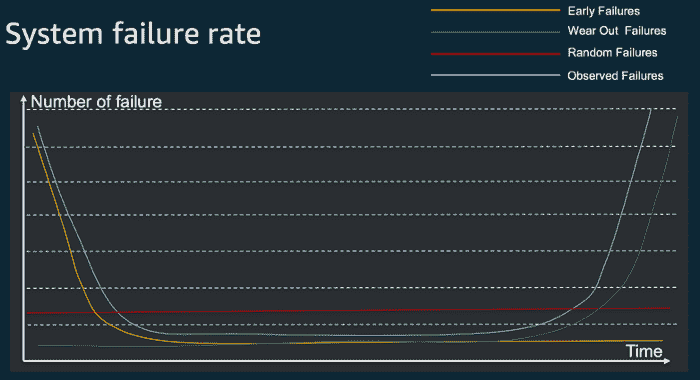

The “bathtub” curve of failure

**早期故障**本质上与编程和配置错误有关(打字错误、变量突变、网络问题，如端口和 IP 路由错误配置、安全性等……)。随着时间的推移，随着产品(或版本)的成熟和自动化的开始，这些失败自然会减少。

*注意:我刚刚提到了“自动化启动”！这实际上意味着你必须使用自动化来体验早期失败的这种自然下降行为。手动操作不允许这种奢侈。*

**磨损(或晚期)故障** —你经常在网上读到软件系统不像物理组件，不会出现磨损故障。嗯，软件是运行在硬件上的，对吧？即使在云中，软件也会受到硬件故障的影响，因此应该加以考虑。

但这还不是全部，磨损故障还常常与配置漂移有关。事实上，配置漂移是灾难恢复和高可用性系统失败的主要原因。

**随机故障**基本上是随机的。一只松鼠在啃你的电缆。一条鲨鱼在横跨大西洋的电缆上刷牙。一个醉酒的卡车司机瞄准了数据中心。宙斯在玩闪电。别傻了，随着时间的推移，你最终也会成为可笑的意外失败的牺牲品。

## **创新的活力**

我们生活在一个速度至关重要的环境中——我的意思是能够持续交付软件。为了让您了解大规模部署的速度，[*Amazon.com 在 2014 年大约进行了 5000 万次部署*](https://www.allthingsdistributed.com/2014/11/apollo-amazon-deployment-engine.html)*，也就是大约每秒 1.6 次部署。*

*当然，并不是每个人都需要这样做——但是软件交付的速度，即使是在较小的规模上，也会对客户满意度和保留率产生很大的影响。*

*那么速度如何影响我们的“浴缸”故障率曲线呢？现在看起来更像是一只准备生吞你的鲨鱼的嘴。事实上，对于每一个新的部署，新的早期故障都会抛给你，希望能让你的系统崩溃。*

*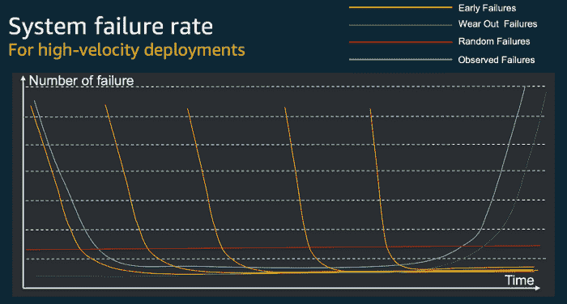

How it really looks like.* 

*正如您很容易注意到的，这在追求高可用性和创新速度之间产生了矛盾。如果您缓慢地开发和发布新功能，您将会有更好的可用性——但是您的客户可能会从其他人那里寻求创新。*

*另一方面，如果你走得很快，并代表客户不断创新，你就有失败和停机的风险——这是他们不喜欢的。*

*为了帮助您理解您在与什么做斗争，我列出了可用性的**“臭名昭著的 9”**表。让那张桌子下沉一分钟。*

*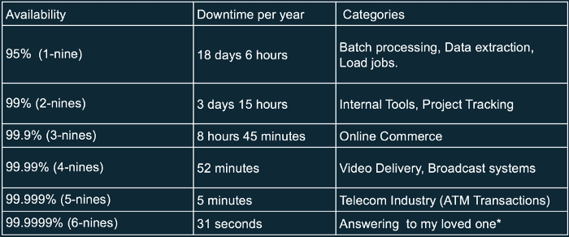

“The Infamous Nines” of Availability* 

***如果您想拥有“5 个 9”的可用性，您一年只能承受 5 分钟的停机时间！！***

*几年前，我亲身经历了整个系统的崩溃。我们的团队花了几分钟才意识到发生了什么，又花了几分钟让我们振作起来，降低我们的心率，又花了几个小时来完成完整的系统恢复。*

> *吸取的教训:如果有 __ 人参与恢复你的系统，你可以和臭名昭著的九个说再见了*

## *AWS 的可用性与可靠性*

*那么，为了客户的更大利益，如何协调可用性和速度呢？有三件重要的事情，即:*

1.  *构建高度可靠和可用的系统*
2.  *工具、自动化和连续交付*
3.  *文化*

*简单地说，你的目标应该是让团队中的每个人都有足够的信心把事情推向生产，而不害怕失败。*

*最好的方法是首先拥有高度可用和可靠的系统，拥有合适的工具，培养一种接受和珍惜失败的文化。接下来，我将更多地关注可用性和可靠性。*

> *值得记住的是，一般来说，一个可靠的系统具有高可用性，但是一个可用的系统可能非常可靠，也可能不太可靠。*

* * *

## *云中的可用性是什么？*

*假设您有两个组件，X 和 Y，可用性分别为 99%和 99.99%。如果将这两个组件串联起来，系统的整体可用性会变得更差。*

*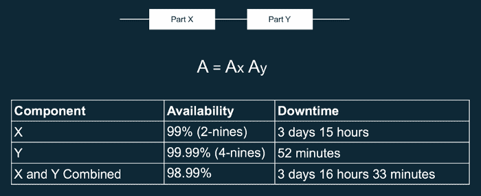

Availability in series* 

*值得注意的是，普遍的观点“链条的强度取决于最薄弱的环节”在这里是错误的——链条实际上恶化了。*

*另一方面，如果您采用这些组件中最差的一个，在这种情况下，具有 99%的可用性，但将其并行放置，您会显著提高整个系统的可用性。工作中的数学之美，我的朋友们！*

*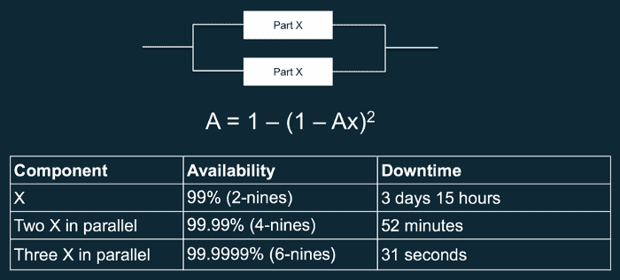

Availability in parallel* 

*从中有什么收获？组件冗余显著提高了可用性！*

**注意:您也可以使用以下等式计算可用性:**

*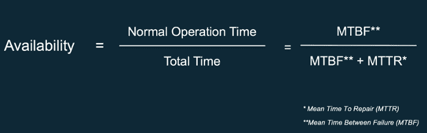

Calculating System Availability* 

*好了，现在我们理解了这一部分，让我们看看 AWS 区域是如何设计的。*

## *AWS 可用性区域和可用性分区*

*从 [AWS 网站](https://aws.amazon.com/about-aws/global-infrastructure/)，您可以阅读以下内容:*

> *AWS 云基础架构围绕区域和可用性区域(“AZs”)构建。区域是世界上有多个可用性区域的物理位置。可用性区域由一个或多个独立的数据中心组成，每个数据中心都有冗余电源、网络和连接，位于独立的设施中。*

*由于一张图片相当于 48 个单词，AWS 区域看起来就像这样。*

*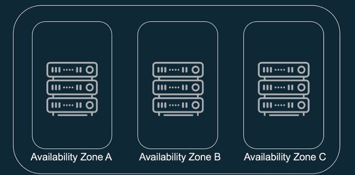

An example AWS Region with 3 AZs.* 

*现在你可能明白为什么 AWS 总是谈论和建议它的客户跨多 AZ 部署他们的应用程序——最好是三个。就因为这个等式，我的朋友们。*

*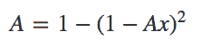*

*通过跨多个 az 部署您的应用程序，您可以神奇地提高可用性，而且只需很少的努力。*

*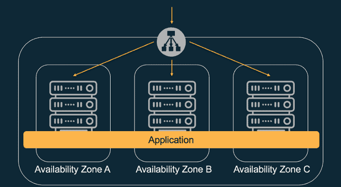

Application deployed across multi-AZ using a Elastic Load Balancer (ELB).* 

*这也是为什么使用 S3、DynamoDB、SQS、Kinesis、Lambda 或 ELBs 等 AWS 区域服务是一个好主意的原因——它们默认使用多个 az。这也是为什么使用在多 AZ 部署中配置的 RDS 很简洁的原因！*

## *可用性的代价*

*不过要记住的一件事是[可用性确实有相关的成本](https://acloudguru.com/blog/engineering/the-true-cost-of-cloud-a-comparison-of-two-development-teams)。您的应用程序需要的可用性越高，所需的复杂性就越大，因此成本也就越高。*

*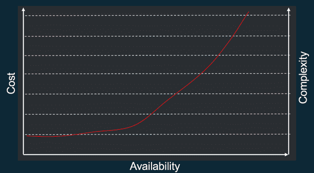

The price of Availability.* 

*事实上，高可用性应用程序对开发、测试和验证有着严格的要求。但特别是，它们必须可靠，我的意思是完全自动化并支持自我修复，这是系统从故障中自动恢复的能力。*

*他们必须动态地获取计算资源以满足需求，但他们还应该能够减少中断，如错误配置或短暂的网络问题。*

*最后，它还要求按照与应用程序本身相同的最高标准来开发、测试和验证这种自动化和自我修复功能的所有方面。这需要时间、金钱和合适的人，因此成本更高。*

## *提高可用性*

*虽然有数十种甚至数百种技术用于提高应用程序的可靠性和可用性，但我想提到两种我认为最突出的技术。*

***指数退避** 一个软件系统中典型的组件包括多个(服务)服务器、负载平衡器、数据库、DNS 服务器等。在操作过程中，由于前面讨论过的潜在故障，任何这些都可能开始产生错误。*

*处理这些错误的默认技术是在请求方实现重试。这种简单的技术增加了应用程序的可靠性，并降低了开发人员的操作成本。*

*但是，在大规模情况下，如果请求者试图在错误发生后立即重试失败的操作，网络会很快被新的和失效的请求所饱和，每个请求都会争用网络带宽，这种模式会一直持续下去，直到整个系统崩溃。*

*为了避免这种情况，必须使用指数补偿算法。指数补偿算法逐渐降低重试的速率，从而避免网络拥塞。*

*在其最简单的形式中，伪指数退避算法看起来像这样:*

*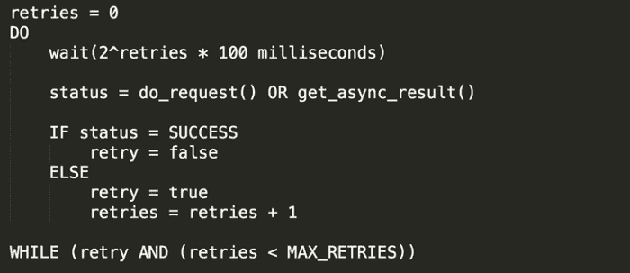

Simple exponential backoff algorithm* 

****注意:*** *如果使用并发客户端，可以在等待功能中加入抖动，帮助你的请求更快成功。这里见***。***

**幸运的是，许多 SDK 和软件库，包括 AWS，都实现了这种算法的一个版本(通常更复杂)。然而，不要假设它，总是验证和测试它。**

**增加应用程序可靠性的另一个重要模式是在通常所说的消息传递架构中使用队列。队列位于 API 和工人之间，允许组件的解耦。**

**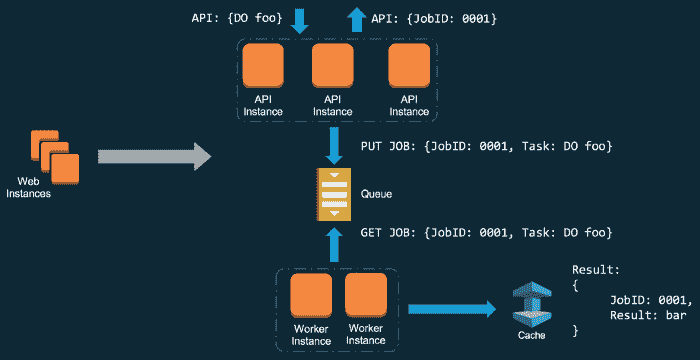

Message-passing pattern with queues.** 

**队列为客户机提供了一劳永逸的请求的能力，让现在在队列中的任务在合适的时间由工人来处理。**

**这种异步模式在提高复杂分布式应用程序的可靠性方面非常强大——但不幸的是，它不像指数补偿算法那样简单，因为它需要重新设计客户端。事实上，请求不再返回结果，而是返回一个 JobID，当结果准备好时，可以用它来检索结果。**

****蛋糕上的樱桃** 将消息传递模式与指数回退相结合，将使您的旅程中最大程度地减少故障对可用性的影响，这也是我学会的最重要的 10 件事情之一。**

* * *

## **获得更好职业所需的技能。**

**掌握现代技术技能，获得认证，提升您的职业生涯。无论您是新手还是经验丰富的专业人士，您都可以通过实践来学习，并在 ACG 的帮助下推进您的云计算职业生涯。**

* * *

**本期就到这里——希望你喜欢！一定要看看这个系列 *的下一部* [*！请不要犹豫给出反馈，分享你自己的观点，或者只是拍手。*](https://read.acloud.guru/why-and-how-do-we-build-a-multi-region-active-active-architecture-6d81acb7d208)**

**阿德里安**