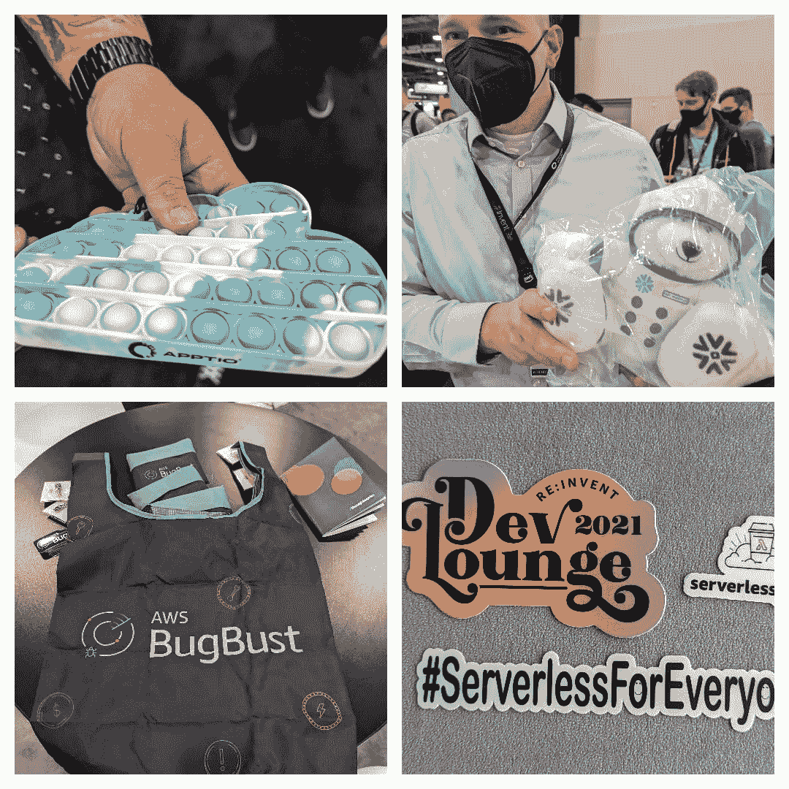
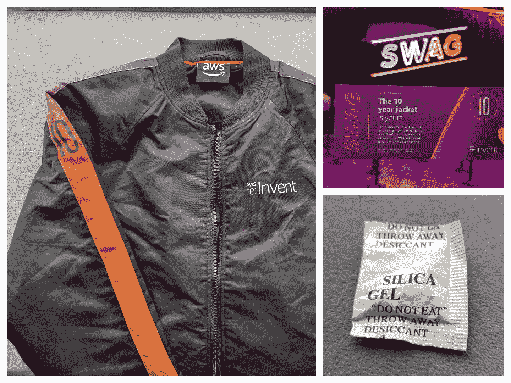
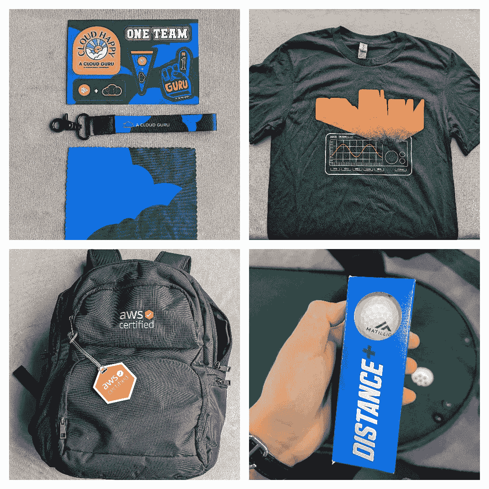
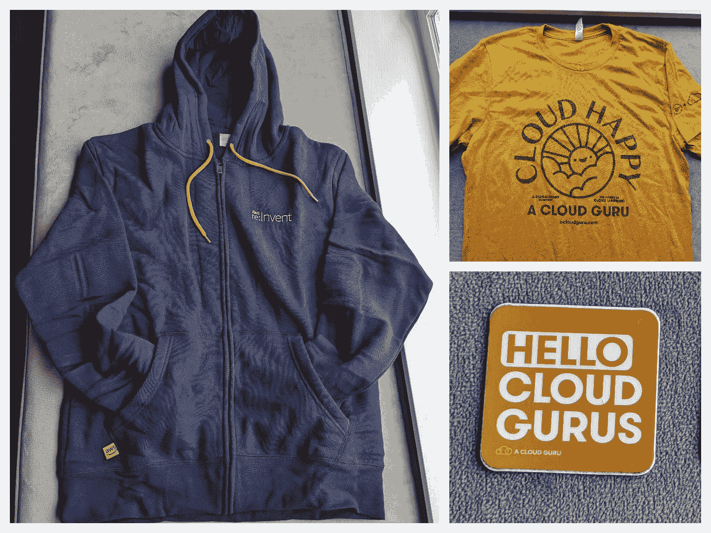
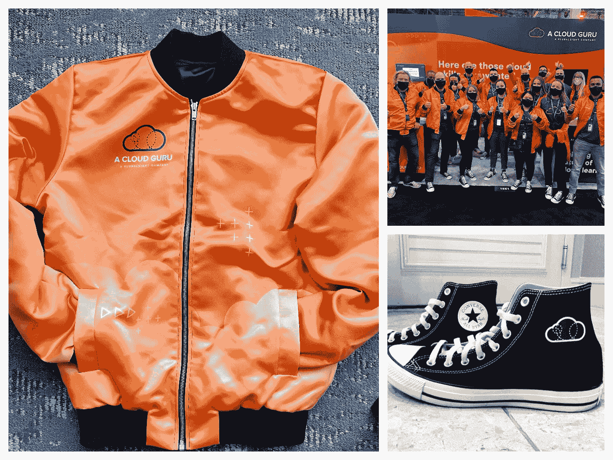
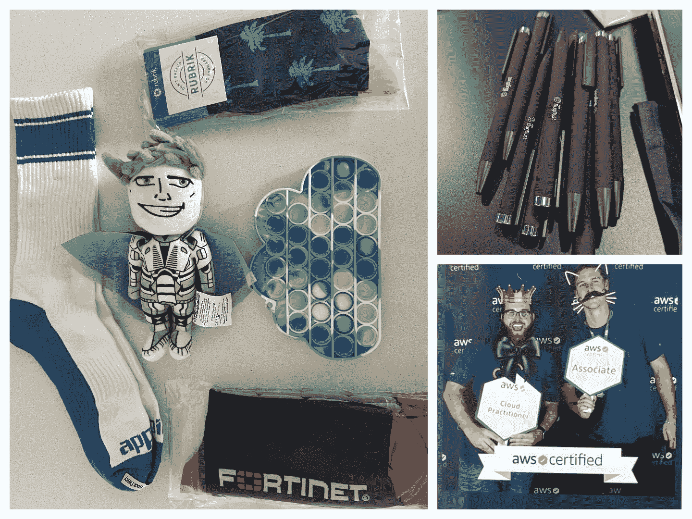
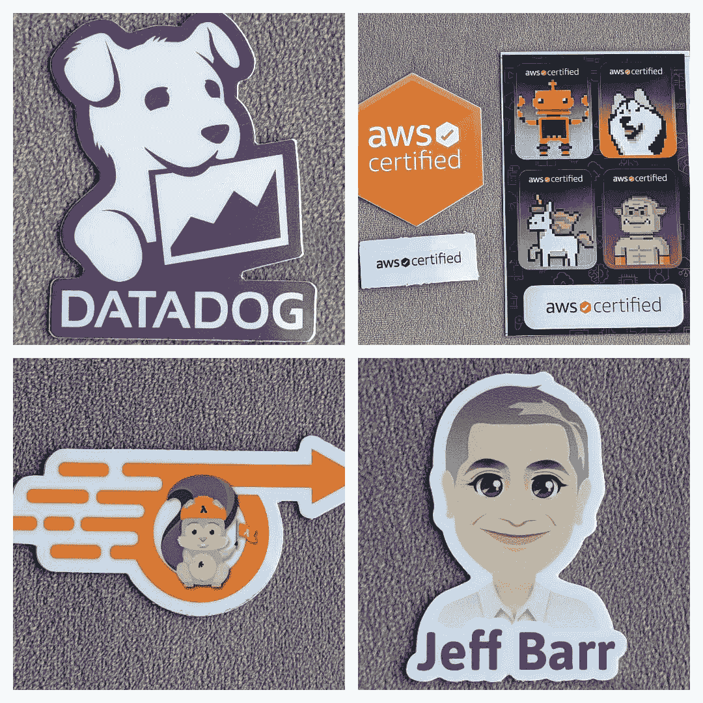
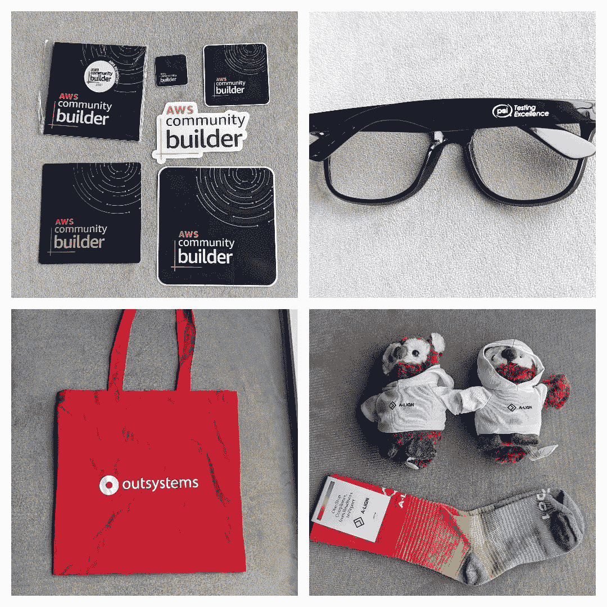
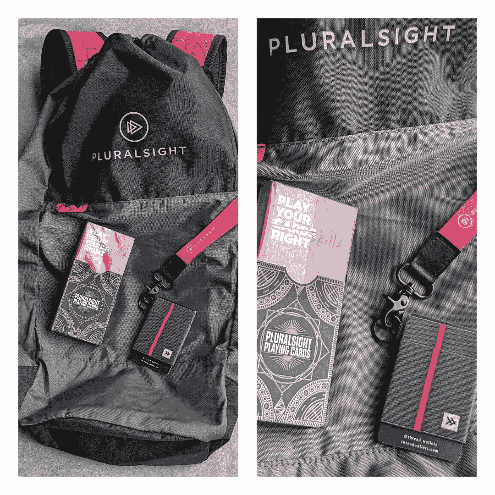
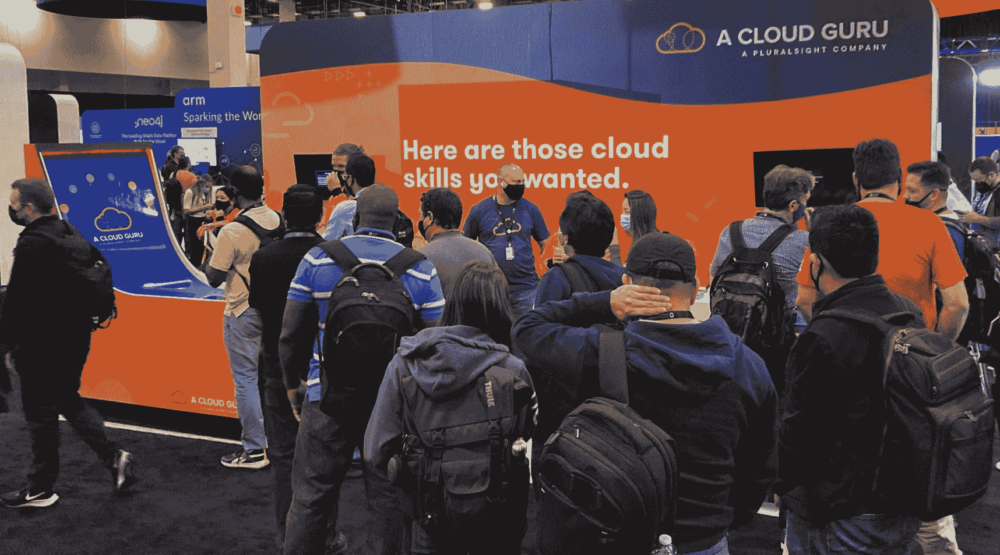

# AWS re:Invent 2021 Swag Review |一位云专家

> 原文：<https://acloudguru.com/blog/engineering/the-swag-and-humans-of-aws-reinvent-2021-reviewed>

## *AWS re:Invent 2021 swag review，加上我们的“再次与人类为伍”报告*

面对面的 AWS re:Invent 2021 的回归标志着许多云学习者渴望的面对面(面具背后)联系的回归。。。还有机会获得大量甜蜜的礼物。

* * *

## 加速您的职业发展

[从 ACG 开始](https://acloudguru.com/pricing)通过 AWS、Microsoft Azure、Google Cloud 等领域的课程和实际动手实验室改变你的职业生涯。

* * *

在本帖中，我们将对《重新发明 2021》进行回顾。因为在拉斯维加斯发生的事情会留在我们的包里，因为我们会带着装满 t 恤、贴纸、杯子和各种品牌商品的行李箱回来。另外，我们对人类的评论！或者更确切地说，我们对时隔如此之久再次回到现场的感受，以及对于我们当中更谨慎的人来说，这一活动有多安全。

为了有所帮助，我们向一些在《re:Invent 2021》现场的大师们求助，谈论他们喜欢什么，不喜欢什么，以及回到《re:Invent》现场的感觉。

## 好的，坏的，和赃物

照片由 Mattias Andersson 提供，Matt Kohn、Joey Hernandez 和 Michelle Kozma 提供额外支持。

### 坏事

让我们从不好的开始，或者一点点的批评。

在远离 re:invent 一年后，ACG 的 Scott Pletcher 觉得今年的 swag 留下了一些不尽人意的东西。即:创造力。

“老实说，今年的奖品真的令人失望(不包括现在的公司)。许多口罩和消毒剂，还有必要的笔和贴纸。创意去哪了？”

也许公司担心投资 swag，担心活动可能在最后一刻转移到虚拟世界？谁知道呢？

* * *

*Check out that snazzy “10 year jacket.” Also, silica gel! Folks who paid attention in English class may feel the quotes around “do not eat” could be read as implying an ironic “do not eat,” but the internet confirms you really shouldn’t eat it.*

* * *

资深客户成功经理 Michelle Kozma 也报告说，在一次会议上看到了很多你所期待的东西。

“有很多类似的东西，但品牌颜色不同，”她说。

* * *

喜欢免费的东西？我们也是！查看[本月的免费 ACG 课程](https://acloudguru.com/blog/news/whats-free-at-acg)免费传播顶级云学习。[创建一个免费账户](https://acloudguru.com/pricing)，然后开始玩吧。不需要信用卡！

* * *

### 好人

米歇尔说，人们似乎很兴奋地回到了抢赃物的游戏中。她还观察到一些流行趋势。

“一些公司发放可重复使用的手提包，让人们可以把所有的赃物都放进去。今年我没有看到任何帽子，但袜子到处都是，”她说。“此外，我很惊讶地发现，分发出去的饮料数量之多，竟然没有一个人是疯子。”

她还报告说注意到很多抽奖活动，公司抽奖出售从任天堂 Switch 到踏板车到公民手表的所有东西。

ACG 的 Mattias Andersson 没有关注 swag(在关注内容和[报道最大的 re:Invent 公告之间)](https://acloudguru.com/blog/engineering/aws-reinvent-2021-the-biggest-announcements)但是他也注意到了一些令人兴奋的赠品。

“我忙于活动和与人交往(在现实生活中！！！)以至于我几乎没有注意到所有的(仍然很酷！)赃物，”他说。“不过，我确实看到一些公司在赠送任天堂 Switch 游戏机、无人机和虚拟现实护目镜。”

鉴于可持续发展是今年的一大焦点，Mattias 认为这些奖项比那些在不久的将来注定要被扔掉的低质量奖品更好。

“一次性用品可能最好不要提供，”他说。“赠品应该是真正有用的，而不仅仅是更多的消费浪费——如果这意味着更多的奖品而不是小摆设，那就这样吧！”

*The re:Invent 2021 hoodie, ACG’s “cloud happy” shirt, and a vintage ACG sticker. (Mattias had a few of these on hand and passed them out to folks at the show. Don’t tell the brand people!)*

*Call us biased, but we were pretty stoked about the ACG crew exclusive gear. We gave out a very limited number of these bomber jackets to some contest winners. But if you’d like one, just come work with us! (We’ll also give you money!)*

*Swag, swag, and ACG’s Matt Kohn and Mike McMahan posing for an AWS Certified photobooth pic.*

* * *

### 趋势

品牌战略总监马特·科恩(Matt Kohn)是一位长期的 swag 创造者(也是终身的 swag 粉丝)。他说，飞行员夹克似乎是今年的一大趋势，包括 ACG 员工在展台上穿的那些顶级赃物。

说到……在 ACG 展台，马特大部分时间都呆在那里(放松，马鑫),放松得很酷，当一个——哦，对不起——马特说一个云专家的“云快乐”衬衫很受欢迎时。

“我们让人们排了长达 30 分钟的队才买到一个，”他说。

* * *

*There are lots of great reasons to talk to Jeff Barr. Getting an amazing sticker is just one of them.*

*Some swag was exclusive, like the AWS Community Builder swag in the top left.*

*Pluralsight swag included a backpack, playing cards, and a wallet.*

* * *

### 其他 AWS re:Invent 2021 亮点

## re:Invent 2021 的人类:回到会议上是什么感觉？

模糊了赃物和贴纸与人类之间的界限:马特随身携带着自己脸上的贴纸(就像一个人一样)，在某个时候掉了一张贴纸。他后来通过 Twitter 的魔力发现，一只马特·多普朗热发现了它，并贴了一张照片。

那个小小的 ~~world~~ conference 时刻只是那段难忘时光的锦上添花。马特说，总的来说，亲自回到 re:Invent 的体验棒极了。

“能够聚在一起，与人们见面，分发礼物，这种感觉真好，”马特说。“在这么长时间没有亲自参加活动后，再次亲自聚在一起令人振奋。”

马蒂亚斯(不要和马特混淆)也有同样的感觉。

“能亲自回来真是太棒了！几乎没有办法复制面对面发生的随机互动。马蒂亚斯说:“无论是在走廊上、在展台上、在午餐时、在排队时、在 cert 休息室、在聚会上的随机聊天，还是在餐馆里让人们随机向你走来，我们建立的人际关系都是 AWS re:Invent 的真正价值。”“还有，我喜欢 re:Play 的人愿意加入我们在无声迪斯科和音乐会上的愚蠢和糟糕的舞蹈！”

## AWS re:Invent 2021 感觉安全吗？

从各方面考虑，我们采访过的大多数人都表示感觉很安全——即使是那些对参加如此重大的活动感到有点不安的人。

AWS 要求人们在获得徽章之前出示疫苗接种证明，不吃不喝时强制佩戴口罩。但是到处都有许多裸露的鼻子从面具中露出来。

## 与云学习者聊天

虽然大多数收集品牌赠品，但 ACG 的 Jess Alvarez 收集了云学习者的良好反响(在从 re:Invent 定期发布[更新的间隙)，包括与一位学习者交谈，他说，“使用云专家是我做出的最好决定。你的](https://acloudguru.com/blog/tag/reinvent2021) [DynamoDB 课程](https://acloudguru.com/course/amazon-dynamodb-deep-dive)太棒了。我已经能够将我从那门课程中学到的知识运用到我目前的工作中。”

Jess 还与来自埃森哲的一位女士聊了聊，这位女士最近获得了 T2 的 AWS 云从业者认证，她很高兴能继续获得 T4 的解决方案架构师助理认证。她顺道感谢 ACG 的联合创始人 Ryan Kroonenburg 的课程，并帮助她获得证书，这推动了她的职业生涯。

对于 re:Invent 的许多人来说，云提供了改变生活的机会。杰斯分享了下面这个我们忍不住分享的故事。

“我最喜欢的一个故事来自一位绅士，他以前是家乡一家当地餐馆的送货司机。他想做出改变，开始赚“真钱”。他和他的一个朋友聊了聊，他们给他介绍了一位云专家。他参加了[云基础课程](https://acloudguru.com/course/cloud-computing-foundations)，然后一头扎进了 AWS。他现在已经获得了 AWS 的全部三个助理认证，从“做花生”变成了“过六位数的生活”多么不可思议的旅程！他很有趣，充满希望，还没有完全成长。"

Mattias 同意这种互动是 ACG 员工真正的亮点。

“没有什么比听到一个接一个的人讲述 ACG 如何为他们改变生活的职业发展做出贡献更好的了，”他说。

Jess 说，参加面对面的会议让她对这样的互动感到感激，并有机会与这么多酷酷的云专家交谈(和书呆子一起出去)。

她说:“他们为实现他们所做的一切而付出的奉献和毅力令人鼓舞，我为他们所有人感到骄傲。”"我希望很快能在我们的不和谐服务器上看到它们."

好棒的插头，杰西！完美的结束一个关于赃物的帖子，这实际上是一个 t 恤形式的插件。

但是在这些方面，如果你有一些关于云学习如何改变你生活的故事，请在 [Twitter](https://twitter.com/acloudguru) 、[脸书](https://www.facebook.com/acloudguru)、 [YouTube](https://www.youtube.com/c/AcloudGuru) 、 [LinkedIn](https://www.linkedin.com/company/a-cloud-guru) 、 [Discord](https://discord.com/invite/acloudguru) 上给我们留言——无论我们在互联网的什么地方。我们*喜欢*聆听和分享您的故事，以帮助激励他人跃上云端，提升他们的职业生涯。

感谢每一个在 ACG 和多元之光展位驻足的人，我们希望在 re:Invent 2022 上见到你。在那之前:继续牛逼吧，云大师们！

### 跟上云的所有事物

回复:发明可能已经消失在夕阳中，但你可以向前看，通过在推特上关注 ACG，在 T2 关注脸书，在 YouTube 上订阅云专家。甚至当你远离大型云会议的浮华、魅力和洗手液站时，你也可以在 ACG 的 Discord 社区与思想不统一的人联系。