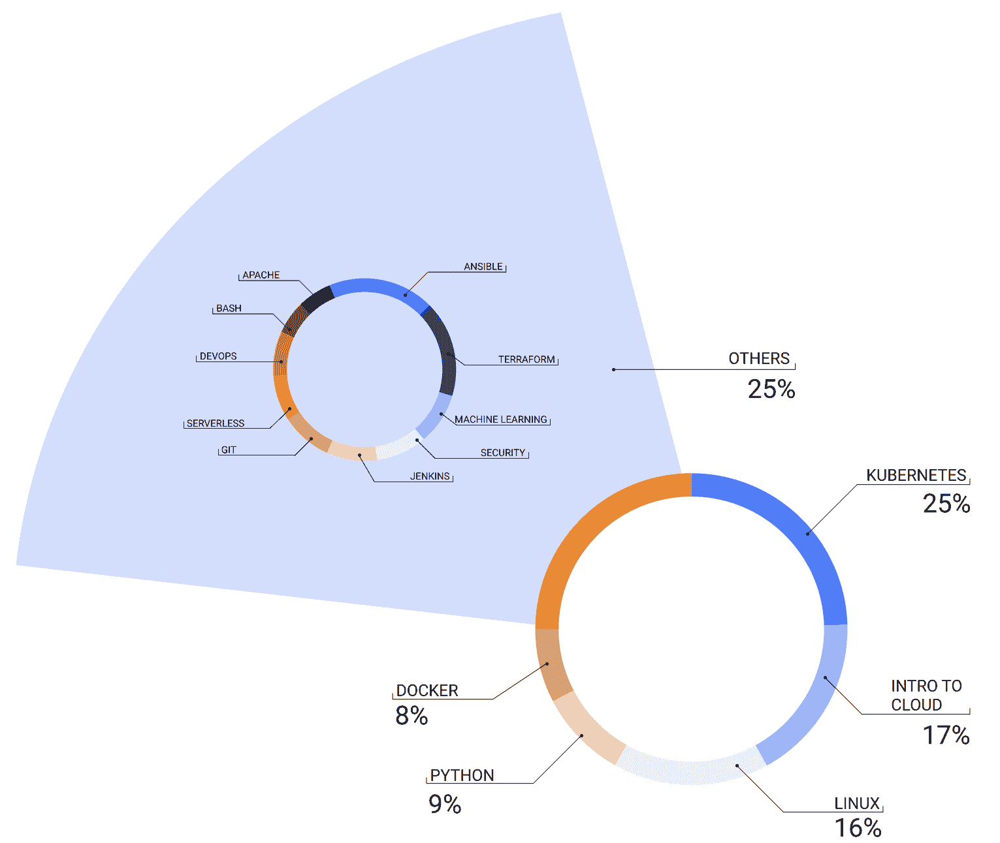
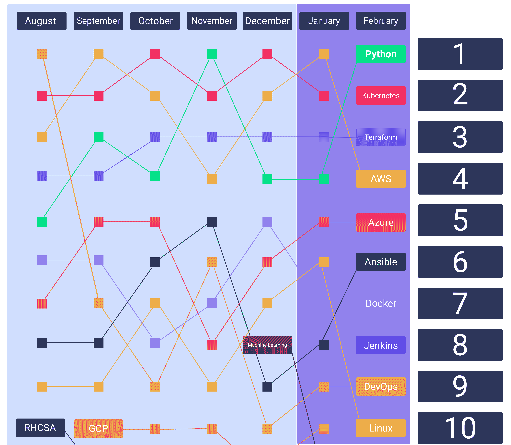
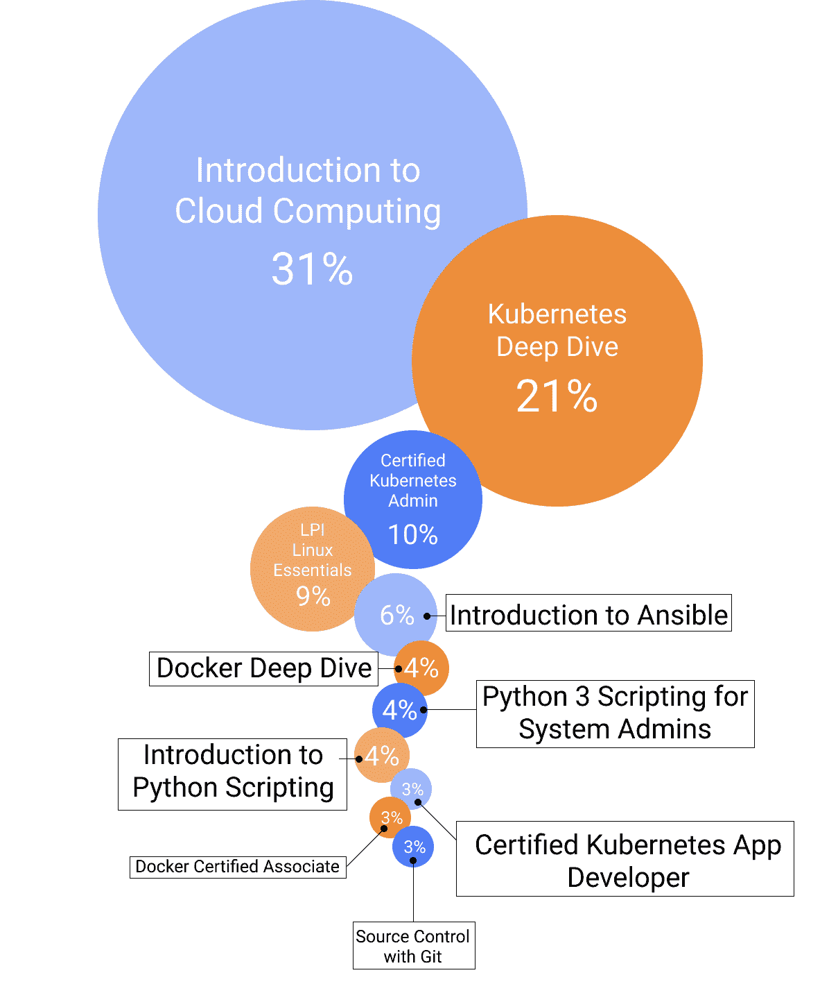
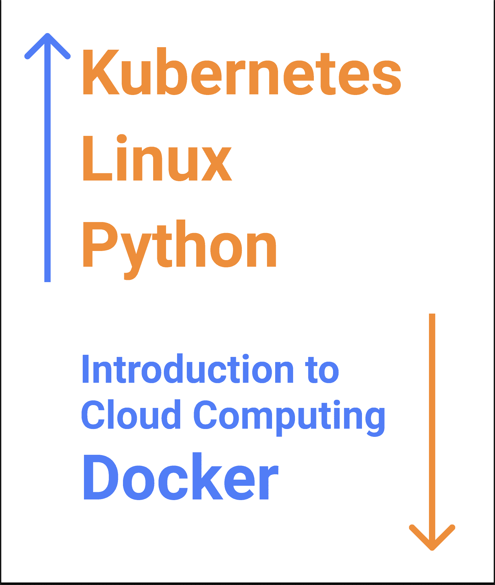

# 2021 年人们正在学习的关键开发运维技能|云专家

> 原文：<https://acloudguru.com/blog/engineering/the-top-devops-skills-people-are-learning-at-a-cloud-guru-right-now>

当你看到云时，AWS、Azure 和 Google Cloud 并不是终点站。他们通常甚至不在火车出发的地方！相反，这要从驱动它们的工具开始，其中一些甚至比云本身还要古老。随着世界转向越来越定制化的方法来支持云操作，Python 和 Linux 等许多工具正在重新焕发生机或变得越来越重要。

我们分析了 100 多门课程中超过 100 万门课程的语料库，以评估学习者在开发工具上花费的时间。我们排除了明确专注于 AWS、Azure 或 Google Cloud 的工具，以了解对支持这些服务的基线开发人员工具的兴趣。

* * *

*有兴趣升级或开始您的 DevOps 之旅吗？云专家的 [AWS DevOps 学习路径](https://acloudguru.com/learning-paths/aws-devops)提供适合初学者和高级专家的定制课程！*

* * *

我们的分析是基于[我们的学习者如何使用 ACG 平台](https://acloudguru.com/blog/news/a-cloud-guru-ranks-as-top-online-course-and-technical-skills-provider-on-g2s-grid-report)，并不意味着这是开发者运营和云计算技能需求的最终结果。随着时间的推移，我们希望它是这种兴趣的快照，希望帮助我们的学习者在如何成长的问题上做出决定，而不是发号施令。

## 顶级云技能和学习趋势

以下是我们发现的一些主要趋势，我们将在下面深入探讨:

*   **地球人，你们好:**虽然我们的分析涉及细分为特定的开发人员工具，但我们的[云计算简介](https://acloudguru.com/course/introduction-to-cloud-computing)课程本身是我们最受欢迎的独立于供应商的课程。
*   **包含云**:容器工具，尤其是 Docker 和 Kubernetes，统治了我们的大部分完成数据，并且排名始终如一。
*   人工智能:机器学习作为一个小众类别，是我们增长最快的领域之一。当然，这是由我们的顶级语言的 **Python 支持的。**
*   詹金斯，给我拿杯饮料:在我们的利基工具中，我们看到詹金斯迅速成为 DevOps 瑞士军刀的重要组成部分。

所有这些只是触及了云复杂性的表面。

## 顶级 DevOps 容器技能和课程

在我们分析的顶级类别中，大约有三分之一的 DevOps 学习者选择 Kubernetes 和 Docker 课程。Linux 和 Python 占四分之一，我们对云计算的介绍占我们顶级 DevOps 类别总完成量的近五分之一。去年，我们将 ACG 平台和 Linux 学院结合起来。

尽管如此，在所有这些类别中，我们的云计算入门课程在 Q1 是如此之大，以至于它非常值得拥有自己的类别。本课程也是云不可知的，侧重于基础知识。这只是表明，在开始研究构成云计算工作方式的一些基本要素之前，构建云计算的基本技能是多么重要。

当你深入研究我们在 2 月份和之前几个月的热门搜索时，我们会发现许多相似之处。二月份我们搜索最多的词是 Python，其次是 Kubernetes 和 Terraform。虽然 Terraform 不在我们的五大类别之内，但它是仅次于 Ansible 的第二大子类别。

你可以在我们的完整分析中找到关于我们十大搜索云主题的更多细节[，但现在，这里是这些排名如何追踪到二月份(包括一些供应商)。](https://acloudguru.com/blog/engineering/the-cloud-top-ten-the-most-searched-cloud-topics-at-acg)

## 云的引入很重要，但不是一切吗

事实上，这个世界还不能完全流利地使用云。当我们查看我们的前 10 名开发者课程的完成情况时，我们发现我们的云计算入门课程是最大的。当然，这是有道理的！云每天都在寻找新的方式来为我们使用和部署的工具提供动力，尽管有些服务已经有十多年的历史了。

但是就在我们的入门课程之后——你猜对了——课程集中在 Kubernetes 和 Linux 上。Docker 也参加了我们的顶级课程的一小部分，这些课程与 Kubernetes 一起，再次显示了容器在现代云应用程序中的至关重要性。

同样，当你将它与我们的热门搜索进行比较时，有很多都符合——Python 在那里，Terraform 在那里，Ansible，等等。

当比较 Q1 2021 年和 Q1 2020 年时，我们看到了另一个越来越明显的转变，即更加关注 Kubernetes 和机器学习工具，特别是 Python。我们还看到了云计算入门课程完成率的变化，这可能只是表明我们的学习者越来越熟悉云的基本原则。

然而，很难将这些工具与它们所支持的供应商分开。但是，随着公司越来越多地转向不仅仅使用 AWS 的多云战略，跟踪这些工具如何演变是至关重要的。当查看消费 Azure 和 AWS focus 课程的公司样本时，2019 年与 2020 年相比，Azure 的份额**上升了超过 10%**。([您可以在我们的《云计算深度探索之路》中找到对公司迁移到云计算的全面分析。](https://get.acloudguru.com/road-to-multicloud-report))

正如我们之前所说的，我们的目标是对开发者社区的趋势做一个简单的介绍。虽然有些人可能会坚持很长时间(看看你，Python)，但我们最终也可能会看到每年的更替，因为创新的速度似乎只会增加。因此，虽然掌握最新的热门技能很重要，但将你的学习集中在让你兴奋的领域也很重要——即使它们还不一定被广泛采用。

努力学习。明智部署。不要将 numpy 作为 pd 导入。

* * *

*通过我们的课程成为[认证 AWS DevOps](https://acloudguru.com/course/aws-certified-devops-engineer-professional) 工程师专家，掌握您的 DevOps 知识。您还将获得成为 DevOps 主题专家所需的高级技术技能。*

* * *

### 云学习**方法论**

我们审查了 100 多门课程中超过 100 万门课程的完成情况，这些课程侧重于部署在特定供应商领域之外的开发人员工具，如 [AWS](https://acloudguru.com/aws-cloud-training) 或[微软 Azure](https://acloudguru.com/azure-cloud-training) 。我们的分析集中在 2021 年第一季度，并与 2020 年第一季度进行了对比。例如，在复习[无服务器课程](https://acloudguru.com/course/serverless-concepts)时，特定于 Lambda 和[特定于 Azure Functions](https://acloudguru.com/course/serverless-computing-with-azure-functions) 的课程被排除在外，我们专注于部署无服务器工具的一般技能。

作为一个例外，我们包括了我们最受欢迎的 Terraform 和 Ansible 的[课程——虽然侧重于在 AWS 上部署，但它代表了我们对 Terraform 作为一个快速增长的领域的崛起的最佳快照。](https://acloudguru.com/course/deploying-to-aws-with-terraform-and-ansible)

## 提升您的云计算职业生涯

无论您是云新手还是经验丰富的专家，云专家都能让您轻松(而且非常棒)地获得认证并掌握现代技术技能。查看 [ACG 目前的免费课程](https://acloudguru.com/blog/news/whats-free-at-acg-april-2021)或[立即开始](https://acloudguru.com/pricing)免费试用。