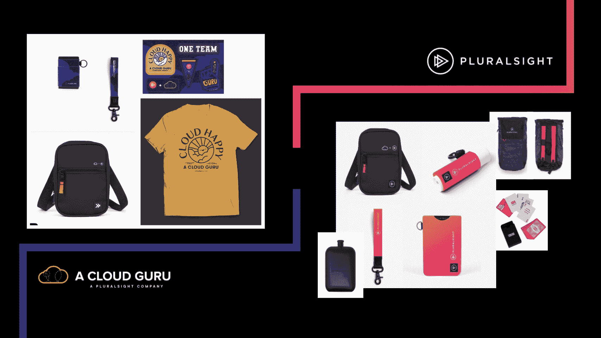

# AWS 最终指南:发明 2021 

> 原文：<https://acloudguru.com/blog/business/the-ultimate-guide-to-aws-reinvent-2021>

随着展会越来越近，本指南将会不断完善。请定期回来查看更新！如果你发现了问题或者缺少了什么东西，请联系我 [@marknca](https://twitter.com/marknca) 。*一如既往，事件现场是真相的最终来源(尽管我试图在这里提供更多的背景)。地点在[https://reinvent.awsevents.com](https://reinvent.awsevents.com/)*

> **抬头**，AWS 对校园做了一个改变。请阅读更新的“酒店”部分，这样你就知道了。

* * *

## 加速您的职业发展

[从 ACG 开始](https://acloudguru.com/pricing)通过 AWS、Microsoft Azure、Google Cloud 等领域的课程和实际动手实验室改变你的职业生涯。

* * *

## 索引

## 一点历史

我年复一年地写了这本指南，用它来追踪 AWS re:Invent 多年来的演变是一个有趣的方法。

以下是 AWS re:Invent past 的指南:

正如您所料，该展会的规模和雄心每年都在增长，这反映了 AWS 云和更大社区的发展。

## 去年

去年的事件是个例外。随着全球疫情和大范围停工，该活动转向了完全虚拟的形式。

这是…不同的。

会议内容令人惊叹，但我们都喜欢的许多事情在虚拟版本中根本不可能实现。这是可以理解的，每个人都曾纠结于虚拟活动与现场活动相比是什么样的。

矛盾的新闻？AWS re:Invent 2021 将是一场面对面的活动，虚拟方面有限。

这意味着这场演出会有非常不同的感觉。不仅在规模上，而且在人口统计学上。会有强大的国际出席吗？将采取哪些安全措施？参加的要求是什么？

简单明了的回答:**没人确定**。

离演出还有几个月，如果你回顾一个月前，事情会非常非常不同。关于今年的 AWS re:Invent 有很多问题。

我有一种强烈的感觉，这份指南将会比往年有更大的变化…这已经说明了很多。

## 行动守则

AWS 回复:发明是关于学习和分享经验的。关键是要确保环境是吸引人的、安全的和支持性的。

[AWS 社区行为准则](https://aws.amazon.com/codesofconduct/?trk=direct,direct)适用于围绕 AWS re:Invent 的物理和数字空间，以及所有其他 AWS 活动。

我会说，这都是常识，遵循的是黄金法则，但随着来自世界各地的成千上万的人分享这一周的经历，最好明确地说出来。

阅读并遵守行为准则。

如果您遇到违反准则的问题，或者您觉得不安全，请寻求帮助。在 aws-events-security-concerns@amazon.com 可以联系到亚马逊安全部门观看现场活动。此外，任何一个现场工作人员或保安都可以帮助解决任何问题。

没有一个系统是完美的，但这是在这个奇妙的活动中创建一个安全、包容的社区的一个良好开端。

* * *

*前往 re:发明 2021？来 1561 号和 1557 号展位与来自 ACG 和 Pluralsight 的工作人员聊天，并为自己赢得一些甜蜜的云礼品！*

* * *

## 我是谁？

我是一名 AWS 社区英雄，一名长期的 AWS re:Invent 参与者(所有人！)也是该剧的忠实粉丝。

我在一个云专家平台上教授几门课程( [AWS 业务要点](https://acloudguru.com/course/aws-business-essentials)、[AWS 市场介绍](https://acloudguru.com/course/introduction-to-the-aws-marketplace)、[掌握 AWS 架构良好的框架](https://acloudguru.com/course/mastering-the-aws-well-architected-framework))、[定期发微博](https://twitter.com/marknca)，一般来说[书呆子会发](https://markn.ca/)关于云与安全的所有事情。

我每年都写这个指南来帮助社区从这个节目中获得最大的收益。同样，如果我是💯老实说，这有助于我了解正在发生的一切，这样我就可以从节目中获得最大的收获。😉

## 健康措施

AWS 已经[更新了他们正在采取的健康措施](https://reinvent.awsevents.com/health-measures/)，以帮助降低所有参加 AWS re:Invent 2021 的人的整体风险。

和所有事情一样，随着我们越来越接近演出，这些衡量标准可能会改变。

请[阅读官方 re:Invent 网站上的整个页面](https://reinvent.awsevents.com/health-measures/),但关键方面是:

*   活动中的所有徽章持有者必须完全接种疫苗(方案中最后一针后 2 周),并提供疫苗接种记录，以便获得您的徽章
*   参加活动的每个人都需要戴口罩
*   酒店有不同的健康政策，称为" [Vegas Smart](https://www.visitlasvegas.com/vegas-smart/) "，请与您的酒店核实具体措施
*   活动期间，不会强制要求物理距离
*   如果向澳大利亚预警系统披露阳性检测结果，将与相关卫生当局合作开展接触者追踪

## 登记

AWS re:Invent 2021 是**现在** **售罄**。成本是 1799 美元，虚拟访问仍然是免费的。

如果你好奇的话，注册将于 2021 年 6 月 15 日星期二正式开始。

## 酒店

为了与过去几场现场展会的流程保持一致，打折的酒店房间将作为注册流程的一部分在您注册后提供。

这些价格总是很好，而且这些房间都是在举办展览的酒店里。在过去的几年里，这些房间的速度非常快。

事实上，AWS 很快扩大了“校园”,包括了许多没有举办任何活动的酒店，只是那些提供折扣的酒店。

[今年的校园](https://reinvent.awsevents.com/campus/)再次分布在多个场馆；

*   威尼斯 / [宫](https://www.venetian.com/towers/the-palazzo.html)仍然是 AWS re-Invent 的中心。今年，它将举办分组讨论、AWS 认证考试、休息室、内容中心、博览会、主题演讲、领导会议、注册、自定进度的实验室和 **SWAG**
*   [凯撒论坛](https://www.caesars.com/meetings/locations/las-vegas/caesars-forum)提供专题内容、内容中心和餐饮
*   [Encore](https://www.wynnlasvegas.com/rooms-and-suites) 获取分组讨论内容和可预订的会议空间
*   永利有突破性的内容、餐点、训练营，还将举办 Jams

一些最初列出的房产**不再**是园区的一部分。这些酒店将不会举办任何活动，也不再被列为“卧室酒店”:

*   米高梅大酒店
*   米高梅大酒店签名
*   曼德勒湾
*   德拉诺

包含在校园内但不举办活动的场馆；

我们将在活动临近时获得更多信息(一如既往！)但看起来大部分内容将发生在 Venetian/Palazzo、Wynn/Encore 和 Caesars 论坛上。

这与前几年相比有点不同。

艾瑞亚已经放弃了它的活动，转而支持凯撒论坛。这实际上很有道理。现在 AWS 已经调整并从校园中移除了米高梅大酒店，大多数活动将在彼此附近进行。威尼斯人/Palazzo、永利/安可和凯撒论坛是 AWS re:Invent 2021 的中心。

这将使白天在不同地点之间的移动变得容易得多，并给你更多的灵活性来决定实际上住在哪里。

看起来你每天都会去这三家酒店中的一家(或者三家都去)。

* * *

*需要您的团队适应 AWS 云环境吗？ACG 动手实验室是[自定进度的实践实验室](https://acloudguru.com/platform/labs)，将学习者置于模拟与 AWS 相关的真实世界云挑战的环境中。*

* * *

## 虚拟出勤

你可能知道，我是这部剧的忠实粉丝。今年会很棒，但不会一样。世界已经变了。

如果你不舒服或不能亲自参加，有一个有限的虚拟组件。老实说，作为一名国际与会者，我对展会的这一方面感到失望。

目前，主题演讲和领导会议将进行现场直播。活动结束后将提供分组会议。

鉴于 AWS re:Invent 2020 的虚拟基础设施已经到位，我假设这一切都将发生在那个平台上(相对于 YouTube)。

这种方法与以往的面对面交流没有什么不同。😔

我已经创建了一个单独的[参加 AWS 虚拟发明指南](https://markn.ca/2021/getting-the-most-out-of-aws-reinvent-remotely/)，如果你要去偏远地区，可能会有帮助。

## 如何重新发明

该剧第四季《[如何重新发明](https://reinvent.awsevents.com/how-to-reinvent/)》已经开播了！

今年，安妮·汉考克带着新的搭档凯利·舒尔茨回归。

这个节目给你带来了关于会议的提示和技巧，并在我们接近节目的时候给你一个深入的了解。

敬请关注每一集，因为它们总是充满了伟大的信息。

到目前为止发布的剧集；

1.  为什么要参加 re:Invent 2021
2.  预订座位
3.  AWS 合作伙伴在 re:Invent

## 预订座位

AWS 再次推出了预订座位系统。随着健康和安全措施的实施，这在今年可能更加重要。

您可以通过[登录](https://portal.awsevents.com/events/reInvent2021/dashboard)查看专题讲座目录并预订座位。

一如既往，你越早这样做越好。预留座位**现在开放**，不要耽误。

好消息是，这个过程——尽管有时令人沮丧——通常会让一周变得更加顺利。此外，请继续查看，因为 AWS 经常为最受欢迎的会话添加重复内容。

…请记住，所有分组会议将在 re:Invent 之后不久在 YouTube 上发布。然而，粉笔谈话，研讨会，和一些其他类型的会议将不会被记录。

当你规划你的一周时，请记住这一点。

## 议程

[官方议程](https://reinvent.awsevents.com/agenda/?trk=direct)已经公布。这让我们得以一窥该剧的结构。

周日午夜疯狂派对拉开了序幕。除此之外，周日只是一个熟悉环境、登记领取徽章和领取行李的日子。

星期一是事情真正开始运转的时候。认证考试开始，实验室开放，训练营开始，一些分组会议开始。

我们还有本周的第一个主题演讲。这一次是在太平洋时间下午 3:00-5:00。主题演讲之后，世博大厅将举办传统的欢迎招待会。

星期二是该节目的第一个“标准”日。大多数活动都是开放的，我们在太平洋时间上午 8:00-10:00 有一个主题演讲。

晚上，有几个由赞助商主办的餐厅招待会和一些“古怪的活动”，这些活动保证会很有趣。

**周三**几乎是周二的老一套，唯一的例外是太平洋时间下午 3:00-5:00 的第二场主题演讲。

在**周四**，我们回到周二白天的日程。只有一个，早上的主题演讲。我们在傍晚举行 AWS 认证招待会，并在晚上举行传奇的 re:Play 派对。

不知道今年在这种情况下会有什么感觉，但每隔一年，这绝对是一场爆炸。

回复:周五**Invent 依然表现强劲。也许“强壮”不是一个合适的词，这总是取决于你的再玩派对经历如何。周五没有主题演讲，但分组会议(通常重复一周中最精彩的部分)将持续到下午 12:30，会议正式结束。**

* * *

****

***观看 [re:Invent 2021: AWS Heroes 关于展会前应该知道的事情](https://acloudguru.com/content/reinvent-2021-aws-heroes-on-what-to-know-before-the-show-webinar)——关于我们期待什么和我们最期待的主题演讲的大赌注。***

* * *

## **领导会议**

**AWS 还宣布了一个扩展的“[领导会议](https://reinvent.awsevents.com/leadership-sessions/)”系列。这些是几年前作为“迷你基调”引入的。**

**我喜欢这个想法，因为会议通常由该领域的高级 AWS 负责人主持。**

**以下是 2021 年的领导会议:**

*   **AWS 执行小组由技术副总裁弗朗西斯卡·瓦斯奎兹主持**
*   **AWS 公共事业部门，全球公共事业部门副总裁 Max Peterson**
*   **AWS 公共部门合作伙伴，全球公共部门合作伙伴和计划副总裁 Sandy Carter**
*   **AWS 存储与数据块和对象存储副总裁 Mai-Lan Tomsen-Bukovec**
*   **Rahul Pathak(分析副总裁)再次参加了分析领导力会议**
*   **云计算运营会议将由工程副总裁 Bill Vass 主讲，他负责存储、自动化、流和管理**
*   **亚马逊 EC2 副总裁大卫·布朗将在会议上重点介绍计算**
*   **计算服务副总裁 Deepak Singh 负责容器**
*   **AWS 开发者工具总监 Ken Exner 将为您带来开发者大会**
*   **比尔·瓦斯(Bill Vass)今年接到了两个电话，一个是 Edge 会议，另一个是已经提到的云运营会议**
*   **企业/迁移将由专业服务副总裁 Todd Weatherby 负责**
*   **Mayumi Hiramatsu(亚马逊 EC2 网络副总裁)将在第一场会议中介绍网络和内容交付**
*   **Stephen Schmidt(副总裁兼首席信息安全官)再次参加了关于安全性、法规遵从性和身份的领导会议**
*   **无服务器副总裁 David Richardson 为我们提供了无服务器服务**
*   **AWS 培训和认证总监 Maureen Lonergan 将进行最后一次领导力培训，重点是培训和认证**

**这些会议都遵循相同的一般格式。他们回顾了过去一年中该主题最重要的公告。然后宣布一些即将推出或即将推出的新服务或新功能。**

**这些公告并不是主要的主题，但仍然值得更多的关注，而不仅仅是一篇博文或文档更新。**

**浏览所有不同的会话可能会让人不知所措。今年，AWS 的一些英雄再次聚集在一起，提出了与特定兴趣相一致的各种指南。**

**这些指南是可下载的 pdf 文件，这与前几年的注册系统中内置的 HTML 格式有所不同。**

**可以使用以下指南:**

**除了 Hero 指南之外，AWS 还为特定行业和一些针对 APN 合作伙伴兴趣定制的指南。**

## **庭院**

**目前，似乎四轴已经从 AWS re:Invent 2021 中删除。现在还为时尚早(9 月中旬)，但以下事件目前仍悬而未决:**

**目前还不知道他们是否会找到新家，因为 AWS re:Invent 2021 园区的规模已经缩小。**

**我将把这些事件的描述留在这里，以防他们找到新家，回到日程上来…**

**DeepRacer 联盟逐年壮大。观看或比赛总是令人兴奋。您可以通过在线查看[文档](https://aws.amazon.com/deepracer/getting-started/)或[观看 A Cloud Guru 平台上的一些精彩内容](https://acloud.guru/series/deepracer)来开始。**

**建筑商博览会基本上是一个大型的科学博览会。来自学校、公司和其他组织的团队通过动手演示和交互式讨论展示他们的项目。这是一种非常酷的方式，可以看到 AWS 技术及其现实世界应用程序的一些不同用例。**

**AWS 互联世界是 AWS 重新发明的新领域。这个空间提供了一个突出物联网、AI/ML、AR/VR、机器人等的区域。AWS 专家和合作伙伴将在现场展示他们如何应用这些技术来解决有趣的问题。**

**Quad 中的演示剧场是 AWS 合作伙伴和专家展示各种服务和解决方案的简短演示(通常为 15 分钟)的地方。剧院的随意性使得提问和了解更多具体解决方案变得很容易。**

**再说一遍，👆随着校园规模的缩小，这些活动和整个校园已经从官方网站上移除。敬请关注更多内容。**

## **午夜疯狂**

**在过去的几年里，re:Invent 已经开始了这个伟大的事件。这是美国大学体育赛前动员会的风格，聚会总是举办一周的第一次产品发布会，还有有趣的活动、食物、音乐……也许，仅仅是也许，另一项世界纪录！**

## **回复:播放**

**传说中的会议派对第十次回来了。每一年都让最后一年显得渺小。期待更多的躲避球、办公椅比赛，当然还有令人惊叹的音乐表演。**

## **其他社会活动**

**随着 AWS re:Invent 2021 的大部分在物理上发生，将会有许多其他的社交活动。更多细节揭晓，敬请期待。请放心，总有适合每种性格类型的东西。**

**AWS 已经用一些可用的活动更新了“[古怪的](https://reinvent.awsevents.com/play/quirky/)页面。**

**今年会有；**

*   **威尼斯人的乒乓球锦标赛，周二到周四**
*   **亚马逊世界著名的吃鸡翅大赛在午夜疯狂举行**
*   **亚马逊鱼缸，亚马逊文化一瞥**
*   **唱诗班！唱诗班！唱诗班！**
*   **宾果之夜**
*   **桌游之夜+乐高大赛**

**AWS 在安排日程方面做得很好，确保你能找到合适的工作。一周内你绝对不会无聊！**

**请定期回来查看更新！如果你发现了问题或者缺少了什么东西，请联系我 [@marknca](https://twitter.com/marknca) 。**