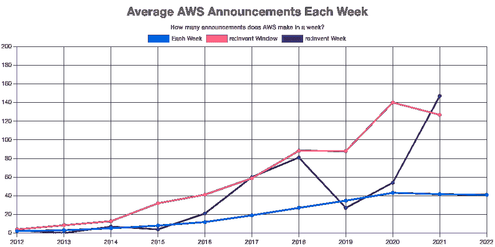

# AWS 最终指南:发明 2022 

> 原文：<https://acloudguru.com/blog/business/the-ultimate-guide-to-aws-reinvent-2022>

随着展会越来越近，本指南将会不断完善。请定期回来查看更新！如果你发现了问题或者缺少了什么，请联系我。

> 和往常一样，事件现场是真相的最终来源(尽管我试图在这里提供更多的背景)。地点在[https://reinvent.awsevents.com](https://reinvent.awsevents.com/)

* * *

## 加速您的职业发展

[从 ACG 开始](https://acloudguru.com/pricing)通过 AWS、Microsoft Azure、Google Cloud 等领域的课程和实际动手实验室改变你的职业生涯。

索引

* * *

## 目标

## 我的目标很简单:帮助你从 AWS re:Invent 中获得最大的收益。

它开始于早期的一些提示。随着节目越来越多，越来越多，导游也越来越多。在拉斯维加斯的整整一周任何时候都是棘手的。在一个有数百场会议和大量新知识要学的会议上？这是一个真正的挑战。

这些年来，我参加了很多会议，也参加了每一次会议(除了在 2021 年参加虚拟会议的例外)。该指南是我回馈社区和帮助自己保持一切正常的方式！

历史

## 这可能是 AWS re:Invent 最长的运行指南。我从 2015 年开始写这个指南。第八个版本将紧密跟随过去几年的布局，因为很多人发现它很有用。

对于怀旧的动摇，这里是以前的指南:

行动守则

## 这是整个指南最重要的部分。说实话。行为准则为机构群体的期望设定了底线。AWS 回复:发明是关于学习和分享经验的。关键是要确保环境是吸引人的、安全的和支持性的。

[AWS 社区行为准则](https://aws.amazon.com/codesofconduct/?trk=direct,direct)适用于围绕 AWS re:Invent 的物理和数字空间，以及所有其他 AWS 活动。

我会说，这都是常识，遵循的是黄金法则，但随着来自世界各地的成千上万的人分享这一周的经历，最好明确地说出来。

阅读并遵守行为准则。

如果您遇到违反准则的问题，或者您觉得不安全，请寻求帮助。在 aws-events-security-concerns@amazon.com 可以联系到亚马逊安全部门观看现场活动。此外，任何一个现场工作人员或保安都可以帮助解决任何问题。

没有一个系统是完美的，但这是在这个奇妙的活动中创建一个安全、包容的社区的一个良好开端。

我是谁？

## 我是 AWS 社区的英雄，AWS re:Invent 的长期参与者，也是这个节目的忠实粉丝。

我在 A Cloud Guru/Pluralsight 平台上教授几门课程( [AWS Business Essentials](https://acloudguru.com/course/aws-business-essentials) 、[AWS market place 简介](https://acloudguru.com/course/introduction-to-the-aws-marketplace)、[掌握 AWS 良好架构的框架](https://acloudguru.com/course/mastering-the-aws-well-architected-framework))、[定期发 tweet](https://twitter.com/marknca) ，并在我的网站上发布了很多内容。

请来 1245 号展位看我们吧！

* * *

我们已经准备了大量的超酷礼品、技术赠品和一个 CloudQuest 游戏来测试你的 AWS 知识。

健康措施

* * *

## 2022 年的任何聚会都需要健康措施到位才能成功。AWS 已经在活动现场发布了[他们的要求](https://reinvent.awsevents.com/health-measures/)。和所有事情一样，随着我们越来越接近演出，这些衡量标准可能会改变。

关键方面是:

与会者不需要**面具**

*   整个活动场地都有手部消毒站
*   科学和最近的历史表明，在共享空间中掩饰是一个非常好的主意。是的，即使你完全接种了疫苗。这一要求可能会随着活动的进行而改变。

截至 2022 年 9 月 8 日(星期一), AWS 已经取消了该事件的疫苗接种要求。这符合美国疾病控制中心(CDC)的最新指南

> 如果掩蔽和其他健康措施是可选的，请尊重每个人的个人选择…即使你不同意。

还记得[行为准则](https://markn.ca/2022/the-ultimate-guide-to-aws-reinvent-2022/#code-of-conduct)吗？尊重是很重要的一部分。对一些人来说，对新冠肺炎的反应是一个敏感的话题，请注意这一点。

登记

## AWS re:Invent 2022 现已开放报名。

完整徽章售价 1799 美元。虚拟访问(主题演讲和领导会议的实时流)是免费的。

[在活动现场](https://reinvent.awsevents.com/register/)报名。

酒店

## 这个展览足够大，以至于 AWS 实际上称这个会议场所为“[校园](https://reinvent.awsevents.com/campus/)”说实话，我不怪他们。这是校园的一瞥👇

说到酒店，关键是要从体验的角度去理解自己想要什么。如果你想置身事外，黄色/琥珀色的酒店就是你想待的地方。这些地方是 AWS 自己举办活动的地方。

Current AWS re:Invent 2022 campus (via AWS

浅蓝色的房产是 AWS 协商房间数量和折扣的地方。他们还提供这些酒店和活动举办地之间的交通服务。

如果你从未去过拉斯维加斯，这里没有一个真正“安静”的地方……除了米高梅的签名。这个位置在米高梅大酒店后面，比其他地方更安静，因为它是唯一一家酒店。没有赌场或剧院。

要了解更多关于每个属性，这里有直接链接。记得通过 AWS re:Invent 注册流程(或之后通过活动网站)预订，以便获得折扣率。

威尼斯 / [宫](https://www.venetian.com/towers/the-palazzo.html)仍然是 AWS re-Invent 的中心。今年，它将举办分组讨论、AWS 认证考试、休息室、内容中心、博览会、主题演讲、领导力会议、注册、自定进度的实验室和 **SWAG**

*   [凯撒论坛](https://www.caesars.com/meetings/locations/las-vegas/caesars-forum)提供专题内容、内容中心和餐饮
*   [Encore](https://www.wynnlasvegas.com/rooms-and-suites) 获取分组讨论内容和可预订的会议空间
*   [永利](https://www.wynnlasvegas.com/)有分组讨论内容和餐食
*   [曼德勒湾](https://mandalaybay.mgmresorts.com/en.html)正在举办突破性的内容，一个内容枢纽和膳食
*   米高梅大酒店有突破内容、徽章领取、内容中心和餐饮
*   包含在校园内但不举办活动的场馆；

曼德勒湾和米高梅大酒店是托管内容的例外。大部分活动发生在威尼斯人、Palazzo、Wynn、Encore 和凯撒论坛区。如果你想减少步行时间(哪怕只是一点点)，这可能是最好的选择。

无论一天结束时你选择在哪里休息，你都会在不同的地点之间移动…很多次。这意味着在选择酒店时没有错误。

在这一点上，最重要的是确保你能以自己能承受的价格租到房间。

虚拟出勤

## 关于虚拟出席没什么好说的。今年的展览又回到了面对面的焦点，这意味着在这一周内最少可以远程观看。

鉴于 COVID 方面持续且不断变化的情况，如果你不舒服或不能亲自参加，那就没有其他选择了。

你可以在网上观看主题演讲和领导会议，并在社交网站上跟进。大概就是这样。

如何重新发明

## AWS 知道 re:Invent 是一个很大的难题。在过去的几年里，他们给我们带来了“如何重新发明”的节目

这个节目有助于分解事件的具体方面。绝对值得一看。

所有六集现在都可以在活动网站上[观看。](https://reinvent.awsevents.com/how-to-reinvent/)

第 1 集包括预订您的酒店，并给出了一个总体的预览

*   第二集讲述了校园，四处走动，以及如何充分利用你的逗留时间
*   第三集是关于与社区的联系
*   第 4 集深入到主题演讲、领导会议，有些必须看到突破
*   第五集着眼于那些不在拉斯维加斯的人的虚拟体验
*   在第六集里，安妮和凯利与 AWS 的首席福音传道者杰夫·巴尔一起谈论现场网络和一些来自一位重新发明老手的建议
*   *需要您的团队适应 AWS 云环境吗？ACG 动手实验室是[自定进度的实践实验室](https://acloudguru.com/platform/labs)，将学习者置于模拟与 AWS 相关的真实世界云挑战的环境中。*

* * *

预订座位

* * *

## 亲临现场的与会者将希望利用今年活动的预留座位系统。它于 2022 年 10 月 11 日星期二开放，允许你在你喜欢的时段锁定一个座位…假设你能得到一个位置。

祈求好运🤞预订系统今年运行良好。处理这件事总是很痛苦。你可能不认为这是一个问题，但当预留座位开放时，最受欢迎的会议可以很快填满。

好消息是什么？即使有预留座位，AWS 通常会保留一些座位给当天的无电梯乘客。

会议时间主要是现在安排，但更多将被添加，因为我们越来越接近显示。请记住，即使有预留座位，AWS 通常会保留一些座位供当天的无电梯乘客使用。

此外，所有分组会议(不是粉笔演讲、研讨会或其他类型的会议)都会在 re:Invent 后不久被录制并发布到 YouTube 上。

当你规划你的一周时，请记住这一点。

移动应用程序

## 现在不差了。这就是你需要知道的全部。🤣

多年来,[手机应用程序](https://reinvent.awsevents.com/mobile-app/)非常令人沮丧。现在它已经改进到成为你一周的好伴侣。查找最新会议、地图、交通时间、与社区联系的方式等。

确保你已经下载了它( [iOS](https://apps.apple.com/us/app/aws-events/id1457242918) / [Android](https://play.google.com/store/apps/details?id=com.mobiquityinc.awsevents&hl=en_US&gl=US) )，并在参加活动前设置好。

议程

## 官方议程公布在活动现场。这是一种便捷的方式来查看一周内发生的事情的高级流程。

周日拉开序幕。这是一个很好的日子，在队伍变得繁忙之前，熟悉环境，领取徽章和纪念品。服务台和 AWS 培训和认证信息亭都在中午开放。唯一的官方活动是午夜疯狂。从晚上 10 点到午夜。

**星期一**挤满了内容。一切都是开放的物流。训练营和分组会议在早上开始。值得注意的是，威尼斯人酒店的欢迎酒会从下午 4:00 到 7:00。

星期二、**星期三**和**星期四**是“标准”的日子，如果这在这个节目中是一件事情的话。一整天都很满足，每晚都有些独特的东西。周二和周三在内容之后有社区活动。周四带来了传说中的再玩派对。

星期五是半天。内容持续到下午 12:30，这是节目的正式结束。

唷，发生了很多事！

**与 Faye 和 Ryan 见面并打招呼**

* * *

来见见我们自己的云专家 Faye Ellis 和 Ryan krooneburg。

主题演讲

最近几个发明已经扩展到五个主题。是的，五个。太疯狂了。

* * *

## 第一个主题演讲通常在周一，作为“合作伙伴日”的一部分今年，Ruba Borno(AWS 全球渠道和联盟副总裁)将推出这款产品。本主题演讲的重点是 AWS 合作伙伴网络以及针对 AWS 合作伙伴的各种计划和工作。如果你不是合伙人，你可以安全地跳过这一步。( [2021 年合作伙伴主题演讲](https://youtu.be/X7p-zELNqFs)。)

Adam Selipsky(AWS 首席执行官)将在今年发表“主要”主题演讲。这将为我们提供广泛的业务更新、一些关键发布和重要的客户使用案例。(以下是 2021 年亚当的主题演讲[。)](https://youtu.be/WGA2P_oH5Xc)

Swami Sivasubramanian(亚马逊机器学习副总裁)将做 ML 和数据库主题演讲。这一年比一年更有趣。总会有一些很酷的用例和新功能发布。(2021 年的 ML/数据库主题演讲[。)](https://youtu.be/ue9aumC7AAk)

周一夜现场变成了周二夜现场，最后是“彼得的基调。”同名的彼得·德桑蒂斯(SVP，AWS 效用计算和应用)带着对 AWS 如何工作的深入探究回来了。不要期待任何新功能，但每次 Peter 上台，我们都会更多地了解 AWS 是如何实现其规模的。总会有业内人士关注 AWS 创造的一些技术创新，以及它们如何影响 AWS 的环境。(彼得发表 [2021 主题演讲](https://youtu.be/9NEQbFLtDmg)。)

最后，沃纳·威格尔博士(首席技术官，亚马逊)将发表一个关于建设者的主题演讲。Werner 总是强烈呼吁采取行动，帮助每个人在云中构建得更好。该主题演讲通常以更多技术发布和新服务为特色。(沃纳的 [2021 主题演讲](https://youtu.be/8_Xs8Ik0h1w)。)

基调概述了一周内容的结构。我强烈建议至少看亚当，沃纳，和彼得的。

领导会议

领导会议本质上是迷你主题演讲。它们由高级 AWS 领导提供，专注于特定的业务领域。今年 re:Invent 的会议有:

## Candi Castleberry(亚马逊全球多样性、公平和包容副总裁)的《多样性、公平和包容》

弗朗西丝卡·瓦斯奎兹(技术和客户解决方案副总裁)的《高管云洞察》

*   Mai-Lan Tomsen-Bukovec 的 AWS 存储(对象存储、监控和可观察性、消息和流服务副总裁)
*   Bratin Saha(机器学习和人工智能服务副总裁)的 AI/ML
*   G2 Krishnamoorthy 的分析(AWS 分析副总裁)
*   弗朗西丝卡·瓦斯奎兹的建筑(技术和客户解决方案副总裁)
*   Diego Pantoja-Navajas(新产品副总裁)的业务应用
*   Nandini Ramani(AWS 监控和可观测性副总裁)和 Kurt ku feld(AWS 平台副总裁)的云操作
*   大卫·布朗计算(亚马逊 EC2 副总裁)
*   Deepak Singh 的容器(计算服务副总裁)
*   杰夫·卡特的数据库(数据库和迁移服务副总裁)
*   开发者 Ken Exner(AWS 开发者工具总监)
*   Miriam McLemore(企业战略总监)和 Al Opher(AWS 专业服务副总裁)的企业和迁移演讲
*   Yasser Alsaied(物联网副总裁)
*   大卫·布朗的网络和内容交付(亚马逊 EC2 副总裁)
*   Max Peterson 公共部门(AWS 全球公共部门副总裁)
*   Jeff Kratz 的公共部门合作伙伴(GM、全球公共部门合作伙伴…等等)
*   CJ Moses(副总裁兼 CISO)谈安全性、合规性和身份
*   Holly Mesrobian 的无服务器产品(AWS Lambda 副总裁)
*   Maureen Lonergan 的培训和认证(AWS 培训和认证副总裁)
*   这与去年的会议非常相似。一些领导者已经改变，一些领域或者已经合并或者已经发展到可以独立运作的程度。你可以[在 AWS YouTube 频道上观看去年的](https://www.youtube.com/watch?v=UM_pKdyGumU&list=PL2yQDdvlhXf-RVvZhqM675tSHzIV-6pKf)领导力会议。
*   领导力课程通常遵循相同的形式。快速回顾过去一年在这一重点领域的最大发布。他们发布新的公告或产品，并附上某种行动号召。

领导层会议中的公告不够大，不足以成为主要的基调。但是对于那些对这个话题感兴趣的人来说，它们同样重要。

英雄指南

现在是一个年度传统，一群 AWS 英雄创造了指南来帮助你在 AWS re:Invent 2022 的会议中导航。每个指南都遵循一个主题，并帮助您找到一组很好的会议来深入探讨该主题。

## 今年，可用的指南有:

其他作者(AWS 人员、APN 合作伙伴等)也有一些[行业和合作伙伴指南](https://reinvent.awsevents.com/community/attendee-guides/)。)

建议的会议

在官方指南之外👆在 AWS re:Invent 大会上，AWS 内外的许多人已经编写了一些很好的会议指南。以下是我发现的一些有用的例子:

## 训练营

[训练营](https://reinvent.awsevents.com/learn/bootcamps/)是半天或一整天的课程，提供深入的实践体验。

## 训练营主要有三种类型:考试准备、技术和合作伙伴。他们每个人都提供了不同的体验。

这些营地通常需要额外付费。这可能是一项非常明智的投资，尤其是如果你正在为考试做最后的努力，或者在某个特定的技术领域需要更多的指导。

游戏化学习

今年的新词是“[游戏化学习](https://reinvent.awsevents.com/learn/gamified-learning/?trk=direct)”。这是 re:Invent 全年广受欢迎的一系列活动。这包括几个 AWS 游戏日和果酱。

## 今年的选择是:

AWS 游戏日:新边疆

AWS 游戏日任务节

*   AWS 堵塞:安全性
*   AWS Jam:开发与现代化
*   AWS Jam:数据和分析
*   这些都是亲身实践的挑战，需要你在团队中一起解决问题。每个问题都有分数，整个活动有一个友好的竞争氛围。这是学习和应用一些关键技能的好方法。
*   有足够的压力激励团队，推动你进一步击败竞争对手！

我们会在酒吧爬行和深夜游戏之夜见到你。马上回复！

公告

* * *

每年 AWS 都会发布一波新的功能，导致 AWS 重新发明。这是他们文化的基础部分。这对你来说意味着什么？

* * *

## 在展览前的三周以及这一周中，你会被各种公告淹没。说真的，这是一个疯狂的努力跟上。

不相信我？这是一个图表，显示了在 AWS re:Invent 举办的这些年中，每周平均发布的 AWS 公告数量。

在 AWS re:Invent“窗口”(之前的 3 周和之后的一周)中，公告数量增加了**245%**。这意味着在窗口期平均每周有 56 个公告。

你将无法跟上所有这些公告。没关系。

我的建议？在你的笔记中，有一个专门的空间用于“稍后查阅”每当你听到一个新的公告，酷的会议，或看到一个伟大的写/讨论，添加网址或参考到您的笔记。

节目结束后，每天留出一点时间来回顾一两个公告，直到你赶上为止。

PeerTalk

AWS 今年将推出一个名为 [PeerTalk](https://reinvent.awsevents.com/peertalk/) 的新项目。行动要求是:“拓展你的思维和网络。”

## 据我所知，该计划将利用您的与会者资料来帮助您更好地与社区中的人们联系。一旦你确定了一个或几个你想联系的人，你就可以在线聊天或要求见面。

如果你马上变得有点紧张，接下来的部分应该会帮助你放松，“……要求在校园内指定的公共场所召开 2-4 人的面对面会议。”

这项计划刚刚宣布，更多的细节将很快从 AWS。

AWS re:发明是指赞助商——APN 合伙人——全力以赴。合作伙伴会出现在整个活动中。一些赞助商休息室，酒吧爬行，移动应用程序，等等。

你会看到大多数赞助商在第一届世博会。除了赞助商的展位之外，大厅里还有大量的 AWS 展台。它这么大，他们现在实际上称之为“AWS 村”。

这里包括 AWS Jam Lounge(一个供短暂实践体验的区域)、社区开发者休息室、AWS DeepRacer League arena、Builder's Fair 等。

当你在这里的时候，很值得去看看这些地方，和一些赞助商聊聊。11 月 28 日星期一(太平洋时间下午 4:00-7:00)的欢迎招待会在世博大厅举行，这是游览该地区时品尝小吃的好机会。

除了欢迎招待会，参观世博会的最佳方式之一是由科里·奎因主持的联合国 AWS 官方自然漫步，这是他的 [re:Quinnevent 2022](https://www.lastweekinaws.com/requinnvent/) 的一部分。这将在 11 月 30 日星期三(太平洋时间下午 1:00)进行。

如果你想知道谁会参加世博会，你可以在活动现场查看赞助商的完整[列表。](https://reinvent.awsevents.com/sponsors/)

管理一天

AWS re:Invent 是一个很难参加的展会。有太多的内容，分布在太多的场所，晚上有太多的事情发生。这只是主要的 AWS 方法。赞助 APN 公司的也会举办一系列活动。

## 你不可能完全理解。你连 20%都拿不到。这不可能。

这里有一些具体的建议，让你每天都能从会议和会议周围的事情中获得最大的收获。

注意事情发生的*。会议有三个主要方面:曼德勒湾、米高梅大酒店和安可/永利/威尼斯人/宫殿/凯撒论坛酒店群*

给自己留至少 30 分钟时间在人群中活动

*   …在主要区域之间移动至少需要一个小时
    *   当你到达拉斯维加斯时，去一家大药店/药房看看。你需要确保你的背包里有足够的物品来度过每一天。威尼斯人/Palazzo 有一个 24/7 沃尔格林。选择以下物品作为日常携带:
    *   本周的蛋白质棒和混合食物
*   本周的新鲜水果(苹果很容易运输)
    *   滴眼剂
    *   润唇膏
    *   洗手液
    *   纸巾/纸巾
    *   确保您有一个多端口充电器/便携式电池。你会在白天耗尽电池。你找不到充电口
    *   水合物。随身携带一个水瓶。充分利用整个活动场地的加油站。你会走很多路。持续的劳累、赌场里干燥的空气以及不寻常的饮食计划都会增加你脱水的风险。如果你晚上喝酒，价格会更高。水合物
*   👟穿有支撑力的运动鞋和好袜子。你将每天步行 10-15 公里(6-9 英里)。你的脚——以及其他一切——会感谢你选择了智能鞋。在这里，实用必须战胜时尚。确保你在到达拉斯维加斯前的第一天就穿好鞋子
*   公共空间
*   每年，校园里都会有一些空间，你可以在那里充电、吃零食、看一个很酷的项目演示、围着白板和一些人聊天等等。

## 今年，活动团队终于在一个地方列出了大多数空间，即活动网站上的[公共空间激活](https://reinvent.awsevents.com/community/public-spaces/?trk=direct)页面。看看他们！

回复:播放

[re:Play](https://reinvent.awsevents.com/community/replay/) 是一个传奇派对，将于太平洋时间 2001 年 12 月 1 日星期四晚上 7:30-12:00 举行。

## 很难描述这个派对。真的是需要经历才能明白的事情。

AWS 在确保每个人都有所收获方面做得很好。总有一些令人惊叹的世界级音乐表演。Werner 通常会在当天早上主题演讲结束时宣布头条新闻。

除此之外，还有大量的食物和款待。很多游戏可以玩。玩游戏是为了远离感官负担。

即使你不是一个喜欢聚会的人，也值得去 re:Play 看看。你可能会惊讶于自己有多开心！

学习和娱乐

一个是:年复一年地发明钉子是一种有趣且吸引人的氛围。它设法在塞满要学习的新东西和提供与社区联系的环境之间取得平衡。

## 希望这个指南能帮助你充分利用一周的时间！

请定期回来查看更新！如果你发现了问题或者缺少了什么东西，请联系我 [@marknca](https://twitter.com/marknca) 。

Hopefully this guide will help you get the most out of your week!

*Please check back regularly for updates! Ping me, if you spot a problem or if something is missing* [@marknca](https://twitter.com/marknca).