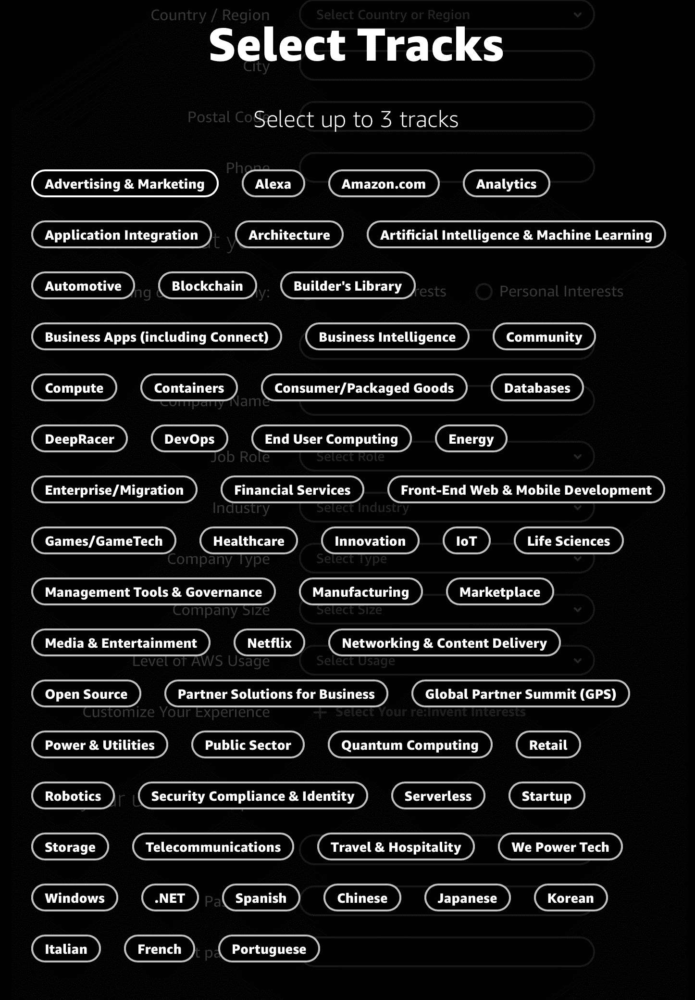
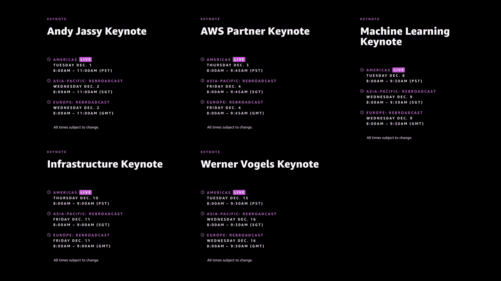
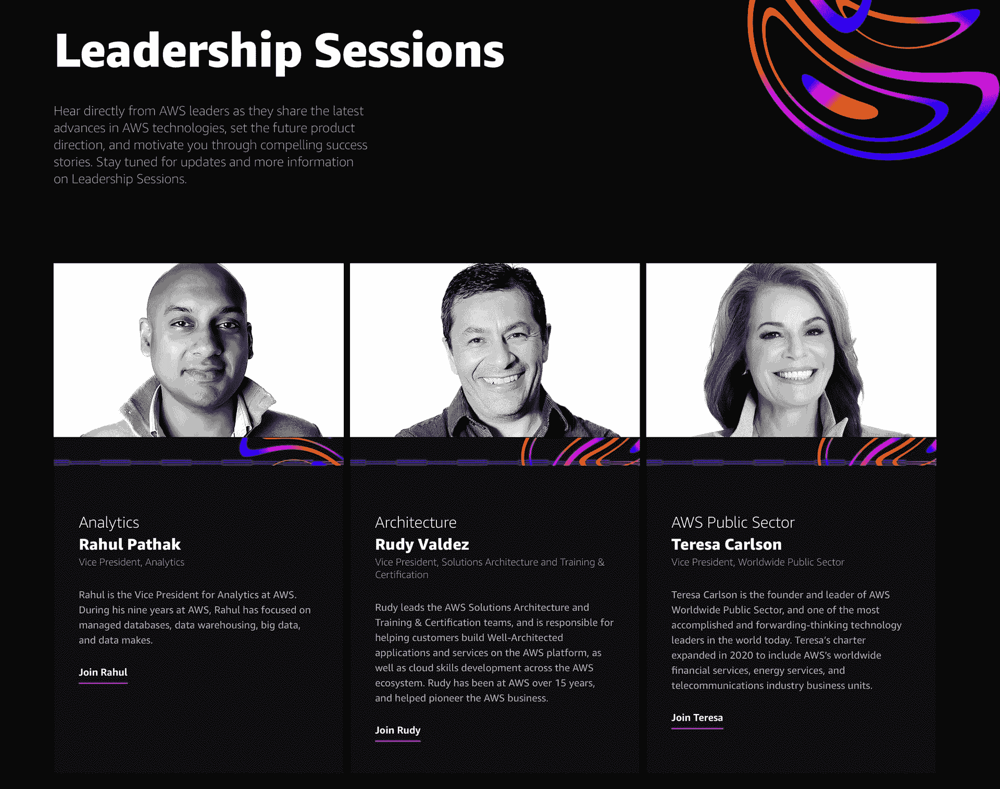

# 重新发明 2020 的终极指南

> 原文：<https://acloudguru.com/blog/engineering/the-ultimate-guide-to-reinvent-2020>

> 随着展会越来越近，本指南将会不断完善。请定期回来查看更新！Ping 我， [@marknca](https://twitter.com/marknca) 如果你发现了一个问题或者是缺少了什么。

在过去的几年里，我一直在为 AWS re:Invent 写“终极指南”(或其他版本)。这是云领域最大的会议，通常会为未来几个月的云创新定下基调。

它总是挤满了新的服务，伟大的对话，等等。往年的指南( [2019](https://read.acloud.guru/the-ultimate-guide-to-aws-re-invent-2019-ddf65f2a0a42) 、 [2018](https://read.acloud.guru/the-ultimate-guide-to-aws-re-invent-2018-1ad4fcf11552) 、 [2017](https://read.acloud.guru/the-ultimate-guide-to-your-first-aws-re-invent-c35eb8c55e6b) 、 [2016](https://medium.com/@marknca/5-ways-to-get-the-most-from-aws-re-invent-2016-bb80aecceec9) 、 [2015](https://medium.com/@marknca/5-ways-to-get-the-most-out-of-aws-re-invent-7b7f67f41032) )已经帮助数十万建筑商从拉斯维加斯的疯狂一周中获得了最大的收获。

就像 2020 年的一切一样，今年的 AWS re:Invent 将会有所不同。但与今年的其他事情不同，可能会有巨大的好处，因为 AWS re:Invent 2020 是**免费和完全虚拟的**。

这意味着世界上任何地方的任何人都可以参与进来，我们可以用新的方式相互联系，帮助彼此建设得更好。

## 本指南

今年的指南显然会——至少我希望是显而易见的？—与众不同。你将不再需要关于住在哪里，如何在合理的时间内得到咖啡，或者如何不把自己从一栋楼搬到另一栋楼的提示。

指南的一些内容将保持不变；

*   随着更多信息的出现，它会定期更新(事实上，第一个版本是在 2020 年 7 月发布在我自己的网站上)
*   索引是关键。指南中有大量信息，索引是浏览所有信息的最佳方式

当我回头看 2019 年的指南时，大约 34%的内容与身体有关。我希望 re:Invent 团队能够用新的数字化体验来取代一些缺失的体验。

无论如何，我们将在指南中一一介绍。

## 索引

AWS re:Invent 运行时间为 2020 年 11 月 30 日(星期一)至 12 月 18 日(星期五)。是的，三周的重新发明。

这是一个完全虚拟的事件，从表面上看，该事件计划在几个时区进行，但以太平洋时间为中心。

0 美元。

通常，我会说参加这个活动是为了建立关系网，实践学习机会，并体验社区的活力。对于虚拟事件，这种情况将会改变。

AWS 尚未公开宣布活动的形式，但我们知道会议的数量已经大幅减少(主要是因为缺乏重复)，像 re:Play 派对这样的物理活动将不会发生。

那么为什么要参加呢？

AWS re:Invent 的所有内容将在活动平台上托管，直到“2021 年 1 月底”(来自“[了解主题](https://reinvent.awsevents.com/faq/?trk=default)”下的常见问题)。之后，会议内容将被转移到 AWS YouTube 频道。

注册并参加活动不仅可以提前访问会议内容，还可以与其他与会者和活动进行交流。像比赛日、堵车、训练之类的事情，都会通过赛事平台举办。更多关于这些在下面。

请记住，与实体活动不同，你不必为虚拟活动全力以赴。你没有理由不注册，参加几个会议，并感受一下你能从它那里得到更多，而不是以后再消费那些内容。

AWS re:Invent 永远是一个非常社交化的会议。这个部分要么通过活动平台(TBD)继续，要么通过社交媒体(主要是 Twitter)继续。

AWS 回复:发明是关于学习和分享经验的。这只能发生在一个安全、有吸引力和支持的环境中。

[AWS 社区行为准则](https://aws.amazon.com/codesofconduct/?trk=direct,direct)适用于所有 AWS 活动……甚至是虚拟活动。

在一个理想的世界中，这里的指导应该是遵循你的常识和黄金法则，但是考虑到世界范围的影响和现在是 2020 年的事实，让我们明确地说出来。

阅读并遵守行为准则。

任何违反准则的问题都可以通过[aws-events-security-concerns@amazon.com](mailto:aws-events-security-concerns@amazon.com)向亚马逊安全部门报告。没有一个制度是完美的，但这是我们建立一个安全、包容的社会的坚实基础。

这是今年指南中我最喜欢的部分。通常，这一部分包含一系列扭曲、复杂的步骤，以最大化你在活动中的机会。

今年我的建议很简单:[注册](https://register.virtual.awsevents.com/?sc_icampaign=event_reInvent_RegisterNow&sc_ichannel=ha&sc_icontent=eventsite_reinvent20&sc_ioutcome=Strategic_Events&sc_iplace=evnav&trk=default)。

现在免费开放了。

在注册过程中，您将被问及典型的 AWS 问题，并有机会通过挑选 3 个曲目向客户展示您的活动体验。

Available tracks for AWS re:Invent content

这些轨道选择用于自定事件界面。它们不会以任何方式限制您对内容的访问。它们只是帮助系统决定先给你看什么。

你可能想知道为什么你应该读这个指南。每年都有大量由任何人和任何公司发布的远程连接到云的文章。我有什么资格写这个？

好吧，考虑到你已经深入了解了指南，这不是一个超级重要的问题，但我确实喜欢分享，所以在这里…

我是一个 AWS 社区英雄，一个云专家的 T2 作者，也是这个活动的重复演讲者(15 次演讲，还在继续)。

从一开始我就去过每一个 re:Invent，每一个都很棒。我写这个指南是为了帮助我弄清楚如何从这个节目中获得最大的收获，我喜欢它能帮助你做同样的事情。

关于 AWS re:Invent 的一个主要未决问题是，活动有多少是直播的，有多少是点播的。

我们知道，这五个主题演讲将进行现场直播，然后在不同的时区重播。领导层会议也在现场直播。其余的部分已经预先录制好了。

对于所有会话，有三次；会话“播放”时，每个时区([太平洋](https://time.is/PT)、 [GMT](https://time.is/GMT?opt_id=oeu1606739980209r0.8686710112195278) 和 [SGT](https://time.is/SGT?opt_id=oeu1606739980209r0.8686710112195278) )一个。之后，它们将在每周结束时提供点播观看。让我重复一遍，因为这已经让我在第一天就焦头烂额了；

> 会话“播放”三次(每个时区一次),然后在周末可供点播观看。
> 
> [me, RT*M-ing](https://twitter.com/marknca/status/1333936759487475714?s=21)

这改变了如何应对每一天。一定要在关键时段播出时参加，否则你要等几天才能赶上。

**第一周讲座现可在专题讲座目录中点播！**

不管这个活动是 100%直播还是直播和点播的结合，你都需要一个策略来处理大量的内容。

在过去的几个月里，我们都参加了很多虚拟活动和会议，这里有一些我发现对我有用或者社区说对他们有用的技巧。第一套提示围绕着你和你的健康；

*   以健身计划开始新的一天。如果那是一次锻炼，一次跑步，一次散步，任何能让你的身体动起来的事情。这个 [15 分钟的初学者](https://youtu.be/L_xrDAtykMI)灵活性练习是开始一天的好方法(不管你一天在做什么，这都是可靠的建议！)
*   设置一个闹钟，每三十分钟起来活动一下，做做伸展运动。更好的是，在观看课程时，站立、伸展和移动。
*   水合物。全天大量饮水。你在家，应该会容易些。
*   在中午散步。走出你的环境，提高你的心率，这不仅对你的身体有好处，而且有助于你消化目前所学的知识，为更多的知识做好准备。

帮助应对内容的浪潮；

*   计划好你的一天。内容被广播三次，然后随后被点播。如果你现在真的想看一个疗程，那就围绕它做计划
*   我发现为早晨选择一个主题，并根据这个主题消费内容是非常有效的。下午再选一个。在第二周和第三周，当有更多的点播内容时，这变得容易得多
*   一边走一边记笔记。在这里，不在会议室或大厅里会有很大的回报。建立一个好的笔记系统，并确保记录下关键的术语和想法，这样你就可以在以后循环使用。
*   注意会话中关键时刻的时间戳。这将为你节省大量的时间，当你记起在某次会议中听到过关于那件事的事情时？
*   不要担心会错过什么，大多数内容都可以点播。

官方 AWS re:Invent agenda 也已经发布。这给了我们一个简单的展会概述，也让我们看看 AWS 是如何在全球范围内扩展展会的。

三周跨越三个时区。[太平洋时间](https://time.is/PT) (PT)是该节目的基准时区，向其拉斯维加斯根源致敬。现场直播和首映将首先在太平洋时间进行，然后在其他时区重播。

其他时区包括[新加坡标准时间](https://time.is/SGT) (SGT)和[格林威治标准时间](https://time.is/GMT) (GMT)，以覆盖欧盟与会者。这是为了“跟着太阳走”的合理传播。

每周的时间都有轻微的变化，但是在一周内**是一致的。**

作为每周的开始，太平洋时间周一晚上 8:00-9:10 会有一场“AWS 深夜”会议。AWS 还没有具体说明这些会议将包括什么，但鉴于它们被标记为“游戏”，我希望往年的“午夜疯狂”氛围。

第一周(11 月 30 日星期一至 12 月 3 日星期四)似乎是从太平洋时间上午 8:00 到下午 4:00(星期一的 AWS 深夜时段除外)。

第 2 周(12 月 7 日星期一至 10 日星期四)安排在太平洋时间上午 7:15 至下午 3:30。

第 3 周(14 年 12 月 1 日至 17 年 12 月 4 日)结束，每天从太平洋时间上午 7:15 开始，下午 3:30 结束。

[继续查看平台的主页](https://virtual.awsevents.com/home?nc2=reinv20_m_hp),查看是否有新的活动和课程加入。

在过去的几年里，AWS 的安妮·汉考克和吉尔·法甘主持了一系列节目，为“重新发明例子”会议的各个方面做准备。他们谈论后勤、社交活动、日程安排等等。

今年，整个系列被浓缩到只有一集。虽然这很有道理，但这也反映了我们没有从今年的虚拟活动中获得什么。

尽管如此，花五分钟时间来快速概括节目的目标以及团队将如何交付还是值得的。

你可以在这里观看。

主题演讲已经宣布，它向我们展示了 2020 年内容战略的第一个变化。

AWS re:Invent keynotes & their schedules

今年有 5 个主题演讲。“经典”主题演讲仍采用以下时间表；

*   Andy Jassy 将于 12 月 1 日星期二上午 08:00-11:00(太平洋标准时间)上线
*   AWS 合作伙伴主题演讲直播，太平洋标准时间 2003 年 12 月 3 日星期四上午 08:00-09:45
*   Peter DeSantis 将于太平洋标准时间 12 月 10 日星期四上午 08:00-09:00 现场发表基础设施主题演讲
*   太平洋标准时间 12 月 15 日星期二上午 08:00-09:30，沃纳·威格尔博士结束主题演讲

新的主题演讲是亚马逊 AI 副总裁**机器学习主题演讲**(在太平洋标准时间 08 年 12 月 12 日星期二上午 08:00-09:30 直播)。来自 AWS 的 Swami Sivasubramanian 将发表这个主题演讲，涵盖 AWS 云中所有最新的机器学习。

现在，今年没有什么是“相同的”,但往年的模式是这样的；

*   Andy Jassy 介绍了 AWS 业务的现状(高级别)，介绍了一些知名客户，并推出了一些很酷的新服务(通常是更高级别的服务)
*   合作伙伴主题演讲关注 [AWS 合作伙伴网络](https://aws.amazon.com/partners/) (APN)的状态。该主题演讲重点介绍了一些面向合作伙伴的新服务/功能/计划、合作伙伴成功案例以及任何特定于合作伙伴的新服务(通常是 [AWS Marketplace](https://aws.amazon.com/marketplace) 公告)
*   新的“机器学习主题”是相当不言自明的。鉴于机器学习/人工智能服务的引人注目，我不期望在本届会议上有很多新的发布，但会有更多的成功故事和一些功能改进。也许一两次发射只是为了保持兴奋。这似乎是从 2018 年的机器学习峰会和去年的优秀领导会议中成长起来的
*   “周一/周二晚间直播”似乎有了一个更现实(考虑到虚拟性)但更无聊的名字“基础设施主题演讲”这是我最喜欢的一个，因为这是一个窥视 AWS 幕后并了解 AWS 云动力的一些惊人细节的机会。这些通常是一个或两个可能与**任何事情**相关的服务公告
*   沃格尔斯博士总是带着一个主题演讲回家，重点是我们需要如何重新调整我们向世界提供解决方案的方法。部分灵感/部分发射台，我们可能会在这里看到一些新的服务发布。通常，这些发布是较低层次的构建模块，或者是以构建者体验为中心的模块

主题演讲总是令人兴奋。今年，我们不仅可以收听现场直播，还可以观看不同时区的重播。预计(再次，我只是根据以前的经验猜测)这些将会在最后一次重复后不久出现在 YouTube 上的第一个会话中。

有一种快速的方法可以将这些会议添加到您的日历中；

一定要确保你得到正确的时区！请记住，这些是为这些主题演讲提供的重复内容。上面的日历链接是为了*现场*会议计时，如果你有兴趣，你必须添加替代转播。

AWS 还宣布了一个扩展的“[领导会议](https://reinvent.awsevents.com/leadership-sessions/)”系列。这些都是在过去几个大型活动(re:Invent 和 re:Inforce)中引入的，它们非常优秀。请将它们视为具有特定范围的小型主题演讲。

Leadership Sessions are available for most tracks

这些会议中的每一个都是由 AWS 中直接负责或深入参与该主题的人进行的。这些会议通常包含新的服务/功能发布，对于主要阶段的主题演讲来说不够大，但仍然值得一提。

你绝对应该在你的行程中安排这些会议，因为它们是一个很好的起点，可以帮助你了解你想要深入了解的东西。将它们用作 AWS re:Invent 2020 及以后的进一步探索的索引或目录。

在现在已经成为一年一度的 AWS re:Invent 努力中，许多 AWS Hero 社区已经编写了[会议指南](https://reinvent.awsevents.com/aws-hero-guides/)来帮助您找到您可能感兴趣的会议。

今年，[我自己](https://twitter.com/marknca)、ACG 自己的[凯莎·威廉姆斯](https://twitter.com/keshawillz)和其他人都提供了各种主题的指南；

*   [西村广子](https://aws.amazon.com/developer/community/heroes/hiroko-nishimura/)，AWS 新手
*   Mark Nunnikhoven ，保安
*   Guillermo A. Fisher ，实践中的分析
*   [罗伯特·科赫](https://aws.amazon.com/developer/community/heroes/robert-koch/)，数据库
*   [凯莎·威廉姆斯](https://aws.amazon.com/developer/community/heroes/kesha-williams/)，机器学习
*   戴夫·斯陶法赫，储物爱好者
*   [Jared Short](https://aws.amazon.com/developer/community/heroes/jared-short/) ，开发工具和现代应用最佳实践
*   [Chris Gong](https://aws.amazon.com/developer/community/heroes/chris-gong/) ，游戏开发中的云基础知识
*   [蚂蚁斯坦利](https://aws.amazon.com/developer/community/heroes/ant-stanley/)，面向无服务器爱好者
*   [维姬·塔尼娅·塞诺](https://aws.amazon.com/developer/community/heroes/vicky-seno/)，集装箱

这些指南[现在位于课程目录](https://virtual.awsevents.com/channel/AWS+Hero+Guides/188376503?nc2=reinv20_m_clahg)中。它们以播放列表的形式呈现，便于在会话间快速切换。

这里的目标很简单，让一个专家根据他们的观点和经验帮助你整理 500 多个会话。

过去几年，会议目录和预定座位一直是个难题。目录在整个夏天都被填满了，但是在预定座位开放和目录实际完成之间总是有一个间隙。

好消息是什么？对于虚拟活动，预订座位应该成为过去。

活动平台现已开放！你可以查看所有的功能，并开始接受一些内容。下面是一些关键特性的快速浏览。

如果您试图做的不仅仅是查找特定会话，那么会话指南用户体验可能会有点棘手。Ken Robbins 有一个更简单的方法来查看 [CloudPegboard](https://cloudpegboard.com/reinvent2020.html) 上发生的事情，但它可能不是完全最新的，因为新的会话正在被添加以支持各种公告。

请记住，官方平台是唯一的真相来源，但肯的工具将使它更容易看到发生了什么。用它来搜索，然后在官方目录中核实。

记住，如果你发现一个看起来有趣的会话，分享它！标记 [@acloudguru](https://twitter.com/acloudguru) 、 [@marknca](https://twitter.com/marknca) 或[@ AWS revent](https://twitter.com/awsreinvent)以便其他人也可以查看。

在为期三周的活动中，[活动赞助商](https://reinvent.awsevents.com/sponsors/?trk=default)都有活动计划。其中一些活动将在活动平台上进行，但我想我们也应该在展会之外看到赞助商的各种活动。

> 完全披露:[一位云专家](https://acloudguru.com)，他非常友好地主持了这篇文章，我在那里教了两门课程([掌握 AWS 良好架构的框架](https://acloud.guru/learn/aws-well-architected-framework)和一门为 [AWS 商业专业人士开设的课程](https://acloudguru.com/course/aws-business-essentials))我的全职雇主趋势科技都是赞助商

关于虚拟化，我个人最想念的一件事是周一早上的考试人群——你知道你是谁！多年来，一群核心成员每周都会举行第一次考试，通常是为了测试新的测试版考试。

但是今年的活动不会缺少[培训和认证](https://reinvent.awsevents.com/learn/training-and-certification/?trk=default)。

AWS 认证可以远程参加，动手实验室将继续在线进行。还没有关于 re:Invent 的任何新的或更新的考试的消息，而且在游戏这么晚的时候，我不希望有任何消息。

考试准备会议将于今年回归。这些都是非常受欢迎的“填鸭式”会议，以帮助你最后推动认证。

除此之外，还有新的" [AWS 认证全球挑战赛](https://pages.awscloud.com/takethechallenge.html)"计划。这项挑战列出了一项推荐活动和学习路径，帮助您获得 [AWS 认证云从业者](https://aws.amazon.com/certification/certified-cloud-practitioner/)认证。

这些为共同目标而努力的团队会非常成功。这是一种共同的目标感，如果你没有坚持到底，会有一点罪恶感，一个强大的支持网络会让你更容易实现目标。

AWS [DeepRacer](https://aws.amazon.com/deepracer/) 、 [DeepLens](https://aws.amazon.com/deeplens/) 和 [DeepComposer](https://aws.amazon.com/deepcomposer/) 都是超级有趣的小工具，旨在帮助教你机器学习的不同方面。虽然每个都激发了一些很酷的项目，但只有 DeepRacer 引发了友好的全球竞争。

通常，我们会在世界各地的 AWS 峰会上看到像 Scott 这样的大师和建筑商在赛道上测试他们的 DeepRacer 模型。今年，那条虚拟线路转移到了[的](https://aws.amazon.com/deepracer/league/)线上。不像在现实世界里看结果那么有趣，但仍然很刺激。

AWS re:Invent 将[举办虚拟赛道锦标赛](https://reinvent.awsevents.com/learn/deepracer/?trk=default),此外还有多次比赛机会……即使这是你第一次使用 AWS DeepRacer。

如果你还没有尝试过为 DeepRacer 建立一个机器学习模型，我强烈建议你试一试。这本身很有趣，但也是一种学习如何[构建强化模型](https://docs.aws.amazon.com/deepracer/latest/developerguide/deepracer-how-it-works-reinforcement-learning-algorithm.html)的奇妙方式，这一概念可以应用于各种各样的其他问题。

詹姆斯和比赛日是每年最受欢迎的活动之一。每种类型的会议都提供了围绕真实世界场景的实践学习机会。

> 我们仍在等待如何加入游戏日的信息。他们将在活动的第三周运行，但请保持警惕。你不会想错过的。

Jams 是一系列挑战，通常与 AWS APN 合作伙伴一起，旨在突出 AWS 云建设的特定方面。每个挑战都有分数，通常难度会逐渐增加。这种友好的竞争结构是一项非常有趣的活动。

果酱分为四类:安全、现代化和开发、数据和分析以及通用 Jam 休息室。

现在有了会话目录，我们可以看到下面列出的堵塞(搜索词:**堵塞**)；

*   AWS Security Jam–由 Datadog、Splunk 和趋势科技提供(2 场会议)
*   AWS 现代化和 DevOps Jam 由 Datadog、NetApp 和 VMware 举办(2 场会议)
*   AWS 数据和分析大会——由英特尔和 Tableau 举办(2 场会议)

第四个“果酱”其实是果酱休息室的日常挑战。您现在可以通过以下步骤注册 Jams

*   在会话目录中找到您想要的 Jam
*   点击“了解更多”
*   点击“点击此处加入这个果酱。”

然后填写一个快速表格以获得访问权限。没有迹象表明对出席人数有限制，但如果你感兴趣，我建议早点锁定。

比赛日有点复杂。与一系列挑战不同，比赛日是一个更大的活动，团队——通常是团队，希望仍然是团队——一起解决一个大问题。

这种开放式的方法允许您在解决手头的问题时进行更多的探索。

同样，现在目录打开了，我们可以看到(搜索词:**gameday**)；

*   AWS 游戏日–金融服务(AMER、EMEA、APAC)
*   AWS GameDay，由 New Relic-Unicorn Polo League(AMER、EMEA、APAC)主办

为游戏日提供时间承诺(5 小时)，每个活动时区都有一个时段。同样，您现在可以将这些添加到您的日历中，但这似乎并没有实际为您注册该活动。

如果你有机会参加这些活动，抓住它！关于如何注册的详细信息有望很快公布。

建筑商节又回来了，这是与往年相比变化最大的活动之一。在一个物理发明中，这个活动很像一个科学展览会。团队有一个小区域，他们在那里展示他们的项目，提供关于项目的关键数据点，并向路人解释项目。

我很高兴这个活动在向虚拟再发明的过渡中幸存下来，尽管形式会有所不同——可能都是视频，但希望也有聊天——这些项目通常值得关注。

从目前宣布的项目来看，今年的确如此。

有机会一定要去[展会的活动平台](https://virtual.awsevents.com/community/186983733/Builders%27+Fair)看看。这不仅会给你一个认可这项工作的机会，还会激励你自己去解决一些“打破常规”的项目！

We Power Tech 是 AWS 包容性、多样性和公平(ID & E)项目的名称。这是一个非常重要的举措，不仅有助于扩大我们的社区，而且确保它是一个支持和包容的地方。

在活动期间，We Power Tech 有一个专门的赛道，突出了“工业设计与工程互动中的创新”。还有一个特殊的 We Power 技术休息室，将提供 15 分钟的闪电谈话和实时聊天。

遗憾的是，著名的 AWS re:Play 派对今年不会举行了。这在很大程度上是一种亲身体验，无法在网上复制。

在为期三周的活动中，re:Invent 团队通过一系列" [Play](https://reinvent.awsevents.com/play/?trk=direct) "活动提升了思维。

正如在[议程&时区部分](#agenda-and-time-zones)中提到的，每周一晚上将会有一场 AWS 深夜会议。

首先(太平洋时间 11 月 30 日，星期一，晚上 8:00)将会有 AWS re:Invent，music 的首次正式发布，该团队也在尝试一项新的世界纪录。在过去的几年里，午夜疯狂活动试图(并成功)打破吉尼斯世界纪录。这是一个有趣的传统，我很期待看到今年的记录！

AWS 第二周深夜节目(太平洋时间 12 月 7 日，星期一，晚上 8 点)带来了我们的第一个大牌音乐表演。布兰迪·卡莉将会现场表演。Brandi 是我个人最喜欢的，在过去的几个月里，她一直在直播一些精彩的视频。这是不容错过的！

…哦还有[安迪·杰西](https://twitter.com/ajassy)那天晚上也会出现？。

除了这些每周一次的会议，在活动期间我们还会看到；

*   AWS 知识杯
*   有线电视侦探游戏
*   几个烹饪演示
*   各种 DJ 设备
*   与来自[昆耶](https://www.kunye.co/)的梅丽莎·恩科莫一起运动

[哑口无言](https://www.speechlessinc.com/)还将主持一个由六个部分组成的改进研讨会。第一次会议于太平洋时间 12 月 1 日星期二上午 11:00 开始。

该活动还将推出一个名为“AWS 鱼缸”的系列。这一个是为了让大家一窥亚马逊的文化。第一部分将由作家伊娃·陈和广播&播客主持人盖伊·拉兹谈论他们的新书。该节目将于太平洋时间 12 月 2 日星期三上午 8:00 播出。

每年 AWS 都会在一周内发起一些活动来支持重要的事业。虽然今年虚拟化改造带来了很多变化，但这种支持力度仍然很大。

今年，AWS 正在推广三项主要举措。

第一个是向前填满和“慈善:水。。这两项举措都促进了为全球儿童和家庭提供清洁用水的努力。

在展会期间，你可以使用 Fill it Forward 应用程序，跟踪你重新装满可重复使用的水瓶的频率。每次你这样做，你不仅可以帮助自己补充水分，AWS 还会向慈善机构捐赠 1 美元:水。

第二项倡议是支持弗雷德·哈奇·奥博利特。这个慈善机构帮助推动弗雷德·哈钦森癌症研究中心的研究。当 re:Invent 于 11 月 30 日启动时，将会提供详细信息，但从各种迹象来看，我们——建设者社区——跑步、步行、骑自行车、滑冰或其他活动越多，将会获得越多的捐款，以帮助实现更快治愈癌症和遏制新冠肺炎的核心目标。

第三项举措主要集中在[三个广场的食物银行](https://www.threesquare.org/)内华达州拉斯韦加斯当地。与其他两项慈善活动不同，这不是向“重新发明”的观众发出的号召。通常会有一个 AWS re:Invent 的本地合作项目，但因为我们今年没有亲自参加。AWS 直接向食物银行捐款。恕我冒昧，除了参加前两项活动，如果可以的话，向当地的食物银行捐款总是一个好主意……尤其是现在。

## 广播中的自动气象站

除了 [AWS on Air](https://twitter.com/AWSonAir) twitter 句柄之外，活动网站的 AWS on Air 部分还包含一些关于会议期间活动的重要信息。

我们现在知道罗伯特·朱和尼克·沃尔什将做会后分析。这应该发生在 re:Invent 平台或者 Twitch 上的某个地方。

每周四上午 11:00[太平洋时间](https://time.is/PT),“AWS 社区之声”将突出社区领袖与 Q & A 的现场讨论

[这是我的建筑](https://www.youtube.com/watch?v=BZ32w0SSAoY&list=PLhr1KZpdzukdeX8mQ2qO73bg6UKQHYsHb)将在展会期间播出。在标签 [#thisismyarchitecture](https://twitter.com/search?q=%23thisismyarchitecture&src=typed_query) 下高亮显示新的会议。

我们还会看到新的节目，比如“全在田间:AWS 农业直播”，主持人凯伦·希尔德布兰德和马特·沃尔夫在标签 [#allinthefield](https://twitter.com/search?q=%23allinthefield&src=typed_query) 下讨论农业科技的最新进展。
你可以在标签[#所有实验](https://twitter.com/search?q=%23alltheexperiments&src=typed_query)下追踪。这是他们在夏天开始的一个想法的延续。

我们还将观看认证问答节目，帮助您练习所有重要的认证考试。AWS Industry Live 将深入探讨特定的垂直市场。和“客户之声”，通过一对一访谈突出一些成功案例。AWS 已经发布了一个方便的指南，告诉你什么时候在 AWS 上播放什么样的流媒体。[来看看](https://aws.amazon.com/blogs/aws/reinvent-2020-streaming-schedule/)，有一大堆精彩的内容即将到来。

AWS re:Invent 通常是一个非常社会化的节目。无论是面对面还是在线。今年，我预计社交媒体会比往年更加繁忙…这已经说明了很多问题。

目前还没有“官方”标签，这里有一些你想关注的标签、账户和列表；

我预计 Twitter 上的主题演讲将会非常活跃。许多人对公告做出反应，并提供快速分析。剩下的活动将会非常有趣。

根据会议是直播还是点播，我们会看到不同的社交媒体使用模式。在走廊上的会议前后通常会有很好的讨论，我希望活动平台提供一种方式来做到这一点，但如果没有，使用 Twitter 上的会议代码可能会有效。

我们进入了 re:Invent 的第一周，这是一个梦幻般的开始。Andy Jassy 的主题演讲提供了一些奇妙的新服务，Twitter 上的讨论非常有趣。

请继续关注，这篇文章将随着更多信息的出现而定期更新。