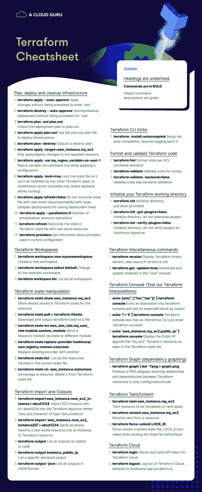

# 终极 Terraform 命令行备忘单|云专家

> 原文：<https://acloudguru.com/blog/engineering/the-ultimate-terraform-cheatsheet>

没有必要从 Terraform 恐惧地跑。关闭搜索引擎标签，查看我们的终极版 [Terraform 备忘单](https://res.cloudinary.com/acloud-guru/image/fetch/c_thumb,f_auto,q_auto/https://acg-wordpress-content-production.s3.us-west-2.amazonaws.com/app/uploads/2020/11/terraform-cheatsheet-from-ACG.pdf),获取您手头需要的所有基本命令，以便从这个令人敬畏的、直观的 IaC 工具中获得最大收益。另外，为什么不通过 [Terraform 认证](https://acloudguru.com/course/hashicorp-certified-terraform-associate)来展示你的 IaC 技能呢。

在云专家那里，我们有关于 Terraform 的深入课程——从使用 Terraform 的[部署到](https://acloud.guru/overview/8a6f598f-a41f-48ff-99a6-2c7a760b4119)[AWS](https://acloudguru.com/course/deploying-to-aws-with-terraform-and-ansible)到使用 Terraform 的[部署资源到 GCP](https://acloudguru.com/course/deploying-resources-to-gcp-with-terraform)和使用 Terraform 在 Azure 中创建基础设施的[。但有时你需要的只是一个简单、方便的参考来完成工作。我们会掩护你的。](https://acloudguru.com/course/build-and-deploy-pipelines-with-microsoft-azure)

### 目录

* * *

## 加速您的职业发展

[从 ACG 开始](https://acloudguru.com/pricing)通过 AWS、Microsoft Azure、Google Cloud 等领域的课程和实际动手实验室改变你的职业生涯。

什么是 Terraform？

* * *

## 基础设施即代码(IaC)是平衡的云早餐的关键部分。说到 IaC 工具，Terraform 是最棒的工具之一。(哪款 IaC 工具适合你？查看 AWS 上的 IaC 指南。)

Terraform 于 2014 年登场，将基础设施编排为代码。它最初的目标是 AWS，但已经发展到可以很好地与模块的[大型生态系统合作，包括谷歌云平台(GCP)、微软 Azure、甲骨文云基础设施和阿里云。事实上，多提供商支持是 Terraform 的主要卖点之一。](https://registry.terraform.io/)

Terraform 推出了自己的 DSL，叫做 [Hashicorp 配置语言](https://github.com/hashicorp/hcl) (HCL)。从表面上看，它更像是一个对人类友好的 JSON，在 Terraform 中也有原生支持。

Terraform introduced its own DSL, called [Hashicorp Configuration Language](https://github.com/hashicorp/hcl) (HCL). On the surface, it feels like a more human-friendly JSON, which is also natively supported within Terraform.

HCL 是一种强大的配置语言，有助于将 Terraform 发挥到极致！

* * *

*想了解更多关于 [HCL2](https://acloudguru.com/hands-on-labs/formatting-a-packer-template-in-hcl2) 的信息？通过我们的动手实验修复一个编写不准确的 HCL2 打包模板来测试您的 HCL2 技能！*

Terraform 命令行

* * *

## **地形 CLI 招数**

**`terraform -install-autocomplete`**#设置标签自动完成，需要重新登录

*   **格式化并验证地形代码**

**`terraform fmt`**#格式代码符合 HCL 规范标准

*   **`terraform validate`**#验证代码的语法
*   **`terraform validate -backend=false`**#验证代码跳过后端验证
*   **初始化你的 Terraform 工作目录**

`**terraform init**` #初始化目录，下拉提供者

*   **`terraform init -get-plugins=false`**#初始化目录，不下载插件
*   **`terraform init -verify-plugins=false`**#初始化目录，不验证插件是否为哈希公司签名
*   **规划、部署和清理基础设施**

**`terraform apply --auto-approve`**#应用更改而不提示输入“是”

*   **`terraform destroy --auto-approve`**#不提示“是”就销毁/清理部署
*   **`terraform plan -out plan.out`**#输出部署计划到 plan.out
*   **`terraform apply plan.out`**#使用 plan.out 计划文件部署基础设施
*   **`terraform plan -destroy`**#输出一个摧毁计划
*   **`terraform apply -target=aws_instance.my_ec2`**#仅应用/部署对目标资源的更改
*   **`terraform apply -var my_region_variable=us-east-1`**#应用配置时通过命令行传递变量
*   **`terraform apply -lock=true`**#锁定状态文件，使其不能被任何其他 Terraform 应用或修改操作修改(仅当后端允许锁定时才可能)
*   **`terraform apply refresh=false`** #不要使状态文件与现实世界的资源一致(对于大型复杂部署有助于节省部署时间)
*   **`terraform apply --parallelism=5`**#同时进行资源操作的数量
*   **`terraform refresh`**#将 Terraform 状态文件中的状态与现实世界的资源相协调
*   **`terraform providers`**#获取当前配置中使用的提供商的信息
*   **地形工作区**

**`terraform workspace new mynewworkspace`**#创建新工作区

*   **`terraform workspace select default`**#改变到选中的工作区
*   **`terraform workspace list`**#列出所有工作区
*   **地形状态操纵**

**`terraform state show aws_instance.my_ec2`**#显示以地形状态存储的资源详细信息

*   **`terraform state pull > terraform.tfstate`**#下载并输出地形状态到文件
*   **`terraform state mv aws_iam_role.my_ssm_role module.custom_module`**#将通过状态跟踪的资源移动到不同的模块
*   **`terraform state replace-provider hashicorp/aws registry.custom.com/aws`**#用其他提供商替换现有提供商
*   **`terraform state list`**#列出通过当前状态文件跟踪的所有资源
*   **`terraform state rm  aws_instance.myinstace`**#取消资源管理，将其从 Terraform 状态文件中删除
*   **地形导入和输出**

**`terraform import aws_instance.new_ec2_instance i-abcd1234`**#将 id 为 i-abcd1234 的 EC2 实例导入到类型为“aws_instance”的名为“new_ec2_instance”的 Terraform 资源中

*   **`terraform import 'aws_instance.new_ec2_instance[0]' i-abcd1234`**#同上，将真实世界的资源导入到 Terraform 资源的实例中
*   **`terraform output`**#列出代码中规定的所有输出
*   **`terraform output instance_public_ip`** #列出一个具体申报的产量
*   以 JSON 格式列出所有输出

**`terraform version`**#显示 Terraform 二进制版本，如果版本太旧也会发出警告

*   **`terraform get -update=true`**#下载并更新“root”模块中的模块。
*   **Terraform 控制台(测试 Terraform 插值)**

**`echo 'join(",",["foo","bar"])' | terraform console`**#将一个表达式回显到 terraform 控制台，并将其预期结果作为输出

*   **`echo '1 + 5' | terraform console`** #Terraform 控制台也有一个交互式 CLI 只要进入“Terraform 控制台”
*   **`echo "aws_instance.my_ec2.public_ip" | terraform console`**#显示 Terraform 状态文件中看到的“my _ ec2”terra form 资源的公共 IP
*   **【地形图(从属图形)**

**`terraform graph | dot -Tpng > graph.png`**#生成一个 PNG 图表，显示配置/代码中 Terraform 资源之间的关系和依赖关系

*   **【terra form tain/un tain】(标记/取消标记资源以便重新创建- >删除然后重新创建)**

**`terraform taint aws_instance.my_ec2`**#污染下次应用时要重新创建的资源

*   **`terraform untaint aws_instance.my_ec2`**#清除资源中的污点
*   `**terraform force-unlock LOCK_ID**` #强制解锁一个锁定的状态文件，预先锁定状态文件时提供的 LOCK_ID
*   **地形云**

**`terraform login`**#获取并保存地形云的 API 令牌

*   **`terraform logout`**#注销 Terraform 云，默认为主机名 app.terraform.io
*   10 个最有用的地形命令

## 使用 Terraform 的一个关键部分是通过了解配置来学习使用 Terraform CLI。

以下是 AWS CLI 中 10 个最常见的 Terraform 命令，可帮助您导航和使用功能强大的工具，并从 Terraform 开始。

因此，如果您已经安装了 Terraform 二进制文件，并准备好开始工作，现在是熟悉您将最常用的 Terraform 命令的好时机。

当您需要快速参考指南时，您可以随时调出 Terraform 的内置命令行文档。有几个命令可以做到这一点:

`terraform`

*   `terraform -h`
*   `terraform --help`
*   生成的帮助页面将在顶部显示主要命令，下面是不常用或更复杂的命令。

您也可以输入 terraform 命令，然后输入带有`-h`或`--help`的子命令，以调出特定于该子命令的命令列表。让我们来演练一下你可能会用到最多的 10 个 Terraform 命令。

**1。`fmt`**
当我完成我的 Terraform 配置后，我想确保所有东西都被正确格式化，所以我首先运行`fmt`命令。此命令以标准样式重新格式化您的配置，因此它将确保间距和其他所有内容的格式正确。如果它返回空白，这意味着工作目录中的配置文件已经被正确格式化。如果它格式化了一个文件，它会让你知道它接触了什么文件。

**2。`init`**
使用`format`命令后，你需要初始化你的工作目录，为你所需要的做准备。`init`命令查看您的配置文件，并确定需要从注册表中删除哪些提供程序和模块，以使您的配置正常工作。

**3。`validate`**
一旦初始化了目录，最好在运行`plan`或`apply`之前运行`validate`命令。验证将捕捉语法错误、版本错误和其他问题。这里需要注意的一点是，在运行`init`命令之前，不能运行`validate`。在运行验证之前，您必须初始化工作目录。

**4。`plan`**
接下来，对你的计划做一次预演，看看它实际上会做什么，这总是一个好主意。您甚至可以使用带有`terraform plan`的子命令之一来输出您的计划，以便稍后应用。

5 **。`apply`**
当然还有`apply`命令，这也是你最常使用的命令之一。这是将您的配置部署或应用到提供程序的命令。

**6。`destroy`**
`destroy`命令显然会破坏您的基础设施——或者，当与`target`标志一起使用时，会破坏您的基础设施中的单个资源。

**7。`output`**
如果你已经准备好了一个输出变量文件，你可以使用`output`命令让那些定义好的输出显示某些信息。例如，如果您正在部署 EC2 实例，您可以输出标记名、实例名、实例 id、实例的 IP 等等。您可以收集一些非常有用的信息，以便以后查找。如果你们是团队合作，后面的人可以使用`output`命令来解决问题并加快速度。

**8。`show`**
`show`命令显示已保存计划的当前状态，提供关于您已部署的基础设施的良好信息。例如，如果您的配置中部署了 EC2 实例或虚拟机，它会向您显示其所处的状态——是启动并准备就绪，还是正在终止。它还提供有用的信息，如 IP 地址。

**9。`state`**
检查工作的另一个好方法是使用`state`命令。如果您使用`state`，然后使用子命令`list`，它会给您一个由您的配置管理的资源的综合列表。如果您正在移动您的 Terraform 实例，比如从本地实例到远程备份，您将使用`state mv`命令。就像`show`命令一样，有一个`state show`命令显示资源的状态。您也可以使用`state rm`命令从一个状态中删除实例。

**10。`version`**
你会经常使用`version`命令来检查你的地形版本，尤其是当你有任何版本冲突的时候。有时，提供者只处理特定版本的 Terraform，所以如果你在配置中定义这些版本，你需要到处使用`version`命令。 

这些是一些最流行的地形命令。请记住，当你不能 100%确定如何使用一个命令或它有什么作用时，`-h`是快速查找命令的一个非常方便的方法，尤其是当你开始使用的时候。有机会看一看吧！

Jesse Hoch 和 Moosa Khalid 对此文亦有贡献。

学习地形的基础知识

* * *

## *想了解更多关于充分利用 Terraform 的信息吗？查看 ACG 的课程[使用 Terraform 和 Ansible](https://acloudguru.com/course/deploying-to-aws-with-terraform-and-ansible) 部署到 AWS。*

*Want to learn more about getting the most out of Terraform? Check out ACG’s course [Deploying to AWS with Terraform and Ansible](https://acloudguru.com/course/deploying-to-aws-with-terraform-and-ansible).*